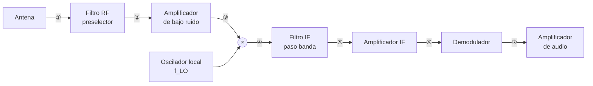
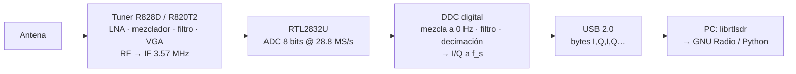

# Sesión 01 — Introducción a la Radio Definida por Software

## Objetivos de Aprendizaje

Al finalizar esta sesión, el estudiante será capaz de:

1. Explicar qué es un *software-defined radio* (radio definida por software) y qué funciones del receptor pasan del hardware al software
2. Describir la cadena de recepción del RTL-SDR (tuner → ADC → DDC → USB) y el papel de cada bloque
3. Relacionar los parámetros $f_c$, $f_s$, ganancia y resolución en bits con el ancho de banda observable y el rango dinámico
4. Verificar una instalación de GNU Radio y un dongle con `rtl_test`, interpretando su salida
5. Identificar qué señales del espectro peruano se pueden recibir y publicar dentro del marco legal del curso

---

## Introducción

Una radio convencional está diseñada para un solo sistema: el receptor de FM de un auto solo recibe FM, un teléfono LTE solo habla LTE. Cada función (filtrar, mezclar, demodular) es un circuito fijo. Cambiar de estándar significa cambiar de hardware.

La idea del *software-defined radio* (SDR) invierte el orden: digitalizar la señal lo antes posible y hacer todo lo demás en software. El mismo hardware recibe FM, aviones, satélites o sensores; solo cambia el programa. El término lo acuñó Joseph Mitola en 1995 y la primera década fue territorio militar y de laboratorio, con equipos de decenas de miles de dólares.

Lo que cambió el panorama fue un accidente: en 2012, Antti Palosaari descubrió que el chip RTL2832U de los sintonizadores USB de televisión digital (DVB-T) de US$ 20 podía entregar muestras I/Q crudas al computador. El proyecto Osmocom escribió el driver `librtlsdr` y nació el **RTL-SDR**: un receptor de 24 MHz a 1.7 GHz por el precio de un almuerzo.

Este curso usa ese dongle, o grabaciones hechas con él, para construir receptores completos en GNU Radio y Python. Esta sesión responde tres preguntas: ¿qué hay dentro del dongle?, ¿qué limita lo que puede hacer? y ¿qué está permitido recibir?

---

## Teoría

### 1. Del superheterodino al SDR

El receptor que domina la radio desde hace un siglo se llama *superheterodino*, y el nombre describe su truco. *Heterodino* viene del griego *héteros* (otro) y *dýnamis* (fuerza): "otra frecuencia". Fessenden lo acuñó en 1901 para un método sencillo: **multiplicar** la señal recibida, de frecuencia $f_{RF}$, por una senoide generada en el propio receptor, el *local oscillator* (LO, oscilador local) de frecuencia $f_{LO}$. El producto de dos senoides contiene solo dos frecuencias nuevas, la suma y la diferencia:

$$
\cos(2\pi f_{RF} t)\cos(2\pi f_{LO} t) = \tfrac{1}{2}\cos\!\big(2\pi (f_{RF}-f_{LO})\,t\big) + \tfrac{1}{2}\cos\!\big(2\pi (f_{RF}+f_{LO})\,t\big).
$$

Es el mismo fenómeno del *batido* que se oye al afinar dos cuerdas de guitarra: dos tonos cercanos producen una oscilación lenta a la frecuencia diferencia. Un filtro se queda con la diferencia y la señal aparece trasladada a una frecuencia nueva que elegimos nosotros. *Super*-heterodino (Armstrong, 1918) significa "heterodino supersónico": la diferencia se coloca por encima del rango audible, en una *intermediate frequency* (IF, frecuencia intermedia) **fija**, típicamente 455 kHz en AM y 10.7 MHz en FM. Ahí un único filtro estrecho y un amplificador hacen todo el trabajo sin importar qué emisora se sintonice: cambiar de emisora es solo cambiar $f_{LO}$.



Puntos de observación del espectro: ① en la antena, ② tras el preselector, ③ tras el LNA, ④ a la salida del mezclador (suma y diferencia), ⑤ tras el filtro IF, ⑥ tras el amplificador IF, ⑦ banda base tras el demodulador.

<!-- TODO (profesor): explicar aquí las transformaciones del espectro de la señal en los puntos ① a ⑦. -->

Cada bloque de la figura es un circuito diseñado para una IF y un tipo de modulación concretos. El SDR ideal elimina todo eso: antena → convertidor analógico-digital (ADC) → software. El problema es el ADC. Digitalizar directamente a 1 GHz con buena resolución exige un conversor de varios gigamuestras por segundo, caro y hambriento de energía. Por eso los SDR reales conservan un *front-end* analógico mínimo cuyo único trabajo es trasladar la señal a una frecuencia donde un ADC modesto pueda muestrearla.

Según dónde queda la señal antes del ADC hay tres familias:

| Arquitectura | Señal antes del ADC | Ejemplos | Costo típico |
|---|---|---|---|
| *RF sampling* | En RF, sin mezcla | USRP X410, equipos de laboratorio | miles de US$ |
| *Zero-IF* (conversión directa) | En banda base, I y Q separados | ADALM-Pluto, HackRF, LimeSDR | 100–400 US$ |
| *Low-IF* | En una IF baja, señal real | **RTL-SDR** | 30–40 US$ |

El RTL-SDR es *low-IF*: el tuner deja la señal en una IF de unos pocos MHz y el ADC la muestrea como señal real. La separación en componentes I y Q, que define a un SDR moderno, ocurre después y en digital. Eso nos lleva a mirar dentro del chip.

### 2. Cadena de recepción del RTL-SDR

El dongle tiene dos chips. El **tuner** (Rafael Micro R820T2 en el V3, R828D en el V4) es el front-end analógico. El **RTL2832U** es el demodulador de TV reconvertido en digitalizador.



Lectura del diagrama, bloque a bloque:

1. **Tuner.** Un amplificador de bajo ruido (LNA) eleva la señal débil de la antena; un mezclador con LO sintonizable la traslada a una IF fija de 3.57 MHz; un filtro paso banda de unos 6 MHz recorta lo que no interesa; un amplificador de ganancia variable (VGA) ajusta el nivel. La ganancia total es de 0 a 49.6 dB en 29 pasos. **El tuner fija $f_c$**, la frecuencia central que quieres ver.
2. **ADC.** El RTL2832U muestrea la IF con 8 bits a 28.8 MS/s, la frecuencia de su cristal. Aquí la señal se vuelve números.
3. **DDC** (*digital downconverter*, conversor descendente digital). Dentro del mismo chip, la señal muestreada se multiplica por una exponencial compleja a 3.57 MHz (eso la lleva a 0 Hz y crea I y Q), se filtra y se decima hasta la tasa $f_s$ que pediste. **El RTL2832U fija $f_s$.**
4. **USB.** Cada muestra sale como dos bytes sin signo, I y Q, con el cero en 127.5.
5. **PC.** `librtlsdr` recibe los bytes; GNU Radio o NumPy los convierten a números complejos entre $-1$ y $+1$.

El punto clave: el tuner y el ADC son la única parte analógica. Todo lo que hagamos en el curso (filtrar, demodular FM, sincronizar BPSK, decodificar ADS-B) ocurre sobre esa secuencia de bytes I/Q. Y esa secuencia tiene límites que vienen de los cuatro parámetros siguientes.

### 3. Los cuatro parámetros y sus límites

**Frecuencia central $f_c$.** El tuner sintoniza de 24 MHz a 1.766 GHz. El V4 añade un *upconverter* (conversor ascendente) integrado que traslada 500 kHz–24 MHz hacia arriba, así que también recibe onda corta y media. Por debajo de 24 MHz el V3 solo puede usar *direct sampling* (muestreo directo sin tuner), con peor sensibilidad.

**Tasa de muestreo $f_s$.** `librtlsdr` acepta 225–300 kS/s y 900 kS/s–3.2 MS/s. Con muestreo complejo el ancho de banda observable es igual a $f_s$ (Sesión 02), pero los filtros del DDC atenúan los bordes: en la práctica se aprovecha el 80 % central. Por encima de 2.4 MS/s el USB empieza a perder muestras; 2.4 MS/s es la tasa de referencia del curso. El caudal resultante es

$$
R = f_s \times 2\ \text{bytes} = 2.4 \times 10^6 \times 2 = 4.8\ \text{MB/s} \approx 38.4\ \text{Mbit/s},
$$

muy por debajo de los 480 Mbit/s de USB 2.0 y muy por encima de los 12 Mbit/s de USB 1.1. Por eso el dongle no necesita USB 3.0, pero sí un puerto USB 2.0 real: un puerto de máquina virtual mal configurado o un hub barato pierden muestras.

**Resolución: 8 bits.** Un ADC de $N$ bits tiene una relación señal a ruido de cuantización máxima

$$
\text{SQNR} \approx 6.02\,N + 1.76\ \text{dB},
$$

que con $N = 8$ da 49.9 dB. En la práctica el rango dinámico útil ronda los 45 dB: si dos señales dentro de la ventana de $f_s$ difieren en más de eso, la débil desaparece bajo el ruido de cuantización, o la fuerte satura el ADC. Esta es la limitación más importante del RTL-SDR y la razón de que la ganancia importe tanto.

**Ganancia.** Los 29 pasos de 0 a 49.6 dB reparten ganancia entre LNA, mezclador y VGA. Poca ganancia: el ruido del ADC domina y las señales débiles no se ven. Mucha ganancia: una señal fuerte lleva al ADC a sus extremos (0 y 255), se recorta y aparecen *spurs* (espurias) por todo el espectro. El modo AGC (*automatic gain control*) ajusta solo según la señal más fuerte presente, lo cual es un problema cerca de un transmisor de FM o TV. En la Sesión 02 se mide este efecto con una grabación a tres ganancias.

Dos límites más que no son "parámetros" pero condicionan todo:

- **Exactitud de frecuencia.** El cristal de 28.8 MHz tiene un error expresado en partes por millón (ppm). El error en RF es $\Delta f = f_c \times \text{ppm} \times 10^{-6}$. Los V3/V4 llevan un TCXO de 1 ppm: 1.09 kHz de error a 1090 MHz, despreciable. Los clones con cristal ordinario (50–100 ppm) se desvían 55–110 kHz a esa frecuencia.
- **Figura de ruido.** El tuner añade unos 3.5 dB de ruido propio. Para señales muy débiles (satélites) se antepone un LNA alimentado por el bias-tee. Se cuantifica en la Sesión 05 con el presupuesto de enlace.

### 4. El ecosistema de software

| Capa | Herramienta | Qué hace |
|---|---|---|
| Driver | `librtlsdr` (`rtl_test`, `rtl_sdr`, `rtl_fm`, `rtl_power`, `rtl_tcp`) | Habla con el dongle; utilidades de línea de comandos para probar, grabar, demodular FM, barrer espectro y servir muestras por red |
| Abstracción | SoapySDR, `gr-osmosdr` | Interfaz común para muchos SDR; el bloque **RTL-SDR Source** de GNU Radio viene de `gr-osmosdr` |
| Framework | GNU Radio 3.10 | Bloques de procesamiento conectados en *flowgraphs*; GNU Radio Companion (GRC) es su editor gráfico |
| Aplicaciones | SDR++, GQRX, SDR# | Receptores de propósito general con interfaz gráfica; útiles para explorar, no para el curso |
| Distribución | radioconda 2025.03.14 | Instala todo lo anterior con versiones fijas en Windows, Linux y macOS |

El curso trabaja en GNU Radio (flowgraphs) y en Python con NumPy (análisis y prototipos). Las aplicaciones de la última fila sirven para explorar el espectro, pero no enseñan cómo funciona un receptor.

### 5. Qué se puede recibir en Lima

Con el dongle y su antena telescópica, desde una ventana o azotea:

| Señal | Frecuencia | Qué se ve | Sesión |
|---|---|---|---|
| Radiodifusión FM y su RDS | 88–108 MHz | Audio estéreo; texto y hora en RDS (BPSK a 1187.5 bit/s) | 02–10 |
| Difusiones aeronáuticas automáticas (ATIS, VOLMET) | 118–137 MHz, AM | Reportes meteorológicos de voz sintetizada | 05 |
| ADS-B | 1090 MHz | Posición y altitud de aviones (Jorge Chávez) | 10 |
| AIS | 161.975 / 162.025 MHz | Posición de barcos (Callao; requiere antena en altura) | proyecto |
| Televisión digital ISDB-Tb | UHF, p. ej. canal 16 (482–488 MHz) | Espectro OFDM de 6 MHz, visible solo en parte a 2.4 MS/s | 12 |
| Satélite Meteor M2-4 (LRPT) | 137.9 MHz | Imágenes meteorológicas digitales | 14 |
| Sensores y LoRa en banda ICM | 915–928 MHz | Telemetría OOK/FSK; chirps LoRa (plan AU915) | 13 |
| Radioaficionados | 144–148 y 430–440 MHz | Voz NBFM, APRS | proyecto |

Fuera de alcance: Wi-Fi y Bluetooth (2.4 GHz, fuera del rango del tuner y con 20 MHz de ancho), telefonía celular (ilegal en el curso, ver abajo), GPS (posible con antena activa pero fuera del programa).

### 6. Marco legal del curso

Recibir no es lo mismo que escuchar cualquier cosa. La ley peruana protege la inviolabilidad de las telecomunicaciones:

- El TUO de la Ley de Telecomunicaciones ([DS 013-93-TCC](https://www.osiptel.gob.pe/media/kbejkkkk/ds013-93-tcc-tuo-ley-de-telecomunicaciones.pdf), art. 4) declara inviolable el secreto de las telecomunicaciones y tipifica como infracción muy grave la interceptación de servicios *no destinados al uso libre del público* y la divulgación de su contenido.
- Su Reglamento ([DS 06-94-TCC](https://www.osiptel.gob.pe/media/wvidghyb/ds06-94-tcc-reg-general-ley-de-telecomunicaciones.pdf), art. 10) define la violación como *tratar de conocer la existencia o el contenido* de una comunicación no dirigida a uno.
- El Código Penal (art. 162 y 162-A) sanciona la interceptación de comunicaciones telefónicas o similares y la posesión de equipos destinados a interceptarlas.

No hay licencia de receptor: recibir radiodifusión, señales de navegación y difusiones al público es legal. De ahí las reglas del curso:

1. **Solo recepción.** El RTL-SDR no puede transmitir; ningún trabajo del curso transmite.
2. **Solo servicios destinados al público:** radiodifusión y RDS, ADS-B, AIS, satélites, sensores en banda ICM, difusiones automáticas ATIS y VOLMET.
3. **Prohibido** sintonizar, decodificar o publicar telefonía celular, sistemas troncalizados o cualquier comunicación privada. La voz de controladores y pilotos no se graba ni se publica.
4. En los reportes se publican espectros, constelaciones, datos de aviones y barcos, imágenes de satélite y telemetría de sensores. Nunca audio de voz.

Para identificar qué servicio ocupa una banda se usa el Plan Nacional de Atribución de Frecuencias ([PNAF 2023](https://www.gob.pe/institucion/mtc/normas-legales/4243339-0597-2023-mtc-01-03)) y el Registro Nacional de Frecuencias ([RNF](https://rnf.mtc.gob.pe/)); ambos son tema de la Sesión 11.

### 7. Ejemplo end-to-end: planificar una captura

Queremos grabar 10 s de una emisora en 99.1 MHz para las Sesiones 02 y 03.

1. **Tasa.** Con $f_s = 2.4$ MS/s la ventana va de 97.9 a 100.3 MHz; el 80 % útil (1.92 MHz) cubre unas 9 emisoras de 200 kHz. Suficiente para ver la emisora objetivo y sus vecinas.
2. **Ganancia.** Empezamos en 30 dB, no en AGC. Cerca de la UNI hay transmisores de FM y TV potentes; con AGC el tuner se ajusta a la más fuerte y las vecinas débiles desaparecen. Si el espectro muestra un piso de ruido plano y elevado o picos repetidos cada pocos cientos de kHz, hay saturación: bajar ganancia.
3. **Exactitud.** 1 ppm a 99.1 MHz son 99 Hz. Frente a un canal de 200 kHz, despreciable.
4. **Tamaño.** $10\ \text{s} \times 2.4 \times 10^6\ \text{muestras/s} \times 2\ \text{bytes} = 48$ MB. Cabe en un correo grande, no en un repositorio Git (límite práctico 100 MB por archivo, y el historial crece con cada versión). Por eso los archivos del curso se publican como *releases* aparte.
5. **Legalidad.** Radiodifusión FM: servicio destinado al público. Sin restricción.

El comando resultante es el de la [guía del RTL-SDR](../../setup/rtl-sdr.md#grabar-muestras-iq):

```bash
rtl_sdr -f 99.1e6 -s 2400000 -g 30 -n 24000000 fm_99p1MHz_2p4Msps_g30.cu8
```

---

## Síntesis

| Concepto | Implicación de diseño | Se profundiza en |
|---|---|---|
| Arquitectura *low-IF* con DDC digital | I y Q nacen en el RTL2832U; toda la selectividad fina se hace en software | S02, S03 |
| $f_c$ (tuner) y $f_s$ (RTL2832U) son independientes | $f_s$ fija el ancho de banda visible; $f_c$ dónde se mira | S02 |
| 8 bits → ~45 dB de rango dinámico | La ganancia se elige por la señal más fuerte presente, no por la que interesa | S02 |
| 2.4 MS/s → 38 Mbit/s por USB 2.0 | Sin USB 3.0; sí puerto directo y sin virtualización descuidada | guía RTL-SDR |
| Error de cristal en ppm | 1 ppm es despreciable en FM; 50 ppm rompe un canal NBFM | S07 |
| Figura de ruido ≈ 3.5 dB | Señales de satélite exigen LNA alimentado por bias-tee | S05, S14 |
| Solo recepción de servicios públicos | Define qué señales entran en labs y proyectos | S05, S10, S11 |

---

## Ejercicios

### Ejercicio 1: Caudal por USB

Un compañero configura el dongle a 2.56 MS/s. Calcula el caudal en MB/s y en Mbit/s. ¿Funcionaría en un puerto USB 1.1 (12 Mbit/s)? ¿Cuál sería la tasa máxima teórica en ese puerto?

??? example "Solución"
    Cada muestra son 2 bytes (I y Q de 8 bits):

    $$
    R = 2.56 \times 10^6 \times 2 = 5.12\ \text{MB/s} = 40.96\ \text{Mbit/s}.
    $$

    USB 1.1 ofrece 12 Mbit/s: no alcanza. La tasa máxima teórica sería $12 \times 10^6 / 16 = 0.75$ MS/s; en la práctica, con la sobrecarga del protocolo, unos 0.25–0.5 MS/s. Es el síntoma clásico de una máquina virtual con controlador USB 1.1: `rtl_test` reporta pérdidas incluso a tasas bajas.

### Ejercicio 2: Rango dinámico y bits

Calcula la SQNR máxima para 8 bits (RTL-SDR), 12 bits (ADALM-Pluto) y 14 bits (USRP B210). Dos señales dentro de la misma ventana difieren en 60 dB. ¿Cuál es el mínimo de bits para ver ambas?

??? example "Solución"
    Con $\text{SQNR} \approx 6.02N + 1.76$ dB:

    | Bits | SQNR |
    |---|---|
    | 8 | 49.9 dB |
    | 12 | 74.0 dB |
    | 14 | 86.0 dB |

    Para 60 dB de separación se necesita $N \geq (60 - 1.76)/6.02 = 9.7$, es decir, 10 bits como mínimo. El RTL-SDR no puede: la señal débil queda bajo el ruido de cuantización, o hay que bajar la ganancia hasta que la fuerte no sature, con lo que la débil se pierde igual. La única salida con 8 bits es un filtro analógico que quite la señal fuerte antes del ADC.

### Ejercicio 3: Error de frecuencia

Calcula el desplazamiento en frecuencia para 1 ppm en 99.1 MHz y en 1090 MHz, y para un clon de 60 ppm en 1090 MHz. Un receptor NBFM de radioaficionado en 435 MHz usa canales de 12.5 kHz: ¿sirve el clon?

??? example "Solución"
    $\Delta f = f_c \times \text{ppm} \times 10^{-6}$:

    - 1 ppm, 99.1 MHz: 99 Hz.
    - 1 ppm, 1090 MHz: 1.09 kHz.
    - 60 ppm, 1090 MHz: 65.4 kHz. Para ADS-B, cuyo receptor abarca unos 2 MHz, sigue dentro de la ventana; se decodifica.
    - 60 ppm, 435 MHz: 26.1 kHz, más de dos canales de 12.5 kHz. El clon sintoniza el canal equivocado. Habría que calibrar el ppm con una señal de referencia conocida, como el piloto de 19 kHz de FM estéreo (Sesión 05).

### Ejercicio 4: Ancho de banda y canales

Con $f_s = 2.4$ MS/s y $f_c = 96.0$ MHz, ¿qué rango se observa y cuántos canales FM de 200 kHz caben en la parte útil (80 %)? ¿Cuántas capturas hacen falta para cubrir toda la banda 88–108 MHz? ¿Qué herramienta hace eso automáticamente?

??? example "Solución"
    Ventana: $96.0 \pm 1.2$ MHz, de 94.8 a 97.2 MHz. Parte útil: 1.92 MHz, es decir 9 canales de 200 kHz. La banda completa mide 20 MHz: $20 / 1.92 \approx 10.4$, así que 11 capturas solapadas. `rtl_power` hace exactamente eso: barre la banda en pasos de $f_s$ y entrega el espectro promedio en un CSV (Sesión 11).

### Ejercicio 5: Planificar una captura de ATIS (integrador)

El ATIS del aeropuerto Jorge Chávez emite en AM en la banda 118–137 MHz (la frecuencia exacta se toma de la publicación aeronáutica vigente; supón 128.8 MHz). A 4 km hay un transmisor de FM comercial 30 dB más fuerte que el ATIS en tu antena. Quieres grabar 30 s. Decide $f_s$, ganancia y nombre del archivo; calcula el tamaño; y responde si la captura y su publicación en tu reporte son legales.

??? example "Solución"
    - **$f_s$.** El canal AM aeronáutico mide 8.33 o 25 kHz; no hace falta 2.4 MS/s. Con $f_s = 1.024$ MS/s la ventana es $128.8 \pm 0.512$ MHz (128.29–129.31 MHz): la banda de FM (88–108 MHz) queda fuera y el transmisor fuerte no entra en el ADC. El problema de los 30 dB desaparece por selección de ventana, no por rango dinámico. (Ojo: el filtro del tuner tiene unos 6 MHz de ancho; una emisora FM a 20 MHz de distancia queda fuera de él.)
    - **Ganancia.** Sin señal fuerte en la ventana, se puede subir: 40 dB. Si el espectro muestra saturación, bajar.
    - **Tamaño.** $30 \times 1.024 \times 10^6 \times 2 = 61.4$ MB.
    - **Nombre.** `atis_128p8MHz_1p024Msps_g40.cu8`.
    - **Legalidad.** ATIS es una difusión automática de información meteorológica destinada a cualquier aeronave que la sintonice: servicio al público, legal de recibir. Publicar el espectro y el texto del reporte meteorológico está dentro de las reglas del curso. Lo que no se publica es la voz de la torre o de pilotos en canales de control, aunque estén a pocos kHz: no son difusiones al público.

    El ejercicio combina cuatro conceptos de la sesión: ancho de banda observable ($f_s$), rango dinámico (evitado por selección de ventana), tamaño de archivo y marco legal.

---

## Laboratorio

El laboratorio de esta sesión valida tu entorno. Debes llegar con todo instalado siguiendo las guías:

- [Instalar GNU Radio con radioconda](../../setup/instalacion.md)
- [Configurar el RTL-SDR](../../setup/rtl-sdr.md) (solo si tienes el dongle)

### En clase (2 h)

| # | Paso | Evidencia para el Reporte 0 | Sin dongle |
|---|---|---|:---:|
| 1 | `python -c "from gnuradio import gr; print(gr.version())"` imprime `3.10.12.0` | Texto de la salida | ✓ |
| 2 | `prueba.grc` (Signal Source → Throttle → Frequency Sink) muestra un pico en +1 kHz | Captura de pantalla del flowgraph y de la ventana | ✓ |
| 3 | Cambia `Output Type` de Signal Source a *Float* y explica en dos líneas qué cambió en el espectro | Captura y explicación | ✓ |
| 4 | `rtl_test -t` detecta el dongle y muestra el tuner | Texto completo de la salida | — |
| 5 | `rtl_test -s 2400000` corre 60 s | Texto completo; cuenta de líneas `lost at least` | — |
| 6 | Primer espectro FM con **RTL-SDR Source** a 2.4 MS/s y ganancia 30 dB | Captura; identifica al menos 3 emisoras por su frecuencia | — |
| 7 | Repite el paso 6 con ganancia 0 dB y con 49.6 dB. ¿Qué pasa con el piso de ruido y con los picos? | Dos capturas y tres líneas de análisis | — |

Los alumnos sin dongle completan los pasos 1–3 y, para los pasos 6–7, analizan las capturas que el profesor proyecta en clase.

La clínica de instalación se hace en paralelo: quien tenga problemas con Zadig, el módulo DVB de Linux o `rtl_test` los resuelve con el profesor y los voluntarios. Anota qué falló y cómo se resolvió: es contenido válido del Reporte 0.

### Reporte 0: instalación y prueba del entorno

- **Vence:** inicio de la Sesión 02, publicado en tu sitio de reportes.
- **Contenido:** sistema operativo y versión; evidencias de la tabla anterior; problemas encontrados y solución; salida de `rtl_test` o la frase "sin dongle".
- **Rúbrica (5 puntos):** evidencias completas y legibles (2), explicación del paso 3 correcta (1), análisis del paso 7 o, sin dongle, del espectro proyectado (1), reporte publicado a tiempo y con la estructura de la plantilla (1).

---

## Lecturas Recomendadas

1. M. Lichtman, *PySDR: A Guide to SDR and DSP using Python*. Capítulo 1 (Introduction) y capítulo sobre RTL-SDR. [pysdr.org](https://pysdr.org/content/intro.html) · [pysdr.org/content/rtlsdr](https://pysdr.org/content/rtlsdr.html). Gratuito, en inglés; es la lectura de cabecera del curso.
2. rtl-sdr.com, *About RTL-SDR*. Especificaciones, historia y límites del dongle. [rtl-sdr.com/about-rtl-sdr](https://www.rtl-sdr.com/about-rtl-sdr/)
3. Osmocom, *rtl-sdr wiki*. Documentación del driver y de las utilidades `rtl_*`. [osmocom.org/projects/rtl-sdr/wiki](https://osmocom.org/projects/rtl-sdr/wiki)
4. GNU Radio Wiki, *Tutorials: Your First Flowgraph* y *Python Variables in GRC*. [wiki.gnuradio.org/index.php/Tutorials](https://wiki.gnuradio.org/index.php/Tutorials)
5. J. Mitola, "The software radio architecture", *IEEE Communications Magazine*, vol. 33, n.º 5, 1995. El artículo que dio nombre al campo.
6. TUO de la Ley de Telecomunicaciones (DS 013-93-TCC) y Reglamento General (DS 06-94-TCC), artículos citados en la sección 6.
