# Sesión 01 — Introducción a la Radio Definida por Software

## Objetivos de aprendizaje

Al finalizar esta sesión, el estudiante será capaz de:

1. Explicar qué es un *software-defined radio* (radio definida por software) y qué funciones del receptor pasan del hardware al software
2. Describir la cadena de recepción del RTL-SDR (tuner → ADC → DDC → USB) y el papel de cada bloque
3. Relacionar los parámetros $f_c$, $f_s$, ganancia y resolución en bits con el ancho de banda observable y el rango dinámico
4. Verificar GNU Radio y reproducir una grabación I/Q en un *flowgraph*; opcionalmente, comprobar un dongle con `rtl_test`
5. Identificar qué señales del espectro peruano se pueden recibir y publicar dentro del marco legal del curso

---

## Introducción

Antes de la adopción masiva del procesamiento digital, una radio convencional se diseñaba para un solo sistema. Cada función —filtrado, mezcla y demodulación— correspondía a un circuito fijo. Cambiar de estándar exigía cambiar el hardware.

La radio definida por software (*software-defined radio*, SDR) cambia ese enfoque: digitaliza la señal tan pronto como resulta técnica y económicamente viable, y traslada al software el procesamiento posterior.

Una misma plataforma puede recibir FM, señales aeronáuticas, satélites o sensores con solo cambiar el programa.

Joseph Mitola acuñó el término en 1995. Durante la primera década, la tecnología se concentró en entornos militares y de laboratorio.

En una radio convencional, cada aplicación determina una cadena de circuitos. En un SDR, varias aplicaciones reutilizan el mismo *front-end* y digitalizador; la selección, el filtrado y la demodulación pasan al software.

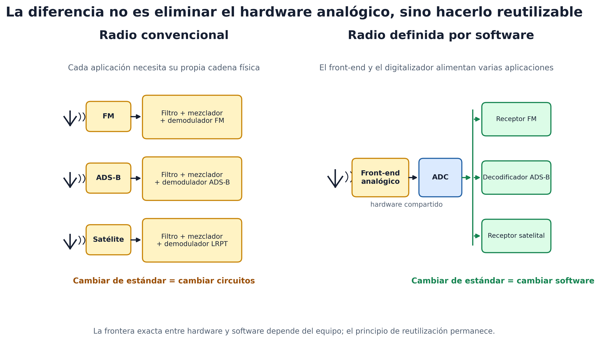

**Figura 1.** Comparación entre radios convencionales de hardware dedicado y una plataforma SDR reutilizable.

El SDR no elimina necesariamente el hardware analógico. Desplaza hacia el dominio digital una frontera que depende del costo, el consumo y la frecuencia de operación del equipo.

En 2012, Antti Palosaari descubrió que el RTL2832U de ciertos sintonizadores USB de televisión digital podía entregar muestras I/Q crudas al computador. El proyecto Osmocom desarrolló `librtlsdr` y dio origen al **RTL-SDR** de bajo costo.

El curso utiliza ese dongle, o grabaciones realizadas con él, para construir receptores completos en GNU Radio y Python.

La sesión responde tres preguntas: ¿qué contiene el dongle?, ¿qué limita su funcionamiento? y ¿qué señales pueden recibirse legalmente?

---

## Teoría

### 1. Del superheterodino al SDR

El receptor *superheterodino* dominó la radio durante gran parte del siglo XX. Su nombre describe la generación de «otra frecuencia» mediante la mezcla de la señal recibida con un oscilador local.

Fessenden introdujo el término en 1901. El método consiste en **multiplicar** la señal recibida, de frecuencia $f_{RF}$, por una senoide local de frecuencia $f_{LO}$. El producto contiene dos frecuencias nuevas: la suma y la diferencia.

$$
\cos(2\pi f_{RF} t)\cos(2\pi f_{LO} t) = \tfrac{1}{2}\cos\!\big(2\pi (f_{RF}-f_{LO})\,t\big) + \tfrac{1}{2}\cos\!\big(2\pi (f_{RF}+f_{LO})\,t\big).
$$

Un filtro conserva la diferencia y traslada la señal a una frecuencia elegida por el diseño. En el superheterodino de Armstrong (1918), esa diferencia se sitúa en una frecuencia intermedia (IF) fija, como 455 kHz en AM o 10.7 MHz en FM.

Un mismo filtro estrecho y un amplificador trabajan en esa IF para cualquier emisora. La sintonización se logra modificando $f_{LO}$.

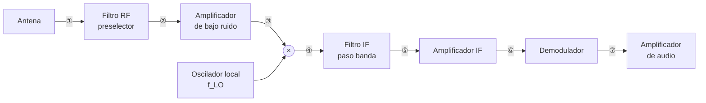

**Figura 2.** Cadena funcional de un receptor superheterodino y puntos de observación de la señal.

Puntos de observación del espectro:

- ① en la antena,
- ② tras el preselector,
- ③ tras el LNA,
- ④ a la salida del mezclador, donde aparecen suma y diferencia,
- ⑤ tras el filtro IF,
- ⑥ tras el amplificador IF,
- ⑦ banda base tras el demodulador.

Cada bloque es un circuito diseñado para una IF y una modulación concretas. El **SDR ideal** reduce la cadena a antena, ADC y software.

Sin embargo, digitalizar directamente a 1 GHz con buena resolución exige un ADC rápido, costoso y de alto consumo.

Por ello, los SDR prácticos conservan un *front-end* analógico. Su función es acondicionar y, cuando resulta necesario, trasladar la señal a una frecuencia que pueda muestrear un ADC más modesto.

Según dónde queda la señal antes del ADC hay tres familias:

| Arquitectura | Señal antes del ADC | Ejemplos | Costo típico |
|---|---|---|---|
| *RF sampling* | En RF, sin mezcla | Convertidores RF de laboratorio | miles de US$ |
| *Zero-IF* (conversión directa) | En banda base, I y Q separados | ADALM-Pluto, HackRF, LimeSDR | 100–400 US$ |
| *Low-IF* | En una IF baja, señal real | **RTL-SDR** | 30–40 US$ |

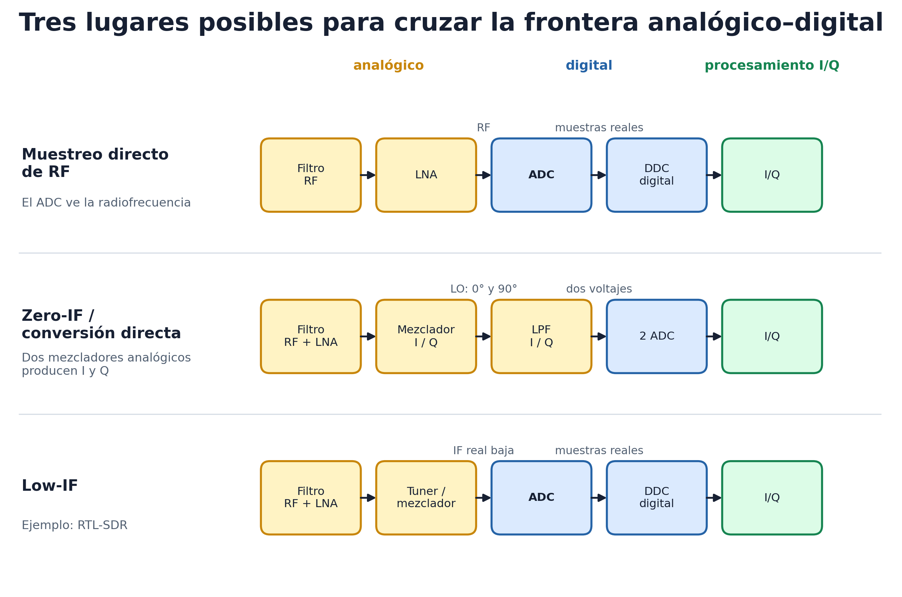

**Figura 3.** Comparación entre muestreo directo de RF, conversión directa (*Zero-IF*) y frecuencia intermedia baja (*Low-IF*).

La diferencia decisiva es **qué señal ve el ADC**. En muestreo directo ve RF; en *Zero-IF* dos ADC reciben los voltajes I y Q producidos por mezcladores analógicos; en *Low-IF* un ADC recibe una IF real y un DDC forma I/Q digitalmente.

La figura sintetiza las comparaciones publicadas por [Analog Devices](https://www.analog.com/en/resources/technical-articles/a-review-of-wideband-rf-receiver-architecture-options.html).

También considera el informe de arquitecturas de recepción de [Texas Instruments](https://www.ti.com/kr/lit/pdf/snaa329).

Como ejemplo verificable de *Zero-IF*, el [ADALM-Pluto](https://wiki.analog.com/university/tools/pluto/users/understanding) emplea conversión directa dentro del AD9363.

El RTL-SDR es *Low-IF*: el tuner deja la señal en una IF de pocos megahercios y el ADC la muestrea como señal real.

La separación en componentes I y Q ocurre después, en el dominio digital. Para comprender el proceso, resulta necesario examinar el interior del receptor.

### 2. Cadena de recepción del RTL-SDR

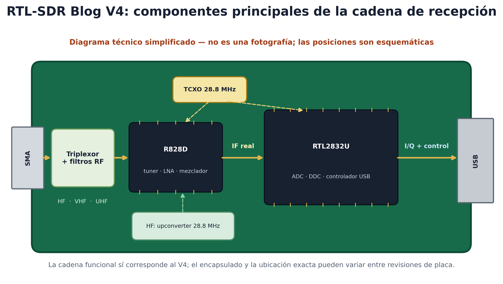

**Figura 4.** Representación funcional de los componentes principales de un RTL-SDR Blog V4.

La ilustración es funcional, no fotográfica: identifica los componentes necesarios para seguir la señal, pero no reproduce su posición exacta sobre la placa.

Su contenido se basa en la [hoja de datos oficial del V4](https://www.rtl-sdr.com/wp-content/uploads/2024/12/RTLSDR_V4_Datasheet_V_1_0.pdf).

**V3** y **V4** son generaciones comerciales del dongle RTL-SDR Blog, no versiones del estándar USB ni del chip RTL2832U. El V3 emplea el tuner R820T2; el V4 lo reemplaza por el R828D y añade filtrado de entrada y un *upconverter* para HF.

El dongle contiene dos circuitos integrados principales en la cadena de recepción:

- El **tuner** es el *front-end* analógico: Rafael Micro R820T2 en el V3 y R828D en el V4.

  Ambos pertenecen a la misma familia y utilizan el mismo driver. El R828D sustituyó al R820T2 y ofrece tres entradas de RF, utilizadas por el V4 para los filtros de banda y el *upconverter* de HF.
- El **RTL2832U** es un demodulador de televisión reconvertido en digitalizador: contiene el ADC, el conversor descendente digital y el controlador USB.

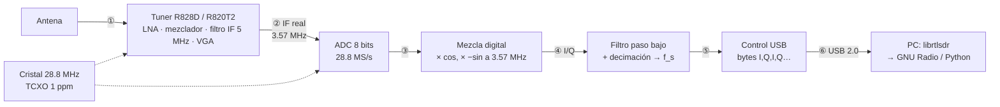

**Figura 5.** Cadena completa de recepción del RTL-SDR, desde la antena hasta el computador.

Todo el procesamiento comprendido entre los puntos ② y ⑤ ocurre dentro del RTL2832U.

La exposición siguiente recorre la señal punto por punto y muestra su espectro. Cada diagrama resalta en ámbar el bloque activo. El ejemplo corresponde a la sección 7: una emisora objetivo en $f_c = 99.1$ MHz y una tasa $f_s = 2.4$ MS/s.

Las figuras son esquemáticas: lóbulos de 200 kHz para cada emisora de FM, sin escala de potencia.

#### 2.1. Punto ① — En la antena: banda de RF

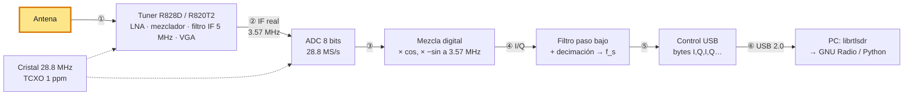

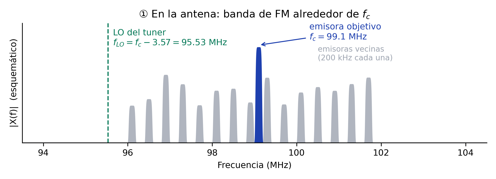

**Figura 6.** Punto ①: banda de RF en la antena y ubicación del bloque observado en la cadena RTL-SDR.

- Cada lóbulo gris representa una emisora de FM; el azul identifica la emisora objetivo en $f_c = 99.1$ MHz.
- La línea verde punteada representa el oscilador local del tuner, situado por el driver en $f_{LO} = f_c - 3.57$ MHz.
- **Sintonizar equivale a elegir $f_{LO}$**: la emisora ubicada 3.57 MHz por encima del LO cae en el centro de la IF.
- El LNA (*Low Noise Amplifier*) eleva el nivel de toda la banda con la ganancia configurada en el dongle.

#### 2.2. Punto ② — Tras el tuner: señal real en la IF

- El mezclador multiplica la banda completa por el LO y, por la identidad de la sección 1, produce suma y diferencia.
- La diferencia traslada la banda en bloque: la emisora en $f_c$ cae en 3.57 MHz, y cada vecina en $3.57 + (f - f_c)$ MHz, conservando sus separaciones.
- La suma cae cerca de 194 MHz y el filtro IF la elimina.
- El filtro tiene 5 MHz de ancho por defecto y está centrado en 3.57 MHz. Por tanto, deja pasar de 1.07 a 6.07 MHz, equivalentes a unos ±2.5 MHz alrededor de $f_c$.
- El VGA (Variable Gain Amplifier) ajusta el nivel antes del ADC.

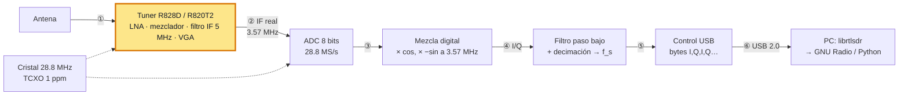

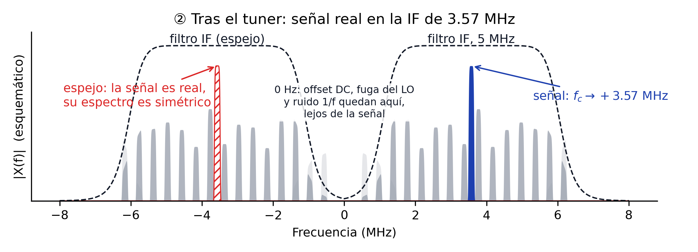

**Figura 7.** Punto ②: bloque tuner resaltado y espectro real resultante en la IF de 3.57 MHz.

Hay un hecho que el diagrama no dice y que decide todo lo que viene después: **la señal en la IF es real**.

Aquí *real* no significa «física» en oposición a «simulada». Significa que, en cada instante, la IF está representada por un único valor real de tensión en un cable.

La señal de RF que llega a la antena también es físicamente real. Los números complejos son una representación matemática que permite describir su amplitud y su fase. El espectro de una señal real es simétrico:

$$
x(t) = \mathrm{Re}\{m(t)\,e^{j2\pi f_{IF} t}\}
\quad\Longrightarrow\quad
X(f) = \tfrac{1}{2}M(f - f_{IF}) + \tfrac{1}{2}M^*(-f - f_{IF}).
$$

El espectro contiene un lóbulo en $+3.57$ MHz y su espejo conjugado en $-3.57$ MHz. No representan dos señales, sino las dos mitades de una señal real, del mismo modo que un coseno puede expresarse como la suma de dos exponenciales.

El primer *flowgraph* de la guía muestra el mismo efecto: la salida *Complex* presenta un pico en $+1$ kHz, mientras que la salida *Float* presenta dos picos en $\pm 1$ kHz.

La señal azul aparece en $+3.57$ MHz y las emisoras vecinas, en gris, permanecen a sus lados. El lóbulo rojo rayado corresponde al espejo en $-3.57$ MHz. La respuesta simétrica del filtro IF se representa con una línea negra punteada.

En 0 Hz permanecen el desplazamiento de continua, la fuga del LO y el ruido 1/f. La arquitectura *Low-IF* aleja esos defectos 3.57 MHz de la señal útil, aunque exige un ADC más rápido.

#### 2.3. Punto ③ — ADC: 28.8 millones de muestras reales por segundo

La frecuencia más alta que entra al ADC es $3.57 + 2.5 = 6.07$ MHz. Nyquist exige una tasa superior a $2 \times 6.07 = 12.1$ MS/s. El RTL2832U muestrea a 28.8 MS/s, la frecuencia de su cristal, y ofrece margen suficiente.

Su zona de Nyquist abarca de $-14.4$ a $+14.4$ MHz. El filtro IF también actúa como filtro *anti-aliasing*: cualquier componente que superase 14.4 MHz reaparecería plegada dentro de esa zona.

Muestrear tiene una consecuencia sobre el espectro: lo hace **periódico**. El espectro entero se copia cada $f_s = 28.8$ MHz. Basta mirar un período.

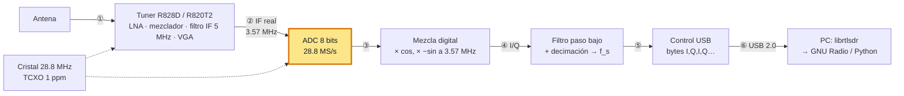

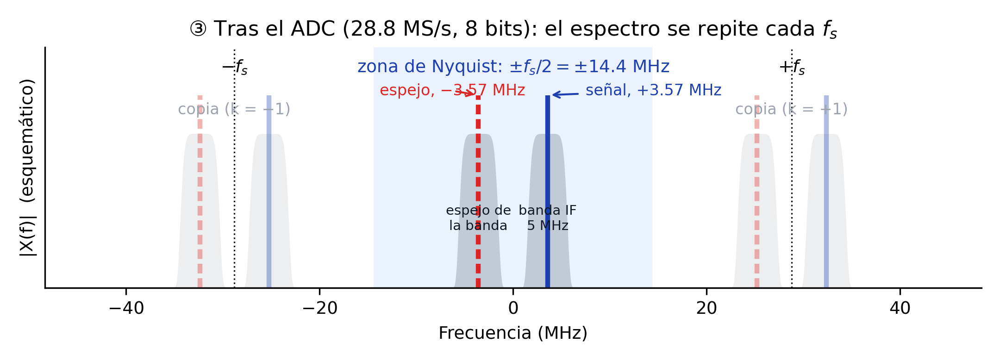

**Figura 8.** Punto ③: ADC resaltado, zona de Nyquist y copias periódicas producidas por el muestreo.

La franja azul claro representa la zona de Nyquist. Dentro de ella se mantiene el espectro del punto ②: la banda gris de 5 MHz, la emisora objetivo en azul y su espejo en rojo.

Las copias en $\pm 28.8$ MHz son una consecuencia del muestreo y no contienen información nueva. No se solapan porque la señal termina en 6.07 MHz, muy por debajo de 14.4 MHz. La señal conserva su información, ahora codificada con 8 bits.

#### 2.4. Punto ④ — Del voltaje real a las muestras complejas I/Q

El ADC no produce números complejos. En cada instante $n$ entrega un único número real $x[n]$, proporcional al voltaje de la IF. La cuadratura aparece en el bloque digital siguiente: el DDC.

El DDC envía la misma secuencia $x[n]$ por dos ramas. Una se multiplica por un coseno y la otra por un seno con un desfase de $90^\circ$:

$$
I_{\mathrm{raw}}[n]=x[n]\cos\!\left(2\pi f_{IF}\frac{n}{f_{ADC}}\right),
\qquad
Q_{\mathrm{raw}}[n]=-x[n]\sin\!\left(2\pi f_{IF}\frac{n}{f_{ADC}}\right).
$$

Los filtros paso bajo eliminan los productos de alta frecuencia y dejan $I[n]$ y $Q[n]$. No son dos mediciones independientes: son la misma señal comparada con dos referencias separadas $90^\circ$.

El par conserva la amplitud y la fase de la señal. Por conveniencia, GNU Radio lo transporta como un solo número complejo:

$$
z[n]=I[n]+jQ[n].
$$

Para una sinusoide didáctica, ignorando una ganancia común, $I(t)=\cos(2\pi f_0t)$ y $Q(t)=\sin(2\pi f_0t)$. Cada una es una señal real; juntas trazan la hélice de $z(t)=e^{j2\pi f_0t}$.

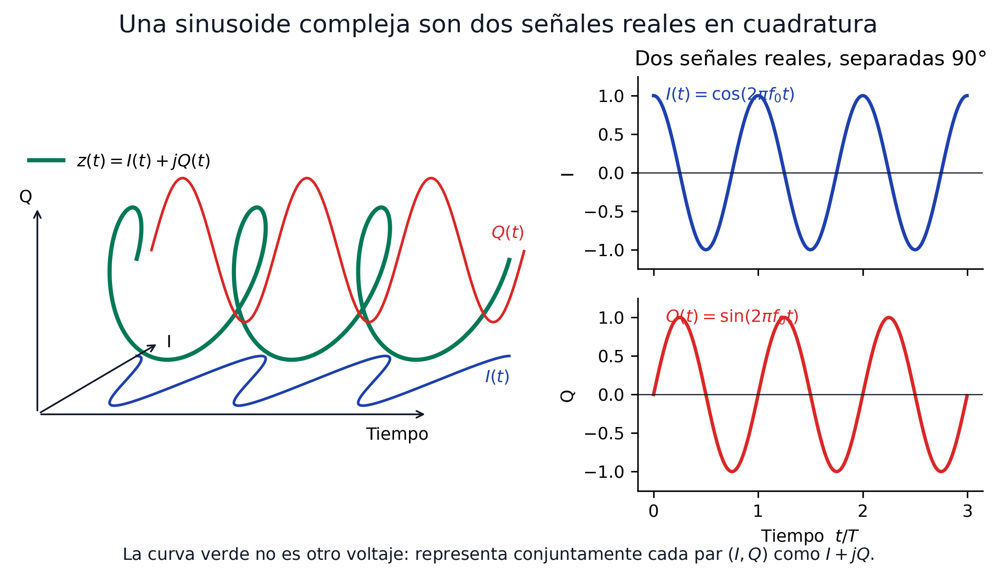

**Figura 9.** Representación conjunta de una sinusoide compleja y sus componentes reales I y Q en cuadratura.

Cada componente real tiene dos copias espectrales, en $+f_0$ y $-f_0$. Al formar $I+jQ$, el factor $j$ cambia sus fases: las copias positivas se suman y las negativas se cancelan.

No se cancela «la parte imaginaria» para obtener una señal real. El resultado sigue siendo complejo, pero ya permite distinguir una frecuencia positiva de una negativa respecto a la frecuencia central.

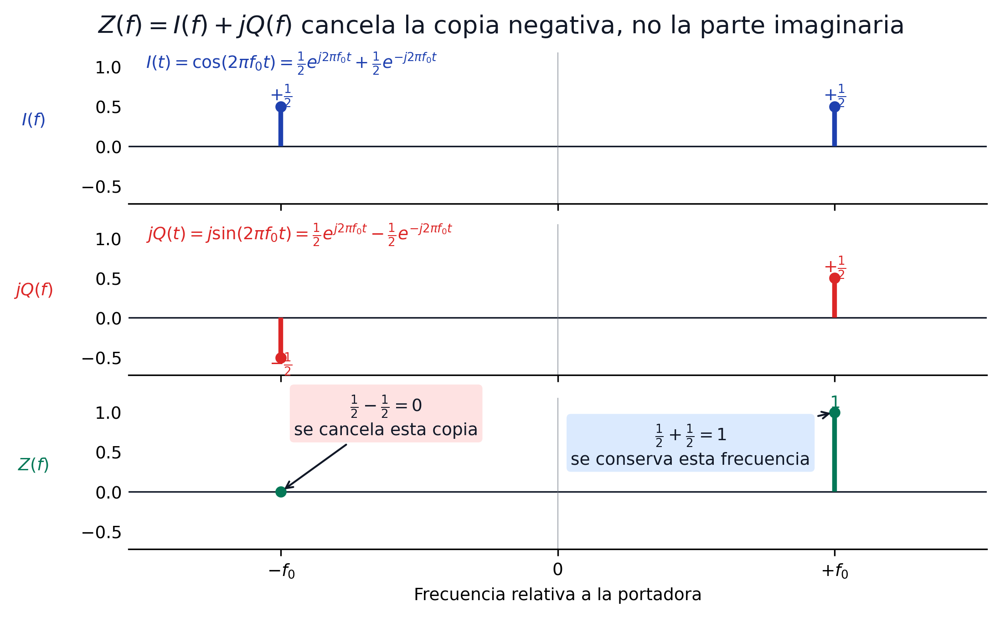

**Figura 10.** Formación de $I+jQ$: suma de las componentes positivas y cancelación de las copias negativas.

!!! info "¿Qué significa `Complex Float 32` en GNU Radio?"
    Una muestra contiene dos números `float32`: uno para I y otro para Q. Cada componente ocupa 32 bits, de modo que la muestra compleja completa ocupa 64 bits u 8 bytes.

    Las fuentes SDR y la cadena de procesamiento I/Q suelen usar este tipo. No todos los bloques de GNU Radio son complejos: después de demodular, por ejemplo, el audio normalmente se representa como `Float 32`.

    Esto tampoco es el formato `.cu8` del cable USB. Allí I y Q ocupan un byte cada uno; el bloque fuente de GNU Radio los centra, normaliza y entrega al *flowgraph* como componentes de punto flotante.

##### 2.4.1. Mezcla digital y desplazamiento del espectro

En el RTL2832U, los multiplicadores usan $\cos(2\pi \cdot 3.57\,\text{MHz}\cdot t)$ y $-\sin(2\pi \cdot 3.57\,\text{MHz}\cdot t)$.

Juntas, las dos ramas equivalen a multiplicar por $e^{-j2\pi \cdot 3.57\,\text{MHz}\cdot t}$.

Multiplicar por esa exponencial compleja **desplaza todo el espectro** en $-3.57$ MHz. La señal que estaba en $+3.57$ MHz cae en 0 Hz; su espejo, situado en $-3.57$ MHz, cae en $-7.14$ MHz.

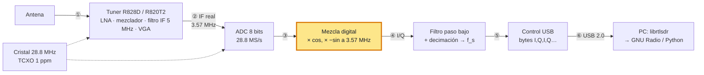

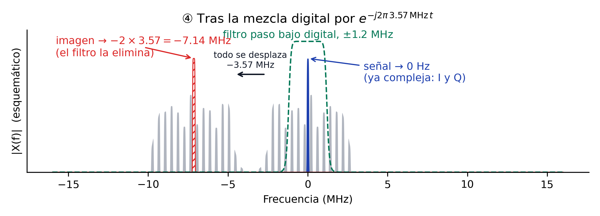

**Figura 11.** Punto ④: DDC resaltado y desplazamiento de la señal útil a 0 Hz y de su imagen a $-7.14$ MHz.

La flecha negra indica el desplazamiento de $-3.57$ MHz. La señal azul queda en 0 Hz y pasa a ser compleja: el multiplicador por coseno produce I y el multiplicador por seno produce Q. El lóbulo rayado en $-7.14$ MHz es la imagen.

El coseno y el seno digitales mantienen un desfase exacto de 90° y amplitudes idénticas. Por ello, esta generación de cuadratura evita el desbalance I/Q propio de mezcladores analógicos.

###### Qué ve cada rama por separado

La Figura 10 mostró la cancelación con una sinusoide aislada. Conviene repetir el experimento sobre el caso real, porque revela algo más fuerte que «se cancela una copia»: **una sola rama no basta para saber dónde está una emisora**.

El montaje es el siguiente. Se sintetiza una señal de paso banda real con tres emisoras situadas **solo por encima** de la frecuencia central, en $+0.2$, $+0.5$ y $+0.9$ MHz. Por debajo no hay ninguna. En la IF eso las coloca en 3.77, 4.07 y 4.47 MHz, todas por encima de la referencia de 3.57, con su grupo espejo en las posiciones negativas correspondientes. Luego se multiplica por $\cos$ y por $-\sin$, exactamente como hace el RTL2832U.

!!! note "Esta figura usa una escena distinta a la de las Figuras 6 a 11, y es deliberado"
    Las figuras del recorrido ① a ⑥ dibujan la banda de FM completa, con emisoras repartidas a ambos lados de $f_c$ cada 400 kHz. Esa escena es la realista, pero aquí sería inservible: al bajar a banda base, el espejo de la emisora que está en $f_c + 0.4$ cae justo encima de la que está en $f_c - 0.4$, donde ya hay una emisora de verdad. Los espejos quedarían escondidos debajo de señales legítimas y la figura no podría distinguirlos.

    Poner emisoras a un solo lado los separa y los hace visibles. El precio es que la escena es artificial; la ventaja es que el mecanismo queda a la vista.

    Y conviene no perder de vista lo que ese solapamiento significa en la banda real: **los espejos existen igual, solo que caen encima de otras emisoras**. Por eso la ambigüedad de una sola rama no es un detalle de laboratorio, sino la razón de que haga falta la segunda.

Las cuatro filas están dibujadas en **amplitud lineal con signo**, no en decibelios. El logaritmo destruye el signo, y aquí el signo es toda la historia.

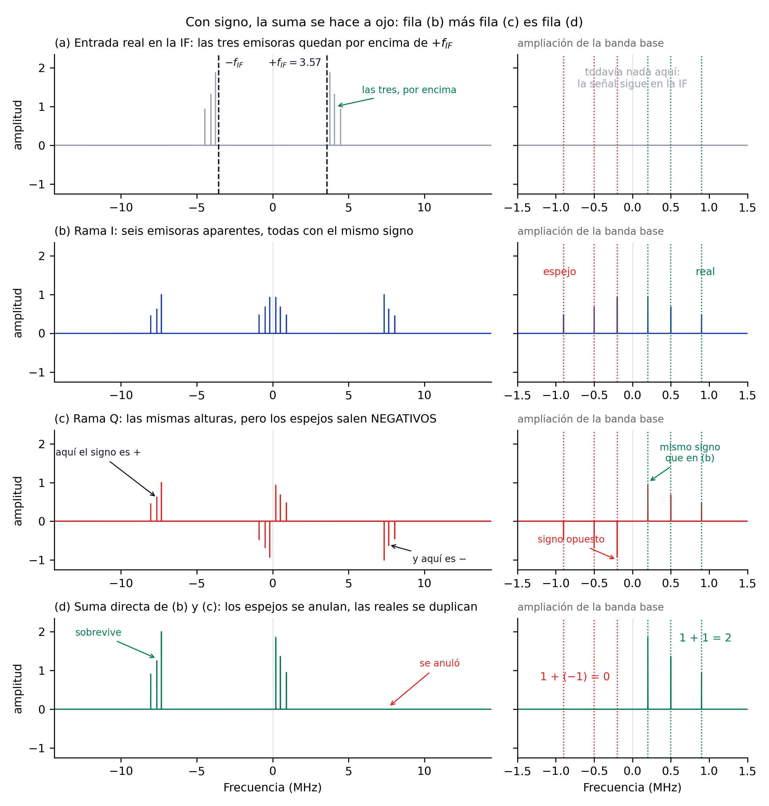

**Figura 12.** Las dos ramas del DDC dibujadas con signo, de modo que la fila (d) es la suma directa de las filas (b) y (c).

Lo que ocurre en cada fila:

- **(a)** La entrada es real, de modo que su espectro es simétrico: los mismos tres lóbulos aparecen alrededor de $+3.57$ y de $-3.57$ MHz. En banda base todavía no hay nada.
- **(b)** La rama I traslada ambos grupos. Alrededor de 0 Hz aparecen **seis** emisoras: las tres verdaderas en $+0.2$, $+0.5$ y $+0.9$ MHz, y tres espejos en las posiciones negativas correspondientes. Todas con el mismo signo, así que nada en esta fila distingue unas de otras.
- **(c)** La rama Q produce **las mismas alturas**, pero con los espejos hacia abajo. Ese cambio de signo es la única diferencia entre las dos ramas, y es lo que las hace complementarias en lugar de redundantes.
- **(d)** La suma directa, columna a columna. Donde los dos signos coinciden, las alturas se suman y la emisora se duplica. Donde se oponen, se restan y el espejo desaparece. La aritmética de la ampliación es literal: $1 + 1 = 2$ en las reales, $1 + (-1) = 0$ en los espejos.

Lo mismo pasa con las réplicas de $\pm 2f_{IF}$: la de $-7.14$ MHz sobrevive y la de $+7.14$ se anula, por el mismo mecanismo de signos. La que queda es la imagen que el filtro paso bajo eliminará en el punto ⑤.

Medido sobre la simulación:

| Frecuencia | Rama I | Rama Q | Suma | Qué es |
|---:|---:|---:|---:|---|
| $-0.9$ MHz | $+0.056$ | $-0.056$ | 0.000 | espejo, no existe |
| $-0.5$ MHz | $+0.081$ | $-0.081$ | 0.000 | espejo, no existe |
| $-0.2$ MHz | $+0.110$ | $-0.110$ | 0.000 | espejo, no existe |
| $+0.2$ MHz | $+0.110$ | $+0.110$ | 0.220 | emisora real |
| $+0.5$ MHz | $+0.081$ | $+0.081$ | 0.161 | emisora real |
| $+0.9$ MHz | $+0.056$ | $+0.056$ | 0.113 | emisora real |

La supresión de los espejos supera los 170 dB, es decir, es exacta salvo por el redondeo de la aritmética.

!!! info "Por qué el signo solo puede ser $+1$ o $-1$"
    En la figura, la rama Q nunca vale un 70 % ni un 130 % de la rama I: vale exactamente lo mismo, con el mismo signo o con el contrario. Eso no es casualidad del ejemplo elegido, y conviene ver de dónde sale.

    Llamemos $A$ y $B$ a las dos copias que produce cada multiplicación. Con las identidades del coseno y del seno,

    $$
    \mathcal{F}\{I\} = \tfrac{1}{2}(A + B),
    \qquad
    j\,\mathcal{F}\{Q\} = \tfrac{1}{2}(B - A).
    $$

    En cada frecuencia de banda base solo una de las dos copias es distinta de cero: $B$ en las emisoras reales y $A$ en los espejos. Sustituyendo, en las reales ambas ramas valen $\tfrac{1}{2}B$, y en los espejos valen $\tfrac{1}{2}A$ y $-\tfrac{1}{2}A$. De ahí el $+1$ y el $-1$, sin valores intermedios. Sumando, queda $\mathcal{F}\{I\} + j\,\mathcal{F}\{Q\} = B$, que es el espectro original desplazado, justamente lo que buscábamos.

El signo de la fila (c) es una forma compacta de decir algo sobre la **fase**. Las dos ramas tienen la misma magnitud en todas las frecuencias, y lo que las diferencia es la dirección de sus valores complejos: coinciden en las emisoras reales y se oponen en los espejos. Verlo como flechas lo deja explícito.

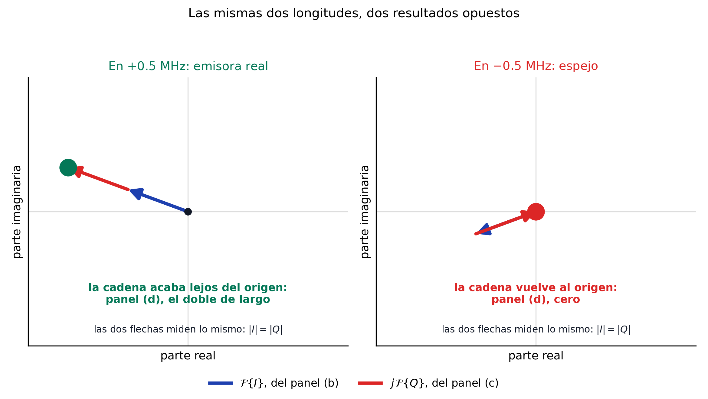

**Figura 13.** Suma de las dos ramas como flechas, en una emisora real y en un espejo.

En cada panel, la flecha azul es el valor complejo de $\mathcal{F}\{I\}$ a esa frecuencia, el punto exacto que el panel (b) dibuja como una altura. La flecha roja es $j\,\mathcal{F}\{Q\}$, que es lo que el panel (c) resume en otra altura. Sumar dos números complejos es poner la segunda flecha donde termina la primera, y el punto grande marca dónde acaba la cadena: **ese punto es el valor que dibuja el panel (d)**.

A la izquierda las dos flechas apuntan en la misma dirección, así que la cadena se estira y el extremo queda al doble de distancia del origen. A la derecha apuntan en direcciones opuestas y la cadena regresa exactamente al punto de partida, de modo que el panel (d) dibuja un cero.

Las cuatro flechas de la figura miden lo mismo. Lo único que cambia entre los dos casos es hacia dónde apuntan, y esa dirección es el signo de la fila (c) de la figura anterior.

Ahí está la clave de toda la arquitectura. Como las dos ramas tienen **la misma magnitud** en todas las frecuencias, la información que distingue una frecuencia positiva de una negativa no está en cuánto vale cada una, sino en **si se acompañan o se oponen**. Una sola rama no puede llevar esa información, y por eso hacen falta dos.

De ahí se sigue por qué el desbalance I/Q importa tanto en los receptores de conversión directa. Si una rama tiene un poco más de ganancia que la otra, o el desfase no es de $90^\circ$ exactos, la cancelación deja de ser perfecta y reaparece un espejo atenuado. Una emisora fuerte puede entonces fabricar un fantasma en el lado opuesto del espectro, donde no hay nada. En el RTL2832U ese riesgo no existe, porque el coseno y el seno se generan digitalmente con amplitudes idénticas y desfase exacto.

??? question "¿Por qué no basta con mirar la magnitud de una sola rama?"
    Porque una señal real no puede distinguir $+f$ de $-f$. Su espectro es simétrico por construcción, de modo que cualquier receptor que produzca una sola señal real entrega siempre pares de candidatos.

    Un receptor antiguo resolvía esto con hardware: un filtro de banda lateral colocado antes del mezclador eliminaba físicamente una de las dos posibilidades. La cuadratura consigue lo mismo sin filtros, a cambio de duplicar la cadena y exigir que las dos ramas estén bien apareadas.

#### 2.5. Punto ⑤ — Filtro paso bajo y decimación

Un filtro paso bajo digital conserva $|f| < f_s^{\text{out}}/2$: ±1.2 MHz para una salida de 2.4 MS/s. El filtro elimina la imagen de $-7.14$ MHz y las emisoras que quedan fuera de la ventana.

Después, un *downsampler* reduce la tasa de 28.8 a 2.4 MS/s, lo que equivale a conservar una de cada 12 muestras. Cuando la razón no es entera, el chip utiliza un *resampler* fraccional.

El registro de razón se gobierna mediante $28.8\,\text{MHz} \cdot 2^{22} / f_s$. Por ello, el dispositivo admite tasas como 1.024 MS/s, aunque no dividan exactamente 28.8 MHz, con una ligera cuantización de la tasa real.

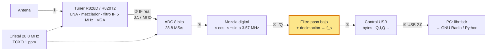

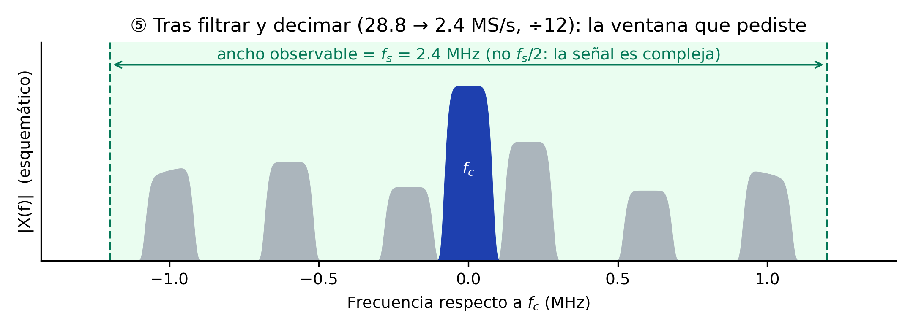

**Figura 14.** Punto ⑤: filtro y decimador resaltados, con la señal útil dentro de la ventana de ±1.2 MHz.

El eje representa frecuencia respecto a $f_c$. Solo permanecen la emisora objetivo y las vecinas comprendidas dentro de ±1.2 MHz. La señal compleja no requiere una copia espectral redundante; por eso, el ancho de banda observable es $f_s$.

El filtro digital fija el ancho de banda mostrado por GNU Radio, mientras que el filtro IF protege al ADC. Las muestras I y Q vuelven a recortarse a 8 bits para el enlace USB, y los bordes del filtro reducen la zona útil a cerca del 80 %.

#### 2.6. Punto ⑥ — USB: bytes I, Q, I, Q…

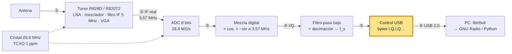

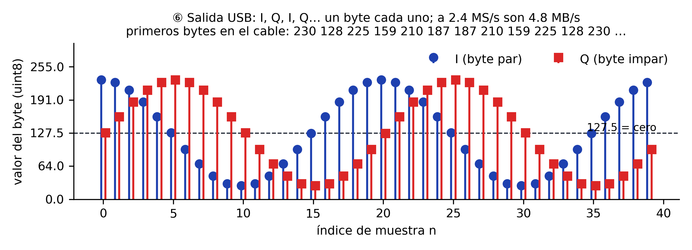

**Figura 15.** Punto ⑥: interfaz USB resaltada y representación de las muestras I/Q como bytes intercalados.

Cada muestra compleja sale como dos bytes sin signo, primero I y luego Q, con el cero en 127.5. A 2.4 MS/s, el caudal alcanza 4.8 MB/s. GNU Radio o NumPy convierten la secuencia al intervalo de $-1$ a $+1$ mediante $(x-127.5)/127.5$.

La [guía del RTL-SDR](../../setup/rtl-sdr.md#grabar-muestras-iq) desarrolla esa conversión. El mismo enlace USB transporta las órdenes de frecuencia, ganancia y tasa hacia los registros del RTL2832U, que programa el tuner por I²C.

El cristal de 28.8 MHz, representado con una línea discontinua, sirve como referencia del PLL del tuner y como reloj del ADC. Un error de $p$ ppm desplaza $f_c$ y $f_s$ en la misma proporción; una sola corrección compensa ambos errores.


??? note "Muestreo directo en el V3, y por qué el V4 lo cambió"
    El V3 dispone de un modo *direct sampling* para HF. Un puente conduce la señal de la antena, a través de un filtro paso bajo, directamente a la entrada Q del ADC y evita el tuner.

    En este modo, la zona de Nyquist abarca de 0 a 14.4 MHz. Una señal de HF por encima de 14.4 MHz se pliega dentro de esa zona y aparece como una imagen, sin la protección del filtro IF.

    El V4 reemplazó ese modo por un *upconverter*. Este bloque traslada la banda de 0–24 MHz a una frecuencia que el tuner puede recibir, por lo que las señales de HF recorren la cadena normal.

El tuner y el ADC constituyen la etapa previa al procesamiento por software. Las operaciones del curso —filtrado, demodulación FM, sincronización BPSK y decodificación ADS-B— actúan sobre la secuencia I/Q del punto ⑥.

Esa secuencia queda sujeta a los límites descritos a continuación.

### 3. Los cuatro parámetros y sus límites

**Frecuencia central $f_c$.** El tuner sintoniza de 24 MHz a 1.766 GHz. El V4 incorpora un *upconverter* que traslada la banda de 500 kHz a 24 MHz, por lo que también recibe onda corta y media.

Por debajo de 24 MHz, el V3 solo puede utilizar *direct sampling* —muestreo directo sin tuner—, con menor sensibilidad.

**Tasa de muestreo $f_s$.** `librtlsdr` acepta 225–300 kS/s y 900 kS/s–3.2 MS/s. Con muestreo complejo, el ancho de banda observable es igual a $f_s$.

Los filtros del DDC atenúan los bordes, por lo que en la práctica se aprovecha cerca del 80 % central.

Por encima de 2.4 MS/s, el enlace USB puede perder muestras. Por ello, el curso adopta 2.4 MS/s como tasa de referencia. El caudal resultante es

$$
R = f_s \times 2\ \text{bytes} = 2.4 \times 10^6 \times 2 = 4.8\ \text{MB/s} \approx 38.4\ \text{Mbit/s},
$$

Este caudal queda por debajo de los 480 Mbit/s de USB 2.0 y por encima de los 12 Mbit/s de USB 1.1. El dongle no requiere USB 3.0, pero sí un puerto USB 2.0 real.

Una máquina virtual mal configurada o un concentrador deficiente pueden ocasionar pérdidas de muestras.

**Resolución: 8 bits.** Un ADC de $N$ bits tiene una relación señal a ruido de cuantización máxima

$$
\text{SQNR} \approx 6.02\,N + 1.76\ \text{dB},
$$

Con $N = 8$, el resultado es 49.9 dB. En la práctica, el rango dinámico útil ronda los 45 dB. Si dos señales dentro de la ventana difieren más que ese valor, la débil desaparece bajo el ruido de cuantización o la fuerte satura el ADC.

Esta limitación explica la importancia de ajustar correctamente la ganancia.

**Ganancia.** Los 29 pasos de 0 a 49.6 dB distribuyen la ganancia entre el LNA, el mezclador y el VGA.

Con poca ganancia domina el ruido del ADC. Con demasiada, una señal fuerte lleva el ADC a sus extremos, produce recorte y genera espurias.

El modo AGC (*automatic gain control*) se ajusta según la señal más fuerte presente. Esto puede ocultar señales débiles cerca de un transmisor de FM o TV. La Sesión 02 mide el efecto mediante grabaciones con tres niveles de ganancia.

Otros dos límites condicionan el desempeño:

- **Exactitud de frecuencia.** El cristal de 28.8 MHz presenta un error en partes por millón: $\Delta f = f_c \times \text{ppm} \times 10^{-6}$.

  Los V3 y V4 incorporan un TCXO de 1 ppm, equivalente a 1.09 kHz de error a 1090 MHz. Un cristal de 50–100 ppm se desvía entre 55 y 110 kHz a esa frecuencia.
- **Figura de ruido.** El tuner añade unos 3.5 dB de ruido propio. Para señales muy débiles (satélites) se antepone un LNA alimentado por el bias-tee. Se cuantifica en la Sesión 05 con el presupuesto de enlace.

### 4. El ecosistema de software

| Capa | Herramienta | Qué hace |
|---|---|---|
| Driver | `librtlsdr` (`rtl_test`, `rtl_sdr`, `rtl_fm`, `rtl_power`, `rtl_tcp`) | Habla con el dongle; utilidades de línea de comandos para probar, grabar, demodular FM, barrer espectro y servir muestras por red |
| Abstracción | SoapySDR, `gr-osmosdr` | Interfaz común para muchos SDR; el bloque **RTL-SDR Source** de GNU Radio viene de `gr-osmosdr` |
| Framework | GNU Radio 3.10 | Bloques de procesamiento conectados en *flowgraphs*; GNU Radio Companion (GRC) es su editor gráfico |
| Aplicaciones | SDR++, GQRX, SDR# | Receptores de propósito general con interfaz gráfica; útiles para explorar, no para el curso |
| Distribución | radioconda 2025.03.14 | Instala todo lo anterior con versiones fijas en Windows, Linux y macOS |

El curso utiliza GNU Radio para los *flowgraphs* y Python con NumPy para el análisis y los prototipos. Las aplicaciones de la última fila permiten explorar el espectro, pero no muestran el funcionamiento interno de un receptor.

### 5. Qué se puede recibir en Lima

Con el dongle y su antena telescópica, desde una ventana o azotea:

| Señal | Frecuencia | Qué se ve | Sesión |
|---|---|---|---|
| Radiodifusión FM y su RDS | 88–108 MHz | Audio estéreo; texto y hora en RDS (BPSK a 1187.5 bit/s) | 02–10 |
| Difusiones aeronáuticas automáticas (ATIS, VOLMET) | 118–137 MHz, AM | Reportes meteorológicos de voz sintetizada | 05 |
| ADS-B | 1090 MHz | Posición y altitud de aviones (Jorge Chávez) | 10 |
| AIS | 161.975 / 162.025 MHz | Posición de barcos (Callao; requiere antena en altura) | proyecto |
| Televisión digital ISDB-Tb | UHF, p. ej. canal 16 (482–488 MHz) | Espectro OFDM de 6 MHz, visible solo en parte a 2.4 MS/s | 12 |
| Satélite Meteor M2-4 (LRPT) | 137.9 MHz | Imágenes meteorológicas digitales | 14 |
| Sensores y LoRa en banda ICM | 915–928 MHz | Telemetría OOK/FSK; chirps LoRa (plan AU915) | 13 |
| Radioaficionados | 144–148 y 430–440 MHz | Voz NBFM, APRS | proyecto |

Fuera de alcance: Wi-Fi y Bluetooth (2.4 GHz, fuera del rango del tuner y con 20 MHz de ancho), telefonía celular (ilegal en el curso, ver abajo), GPS (posible con antena activa pero fuera del programa).

### 6. Marco legal del curso

La recepción técnica no autoriza el acceso a cualquier comunicación. La legislación peruana protege la inviolabilidad de las telecomunicaciones:

- El [TUO de la Ley de Telecomunicaciones](https://www.osiptel.gob.pe/media/kbejkkkk/ds013-93-tcc-tuo-ley-de-telecomunicaciones.pdf), DS 013-93-TCC, art. 4, declara inviolable el secreto de las telecomunicaciones.

  También tipifica como infracción muy grave la interceptación de servicios no destinados al uso libre del público y la divulgación de su contenido.
- El [Reglamento General](https://www.osiptel.gob.pe/media/wvidghyb/ds06-94-tcc-reg-general-ley-de-telecomunicaciones.pdf), DS 06-94-TCC, art. 10, considera violación intentar conocer una comunicación ajena.
- El Código Penal (art. 162 y 162-A) sanciona la interceptación de comunicaciones telefónicas o similares y la posesión de equipos destinados a interceptarlas.

La recepción de radiodifusión, señales de navegación y emisiones destinadas al público no requiere una licencia de receptor. De este marco se derivan las reglas del curso:

1. **Solo recepción.** El RTL-SDR no puede transmitir; ningún trabajo del curso transmite.
2. **Solo servicios destinados al público:** radiodifusión y RDS, ADS-B, AIS, satélites, sensores en banda ICM, difusiones automáticas ATIS y VOLMET.
3. **Prohibido** sintonizar, decodificar o publicar telefonía celular, sistemas troncalizados o cualquier comunicación privada. La voz de controladores y pilotos no se graba ni se publica.
4. En los reportes se publican espectros, constelaciones, datos de aviones y barcos, imágenes de satélite y telemetría de sensores. Nunca audio de voz.

El [Plan Nacional de Atribución de Frecuencias](https://www.gob.pe/institucion/mtc/normas-legales/4243339-0597-2023-mtc-01-03) y el [Registro Nacional de Frecuencias](https://rnf.mtc.gob.pe/) identifican el servicio asignado a cada banda.

Ambas fuentes se estudian en la Sesión 11.

### 7. Ejemplo end-to-end: planificar una captura

El ejemplo plantea la grabación de 10 s de una emisora en 99.1 MHz para las Sesiones 02 y 03.

1. **Tasa.** Con $f_s = 2.4$ MS/s la ventana va de 97.9 a 100.3 MHz; el 80 % útil (1.92 MHz) cubre unas 9 emisoras de 200 kHz. Suficiente para ver la emisora objetivo y sus vecinas.
2. **Ganancia.** Se parte de 30 dB, sin AGC. Cerca de la UNI existen transmisores potentes de FM y TV; el AGC se ajustaría a la señal más fuerte y ocultaría las vecinas débiles.

   Un piso de ruido elevado o picos repetidos indican saturación y exigen reducir la ganancia.
3. **Exactitud.** 1 ppm a 99.1 MHz son 99 Hz. Frente a un canal de 200 kHz, despreciable.
4. **Tamaño.** $10\ \text{s} \times 2.4 \times 10^6\ \text{muestras/s} \times 2\ \text{bytes} = 48$ MB. El archivo no debe almacenarse en Git, porque cada versión aumenta el historial.

   Las grabaciones se distribuyen mediante la carpeta de Google Drive del curso. El enlace y los metadatos de cada muestra se publican en el laboratorio correspondiente.
5. **Legalidad.** Radiodifusión FM: servicio destinado al público. Sin restricción.

El comando resultante es el de la [guía del RTL-SDR](../../setup/rtl-sdr.md#grabar-muestras-iq):

```bash
rtl_sdr -f 99.1e6 -s 2400000 -g 30 -n 24000000 fm_99p1MHz_2p4Msps_g30.cu8
```

!!! info "¿Qué describe la extensión `.cu8`?"
    El nombre abrevia **c**omplejo, **u**nsigned (sin signo), **8** bits por componente. Cada muestra contiene un byte `uint8` para I y otro para Q: 16 bits o 2 bytes en total, intercalados como `I,Q,I,Q,…`.

    | Representación | Componente I | Componente Q | Total por muestra |
    |---|---:|---:|---:|
    | `.cu8` | `uint8`, 1 byte | `uint8`, 1 byte | 2 bytes |
    | GNU Radio `Complex Float 32` | `float32`, 4 bytes | `float32`, 4 bytes | 8 bytes |

    `.cu8` es una convención descriptiva, no una extensión que `rtl_sdr` interprete. La utilidad escribe los bytes crudos en el archivo cuyo nombre recibe; podría llamarse `.bin`, pero entonces el tipo no quedaría indicado.

    [SigMF](https://sigmf.org/sigmf-spec.pdf) formaliza el nombre de tipo `cu8` y permite acompañar los datos con metadatos.

    El [código de `rtl_sdr`](https://github.com/osmocom/rtl-sdr/blob/master/src/rtl_sdr.c) confirma que la utilidad graba un búfer `uint8_t` y utiliza dos bytes por muestra compleja.

    El laboratorio de esta sesión trabaja directamente sobre el `.cu8`, sin convertirlo. Un bloque **File Source** de tipo *Complex* espera 8 bytes por muestra y por tanto **no** puede leer este archivo; la Parte B demuestra qué ocurre si se intenta.

---

## Síntesis

| Concepto | Implicación de diseño | Se profundiza en |
|---|---|---|
| Arquitectura *low-IF* con DDC digital | I y Q nacen en el RTL2832U; toda la selectividad fina se hace en software | S02, S03 |
| $f_c$ (tuner) y $f_s$ (RTL2832U) son independientes | $f_s$ fija el ancho de banda visible; $f_c$ dónde se mira | S02 |
| 8 bits → ~45 dB de rango dinámico | La ganancia se elige por la señal más fuerte presente, no por la que interesa | S02 |
| 2.4 MS/s → 38 Mbit/s por USB 2.0 | Sin USB 3.0; sí puerto directo y sin virtualización descuidada | guía RTL-SDR |
| Error de cristal en ppm | 1 ppm es despreciable en FM; 50 ppm rompe un canal NBFM | S07 |
| Figura de ruido ≈ 3.5 dB | Señales de satélite exigen LNA alimentado por bias-tee | S05, S14 |
| Solo recepción de servicios públicos | Define qué señales entran en labs y proyectos | S05, S10, S11 |

---

## Ejercicios

### Ejercicio 1: Caudal por USB

Un estudiante configura el dongle a 2.56 MS/s. Se debe calcular el caudal en MB/s y Mbit/s, determinar si funcionaría en un puerto USB 1.1 de 12 Mbit/s y hallar la tasa máxima teórica de ese puerto.

??? example "Solución"
    Cada muestra son 2 bytes (I y Q de 8 bits):

    $$
    R = 2.56 \times 10^6 \times 2 = 5.12\ \text{MB/s} = 40.96\ \text{Mbit/s}.
    $$

    USB 1.1 ofrece 12 Mbit/s, por lo que no alcanza. La tasa máxima teórica sería $12 \times 10^6 / 16 = 0.75$ MS/s; en la práctica, la sobrecarga del protocolo la reduce a unos 0.25–0.5 MS/s.

    Una máquina virtual limitada a USB 1.1 presenta el síntoma característico: `rtl_test` informa pérdidas incluso con tasas bajas.

### Ejercicio 2: Rango dinámico y bits

Se debe calcular la SQNR máxima para 8 bits (RTL-SDR), 12 bits (ADALM-Pluto) y 14 bits (USRP B210). Si dos señales dentro de una misma ventana difieren en 60 dB, se debe determinar el mínimo de bits necesario para observar ambas.

??? example "Solución"
    Con $\text{SQNR} \approx 6.02N + 1.76$ dB:

    | Bits | SQNR |
    |---|---|
    | 8 | 49.9 dB |
    | 12 | 74.0 dB |
    | 14 | 86.0 dB |

    Para 60 dB de separación se necesita $N \geq (60 - 1.76)/6.02 = 9.7$, es decir, un mínimo de 10 bits.

    Con el RTL-SDR, la señal débil queda bajo el ruido de cuantización. Si se reduce la ganancia para evitar saturación, también se pierde la señal débil. La solución requiere un filtro analógico previo al ADC.

### Ejercicio 3: Error de frecuencia

Se debe calcular el desplazamiento para 1 ppm a 99.1 MHz y 1090 MHz, y para un clon de 60 ppm a 1090 MHz. Después se debe determinar si ese clon resulta adecuado para un receptor NBFM de 435 MHz con canales de 12.5 kHz.

??? example "Solución"
    $\Delta f = f_c \times \text{ppm} \times 10^{-6}$:

    - 1 ppm, 99.1 MHz: 99 Hz.
    - 1 ppm, 1090 MHz: 1.09 kHz.
    - 60 ppm, 1090 MHz: 65.4 kHz. Para ADS-B, cuyo receptor abarca unos 2 MHz, sigue dentro de la ventana; se decodifica.
    - 60 ppm, 435 MHz: 26.1 kHz, más de dos canales de 12.5 kHz. El clon sintoniza el canal equivocado. Habría que calibrar el ppm con una señal de referencia conocida, como el piloto de 19 kHz de FM estéreo (Sesión 05).

### Ejercicio 4: Ancho de banda y canales

Para $f_s = 2.4$ MS/s y $f_c = 96.0$ MHz, se debe hallar el rango observado y la cantidad de canales FM de 200 kHz que caben en el 80 % útil.

También se debe determinar cuántas capturas cubren 88–108 MHz y qué herramienta automatiza el proceso.

??? example "Solución"
    La ventana abarca $96.0 \pm 1.2$ MHz, es decir, de 94.8 a 97.2 MHz. La parte útil mide 1.92 MHz y admite nueve canales de 200 kHz.

    La banda completa mide 20 MHz. Como $20 / 1.92 \approx 10.4$, se necesitan 11 capturas solapadas. `rtl_power` automatiza el barrido en pasos de $f_s$ y entrega el espectro promedio en un archivo CSV.

### Ejercicio 5: Planificar una captura de ATIS (integrador)

El ATIS del aeropuerto Jorge Chávez emite en AM dentro de 118–137 MHz. Para el ejercicio se adopta 128.8 MHz. A 4 km existe un transmisor de FM comercial cuya señal en la antena supera al ATIS en 30 dB.

Se debe planificar una grabación de 30 s: seleccionar $f_s$, ganancia y nombre de archivo; calcular el tamaño; y determinar si la captura y su publicación en el reporte son legales.

??? example "Solución"
    - **$f_s$.** El canal AM aeronáutico ocupa 8.33 o 25 kHz, por lo que no requiere 2.4 MS/s. Con $f_s = 1.024$ MS/s, la ventana abarca de 128.29 a 129.31 MHz.

      La banda de FM queda fuera y el transmisor fuerte no alcanza el ADC. El filtro del tuner, de unos 6 MHz, también rechaza una emisora situada a 20 MHz.
    - **Ganancia.** Sin una señal fuerte en la ventana, la ganancia puede elevarse a 40 dB. Si el espectro muestra saturación, debe reducirse.
    - **Tamaño.** $30 \times 1.024 \times 10^6 \times 2 = 61.4$ MB.
    - **Nombre.** `atis_128p8MHz_1p024Msps_g40.cu8`.
    - **Legalidad.** ATIS es una difusión automática de información meteorológica destinada a cualquier aeronave que la sintonice. Por ello, se considera un servicio dirigido al público y su recepción está permitida.

      Las reglas del curso permiten publicar el espectro y el reporte meteorológico. No permiten publicar la voz de la torre ni de los pilotos en canales de control, porque esas comunicaciones no están destinadas al público.

    El ejercicio combina cuatro conceptos de la sesión: ancho de banda observable ($f_s$), rango dinámico (evitado por selección de ventana), tamaño de archivo y marco legal.

---

## Laboratorio

El laboratorio recorre una sola grabación desde los bits del disco hasta el espectro en pantalla. Tiene cuatro partes: la primera no necesita GNU Radio, la segunda muestra un fallo deliberado, la tercera lo repara y la cuarta es opcional para quien tenga dongle.

Antes de la clase, instala las herramientas según las guías:

- [Instalar GNU Radio con radioconda](../../setup/instalacion.md)
- [Configurar el RTL-SDR](../../setup/rtl-sdr.md) (solo para quien disponga del dongle)

### Materiales

| Archivo | Qué es |
|---|---|
| `fm_99p1MHz_2p4Msps_g30.cu8` | Grabación oficial de la sesión. Se descarga de Drive |
| [`test.grc`](https://github.com/ollerenac-uni/sdr/blob/main/gnuradio-flowgraphs/test.grc) | Grafo con un error deliberado. Parte B |
| [`test2.grc`](https://github.com/ollerenac-uni/sdr/blob/main/gnuradio-flowgraphs/test2.grc) | Solución de referencia. Consúltala solo al terminar la Parte C |

Metadatos de la grabación:

| Parámetro | Valor |
|---|---|
| Frecuencia central $f_c$ | 99.1 MHz |
| Tasa de muestreo $f_s$ | 2.4 MS/s |
| Ganancia manual | 30 dB |
| Formato | `.cu8`, dos bytes por muestra compleja |
| Duración | 10.0 s |
| Tamaño | 48 000 000 bytes |
| SHA-256 | `3944638586f418d7fd271ae03bcaa1b622d6bcc08ecc700e9cb5df0dc2d94579` |

### Descargar la grabación

Las muestras del curso están en una carpeta compartida de Google Drive:

**[Carpeta `samples` del curso](https://drive.google.com/drive/folders/1tP8u1tQZDnvi_-ZAxZ3J8tehdKwi92an?usp=drive_link)**

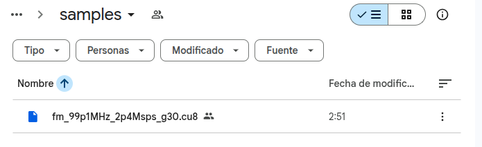

**Figura 16.** Carpeta compartida del curso en Google Drive con la grabación oficial de la sesión.

Descarga `fm_99p1MHz_2p4Msps_g30.cu8` y comprueba que llegó íntegro antes de empezar. Son 48 MB y una descarga truncada produce errores confusos más adelante:

=== "Linux"

    ```bash
    sha256sum samples/fm_99p1MHz_2p4Msps_g30.cu8
    ```

=== "macOS"

    ```bash
    shasum -a 256 samples/fm_99p1MHz_2p4Msps_g30.cu8
    ```

=== "Windows"

    ```bat
    certutil -hashfile samples\fm_99p1MHz_2p4Msps_g30.cu8 SHA256
    ```

El valor debe coincidir con el SHA-256 de la tabla anterior.

### Organizar la carpeta de trabajo

Reproduce esta estructura, que es la misma del repositorio del curso:

```
sdr/
├── samples/
│   └── fm_99p1MHz_2p4Msps_g30.cu8
└── gnuradio-flowgraphs/
    ├── test.grc
    └── test2.grc
```

De ahí salen las dos rutas que verás a lo largo del laboratorio, y conviene entender por qué son distintas. Los comandos de terminal de la Parte A se ejecutan desde `sdr/`, así que usan `samples/fm_99p1MHz_2p4Msps_g30.cu8`. Los grafos, en cambio, guardan la ruta `../samples/fm_99p1MHz_2p4Msps_g30.cu8`, porque GNU Radio Companion ejecuta cada grafo desde la carpeta donde vive el `.grc`.

!!! tip "Si el grafo no encuentra el archivo"
    Abre el bloque **File Source**, pulsa el botón de examinar y selecciona el archivo a mano. GRC guardará entonces la ruta de tu máquina y el problema desaparece.

### Parte A: el archivo por dentro, sin GNU Radio

Ningún programa sabe qué contiene un archivo crudo. Hay que decírselo, y esta parte establece qué hay que decirle. Trabaja en la terminal, sobre la grabación descargada.

**A1. El chorro de bits.** Un archivo es una tira de unos y ceros sin separadores ni etiquetas.

```bash
xxd -b -c1 -l8 samples/fm_99p1MHz_2p4Msps_g30.cu8 | cut -d' ' -f2 | tr -d '\n'; echo
```

**A2. Cortar cada 8 bits.** El corte cada ocho no es arbitrario: es la resolución del ADC del dongle.

```bash
xxd -b -l12 samples/fm_99p1MHz_2p4Msps_g30.cu8
```

`xxd -b` imprime 6 bytes por línea, es decir 3 muestras complejas. Como 6 es par, las columnas primera, tercera y quinta son siempre I, y la segunda, cuarta y sexta siempre Q.

**A3. Del bit al número.** Cada grupo de 8 bits vale lo que dicta la posición de cada uno.

```bash
xxd -b -c1 -l1 samples/fm_99p1MHz_2p4Msps_g30.cu8 | awk '{n=$2
  printf "bit      "; for(k=1;k<=8;k++) printf "%4s", substr(n,k,1)
  printf "\npeso     "; for(k=1;k<=8;k++) printf "%4d", 2^(8-k)
  printf "\naporta   "; for(k=1;k<=8;k++) printf "%4d", substr(n,k,1)*2^(8-k); printf "\n"}'
```

De ahí sale el rango completo: `00000000` es 0, `11111111` es 255, y entre ambos hay $2^8 = 256$ niveles. Eso, y nada más, significa "ADC de 8 bits".

**A4. El atajo.** `od` hace esa cuenta por ti y escribe el mismo byte en base 10.

```bash
od -An -tu1 -N12 -v samples/fm_99p1MHz_2p4Msps_g30.cu8
```

!!! info "`od` no convierte nada"
    El byte ya *es* el entero. `xxd -b` lo escribe en base 2 y `od -tu1` en base 10, pero son los mismos ocho bits. `10000011` y `131` son la misma cosa escrita de dos formas. Retén esta distinción: en la Parte B aparecerá una operación que sí cambia el significado de los bits.

**A5. Una muestra por línea.** Con `-w2` cada línea es una muestra compleja, y la dirección avanza de dos en dos.

```bash
od -Ad -tu1 -w2 -N20 -v samples/fm_99p1MHz_2p4Msps_g30.cu8
```

**A6. Comprobar el formato.** Tres medidas que confirman que la grabación es lo que dice ser.

```bash
od -An -tu1 -v -N200000 samples/fm_99p1MHz_2p4Msps_g30.cu8 | tr -s ' ' '\n' | grep . |
  awk '{v[NR]=$1; s+=$1} END {print "min", v[1]+0, "| max", v[NR]+0, "| promedio", sprintf("%.2f",s/NR)}'
```

```bash
od -An -tu1 -v -N200000 samples/fm_99p1MHz_2p4Msps_g30.cu8 | tr -s ' ' '\n' | grep . |
  awk '{h[int($1/16)]++} END {for(i=0;i<16;i++)
    printf "%3d-%3d %7d %s\n", i*16, i*16+15, h[i]+0, substr("########################################",1,int(h[i]/900))}'
```

??? question "A6. ¿Qué demuestra cada número?"
    El promedio cae en 127.4, no en 0 ni en 128. Es el cero de la señal, que en un formato sin signo vive en mitad de la escala, en 127.5.

    El histograma sale en forma de campana con los dos tramos centrales empatados. Esa simetría alrededor de 127.5 es la misma afirmación vista como dibujo.

    Las colas llegan a cero antes de tocar los extremos. En los 48 millones de bytes de la grabación completa solo 6 tocan 0 o 255, uno de cada ocho millones: es la cola de la gaussiana, no recorte. La ganancia de 30 dB está bien elegida.

    Si el histograma tuviera picos altos pegados a 0 y a 255, habría saturación y la ganancia sería excesiva. Ese caso se estudia en la Sesión 02.

### Parte B: la prueba fallida

Abre `test.grc` y ejecútalo con **F6**. Su `File Source` está declarado de tipo *Complex*.

Observarás dos cosas: el Time Sink muestra líneas que saltan entre $+1$ y $-1$ sin estructura, y el Frequency Sink queda **completamente vacío**. No hay mensaje de error.

Responde en el reporte, antes de leer la solución:

1. ¿Cuántos bytes lee el bloque por muestra cuando está en modo *Complex*? ¿Cuántos tiene en realidad cada muestra del archivo?
2. ¿Por qué el Time Sink dibuja algo y el Frequency Sink no dibuja nada?

??? example "Solución de la Parte B"
    Un `File Source` de tipo *Complex* consume 8 bytes por muestra, dos `float32`. El archivo tiene 2. El bloque toma entonces cuatro bytes `uint8` consecutivos y los lee como un solo `float32`, así que produce cuatro veces menos muestras que las que hay.

    El byte más significativo de ese grupo cae sobre el campo de exponente del formato IEEE-754. Con bytes repartidos alrededor de 127, el exponente aterriza cerca de su valor máximo con frecuencia. Medido sobre esta grabación:

    | Efecto | Valor |
    |---|---|
    | Muestras producidas | 4 veces menos de las reales |
    | Muestras NaN o infinitas | 1.4 % |
    | Magnitud mediana de las finitas | 4.5 × 10²⁴ |

    El Time Sink tiene autoescala apagada y rango $\pm 1$, así que valores de 10²⁴ rielan contra los bordes. Eso es lo que dibuja.

    El Frequency Sink calcula una FFT sobre ventanas de 1024 muestras. Con 1.4 % de NaN, cada ventana contiene unas catorce, y un solo NaN convierte toda la FFT en NaN. No queda nada representable, y por eso la pantalla está en blanco.

    Puedes ver la causa directamente en la terminal:

    ```bash
    od -An -tf4 -N32 -v samples/fm_99p1MHz_2p4Msps_g30.cu8
    ```

    Los mismos bytes de la Parte A, leídos de a cuatro como `float32`, dan valores del orden de 10³⁴. GNU Radio no falló: obedeció una declaración de tipo equivocada.

!!! danger "Convertir no es reinterpretar"
    Son operaciones opuestas y confundirlas causa este fallo.

    **Reinterpretar** conserva los bits y destruye el valor. El byte `10000011` junto a sus tres vecinos pasa a valer 9.1 × 10³⁴. Es lo que acaba de ocurrir.

    **Convertir** conserva el valor y reescribe los bits. El byte `10000011` vale 131, y como `float32` de 32 bits se escribe `00000000 00000000 00000011 01000011`, que sigue valiendo 131. Es lo que hará `UChar To Float` en la Parte C.

### Parte C: la lectura correcta

Construye un grafo nuevo, guárdalo como `mi_lectura.grc` y sigue la cadena de abajo. El objetivo es traducir a bloques exactamente lo que hiciste a mano en la Parte A.

| # | Bloque | Parámetros | Qué hace |
|---|---|---|---|
| 1 | File Source | `Output Type: Byte`, archivo `.cu8`, `Repeat: Yes` | Entrega los bytes crudos, sin interpretarlos |
| 2 | Throttle | `Type: Byte`, `Sample Rate: 2*samp_rate` | Limita la reproducción a tiempo real |
| 3 | UChar To Float | sin parámetros | Convierte el entero 0…255 al real 0.0…255.0 |
| 4 | Add Const | `Type: Float`, `Constant: -127.5` | Lleva el cero de la señal al cero del eje |
| 5 | Multiply Const | `Type: Float`, `Constant: 1/127.5` | Normaliza al intervalo $[-1, +1]$ |
| 6 | Deinterleave | `Type: Float`, `Num Streams: 2` | Separa el flujo alternado en dos: todas las I por una salida, todas las Q por la otra |
| 7 | Float To Complex | sin parámetros | Une los dos flujos en uno de muestras complejas |
| 8 | QT GUI Time Sink y Frequency Sink | `Type: Complex`, `Center Frequency: 99.1e6`, `Bandwidth: samp_rate` | Muestran el resultado |

Define además la variable `samp_rate` con valor `2400000`.

!!! tip "Por qué el Throttle va a `2*samp_rate`"
    El Throttle está colocado sobre un flujo de **bytes**, no de muestras. Como cada muestra compleja ocupa dos bytes, para reproducir 2.4 millones de muestras por segundo hacen falta 4.8 millones de bytes por segundo. Si dejas `samp_rate` a secas, el archivo se reproduce a mitad de velocidad. El espectro sale igual, pero los 10 segundos de grabación duran 20.

Ejecuta el grafo. Ahora el Time Sink muestra dos trazas que oscilan alrededor de cero sin acercarse a los bordes, y el Frequency Sink muestra el espectro con varias portadoras de FM.

Comprueba tu trabajo con `test2.grc`, que es la solución de referencia.

??? question "C1. La cuenta de muestras"
    Si entran 12 bytes por el bloque 1, ¿cuántos valores salen de cada bloque de la cadena?

    **Respuesta.** Salen 12 de los bloques 1 a 5, porque operan muestra a muestra sin cambiar la cantidad. `Deinterleave` rompe esa cuenta por primera vez: entran 12 y salen 6 por cada una de sus dos salidas. `Float To Complex` la cierra: entran 6 y 6, salen 6 muestras complejas.

    De los siete bloques, solo dos cambian el número de elementos, y hacen operaciones opuestas. Uno separa para que el otro pueda emparejar.

??? question "C2. El recorrido de un número"
    Sigue el primer byte de la grabación a lo largo de toda la cadena y anota su valor en cada etapa.

    **Respuesta.**

    | Etapa | Valor |
    |---|---|
    | En el disco | `10000011` |
    | Leído como entero | 131 |
    | Tras UChar To Float | 131.0 |
    | Tras Add Const | +3.5 |
    | Tras Multiply Const | +0.0275 |
    | Tras Float To Complex | parte real de la primera muestra |

    Ese +0.0275 es el primer punto que dibuja el Time Sink.

??? question "C3. El ancho de banda observable"
    Con $f_c = 99.1$ MHz y $f_s = 2.4$ MS/s, ¿qué intervalo de frecuencias muestra el Frequency Sink? ¿Cuántos canales de FM de 200 kHz caben?

    **Respuesta.** El intervalo va de 97.9 a 100.3 MHz, porque en muestreo complejo el ancho observable es $f_s$ entero y no $f_s/2$. Los filtros del conversor descendente atenúan los bordes, así que se aprovecha el 80 % central, unos 1.92 MHz. Ahí caben nueve canales de 200 kHz.

    Identifica al menos tres portadoras en tu pantalla y anota su frecuencia.

### Parte D: con dongle, opcional

Quien tenga el RTL-SDR puede sustituir la fuente por hardware. Desactiva `File Source` y `Throttle` con la tecla `D`, activa `Soapy RTL-SDR Source` y ejecuta. Esta parte no altera la calificación.

```bash
rtl_test -t              # detección y tipo de tuner
rtl_test -s 2400000      # 60 s; registra cuántas líneas "lost at least" aparecen
```

Observa que la fuente del dongle entrega muestras complejas ya normalizadas a $\pm 1$. La conversión que construiste en la Parte C ocurre dentro del driver, y por eso la cadena de siete bloques se reduce a uno.

### Cierre: qué contenían los diez segundos

Esta parte es una demostración del profesor y no entra en la calificación. Cierra la pregunta que queda abierta tras la Parte C: has visto una muestra, ¿qué había en los veinticuatro millones restantes?

Primero, por qué caben 2.4 MHz de espectro en una lista de números:

| Concepto | Valor |
|---|---:|
| Muestras complejas del archivo | 24 000 000 |
| Números reales, contando I y Q por separado | 48 000 000 |
| Grados de libertad de una banda $B$ durante $T$, es decir $2BT$ | 48 000 000 |

La coincidencia es exacta, no aproximada. Una banda de 2.4 MHz observada durante 10 segundos tiene exactamente esa cantidad de grados de libertad, y el archivo guarda exactamente esa cantidad de números. Con menos, se perdería información de forma irreversible; con más, se estaría guardando redundancia.

El punto que conviene dejar claro es que **ninguna muestra individual contiene una frecuencia**. Cada número complejo es el valor instantáneo de los 2.4 MHz enteros, con todas las emisoras sumadas encima. Las frecuencias no están guardadas por separado en ningún sitio: están en el **orden** de la secuencia. Lo que las separa es la transformada.

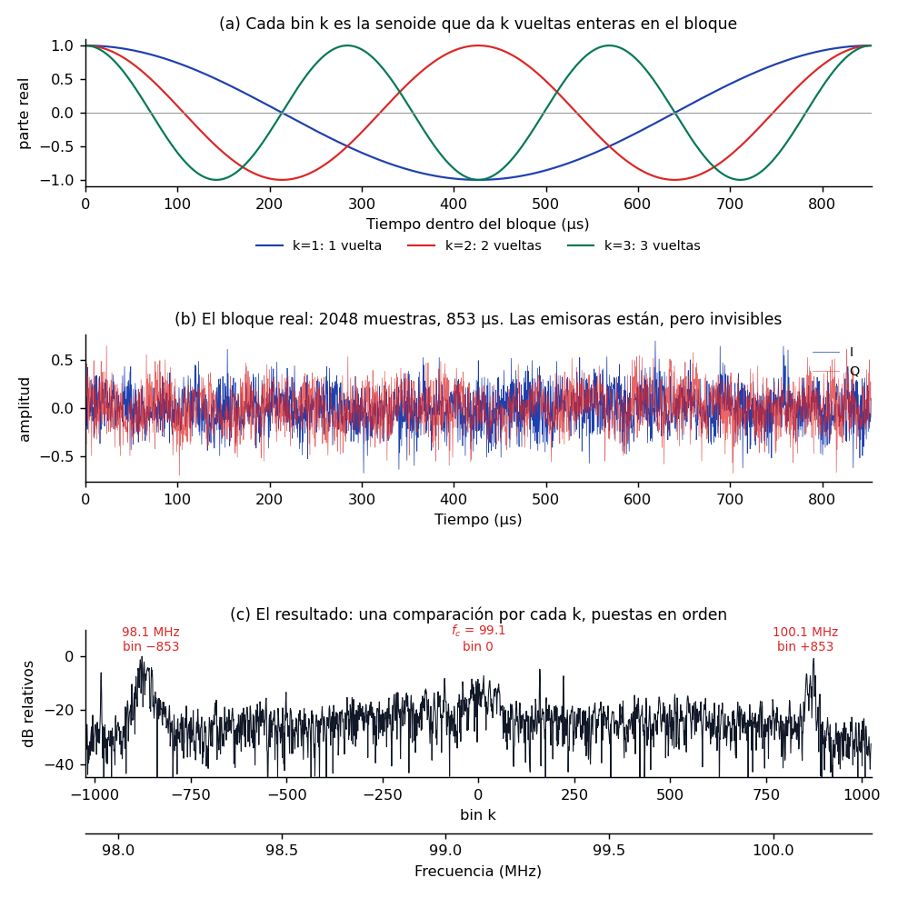

**Figura 17.** De las muestras al espectro: las senoides de referencia, el bloque crudo y el resultado de compararlos.

El panel (a) muestra contra qué se compara. Cada bin $k$ es la senoide que completa **exactamente $k$ vueltas enteras dentro del bloque**, y de ahí sale el espaciado entre bins. Con $N = 2048$ muestras a 2.4 MS/s el bloque dura 853 µs, así que el bin 1 da una vuelta en ese tiempo, es decir 1172 Hz; el bin 853 da 853 vueltas, casi exactamente 1 MHz.

El panel (b) es el bloque tal cual sale del archivo. Parece ruido, y sin embargo contiene tres emisoras.

El panel (c) es el resultado de las 2048 comparaciones, puestas en orden. Los datos son los mismos que en (b): lo único que cambió es quién los mira. Observa que lleva dos ejes, porque la transformada devuelve desplazamientos respecto a 0 Hz y la frecuencia absoluta es una etiqueta que se añade después, sumando $f_c$.

!!! warning "Dos períodos distintos, con trabajos opuestos"
    Es fácil confundirlos porque ambos se miden en segundos.

    $T_s = 1/f_s$ es la separación **entre** muestras, 416.7 ns aquí, y fija el **ancho** de la banda observable.

    $T_b = N \cdot T_s$ es la duración del **bloque**, 853.3 µs, y fija la **resolución** $\Delta f = 1/T_b$, que aquí vale 1172 Hz.

    Uno decide cuánto espectro ves; el otro, con cuánto detalle.

Repitiendo esa operación sobre los 11 718 bloques del archivo y apilando los resultados en orden temporal se obtiene el espectrograma, que es la fotografía completa de la grabación:

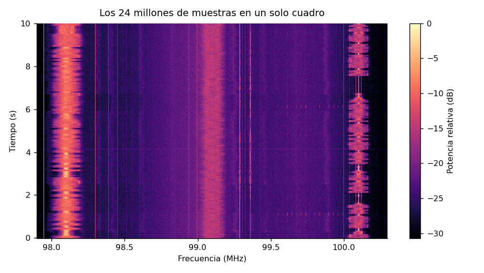

**Figura 18.** Espectrograma de los diez segundos completos: frecuencia en el eje horizontal, tiempo en el vertical.

Cada fila horizontal es el espectro de un instante; el eje vertical es el tiempo. Se distinguen tres emisoras fuertes en 98.1, 99.1 y 100.1 MHz, cada una de unos 200 kHz de ancho, y su brillo late con el programa de audio que transportan. Las líneas verticales finas y constantes son portadoras piloto y espurias del propio dongle.

Los mismos datos admiten una representación como superficie, con la potencia en el eje vertical:

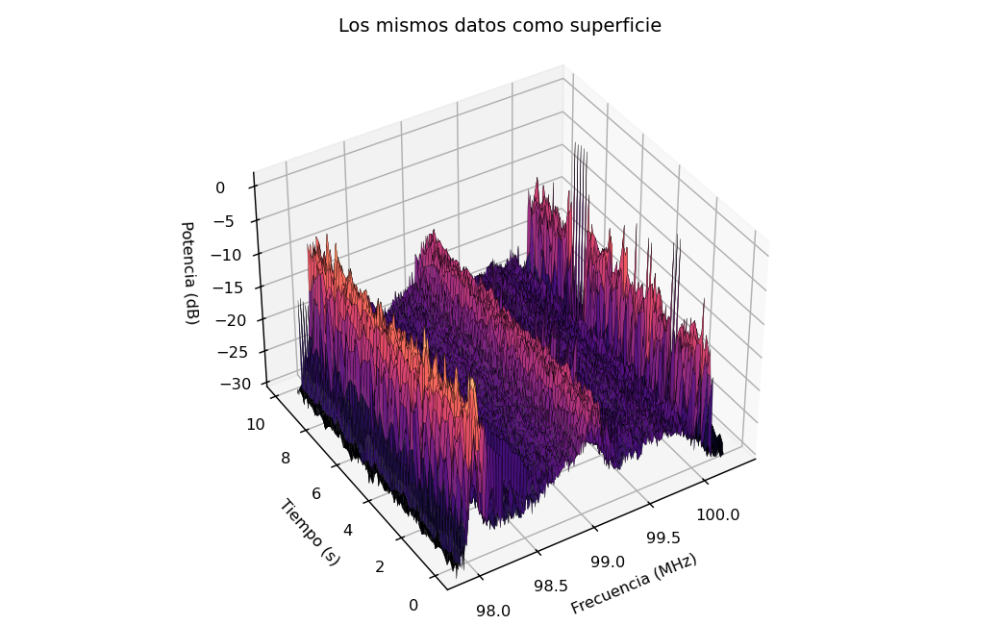

**Figura 19.** La misma matriz del espectrograma dibujada como superficie, para comparar legibilidad.

Se ve más espectacular y se lee peor: los picos del frente tapan lo que hay detrás y el ojo no compara alturas en perspectiva. El mapa plano contiene exactamente la misma información y permite leer una frecuencia o un instante concretos, y por eso todo receptor real, de GNU Radio a SDR++, muestra una cascada plana y no una superficie.

Queda una elección por hacer, y es el tema con el que arranca la Sesión 03. Al fijar $N$ decides dónde gastar la resolución, porque el producto $\Delta f \cdot \Delta t$ siempre vale uno:

| $N$ | $\Delta f$ | $\Delta t$ | Bloques en 10 s |
|---:|---:|---:|---:|
| 256 | 9375 Hz | 107 µs | 93 750 |
| 1024 | 2344 Hz | 427 µs | 23 437 |
| 4096 | 586 Hz | 1.7 ms | 5 859 |
| 65 536 | 37 Hz | 27 ms | 366 |

Bloques largos distinguen frecuencias muy juntas pero emborronan cuándo ocurrió cada cosa. Bloques cortos fechan los eventos con precisión pero no separan frecuencias vecinas. Ningún ajuste gana en ambas.

#### Cómo se dibujan

Las dos vistas salen de la misma matriz, y construirla son diez líneas. El fragmento lee la grabación, la corta en bloques, transforma cada uno y promedia grupos de bloques para que la imagen quepa en pantalla.

```python title="espectrograma.py"
import numpy as np
import matplotlib.pyplot as plt

FS, FC, N, FILAS = 2.4e6, 99.1e6, 2048, 300

crudo = np.fromfile("samples/fm_99p1MHz_2p4Msps_g30.cu8", dtype=np.uint8)
iq = ((crudo[0::2] - 127.5) + 1j * (crudo[1::2] - 127.5)) / 127.5

# Un espectro por cada bloque de N muestras
n_bloques = len(iq) // N
bloques = iq[: n_bloques * N].reshape(n_bloques, N) * np.hanning(N)
pot = np.abs(np.fft.fftshift(np.fft.fft(bloques, axis=1), axes=1)) ** 2

# Promedia grupos de bloques para que la imagen quepa en pantalla
pot = pot[: n_bloques // FILAS * FILAS].reshape(FILAS, -1, N).mean(axis=1)
db = 10 * np.log10(pot)
db -= db.max()

f = (FC + np.fft.fftshift(np.fft.fftfreq(N, 1 / FS))) / 1e6
t = np.linspace(0, len(iq) / FS, FILAS)

plt.pcolormesh(f, t, db, shading="auto", cmap="magma", vmin=-30, vmax=0)
plt.xlabel("Frecuencia (MHz)")
plt.ylabel("Tiempo (s)")
plt.colorbar(label="Potencia relativa (dB)")
plt.show()
```

La línea del `reshape` es la que conviene leer despacio: convierte una tira de 24 millones de muestras en 11 718 bloques de 2048, y cada bloque se transformará por separado. La multiplicación por `np.hanning(N)` es la ventana que suaviza los extremos de cada bloque; sin ella aparece la fuga espectral de la sección anterior.

La superficie usa exactamente la misma matriz `db`, solo que dibujada en perspectiva y submuestreada para que la malla no se sature:

```python title="superficie3d.py, continúa el anterior"
fig = plt.figure(figsize=(8, 5))
ax = fig.add_subplot(projection="3d")

F, T = np.meshgrid(f[::6], t[::5])
ax.plot_surface(F, T, db[::5, ::6], cmap="magma", vmin=-30, vmax=0, linewidth=0)

ax.set_xlabel("Frecuencia (MHz)")
ax.set_ylabel("Tiempo (s)")
ax.set_zlabel("Potencia (dB)")
ax.view_init(elev=38, azim=-122)
plt.show()
```

Los pasos `[::6]` y `[::5]` descartan cinco de cada seis columnas y cuatro de cada cinco filas. Sin ellos matplotlib dibuja 614 400 polígonos y tarda minutos en responder.

??? tip "Las figuras de esta sección"
    Las tres salen del generador [`gen_espectro_tiempo.py`](https://github.com/ollerenac-uni/sdr/blob/main/docs/sessions/01-introduccion-sdr/figures/gen_espectro_tiempo.py), que es la versión cuidada de los fragmentos de arriba. Cambia `N` y vuelve a ejecutarlo para ver el compromiso de la tabla con tus propios ojos:

    ```bash
    cd docs/sessions/01-introduccion-sdr/figures
    python gen_espectro_tiempo.py
    ```

### Reporte 0: del bit al espectro

- **Vence:** al inicio de la Sesión 02, publicado en el sitio de reportes del estudiante.
- **Contenido obligatorio:** sistema operativo y versión de GNU Radio; salidas de A1 a A6 y respuesta a A6; capturas de la Parte B con las dos respuestas; captura del grafo de la Parte C y de sus dos sumideros, con las respuestas C1, C2 y C3; problemas de instalación encontrados y su solución.
- **Opcional:** evidencia de la Parte D.

| Criterio | Puntos |
|---|:---:|
| Salidas de la Parte A completas y legibles, con la interpretación de A6 | 1 |
| Diagnóstico correcto del fallo de la Parte B, con la distinción entre convertir y reinterpretar | 1 |
| Grafo de la Parte C funcionando, con capturas de ambos sumideros | 1 |
| Respuestas C1, C2 y C3 correctas | 1 |
| Publicación puntual, con la plantilla y el archivo `.grc` enlazado en el repositorio | 1 |

La clínica de instalación se desarrolla en paralelo durante toda la sesión. Quien encuentre problemas con Zadig, el módulo DVB de Linux o `rtl_test` los resuelve con el profesor y los voluntarios; el Reporte 0 debe registrar el problema y su solución.

---

## Lecturas recomendadas

1. M. Lichtman, *PySDR: A Guide to SDR and DSP using Python*: [introducción](https://pysdr.org/content/intro.html) y [RTL-SDR](https://pysdr.org/content/rtlsdr.html). Lectura gratuita de referencia del curso.
2. rtl-sdr.com, *About RTL-SDR*. Especificaciones, historia y límites del dongle. [rtl-sdr.com/about-rtl-sdr](https://www.rtl-sdr.com/about-rtl-sdr/)
3. Osmocom, *rtl-sdr wiki*. Documentación del driver y de las utilidades `rtl_*`. [osmocom.org/projects/rtl-sdr/wiki](https://osmocom.org/projects/rtl-sdr/wiki)
4. GNU Radio Wiki, *Tutorials: Your First Flowgraph* y *Python Variables in GRC*. [wiki.gnuradio.org/index.php/Tutorials](https://wiki.gnuradio.org/index.php/Tutorials)
5. J. Mitola, "The software radio architecture", *IEEE Communications Magazine*, vol. 33, n.º 5, 1995. El artículo que dio nombre al campo.
6. TUO de la Ley de Telecomunicaciones (DS 013-93-TCC) y Reglamento General (DS 06-94-TCC), artículos citados en la sección 6.
