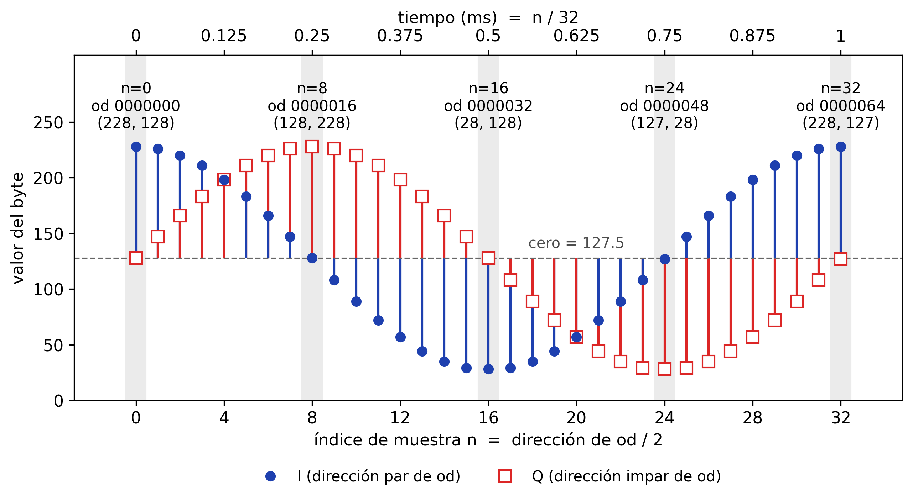

# Laboratorio: muestreo, FFT, decimación e interpolación

Esta guía es para quien ya conecta bloques en GNU Radio pero todavía no domina la relación entre la frecuencia de muestreo $f_s$, el tiempo, el número de muestras y el tamaño de la FFT. Continúa la [Parte A de la Sesión 01](index.md#parte-a-el-archivo-por-dentro-sin-gnu-radio), donde leíste la grabación byte a byte, y le añade el eje que allí faltaba. Allí contaste bytes y muestras; aquí cada muestra ocupa además un instante.

Materiales:

| Archivo | Qué es |
|---|---|
| [`gen_tono.py`](https://github.com/ollerenac-uni/sdr/blob/main/samples/gen_tono.py) | Genera `tono_1kHz_32kSps.cu8`. Sección 1 |
| [`calentamiento_32k.grc`](https://github.com/ollerenac-uni/sdr/blob/main/gnuradio-flowgraphs/calentamiento_32k.grc) | Grafo de la sección 1 |
| `fm_99p1MHz_2p4Msps_g30.cu8` | La grabación de la Sesión 01. Secciones 2, 4 y 6 |

## 1. Calentamiento: el milisegundo que se puede contar

La grabación de la Sesión 01 tiene 24 millones de muestras y nadie puede mirarlas una a una. Esta sección usa un archivo tan simple que sí se puede: un tono de 1 kHz muestreado a 32 kS/s, donde un milisegundo cabe en 32 líneas de terminal.

**1.1 Predecir con papel.** Antes de ejecutar nada, responde:

1. A 32 kS/s, ¿cuántas muestras hay en 1 ms?
2. ¿Y en 1 s?
3. El archivo que vas a generar ocupa 6400 bytes en formato `.cu8`. ¿Cuánto dura?

Basta una regla: el número de muestras es la tasa por la duración,

$$
N = f_s \cdot T.
$$

Tiene un atajo que conviene retener: **en 1 ms hay tantas muestras como kS/s tenga $f_s$**, porque 1 ms es 1/1000 s y «kS/s» significa miles de muestras por segundo.

??? question "1.1. ¿Cuántas muestras y cuánto tiempo?"
    En 1 ms hay $32\,000 \cdot 0.001 = 32$ muestras. Es el atajo: 32 kS/s, 32 muestras por milisegundo.

    En 1 s hay 32 000.

    Cada muestra compleja ocupa dos bytes, uno para I y otro para Q, así que 6400 bytes son 3200 muestras. Despejando la regla, $T = N / f_s = 3200 / 32\,000 = 0.1$ s.

**1.2 Generar y contar.** Con el entorno `(base)` de radioconda activo y desde la carpeta `sdr/`, genera el archivo y pide a `od` sus primeros 64 bytes, dos por línea:

```bash
python samples/gen_tono.py
od -Ad -tu1 -w2 -N64 -v samples/tono_1kHz_32kSps.cu8
```

El primer comando responde `tono_1kHz_32kSps.cu8: 6400 bytes`, la cifra que usaste en 1.1. El segundo imprime esto:

```
0000000 228 128
0000002 226 147
0000004 220 166
0000006 211 183
0000008 198 198
0000010 183 211
0000012 166 220
0000014 147 226
0000016 128 228
0000018 108 226
0000020  89 220
0000022  72 211
0000024  57 198
0000026  44 183
0000028  35 166
0000030  29 147
0000032  28 128
0000034  29 108
0000036  35  89
0000038  44  72
0000040  57  57
0000042  72  44
0000044  89  35
0000046 108  29
0000048 127  28
0000050 147  29
0000052 166  35
0000054 183  44
0000056 198  57
0000058 211  72
0000060 220  89
0000062 226 108
0000064
```

Cómo leerlo:

- `-N64` pide 64 bytes. A dos bytes por muestra son 32 muestras, y a 32 kS/s eso es exactamente el milisegundo de 1.1.
- Salen 33 líneas. Las 32 primeras son muestras. La última, `0000064`, no trae valores: es la dirección donde terminó la lectura.
- La primera columna es la dirección, la posición en decimal del primer byte de la línea. Avanza de dos en dos, así que el índice de la muestra es n = dirección / 2: la línea `0000016` es la muestra 8.
- Tras la dirección vienen los dos bytes de la muestra, primero I y después Q, igual que en A5 de la Sesión 01.

**1.3 Encontrar los 90°.** Busca en la salida el valor más alto de I y el valor más alto de Q. Anota en qué línea está cada uno y cuántas muestras los separan.

??? question "1.3. ¿Dónde están los máximos?"
    I alcanza su máximo, 228, en la primera línea: dirección `0000000`, muestra n = 0.

    Q alcanza el mismo 228 en la dirección `0000016`, muestra n = 8.

    Los separan ocho muestras. Un tono de 1 kHz completa un ciclo por milisegundo, así que un ciclo ocupa las 32 muestras y ocho son un cuarto de ciclo: 90°. Q hace lo mismo que I con un cuarto de ciclo de retraso. Son las dos proyecciones de una flecha que gira, la misma forma de dibujar un número complejo que usa la figura de los fasores de la [Sesión 01](index.md#2-cadena-de-recepcion-del-rtl-sdr).



**Figura 1.** Un milisegundo del tono, muestra a muestra: en cada posición n están los dos bytes de una línea de `od`, I y Q del mismo instante.

La línea discontinua es el cero de la señal, 127.5, el mismo que A6 de la Sesión 01 dedujo del promedio de la grabación. Cada tallo nace en ella y sube o baja hasta el valor del byte, con la misma forma que dibujará el Time Sink en 1.4.

El círculo azul relleno es I y el cuadrado rojo hueco es Q. Comparten posición horizontal porque son los dos bytes de una misma línea de `od`, es decir, el mismo instante.

El eje inferior cuenta muestras y el superior, milisegundos. Las etiquetas de n = 0, 8, 16, 24 y 32 dan el índice, la dirección que imprime `od`, que es siempre 2n, y el par (I, Q).

Sigue los extremos: I arriba en n = 0, Q arriba en n = 8, I abajo en n = 16, Q abajo en n = 24. Q repite cada gesto de I un cuarto de ciclo después.

La muestra 32 ya pertenece al ciclo siguiente y vuelve al máximo de I. No aparece en la salida de 1.2, donde `0000064` sale sola; para ver sus bytes pide dos más con `-N66`. Su Q vale 127 y no 128 como en n = 0, por el redondeo que explica el aviso siguiente.

!!! info "Por qué el cero sale unas veces 128 y otras 127"
    En n = 8 el coseno vale cero y `od` da I = 128. En n = 24 también vale cero y da 127. El archivo no está mal: el cero del formato es 127.5, justo a medio camino entre dos enteros, y el byte tiene que caer a un lado.

    Cuando la cuenta da **exactamente** 127.5, como en Q para n = 0 o en I para n = 8, NumPy redondea al entero par: 128. Cuando la aritmética de coma flotante deja un residuo diminuto, del orden de $10^{-14}$, decide el signo de ese residuo. En n = 24 el residuo es $-1.8 \times 10^{-14}$, la suma queda apenas por debajo de 127.5 y sale 127.

    Por eso ciclos sucesivos pueden diferir en ±1 justo en esos valores.

    ??? question "¿Por qué n = 8 da 128 y n = 24 da 127?"
        En n = 8 también hay residuo: el coseno calculado vale $+6.1 \times 10^{-15}$. Pero cerca de 127.5 la coma flotante solo distingue pasos de $1.4 \times 10^{-14}$, y un residuo menor que medio paso, $7.1 \times 10^{-15}$, se pierde al sumar. La suma queda en 127.5 exacto y se aplica el redondeo al par. El residuo de n = 24 supera ese medio paso y sí mueve la suma.

**1.4 El mismo milisegundo en GNU Radio.** Abre [`calentamiento_32k.grc`](https://github.com/ollerenac-uni/sdr/blob/main/gnuradio-flowgraphs/calentamiento_32k.grc) y ejecútalo con **F6**. Los bloques son los de la Parte C de la Sesión 01 con dos cambios: `samp_rate` vale `32000` y el `File Source` lee `../samples/tono_1kHz_32kSps.cu8`. Lo que interesa está en cómo se configuraron los dos visores.

Empieza por el Time Sink:

- `Number of Points` vale 32, así que dibuja 32 muestras: el milisegundo de 1.2. La leyenda llama `I` a la traza azul y `Q` a la roja, y la rejilla está activada.
- Tiene un disparo (*trigger*), que decide en qué muestra empieza cada imagen: `Trigger Mode` en `Normal`, `Trigger Slope` en `Positive`, `Trigger Level` en 0.78 y `Trigger Channel` en 0, que es la parte real. El visor espera a que I cruce 0.78 subiendo, así que la imagen queda quieta y arranca en n = 0: I en 0.788 y Q prácticamente en cero.
- La curva azul arranca en 0.788 y no en 228. Los bloques `Add Const` y `Multiply Const` hacen la cuenta de C2 de la Sesión 01: $(228 - 127.5) / 127.5 = 0.788$.

Calcula qué altura deben tener Q e I en n = 8, que en el eje de tiempo es 0.25 ms, y compruébalo en la pantalla.

??? question "1.4. Las alturas en n = 8"
    Q vale 228, así que su altura es la misma que la de I en n = 0: $(228 - 127.5) / 127.5 = 0.788$.

    I vale 128, así que su altura es $(128 - 127.5) / 127.5 = 0.0039$. En pantalla parece cero, pero no lo es: es el 128 del aviso sobre el redondeo.

**1.5 El tamaño de la FFT.** Pasa al Frequency Sink. Tiene `FFT Size` en 32, `Bandwidth (Hz)` en `samp_rate`, `Center Frequency (Hz)` en 0 y ventana `Rectangular`, que en el `.grc` se guarda como `window.WIN_RECTANGULAR`.

- El eje va de −16 a +16 kHz. La FFT de una señal compleja muestra de $-f_s/2$ a $+f_s/2$, el ancho $f_s$ entero que ya apareció en C3 de la Sesión 01.
- Los 32 bins se reparten esos 32 kHz, así que quedan separados 1000 Hz. El tono cae exacto en el bin de +1 kHz y marca unos −2 dB, que es $20 \log_{10}(0.788)$: la altura de 1.4 en decibelios. Sale en +1 kHz y no en −1 kHz porque Q va por detrás de I, como encontraste en 1.3.
- Lo demás no es el tono. Es un peine de torres entre unos −58 y −68 dB, con huecos que caen al fondo de la escala, −140 dB. Es el error de guardar la señal en 8 bits, unos 60 dB por debajo del tono.

??? question "¿De dónde sale el peine, y por qué no subir `Y min` para quitarlo?"
    En n = 1 la cuenta da 225.58, pero un byte solo admite enteros y guarda 226. Esa diferencia, repetida en cada muestra, es una señal pequeña que viaja sumada al tono, y la FFT la dibuja como a cualquier otra. Es el precio de los 256 niveles que definieron «ADC de 8 bits» en la [Parte A de la Sesión 01](index.md#parte-a-el-archivo-por-dentro-sin-gnu-radio).

    Subir `Y min` la sacaría de la pantalla, pero no de los datos.

Ahora cambia `FFT Size` a 1024; el bloque solo acepta potencias de dos entre 32 y 32768. Antes de ejecutar, predice cuánto se separan los bins, cuánto tiempo abarca cada FFT y dónde estará la raya.

??? question "1.5. ¿Qué cambió con 1024?"
    La separación entre bins baja a 32 000 / 1024 = 31.25 Hz.

    Cada FFT abarca ahora 1024 / 32 000 s = 32 ms: treinta y dos ciclos del tono en lugar de uno.

    La raya sigue en 1 kHz y a unos −2 dB, ahora mucho más fina. El peine del redondeo sigue en las mismas frecuencias, convertido en rayas sueltas, y entre ellas el fondo ya no cae a −140: se llena de un rizado entre unos −85 y −100 dB. Es el ±1 del aviso de 1.3: no todos los ciclos son idénticos. Con 32 muestras solo hay bins cada 1 kHz y esas diferencias no tienen dónde aparecer entre ellos; con 1024, sí.

La regla funciona en los dos sentidos:

$$
\Delta f = \frac{f_s}{N}, \qquad T = \frac{N}{f_s}.
$$

Son la misma cuenta, porque $\Delta f = 1/T$. Más resolución en frecuencia cuesta más tiempo de observación.

!!! note "La ventana es rectangular a propósito"
    Con la Blackman-Harris que trae `test2.grc`, la misma raya se ensancha varios bins. Por qué, lo explica la [Sesión 02, §5](../02-tiempo-frecuencia-iq/index.md#5-por-que-aparece-la-fuga-espectral). Aquí se usa la rectangular para que el tono ocupe un solo bin.

## 2. Las mismas reglas donde no se pueden contar

## 3. La escalera con hardware real

!!! warning "Pendiente"
    Esta parte necesita dos grabaciones nuevas, a 1.2 MS/s y a 300 kS/s, que todavía no están publicadas.

## 4. Decimación en software

## 5. El careo: grabado contra decimado

!!! warning "Pendiente"
    Esta parte necesita la grabación a 300 kS/s, que todavía no está publicada.

## 6. Interpolación
