# Sesión 02 — Señales y espectro en SDR

## Objetivos de aprendizaje

Al finalizar esta sesión, el estudiante será capaz de:

1. Calcular el intervalo entre muestras y la duración de un bloque a partir de la tasa de muestreo y del número de muestras.
2. Interpretar las componentes I/Q de una señal, calcular su magnitud y fase, y explicar la diferencia entre una senoide real y una senoide compleja.
3. Relacionar las representaciones en tiempo y frecuencia, y predecir el espectro de un tono real, un tono complejo y una suma de tonos.
4. Interpretar el eje de frecuencias de una FFT y explicar cómo el número de muestras y la ventana afectan el espectro observado.
5. Distinguir aliasing y spectral leakage, y comprobar sus efectos con señales conocidas.
6. Relacionar las frecuencias en baseband con las frecuencias RF de una captura SDR y predecir el desplazamiento producido por una mezcla compleja.

## Teoría

### 1. De las muestras a una señal

En la sesión 1, el receptor entregó una secuencia de muestras I/Q. Cada muestra corresponde a un instante de la señal. Para interpretar esa secuencia hace falta conocer sus valores, su orden y la tasa de muestreo con la que se obtuvo.

El RTL-SDR entrega muestras complejas I/Q: cada muestra contiene dos valores reales, I y Q, que se interpretan conjuntamente como $I+jQ$. La señal física recibida es un voltaje real; la salida I/Q es su representación compleja en baseband.

Para estudiar primero la relación entre muestras y tiempo, esta subsección utiliza una senoide real de ejemplo, representada por $x[n]$. Este ejemplo no reproduce todavía la salida I/Q del receptor. Las relaciones entre índice, tasa de muestreo y tiempo también se aplican a una secuencia compleja.

#### 1.1. Un valor de la señal en cada instante

Una señal continua, como el voltaje a la entrada de un ADC, se representa mediante $x(t)$. La variable $t$ indica tiempo, por ejemplo en segundos.

Al tomar valores de esa señal en instantes separados, se obtiene una secuencia:

$$
x[0],\;x[1],\;x[2],\;\ldots
$$

La notación $x[n]$ indica el valor de la muestra de índice $n$. El índice comienza en cero: $x[0]$ es la primera muestra, $x[1]$ es la segunda y así sucesivamente.

El índice indica una posición en la secuencia. Por sí solo, $n=4$ no significa cuatro segundos ni cuatro milisegundos. El tiempo depende de la tasa de muestreo.

#### 1.2. Muestreo y cuantización

El ADC realiza dos operaciones que conviene distinguir:

| Operación | Qué limita | Resultado |
|---|---|---|
| Muestreo | Los instantes en los que se toma un valor | Una secuencia en tiempo discreto. |
| Cuantización | Los valores de amplitud que pueden representarse | Cada muestra se asigna a uno de los niveles disponibles. |

Por ejemplo, si un valor ideal fuera $0.7071$ y los niveles disponibles estuvieran separados por $0.25$, el redondeo al nivel más cercano daría $0.75$. El instante de la muestra sería el mismo; cambiaría la amplitud representada. Es un ejemplo de cuantización, no un modelo del ADC del RTL-SDR.

Esta distinción entre discretizar el tiempo y discretizar la amplitud se desarrolla en las [notas de muestreo y cuantización del MIT](https://ocw.mit.edu/courses/6-003-signals-and-systems-fall-2011/95b4b245722073e5d0c4ea95b384446e_MIT6_003F11_lec22.pdf).

Los ejemplos siguientes calculan muestras de un tono con NumPy. Por ahora no simulan la cuantización del ADC; permiten estudiar la relación entre valores y tiempo.

#### 1.3. La tasa de muestreo construye el eje temporal

La tasa de muestreo $f_s$ indica cuántas muestras se toman por segundo. El intervalo entre muestras consecutivas es

$$
T_s=\frac{1}{f_s}.
$$

Si se asigna $t=0$ a la primera muestra, el instante de la muestra $n$ es

$$
t_n=nT_s=\frac{n}{f_s}.
$$

En el modelo de muestreo ideal, el valor se obtiene evaluando la señal en ese instante:

$$
x[n]=x(t_n).
$$

Estas relaciones suponen muestras uniformemente espaciadas. La descripción matemática se puede consultar en el material de [muestreo de senoides de TU Eindhoven](https://spseducation.tue.nl/disciplines/discrete/discretesignalprocessing_sampling_sampling/).

Para una tasa de $f_s=8000$ S/s, también escrita como 8 kS/s:

$$
T_s=\frac{1}{8000}\;\text{s}=125\;\mu\text{s}=0.125\;\text{ms}.
$$

| Índice $n$ | Posición en la secuencia | Instante $t_n$ |
|---:|---|---:|
| 0 | Primera muestra | 0 ms |
| 1 | Segunda muestra | 0.125 ms |
| 2 | Tercera muestra | 0.250 ms |
| 4 | Quinta muestra | 0.500 ms |
| 8 | Novena muestra | 1.000 ms |

La muestra de índice 8 aparece a 1 ms del inicio. Su valor todavía depende de la señal que se esté muestreando.

#### 1.4. Un tono que se puede contar

Una senoide real permite reconocer los parámetros básicos de una señal:

$$
x(t)=A\cos(2\pi f_0t+\phi).
$$

| Parámetro | Significado | Valor del ejemplo |
|---|---|---:|
| $A$ | Amplitud: distancia desde cero hasta un máximo de la senoide. | 1 |
| $f_0$ | Frecuencia del tono: ciclos por segundo. | 1000 Hz |
| $\phi$ | Fase: posición dentro del ciclo en el origen temporal. | 0 rad |

Las amplitudes del ejemplo no representan voltios medidos por el receptor. Son valores elegidos para la simulación.

El período del tono, $T_0$, es el tiempo que dura un ciclo:

$$
T_0=\frac{1}{f_0}=\frac{1}{1000}\;\text{s}=1\;\text{ms}.
$$

Con $f_s=8000$ S/s se toman ocho muestras por ciclo de este tono. $f_0$ y $f_s$ describen cosas diferentes: la primera indica ciclos de la señal por segundo; la segunda, muestras por segundo.

Al sustituir $t=n/f_s$ en la senoide se obtiene

$$
x[n]=A\cos\left(2\pi f_0\frac{n}{f_s}+\phi\right).
$$

**Colab — Celda 1: generar las muestras.** Las cuatro celdas de esta subsección se ejecutan en orden dentro del mismo notebook.

```python
import numpy as np
import matplotlib.pyplot as plt

fs = 8000       # Tasa de muestreo, en S/s.
f0 = 1000       # Frecuencia del tono, en Hz.
A = 1.0        # Amplitud.
phi = 0.0      # Fase, en radianes.
N = 16         # Número de muestras del bloque.

n = np.arange(N)                 # Índices: 0, 1, ..., N-1.
t = n / fs                      # Instantes, en segundos.
x = A * np.cos(2 * np.pi * f0 * t + phi)

print(" n    tiempo (ms)    x[n]")
for k in range(8):
    print(f"{n[k]:2d}      {t[k]*1000:6.3f}     {x[k]:7.4f}")
```

`np.arange(N)` genera exactamente $N$ índices, desde 0 hasta $N-1$. Dividirlos entre `fs` construye los instantes de muestreo. Este uso sigue la definición de [arange en NumPy](https://numpy.org/doc/stable/reference/generated/numpy.arange.html).

Los primeros valores son aproximadamente $1$, $0.7071$, $0$, $-0.7071$, $-1$, $-0.7071$, $0$ y $0.7071$. La muestra $x[8]$ vuelve a valer 1: ha transcurrido un período. Algunos ceros pueden aparecer como números muy pequeños o como `-0.0000` por la precisión de los cálculos.

**Colab — Celda 2: observar índice y tiempo.**

```python
# Muchos puntos permiten dibujar la función conocida como referencia.
t_ref = np.linspace(0, N / fs, 1000)
x_ref = A * np.cos(2 * np.pi * f0 * t_ref + phi)

fig, axes = plt.subplots(2, 1, figsize=(10, 6), layout="constrained")

axes[0].stem(n, x, basefmt=" ")
axes[0].set(xlabel="Índice de muestra n", ylabel="Amplitud", title="Valores de la secuencia", xticks=n)

axes[1].plot(t_ref * 1000, x_ref, color="0.7", label="Función conocida del ejemplo")
axes[1].stem(t * 1000, x, basefmt=" ", label="Muestras")
axes[1].axvline(N / fs * 1000, color="tab:orange", linestyle="--", label="Fin del bloque (sin muestra)")
axes[1].set(xlabel="Tiempo (ms)", ylabel="Amplitud", title="Las mismas muestras con su eje temporal")
axes[1].legend(loc="upper center", bbox_to_anchor=(0.5, -0.2))

for ax in axes:
    ax.grid(alpha=0.2)
plt.show()
```

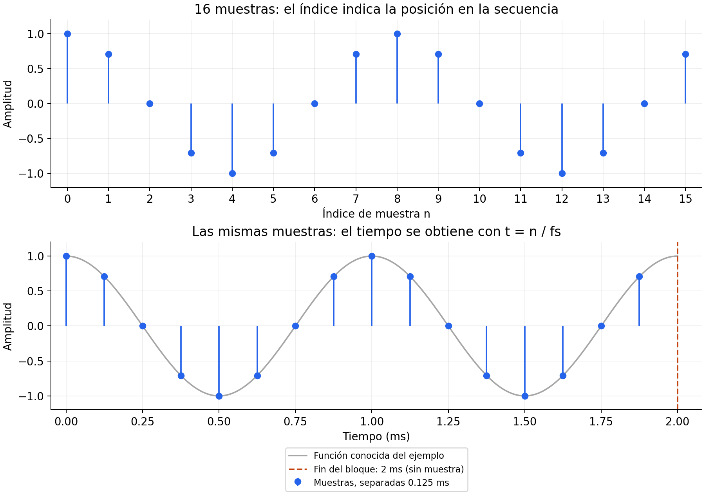

**Figura 1.** Las mismas 16 muestras representadas por índice y por tiempo, con una tasa de muestreo de 8 kS/s.

En el gráfico superior se cuentan posiciones de la secuencia. En el inferior se leen instantes: los máximos en $n=0$ y $n=8$ corresponden a 0 y 1 ms. Cada punto azul representa una muestra. La curva gris representa la función conocida utilizada para generar el ejemplo; no es una reconstrucción obtenida de una captura. Los tallos verticales ayudan a leer las amplitudes y no representan pulsos físicos.

#### 1.5. Cuánto tiempo representa un bloque

Un bloque de $N$ muestras contiene los índices de 0 a $N-1$. Su duración nominal es

$$
T_{\mathrm{bloque}}=NT_s=\frac{N}{f_s}.
$$

Con 16 muestras a 8000 S/s:

$$
T_{\mathrm{bloque}}=\frac{16}{8000}\;\text{s}=2\;\text{ms}.
$$

La última muestra es $x[15]$, cuyo instante es

$$
t_{15}=\frac{15}{8000}\;\text{s}=1.875\;\text{ms}.
$$

No hay contradicción: entre la primera y la última muestra existen 15 intervalos. Para contar la duración nominal del bloque se consideran 16 intervalos de muestreo. La siguiente muestra de una secuencia que continúa, $x[16]$, llegaría a los 2 ms, ya fuera de este bloque. En la Figura 1, la línea naranja marca ese límite.

**Colab — Celda 3: comprobar los tiempos.**

```python
print(f"Intervalo entre muestras: {1e6 / fs:.1f} us")
print(f"Duración del bloque:      {1000 * N / fs:.3f} ms")
print(f"Instante de la última:    {1000 * t[-1]:.3f} ms")
print(f"Muestras por ciclo:       {fs / f0:g}")
```

La salida es 125.0 us, 2.000 ms, 1.875 ms y 8 muestras por ciclo. En Python, `t[-1]` selecciona el último elemento del arreglo.

??? example "Comprobación: el mismo bloque con otra tasa declarada"
    Si los mismos 16 valores se interpretan con una tasa de 4000 S/s, el intervalo pasa a 0.25 ms y la duración nominal a 4 ms. Los valores no cambian; cambia el tiempo asignado a cada uno. Por eso una captura necesita conservar su tasa de muestreo como metadato.

#### 1.6. Qué cambia al modificar el tono

Una vez fijado el eje temporal, se puede cambiar un parámetro del tono y observar su efecto:

| Cambio respecto al ejemplo | Predicción |
|---|---|
| Amplitud $A=0.5$ | Los valores se reducen a la mitad; el período sigue siendo 1 ms. |
| Frecuencia $f_0=2000$ Hz | El período pasa a 0.5 ms; hay cuatro ciclos en el intervalo de 2 ms y cuatro muestras por ciclo. |
| Fase $\phi=\pi/2$ | El valor inicial pasa de 1 a 0; la amplitud y el período se mantienen. |

**Colab — Celda 4: comparar un cambio a la vez.** Esta celda utiliza los arreglos de referencia de las celdas anteriores y mantiene la tasa de muestreo y el tamaño del bloque.

```python
cambios = [
    (0.5, 1000, 0.0, "Amplitud: A = 0.5"),
    (1.0, 2000, 0.0, "Frecuencia: f0 = 2 kHz"),
    (1.0, 1000, np.pi / 2, "Fase: phi = pi/2 rad"),
]

fig, axes = plt.subplots(3, 1, figsize=(10, 7), sharex=True, sharey=True, layout="constrained")
for ax, (amp, freq, fase, titulo) in zip(axes, cambios):
    y_ref = amp * np.cos(2 * np.pi * freq * t_ref + fase)
    y = amp * np.cos(2 * np.pi * freq * t + fase)
    ax.plot(t_ref * 1000, x_ref, "--", color="0.7", label="Referencia")
    ax.plot(t_ref * 1000, y_ref, color="tab:blue", label="Cambio")
    ax.plot(t * 1000, y, "o", color="tab:blue", label="Muestras")
    ax.set(title=titulo, ylabel="Amplitud", ylim=(-1.2, 1.2))
    ax.grid(alpha=0.2)
axes[0].legend(loc="upper center", bbox_to_anchor=(0.5, 1.5), ncol=3)
axes[-1].set_xlabel("Tiempo (ms)")
plt.show()
```

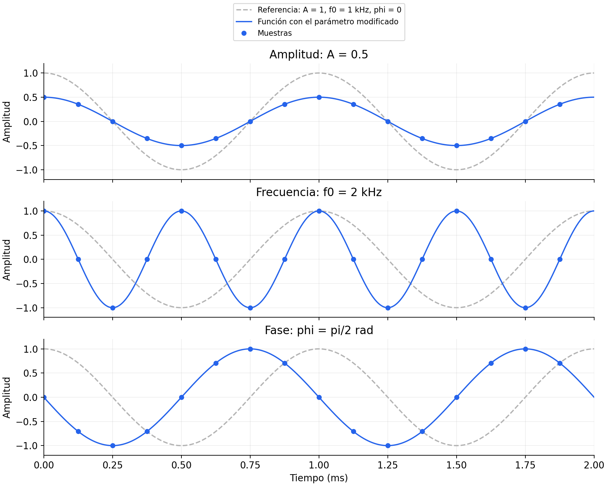

**Figura 2.** Efectos de cambiar por separado la amplitud, la frecuencia y la fase de un tono.

La curva gris conserva el tono original en los tres paneles. En el primero, la curva azul alcanza la mitad de amplitud y repite el ciclo en los mismos instantes. En el segundo, completa los ciclos en la mitad de tiempo. En el tercero, comienza en otra posición del ciclo: cruza por cero en lugar de empezar en un máximo. Los puntos mantienen los mismos instantes de muestreo en todos los casos.

Para experimentar, el estudiante puede cambiar una fila de `cambios`, anotar primero qué espera observar y ejecutar de nuevo la celda 4. Por ejemplo, $A=0.25$, $f_0=500$ Hz o $\phi=\pi$ permiten comparar una amplitud menor, un período mayor o un inicio en el mínimo. Cada prueba cambia un solo parámetro respecto al tono original.

??? example "Comprobación: frecuencia del tono y tasa de muestreo"
    Un tono de 500 Hz tiene un período de 2 ms. A 8000 S/s se toman 16 muestras por ciclo. La señal cambia más lentamente que el tono de 1 kHz, aunque la separación temporal entre muestras sigue siendo 0.125 ms.

??? example "Comprobación: índice, tiempo y fase"
    Con los parámetros originales, la muestra de índice 4 corresponde a 0.5 ms y vale aproximadamente $-1$. Si solo cambia la fase a $\pi/2$, ese índice sigue correspondiendo a 0.5 ms, pero su valor pasa a ser aproximadamente 0.

Al finalizar esta subsección, la secuencia ya tiene una interpretación temporal: el índice identifica una muestra, la tasa de muestreo determina su instante y el valor describe la señal en ese punto. La siguiente subsección utiliza esta base para interpretar las dos componentes de una muestra I/Q.

#### 1.7. Ejercicios de refuerzo

- **Forma de trabajo:** se plantea primero una respuesta con sus unidades y una justificación. La solución desplegable permite contrastar el resultado después de resolver el ejercicio.

##### Ejercicio 1A — construir el eje temporal

Se dispone de un bloque de 400 muestras con $f_s=20000$ S/s.

- Calcular el intervalo entre muestras, la duración nominal del bloque y el instante de la última muestra.
- Indicar a qué tiempo corresponde la muestra de índice $n=50$.

??? example "Solución del ejercicio 1A"

    - **Intervalo:** $T_s=1/20000=50$ µs. La tasa indica cuántas muestras corresponden a un segundo; su inversa indica cuánto tiempo separa dos muestras.
    - **Duración nominal:** $N/f_s=400/20000=20$ ms.
    - **Última muestra:** su índice es 399, no 400. Su instante es $399/20000=19.95$ ms.
    - **Muestra 50:** corresponde a $50/20000=2.5$ ms. El índice cuenta posiciones desde cero; no es una cantidad de segundos por sí mismo.

##### Ejercicio 1B — calcular valores de una senoide

Se considera $x[n]=0.8\cos(2\pi\,1000\,n/8000+\pi/2)$.

- Identificar amplitud, frecuencia, fase inicial y sample rate.
- Calcular el período, la cantidad de muestras por ciclo y los valores $x[0]$ y $x[2]$.

??? example "Solución del ejercicio 1B"

    - **Parámetros:** $A=0.8$, $f_0=1000$ Hz, $\phi=\pi/2$ rad y $f_s=8000$ S/s. La frecuencia del tono y el sample rate describen cosas distintas.
    - **Período y muestras por ciclo:** $T_0=1/1000=1$ ms y $f_s/f_0=8$ muestras por ciclo.
    - **Primera muestra:** $x[0]=0.8\cos(\pi/2)=0$.
    - **Muestra 2:** su fase es $2\pi(1000)(2)/8000+\pi/2=\pi$, de modo que $x[2]=-0.8$. Su instante es $2/8000=0.25$ ms.

##### Ejercicio 1C — cambiar una etiqueta no adquiere otras muestras

Un bloque de 32 muestras contiene un tono conocido de 1 kHz, adquirido a 8 kS/s. Por error, el mismo arreglo se interpreta como si su tasa fuera 16 kS/s.

- Calcular la duración y el intervalo entre muestras con cada tasa declarada.
- Indicar qué frecuencia se atribuiría al tono y si cambió la señal originalmente adquirida.

??? example "Solución del ejercicio 1C"

    - **Con la tasa correcta:** el bloque representa $32/8000=4$ ms y el intervalo es 0.125 ms.
    - **Con la etiqueta errónea:** representa $32/16000=2$ ms y el intervalo se interpreta como 0.0625 ms.
    - **Frecuencia atribuida:** la secuencia conserva ocho muestras por ciclo. Si se interpreta a 16 kS/s, se le atribuyen $16000/8=2000$ Hz.
    - **Qué ocurrió:** no se adquirió un tono nuevo de 2 kHz. Se interpretaron los mismos valores sobre un eje temporal incorrecto; para describir la adquisición se debe utilizar su tasa real.

##### Ejercicio 1D — explicar los tres cambios de la Figura 2

Se toma como referencia el tono de amplitud 1, frecuencia 1 kHz y fase inicial cero de la Figura 2.

- Explicar qué cambia al usar amplitud 0.5, frecuencia 2 kHz o fase inicial $\pi/2$, modificando un parámetro a la vez.
- Indicar si cambia la separación temporal de los puntos cuando se conservan $f_s$ y $N$.

??? example "Solución del ejercicio 1D"

    - **Cambio de amplitud:** los valores se reducen a la mitad, pero el período sigue siendo 1 ms.
    - **Cambio de frecuencia:** el período pasa a 0.5 ms. La señal completa los ciclos en menos tiempo y, a 8 kS/s, tiene cuatro muestras por ciclo.
    - **Cambio de fase:** el valor inicial pasa de 1 a 0. La amplitud y el período no cambian; cambia la posición del tono dentro de su ciclo en cada instante.
    - **Instantes de muestreo:** no cambian en ninguno de los tres casos, porque el sample rate se mantuvo fijo. Cambiar los valores no equivale a cambiar el eje temporal.

### 2. Señales reales y señales complejas I/Q

En el ejemplo anterior, cada muestra $x[n]$ era un número real. En la salida I/Q del RTL-SDR, cada muestra contiene una pareja de valores reales. Esa pareja se representa como un número complejo:

$$
z[n]=I[n]+jQ[n].
$$

I y Q corresponden al mismo índice de muestra y al mismo instante. La pareja completa constituye una muestra compleja; no son dos muestras tomadas en instantes consecutivos. A 8 kS/s de muestras complejas se obtienen 8000 valores I y 8000 valores Q por segundo.

#### 2.1. Qué significa una muestra compleja

Los nombres I y Q provienen de *in-phase* y *quadrature*. Se asocian con las dos referencias de mezcla, separadas 90°, utilizadas para obtener la representación en baseband. La asignación de I a la parte real y Q a la parte imaginaria se describe en las [convenciones de señales en baseband de MathWorks](https://www.mathworks.com/help/phased/gs/standards-and-conventions.html).

En la expresión $I+jQ$, $j$ es la unidad imaginaria y cumple $j^2=-1$. Permite representar y operar con las dos componentes de forma conjunta. No significa que Q sea una cantidad ficticia: I y Q son valores reales producidos por el procesamiento del receptor.

Por ejemplo, una muestra con $I=3$ y $Q=4$ se escribe como

$$
z=3+j4.
$$

En el plano I/Q, el eje horizontal representa I y el vertical representa Q. La muestra se ubica en el punto $(3,4)$. Este plano tiene dos ejes de amplitud; ninguno de ellos es un eje temporal.

#### 2.2. Magnitud y fase: distancia y ángulo

La misma muestra puede describirse por su distancia al origen y por el ángulo que forma con el eje I positivo:

$$
|z|=\sqrt{I^2+Q^2},
\qquad
\theta=\operatorname{atan2}(Q,I).
$$

La distancia es la magnitud y el ángulo es la fase. `atan2` utiliza ambas componentes para identificar el cuadrante del punto. Para $z=3+j4$:

$$
|z|=5,
\qquad
\theta\approx 0.9273\;\text{rad}\approx 53.13^\circ.
$$

La fase se mide desde el eje I positivo, con ángulos positivos en sentido antihorario. La representación polar reúne estas dos cantidades:

$$
z=|z|e^{j\theta}.
$$

**Colab — Celda 1: leer una muestra y ubicarla en el plano.** Las cinco celdas de esta subsección se ejecutan en orden. Esta primera celda incluye los imports para que la subsección también pueda ejecutarse en un notebook nuevo.

```python
import numpy as np
import matplotlib.pyplot as plt

muestra = 3 + 4j
print(f"I = {muestra.real:g}; Q = {muestra.imag:g}")
print(f"Magnitud = {np.abs(muestra):.2f}")
print(f"Fase = {np.angle(muestra):.4f} rad = {np.angle(muestra, deg=True):.2f} grados")

fig, ax = plt.subplots(figsize=(6, 6), layout="constrained")
ax.axhline(0, color="0.7")
ax.axvline(0, color="0.7")
ax.annotate("", xy=(muestra.real, muestra.imag), xytext=(0, 0), arrowprops={"arrowstyle": "->", "color": "tab:blue", "lw": 2})
ax.plot([muestra.real, muestra.real], [0, muestra.imag], "--", color="0.5")
ax.plot([0, muestra.real], [muestra.imag, muestra.imag], "--", color="0.5")
ax.plot(muestra.real, muestra.imag, "o", color="tab:blue", label=f"z = {muestra}")
ax.set(xlabel="I (parte real)", ylabel="Q (parte imaginaria)", xlim=(-6, 6), ylim=(-6, 6), title="Una muestra en el plano I/Q")
ax.set_aspect("equal")
ax.grid(alpha=0.2)
ax.legend()
plt.show()
```

En Python se escribe `1j` para la unidad imaginaria, y `3 + 4j` para esta muestra. Los atributos `.real` y `.imag` permiten recuperar las componentes. NumPy calcula la [magnitud con `np.abs`](https://numpy.org/doc/stable/reference/generated/numpy.absolute.html) y la [fase con `np.angle`](https://numpy.org/doc/stable/reference/generated/numpy.angle.html). Esta última devuelve radianes, o grados si se indica `deg=True`.

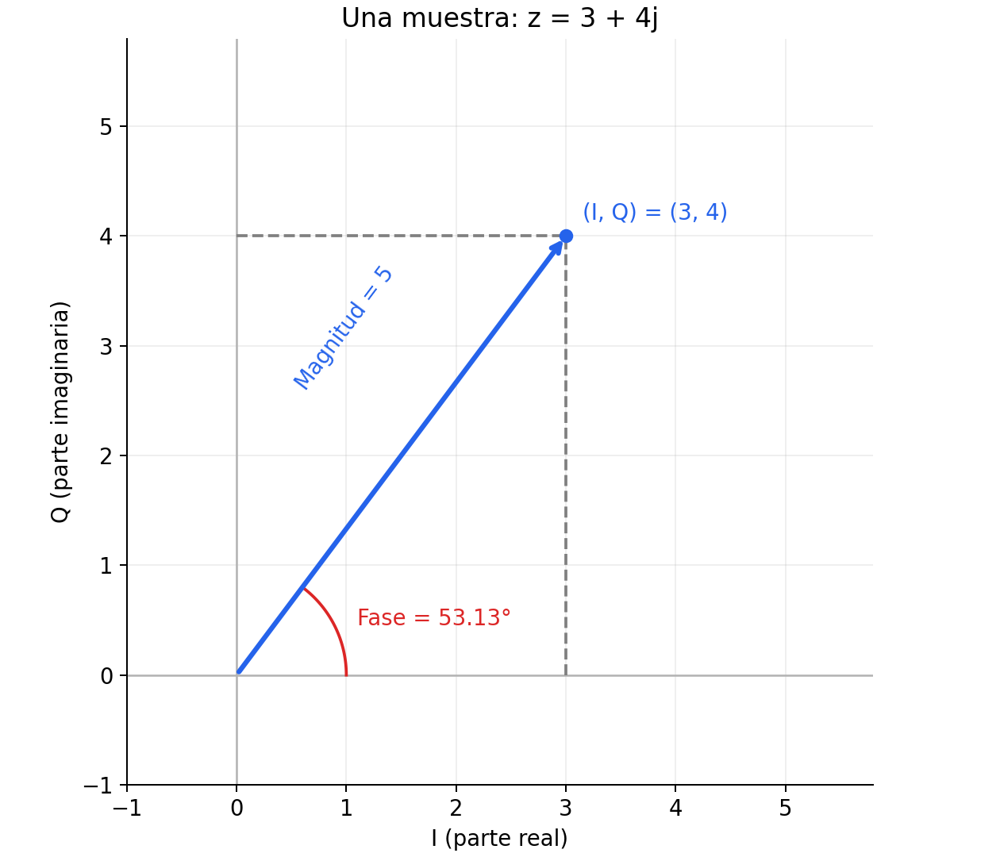

**Figura 3.** Una muestra compleja descrita por sus componentes I/Q, su magnitud y su fase.

Las líneas grises permiten leer I y Q en sus ejes. La flecha azul une el origen con la muestra: su longitud es 5. El arco rojo indica la fase de 53.13°. Las componentes, la magnitud y la fase describen el mismo punto de dos maneras diferentes.

??? example "Comprobación: igual magnitud, distinta fase"
    La muestra $-3+j4$ también tiene magnitud 5, pero se encuentra en el segundo cuadrante. Su fase es aproximadamente 126.87°. Cambiar `muestra` a `-3 + 4j` en la celda 1 permite comprobarlo. Si ambas componentes son cero, la magnitud es cero y no existe una dirección que defina la fase; el valor que devuelva el software en ese caso es una convención.

#### 2.3. Una senoide compleja es una rotación

Una secuencia de muestras complejas puede describir un punto que gira alrededor del origen. El tono complejo de amplitud $A$, frecuencia $f_0$ y fase inicial $\phi$ es

$$
z[n]=Ae^{j\theta[n]},
\qquad
\theta[n]=2\pi f_0\frac{n}{f_s}+\phi.
$$

La identidad de Euler permite leer sus componentes:

$$
e^{j\theta}=\cos\theta+j\sin\theta.
$$

Por tanto,

$$
I[n]=A\cos\theta[n],
\qquad
Q[n]=A\sin\theta[n].
$$

En este tono ideal, I y Q son senoides separadas un cuarto de ciclo. Al observarlas juntas, cada pareja corresponde a un punto del círculo de radio $A$.

La magnitud del tono complejo es constante:

$$
|z[n]|=\sqrt{A^2\cos^2\theta[n]+A^2\sin^2\theta[n]}=A,
\qquad A>0.
$$

Así, I puede pasar por cero mientras Q alcanza un máximo. La magnitud conjunta se mantiene, aunque cambien las dos componentes.

**Colab — Celda 2: generar un tono complejo.** Se conservan la frecuencia de 1 kHz, la tasa de 8 kS/s y las 16 muestras del ejemplo anterior.

```python
fs = 8000
f0 = 1000
A = 1.0
phi = 0.0
N = 16

n = np.arange(N)
t = n / fs
theta = 2 * np.pi * f0 * t + phi
I = A * np.cos(theta)
Q = A * np.sin(theta)
z = I + 1j * Q

print(" n      I        Q      magnitud   fase (grados)")
for k in range(8):
    print(f"{k:2d}  {I[k]:7.4f}  {Q[k]:7.4f}    {np.abs(z[k]):.4f}       {np.angle(z[k], deg=True):7.2f}")
print("Las dos formas coinciden:", np.allclose(z, A * np.exp(1j * theta)))
```

La primera muestra es aproximadamente $1+j0$; la de índice 2 es $0+j1$; la de índice 4 es $-1+j0$. Todas tienen magnitud 1. La amplitud del ejemplo sigue siendo una cantidad elegida para la simulación, sin calibración en voltios.

Entre muestras consecutivas, el ángulo avanza

$$
\Delta\theta=2\pi\frac{f_0}{f_s}=\frac{\pi}{4}=45^\circ.
$$

Ocho avances de 45° completan una vuelta. La muestra de índice 8 vuelve a la posición inicial, 1 ms después de la primera.

`np.angle` expresa el ángulo principal en el intervalo $(-180^\circ,180^\circ]$. Por eso puede mostrar 180° y después −135°: −135° y 225° indican la misma dirección. Ese cambio de representación no significa que el punto haya invertido su giro.

**Colab — Celda 3: observar las componentes y la rotación.**

```python
t_ref = np.linspace(0, N / fs, 1000)
z_ref = A * np.exp(1j * (2 * np.pi * f0 * t_ref + phi))

fig, axes = plt.subplots(1, 2, figsize=(12, 5), layout="constrained")
axes[0].plot(t_ref * 1000, z_ref.real, color="tab:blue", label="I")
axes[0].plot(t * 1000, I, "o", color="tab:blue")
axes[0].plot(t_ref * 1000, z_ref.imag, color="tab:red", label="Q")
axes[0].plot(t * 1000, Q, "s", color="tab:red", markerfacecolor="white")
axes[0].set(xlabel="Tiempo (ms)", ylabel="Amplitud", title="I y Q del mismo tono")
axes[0].legend()

axes[1].plot(z_ref.real, z_ref.imag, color="0.7")
axes[1].plot(z[:8].real, z[:8].imag, "o", color="tab:blue")
for k in (0, 1, 2, 4, 6):
    axes[1].text(1.12 * I[k], 1.12 * Q[k], f"n={k}", ha="center", va="center")
axes[1].annotate("", xy=(I[1], Q[1]), xytext=(I[0], Q[0]), arrowprops={"arrowstyle": "->", "color": "tab:blue", "lw": 2})
axes[1].axhline(0, color="0.7")
axes[1].axvline(0, color="0.7")
axes[1].set(xlabel="I", ylabel="Q", xlim=(-1.4, 1.4), ylim=(-1.4, 1.4), title="Una vuelta cada 1 ms")
axes[1].set_aspect("equal")
for ax in axes:
    ax.grid(alpha=0.2)
plt.show()
```

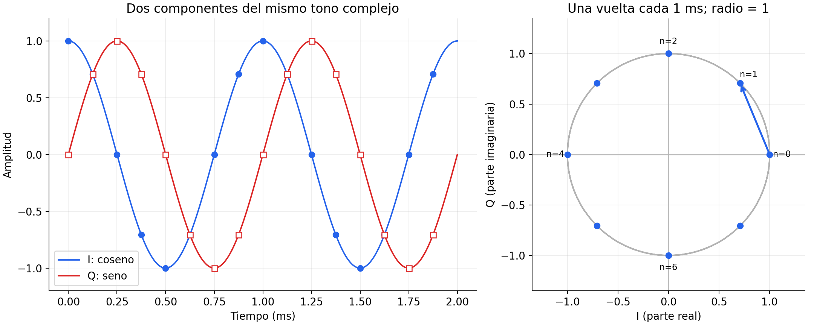

**Figura 4.** Un tono complejo observado como dos componentes temporales y como una rotación en el plano I/Q.

En el panel izquierdo, cada instante tiene un valor azul I y un valor rojo Q. El panel derecho combina cada pareja en un punto. La flecha muestra el avance de $n=0$ a $n=1$. Los ocho puntos visibles se repiten durante el segundo ciclo del bloque, por lo que no aparecen 16 posiciones diferentes. Las curvas representan el tono conocido del ejemplo, no una reconstrucción de datos recibidos.

Para experimentar, el estudiante puede cambiar $A$ a 0.5 en la celda 2 y ejecutar de nuevo las celdas 2 y 3. El radio pasa a 0.5. Si solo cambia $\phi$ a $\pi/2$, la primera muestra pasa a $0+j1$, pero el radio y el tiempo por vuelta se mantienen.

!!! note "Una captura I/Q no tiene que formar un círculo"
    El círculo corresponde a un tono complejo ideal de amplitud constante. Una captura puede contener varias señales, cambios de amplitud y ruido. Además, I y Q no tienen que ser siempre dos senoides separadas 90°: sus nombres se refieren a las referencias de mezcla. La relación de seno y coseno usada aquí corresponde al tono elegido.

#### 2.4. El signo de la frecuencia indica el sentido del giro

Con la convención $z=I+jQ$, un tono $e^{j2\pi f_0t}$ con $f_0>0$ gira en sentido antihorario. Al cambiar el signo de $f_0$, gira en sentido horario. En el ejemplo muestreado de esta subsección, los tonos de +1 kHz y −1 kHz avanzan +45° y −45° por muestra, respectivamente.

Sus componentes son

$$
z_+[n]=\cos\theta[n]+j\sin\theta[n],
\qquad
z_-[n]=\cos\theta[n]-j\sin\theta[n],
$$

donde ahora $\theta[n]=2\pi\,1000\,n/8000$, sin fase inicial.

Ambos tonos tienen la misma componente I y la misma magnitud. La componente Q cambia de signo. Al conservar solo I, estos dos tonos se vuelven indistinguibles; al conservar I y Q se puede distinguir el sentido del giro.

Una frecuencia negativa en esta representación no indica una frecuencia RF físicamente negativa. La relación con la frecuencia central de la captura se desarrollará en la subsección 6.

**Colab — Celda 4: comparar los dos sentidos.** Esta celda fija explícitamente los tonos de ±1 kHz, independientemente de los cambios de amplitud y fase que se hayan probado antes.

```python
theta_giro = 2 * np.pi * 1000 * t
z_pos = np.exp(1j * theta_giro)
z_neg = np.exp(-1j * theta_giro)
print("Las componentes I coinciden:", np.allclose(z_pos.real, z_neg.real))
print("Las componentes Q son opuestas:", np.allclose(z_pos.imag, -z_neg.imag))

fig, axes = plt.subplots(1, 2, figsize=(10, 5), layout="constrained")
circulo = np.exp(1j * np.linspace(0, 2 * np.pi, 200))
casos = [(z_pos, "+1 kHz: giro antihorario", "tab:blue"), (z_neg, "-1 kHz: giro horario", "tab:red")]
for ax, (tono, titulo, color) in zip(axes, casos):
    ax.plot(circulo.real, circulo.imag, color="0.7")
    ax.plot(tono[:8].real, tono[:8].imag, "o", color=color)
    for k in (0, 1, 2, 4, 6):
        ax.text(1.12 * tono[k].real, 1.12 * tono[k].imag, f"n={k}", ha="center", va="center")
    ax.annotate("", xy=(tono[1].real, tono[1].imag), xytext=(tono[0].real, tono[0].imag), arrowprops={"arrowstyle": "->", "color": color, "lw": 2})
    ax.axhline(0, color="0.7")
    ax.axvline(0, color="0.7")
    ax.set(xlabel="I", ylabel="Q", title=titulo, xlim=(-1.4, 1.4), ylim=(-1.4, 1.4))
    ax.set_aspect("equal")
    ax.grid(alpha=0.2)
plt.show()
```

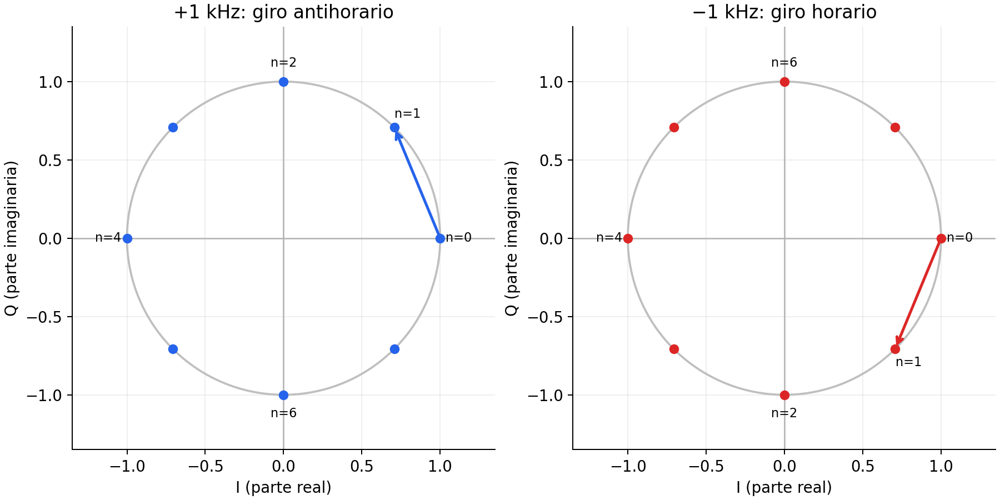

**Figura 5.** El signo de la frecuencia distingue dos sentidos de rotación en el plano I/Q.

Ambos recorridos comienzan en $(1,0)$. En el panel izquierdo, la muestra $n=1$ tiene Q positiva; en el derecho, Q negativa. Los círculos y los puntos ocupan las mismas posiciones, pero las etiquetas muestran un orden diferente. La dirección se identifica observando la secuencia, no una muestra aislada ni una nube de puntos sin orden temporal.

#### 2.5. Una senoide real reúne dos giros opuestos

La identidad de Euler también permite escribir una senoide real como suma de dos tonos complejos:

$$
A\cos\theta[n]=\frac{A}{2}e^{j\theta[n]}+\frac{A}{2}e^{-j\theta[n]}.
$$

Cada tono tiene la mitad de amplitud y gira en un sentido. Al sumar sus componentes, las partes imaginarias se cancelan y las partes reales se suman:

$$
\frac{A}{2}(\cos\theta+j\sin\theta)+\frac{A}{2}(\cos\theta-j\sin\theta)=A\cos\theta.
$$

El resultado se mueve sobre el eje real. Esta descomposición prepara la explicación de las componentes positivas y negativas del espectro de una senoide real, que se verá en la subsección 3. También aparece en el material de [senoides en tiempo discreto de TU Eindhoven](https://spseducation.tue.nl/disciplines/discrete/discretesignalprocessing_sampling_sampling/).

**Colab — Celda 5: sumar los giros.** La comprobación utiliza los tonos de amplitud 1 y frecuencias ±1 kHz de la celda 4.

```python
suma = 0.5 * z_pos + 0.5 * z_neg
tono_real = np.cos(theta_giro)

print("La parte real coincide con el coseno:", np.allclose(suma.real, tono_real))
print("La parte imaginaria es cero:", np.allclose(suma.imag, 0))
print("Magnitudes del tono complejo:", np.round(np.abs(z_pos[:8]), 4))
print("Valores absolutos del tono real:", np.round(np.abs(tono_real[:8]), 4))
```

Las dos primeras comparaciones producen `True`. El tono complejo tiene magnitud 1 en todas las muestras; el valor absoluto de la senoide real cambia entre 0 y 1. La amplitud de una senoide real es un parámetro de toda la onda, no el valor absoluto de cada muestra.

Una secuencia real puede escribirse formalmente como $x[n]+j0$. Sin embargo, añadir una Q nula no recupera la información de una captura I/Q de la que se descartó Q. Tampoco es lo mismo sumar dos giros de amplitud $A/2$ que conservar el tono complejo completo de amplitud $A$.

??? example "Comprobación: dos tonos y una sola componente"
    Si se guarda únicamente I de los tonos de ±1 kHz del ejemplo, se obtiene el mismo coseno. No se puede decidir cuál de los dos tonos originó esos valores. Con Q se distingue: en $n=2$, Q vale aproximadamente +1 para el tono positivo y −1 para el negativo.

??? example "Comprobación: qué cambia en el plano I/Q"
    En un tono complejo, reducir la amplitud reduce el radio. Cambiar la fase inicial cambia la posición de inicio. Cambiar el signo de la frecuencia invierte el sentido de giro. Con los demás parámetros fijos, cambiar la magnitud de la frecuencia cambia el tiempo necesario para completar una vuelta.

La salida del RTL-SDR sigue esta organización de muestras complejas, aunque una captura real sea más complicada que un tono ideal. Las componentes I y Q permiten describir conjuntamente magnitud y fase. La siguiente subsección utiliza estos tonos como punto de partida para relacionar las representaciones en tiempo y frecuencia.

#### 2.6. Ejercicios de refuerzo

##### Ejercicio 2A — ubicar una muestra y calcular su fase

Una muestra tiene $I=-3$ y $Q=4$.

- Escribirla como número complejo, ubicar su cuadrante y calcular su magnitud y fase en grados.
- Explicar por qué la fase no debe calcularse ignorando el signo de I.

??? example "Solución del ejercicio 2A"

    - **Muestra compleja:** $z=-3+j4$. Su punto está en el segundo cuadrante: I es negativa y Q es positiva.
    - **Magnitud:** $|z|=\sqrt{(-3)^2+4^2}=5$.
    - **Fase:** $\operatorname{atan2}(4,-3)\approx126.87^\circ$. Se mide desde el eje I positivo en sentido antihorario.
    - **Cuadrante:** usar únicamente $\arctan(Q/I)$ puede dar un ángulo que no ubica correctamente el punto. `atan2` utiliza los signos de las dos componentes.

##### Ejercicio 2B — reconocer el giro a partir de dos muestras

Se genera $z[n]=0.5e^{j(-2\pi\,1000\,n/8000+\pi/4)}$.

- Calcular $z[0]$, $z[1]$ y el cambio de fase entre esas muestras.
- Indicar el sentido de giro y qué representa el radio del recorrido.

??? example "Solución del ejercicio 2B"

    - **Muestra inicial:** $z[0]=0.5e^{j\pi/4}\approx0.3536+j0.3536$.
    - **Muestra siguiente:** la fase pasa de $\pi/4$ a cero, por lo que $z[1]=0.5+j0$.
    - **Cambio de fase:** $\Delta\theta=-2\pi(1000/8000)=-\pi/4=-45^\circ$ por muestra. El giro es horario y corresponde a −1 kHz.
    - **Radio:** es 0.5 y permanece constante para este tono ideal. No representa la frecuencia ni el tiempo; representa la magnitud de cada muestra.

##### Ejercicio 2C — contar muestras I/Q sin duplicar el tiempo

Un bloque contiene 40 parejas I/Q y su sample rate es 8 kS/s de muestras complejas.

- Indicar cuántas muestras complejas, valores I y valores Q contiene.
- Calcular su duración y explicar por qué no corresponde a 80 muestras temporales.

??? example "Solución del ejercicio 2C"

    - **Conteo:** hay 40 muestras complejas, 40 valores I y 40 valores Q. En total se almacenan 80 valores reales.
    - **Duración:** se utiliza $N=40$, de modo que $40/8000=5$ ms.
    - **Organización temporal:** I y Q de cada pareja corresponden al mismo instante. Contar sus componentes como muestras consecutivas duplicaría incorrectamente el número de instantes.

##### Ejercicio 2D — descomponer un coseno sin perder de vista I/Q

Se considera $x[n]=1.2\cos(2\pi\,500\,n/8000)$.

- Escribirlo como suma de dos tonos complejos e indicar sus frecuencias y magnitudes.
- Explicar si observar únicamente I permitiría distinguir un tono complejo de +500 Hz de otro de −500 Hz, ambos con fase inicial cero.

??? example "Solución del ejercicio 2D"

    - **Descomposición:** $x[n]=0.6e^{j2\pi\,500\,n/8000}+0.6e^{-j2\pi\,500\,n/8000}$.
    - **Dos giros:** tienen frecuencias +500 y −500 Hz y magnitud 0.6 cada uno. Al sumar, sus partes imaginarias se cancelan y queda el coseno real.
    - **Solo I:** los tonos complejos de signos opuestos, con igual magnitud y fase inicial cero, tienen el mismo coseno como parte real. Para distinguir el sentido de giro también hace falta Q.
    - **Q artificialmente nula:** añadir $j0$ a la secuencia real no recupera la componente Q que se descartó de un tono complejo.

### 3. Una señal, dos representaciones: tiempo y frecuencia

Las subsecciones anteriores describieron cómo cambian las muestras de un tono. Ahora se considera otra pregunta: ¿qué tonos contribuyen a una señal?

La representación temporal muestra los valores en cada instante. La representación frecuencial describe las componentes que forman la señal. Ambas se refieren a la misma señal y permiten responder preguntas diferentes.

#### 3.1. Qué revela cada representación

| Representación | Pregunta que responde | Ejemplo de lectura |
|---|---|---|
| Tiempo | ¿Qué valor toma la señal y cuándo cambia? | Reconocer un período, un cambio de amplitud o la posición inicial dentro de un ciclo. |
| Frecuencia | ¿Qué componentes frecuenciales contiene? | Identificar tonos, comparar sus magnitudes y distinguir frecuencias positivas y negativas. |

En un tono sencillo se puede reconocer la frecuencia contando ciclos. Cuando se suman varios tonos, la forma temporal resulta más complicada. La representación en frecuencia permite identificar las componentes por separado.

El análisis de Fourier proporciona esta relación entre representaciones. Para un bloque de muestras, una FFT calcula coeficientes complejos asociados con determinadas frecuencias. Cada coeficiente tiene magnitud y fase. La idea de descomponer una señal y recuperarla a partir de sus componentes se presenta en el [tutorial de Fourier de SciPy](https://docs.scipy.org/doc/scipy/tutorial/fft.html).

En esta subsección, la FFT se utiliza como herramienta de visualización. El significado detallado de sus puntos de frecuencia, del tamaño del bloque y de las ventanas se desarrollará en la subsección 5.

#### 3.2. Qué componentes corresponden a cada tono

La descomposición de la subsección 2 permite predecir tres espectros:

| Señal de amplitud 1 | Componentes esperadas | Magnitud de cada componente |
|---|---|---:|
| $\cos(2\pi\,1000\,t)$ | −1 kHz y +1 kHz | 0.5 y 0.5 |
| $e^{j2\pi\,1000\,t}$ | +1 kHz | 1 |
| $e^{-j2\pi\,1000\,t}$ | −1 kHz | 1 |

El coseno real reúne dos giros de amplitud 0.5. El tono complejo conserva un solo sentido de giro. Por eso el espectro completo del coseno tiene dos componentes y el de cada tono complejo tiene una.

Las dos componentes del coseno describen una sola senoide real. No significan que existan dos emisoras. En general, un pico representa una componente frecuencial; identificar su origen requiere más información.

**Colab — Celda 1: preparar las señales y el visor de frecuencia.** Las cinco celdas de esta subsección se ejecutan en orden y pueden comenzar en un notebook nuevo.

```python
import numpy as np
import matplotlib.pyplot as plt

fs = 8000
f0 = 1000
N = 64
t = np.arange(N) / fs
theta = 2 * np.pi * f0 * t
x_real = np.cos(theta)
z_pos = np.exp(1j * theta)
z_neg = np.exp(-1j * theta)
visible = t < 0.002              # Primeros 2 ms para el gráfico temporal.

def espectro(y, fs):
    frecuencias = np.fft.fftshift(np.fft.fftfreq(len(y), d=1 / fs))
    coeficientes = np.fft.fftshift(np.fft.fft(y)) / len(y)
    return frecuencias, coeficientes

print(f"Duración del bloque: {1000 * N / fs:g} ms")
```

La función `espectro` devuelve las frecuencias en Hz y sus coeficientes complejos. `fftfreq` construye el eje usando el intervalo entre muestras; `fftshift` ordena ambos arreglos para colocar las frecuencias negativas a la izquierda y las positivas a la derecha. La división entre el número de muestras fija la escala usada en estos ejemplos. Estas operaciones se documentan en NumPy: [fftfreq](https://numpy.org/doc/stable/reference/generated/numpy.fft.fftfreq.html), [fftshift](https://numpy.org/doc/stable/reference/generated/numpy.fft.fftshift.html) y [convenciones de FFT](https://numpy.org/doc/stable/reference/routines.fft.html).

Los tonos elegidos completan un número entero de ciclos en el bloque. Así sus componentes se observan en puntos de frecuencia concretos y sus alturas coinciden con la tabla. Otras elecciones pueden distribuir un tono entre varios puntos; ese efecto se estudiará en la subsección 5.

**Colab — Celda 2: comparar el tiempo y la frecuencia.**

```python
casos = [(x_real, "Coseno real", False), (z_pos, "Tono complejo de +1 kHz", True), (z_neg, "Tono complejo de -1 kHz", True)]
fig, axes = plt.subplots(3, 2, figsize=(12, 9), layout="constrained")

for fila, (y, titulo, complejo) in enumerate(casos):
    axes[fila, 0].plot(t[visible] * 1000, y.real[visible], ".-", label="I" if complejo else "x[n]")
    if complejo:
        axes[fila, 0].plot(t[visible] * 1000, y.imag[visible], "s-", label="Q", markerfacecolor="white")
    axes[fila, 0].set(title=titulo, xlabel="Tiempo (ms)", ylabel="Amplitud", ylim=(-1.2, 1.2))
    axes[fila, 0].legend()
    f, C = espectro(y, fs)
    axes[fila, 1].stem(f / 1000, np.abs(C), basefmt=" ")
    axes[fila, 1].set(title="Componentes en frecuencia", xlabel="Frecuencia (kHz)", ylabel="Magnitud por componente", xlim=(-3, 3), ylim=(-0.04, 1.15))
    for ax in axes[fila]:
        ax.grid(alpha=0.2)
plt.show()
```

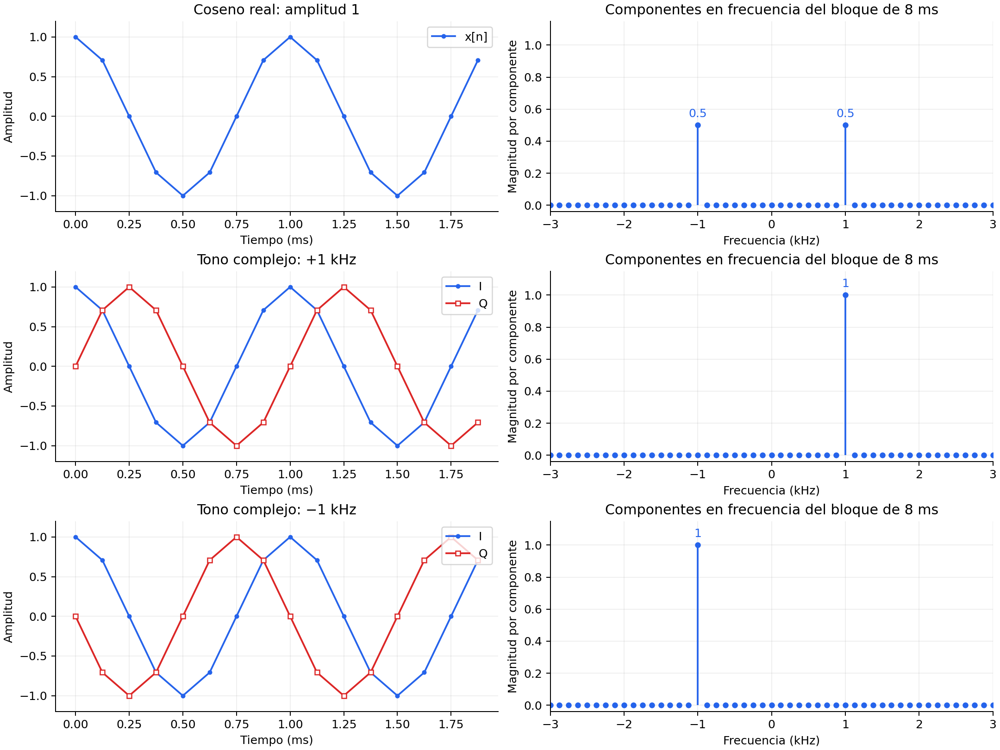

**Figura 6.** Representaciones temporal y frecuencial de un coseno real y de dos tonos complejos con sentidos de giro opuestos.

La primera fila muestra un coseno con dos componentes de magnitud 0.5. Las otras filas tienen la misma componente I, pero Q cambia de signo y el pico aparece en un lado diferente del eje de frecuencias. Cada espectro utiliza las 64 muestras del bloque de 8 ms. Los gráficos temporales muestran solo las primeras 16 muestras, dentro de los primeros 2 ms; las líneas entre puntos guían la lectura y no son una reconstrucción de la señal.

La magnitud se presenta en escala lineal, sin convertirla a potencia ni a dBm. Se muestra el espectro completo, con ambos signos de frecuencia; no se duplica la altura del pico positivo del coseno para formar un espectro de un solo lado.

#### 3.3. Una señal puede contener varios tonos

Si se suman dos señales en el tiempo, también se suman sus representaciones en frecuencia. Esta propiedad se llama linealidad y se estudia entre las [propiedades de Fourier del MIT](https://ocw.mit.edu/courses/res-6-007-signals-and-systems-spring-2011/resources/lecture-9-fourier-transform-properties/).

En el ejemplo siguiente se suman un tono complejo de +1 kHz con amplitud 1 y otro de −2 kHz con amplitud 0.5:

$$
z_{\mathrm{suma}}[n]=e^{j2\pi\,1000\,n/f_s}+0.5e^{-j2\pi\,2000\,n/f_s}.
$$

Cada muestra de la suma contiene la contribución de ambos tonos. Su forma temporal cambia, pero el espectro permite reconocer las dos componentes:

- Una componente en +1 kHz, de magnitud 1.
- Una componente en −2 kHz, de magnitud 0.5.

El espectro de una señal compleja no tiene que presentar la misma magnitud en frecuencias positivas y negativas. La simetría de magnitud que se observó en el coseno se debe a que esa señal es real.

**Colab — Celda 3: sumar dos tonos y comprobar sus componentes.**

```python
z1 = z_pos
z2 = 0.5 * np.exp(-1j * 2 * np.pi * 2000 * t)
z_suma = z1 + z2
f, C1 = espectro(z1, fs)
_, C2 = espectro(z2, fs)
_, C_suma = espectro(z_suma, fs)
print("Los coeficientes se suman:", np.allclose(C_suma, C1 + C2))

fig, axes = plt.subplots(2, 2, figsize=(12, 7), layout="constrained")
axes[0, 0].plot(t[visible] * 1000, z1.real[visible], "o-", label="I del tono de +1 kHz")
axes[0, 0].plot(t[visible] * 1000, z2.real[visible], "s-", label="I del tono de -2 kHz")
axes[0, 0].set(title="Antes de sumar", xlabel="Tiempo (ms)", ylabel="Amplitud")
axes[0, 0].legend()
axes[1, 0].plot(t[visible] * 1000, z_suma.real[visible], "o-", label="I de la suma")
axes[1, 0].plot(t[visible] * 1000, z_suma.imag[visible], "s-", label="Q de la suma", markerfacecolor="white")
axes[1, 0].set(title="Una sola secuencia", xlabel="Tiempo (ms)", ylabel="Amplitud")
axes[1, 0].legend()
axes[0, 1].stem(f / 1000, np.abs(C1), linefmt="C0-", markerfmt="C0o", basefmt=" ", label="Tono de +1 kHz")
axes[0, 1].stem(f / 1000, np.abs(C2), linefmt="C1-", markerfmt="C1s", basefmt=" ", label="Tono de -2 kHz")
axes[0, 1].legend()
axes[1, 1].stem(f / 1000, np.abs(C_suma), basefmt=" ")
axes[1, 1].set_title("Espectro de la suma")
for ax in axes[:, 1]:
    ax.set(xlabel="Frecuencia (kHz)", ylabel="Magnitud por componente", xlim=(-3, 3), ylim=(-0.04, 1.15))
for ax in axes.flat:
    ax.grid(alpha=0.2)
plt.show()
```

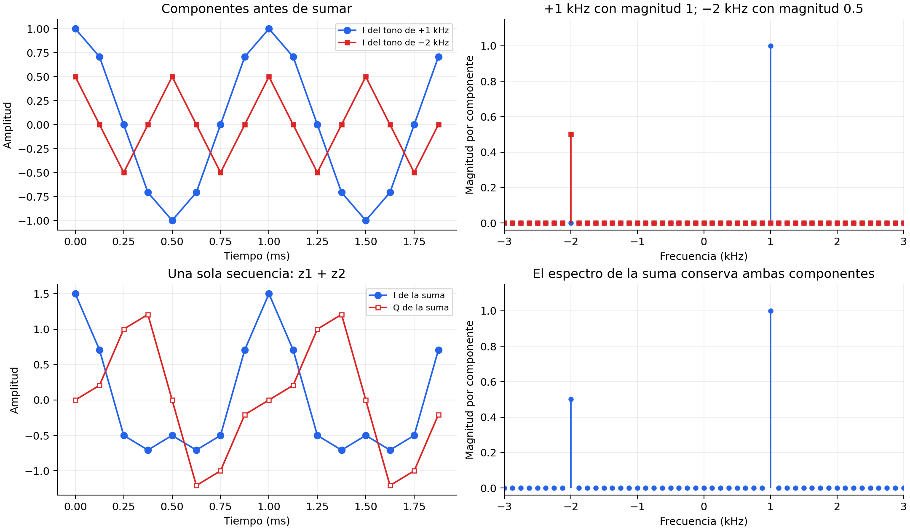

**Figura 7.** La suma de dos tonos produce una secuencia temporal que conserva ambas componentes en frecuencia.

El panel superior izquierdo compara las componentes I antes de sumar. El inferior izquierdo muestra I y Q de la señal resultante. A la derecha, los picos conservan sus posiciones y magnitudes. En $t=0$, I de la suma vale 1.5 porque coinciden las contribuciones 1 y 0.5; ese valor no significa que exista un tono de amplitud 1.5 en otra frecuencia.

La linealidad se aplica a los coeficientes complejos, no a una suma general de sus magnitudes. Si dos contribuciones ocupan la misma frecuencia, sus fases también intervienen y pueden reforzarse o cancelarse.

??? example "Comprobación: dos tonos en la misma frecuencia"
    Dos tonos complejos de la misma amplitud y frecuencia, con fases iniciales 0 y $\pi$, tienen valores opuestos en cada muestra. Su suma es cero. Por tanto, no se obtendría un pico con el doble de magnitud. La fase determina cómo se combinan las contribuciones.

#### 3.4. La magnitud no muestra toda la información

Cada coeficiente espectral es complejo. Su magnitud indica cuánto contribuye la componente; su fase indica su posición dentro del ciclo respecto al origen temporal.

Dos señales pueden presentar la misma magnitud espectral y tener valores diferentes en el tiempo. Por ejemplo:

$$
x_0[n]=\cos\theta[n],
\qquad
x_{90}[n]=\cos\left(\theta[n]+\frac{\pi}{2}\right).
$$

Ambas tienen frecuencia de 1 kHz y amplitud 1. La primera comienza en un máximo y la segunda en un cruce por cero. Sus componentes en ±1 kHz mantienen magnitud 0.5, pero tienen fases distintas:

| Fase inicial del coseno | Fase de la componente en +1 kHz | Fase de la componente en −1 kHz |
|---|---:|---:|
| 0° | 0° | 0° |
| 90° | +90° | −90° |

Esto se obtiene al conservar la fase en la descomposición del coseno:

$$
\cos(\omega t+\phi)=\frac{1}{2}e^{j\phi}e^{j\omega t}+\frac{1}{2}e^{-j\phi}e^{-j\omega t},
\qquad \omega=2\pi f_0.
$$

Una pantalla que presenta únicamente magnitud no distingue estos dos casos. La transformada completa sí los distingue porque conserva la fase.

**Colab — Celda 4: comparar magnitud y fase espectral.**

```python
x0 = np.cos(theta)
x90 = np.cos(theta + np.pi / 2)
f, C0 = espectro(x0, fs)
_, C90 = espectro(x90, fs)
presentes = np.abs(C0) > 1e-9
print("Las magnitudes coinciden:", np.allclose(np.abs(C0), np.abs(C90)))
print("Las muestras coinciden:", np.allclose(x0, x90))

fig, axes = plt.subplots(3, 1, figsize=(10, 9), layout="constrained")
axes[0].plot(t[visible] * 1000, x0[visible], "o-", label="Fase inicial 0°")
axes[0].plot(t[visible] * 1000, x90[visible], "s-", label="Fase inicial 90°", markerfacecolor="white")
axes[0].set(title="Distintos valores en el tiempo", xlabel="Tiempo (ms)", ylabel="Amplitud")
axes[1].stem(f / 1000, np.abs(C0), basefmt=" ", label="Fase inicial 0°")
axes[1].plot(f / 1000, np.abs(C90), "s", color="tab:orange", markerfacecolor="white", label="Fase inicial 90°")
axes[1].set(title="Igual magnitud espectral", xlabel="Frecuencia (kHz)", ylabel="Magnitud por componente", xlim=(-2, 2), ylim=(-0.03, 0.6))
axes[2].plot(f[presentes] / 1000, np.angle(C0[presentes], deg=True), "o", label="Fase inicial 0°")
axes[2].plot(f[presentes] / 1000, np.angle(C90[presentes], deg=True), "s", label="Fase inicial 90°", markerfacecolor="white")
axes[2].set(title="Distinta fase espectral", xlabel="Frecuencia (kHz)", ylabel="Fase (grados)", xlim=(-2, 2), ylim=(-115, 115), yticks=[-90, 0, 90])
for ax in axes:
    ax.grid(alpha=0.2)
    ax.legend()
plt.show()
```

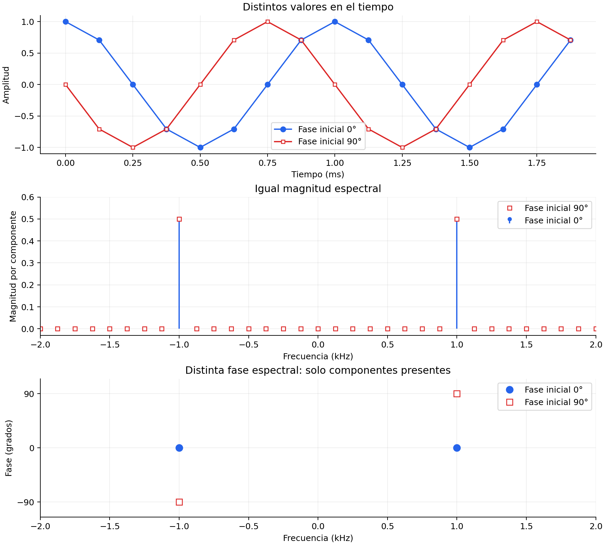

**Figura 8.** Dos señales distintas en el tiempo pueden tener la misma magnitud espectral y diferente fase espectral.

El primer panel muestra que las muestras cambian. En el segundo, los marcadores de magnitud se superponen. El tercero distingue las señales por las fases de sus componentes en ±1 kHz. Se muestran fases únicamente donde hay componentes presentes: los coeficientes que deberían ser cero pueden contener pequeños errores numéricos, cuya fase no aporta información sobre un tono del ejemplo.

El umbral `1e-9` solo evita mostrar esas fases numéricas en esta simulación sin ruido. No es un criterio de detección para una captura real.

#### 3.5. La transformada completa permite recuperar las muestras

Cambiar de representación no elimina información por sí mismo. La DFT completa de un bloque y su inversa permiten pasar entre las muestras y los coeficientes. La correspondencia entre ambas secuencias se describe en el [tutorial de SciPy](https://docs.scipy.org/doc/scipy/tutorial/fft.html).

Conservar únicamente las magnitudes descarta las fases originales. En general, esas magnitudes no bastan para recuperar las mismas muestras. Esto se puede comprobar con el coseno de fase inicial 90°:

**Colab — Celda 5: volver al tiempo con y sin la fase original.** Esta celda usa directamente la salida de `fft`, sin el reordenamiento ni la escala del visor anterior.

```python
X_completo = np.fft.fft(x90)
x_recuperado = np.fft.ifft(X_completo)
x_sin_fase = np.fft.ifft(np.abs(X_completo))

print("La transformada completa recupera las muestras:", np.allclose(x_recuperado, x90))
print("Solo la magnitud recupera las mismas muestras:", np.allclose(x_sin_fase, x90))
print("Error máximo con la transformada completa:", np.max(np.abs(x_recuperado - x90)))
```

La primera comparación produce `True` y la segunda, `False`. El error de recuperación con la transformada completa es muy pequeño y corresponde a la precisión numérica. Usar `np.abs(X_completo)` como entrada de la inversa asigna fase cero a todos sus coeficientes; no conserva las fases del coseno original.

Este resultado explica por qué una gráfica habitual de magnitud espectral muestra solo una parte de la representación en frecuencia. La FFT devuelve coeficientes complejos; la elección de mostrar únicamente su magnitud corresponde al visor.

??? example "Comprobación: otro tono real"
    Un coseno real de 500 Hz y amplitud 0.8 se descompone en componentes de −500 Hz y +500 Hz, de magnitud 0.4 cada una. En estos ejemplos el bloque contiene un número entero de ciclos. Un tono complejo positivo de 500 Hz y magnitud 0.8 tendría una sola componente, en +500 Hz.

??? example "Comprobación: interpretar una pantalla de magnitud"
    Si dos gráficos de magnitud coinciden, no se puede concluir que las muestras sean iguales. Los cosenos con fases iniciales 0° y 90° de esta subsección son un contraejemplo. Para comparar la representación completa también hacen falta las fases.

La lectura en tiempo y la lectura en frecuencia se complementan: una permite observar cómo cambia la secuencia y la otra identificar sus componentes. En una captura I/Q se analizan ambas partes conjuntamente como una señal compleja. Antes de interpretar cualquier eje de frecuencia, también hay que entender qué efectos introduce el muestreo; ese es el tema de la subsección 4.

#### 3.6. Ejercicios de refuerzo

- **Condición de los ejemplos:** se utilizan bloques con ciclos enteros de los tonos y la escala de magnitud por componente de esta subsección. Los detalles de bins y ventanas se reservan para la subsección 5.

##### Ejercicio 3A — predecir el espectro de una suma compleja

Se considera $z[n]=0.8e^{j2\pi\,1000\,n/8000}+0.3e^{-j2\pi\,2000\,n/8000}$, en un bloque de 64 muestras.

- Indicar las posiciones y magnitudes de sus componentes.
- Explicar si debe haber una copia de igual magnitud en el signo opuesto de cada frecuencia.

??? example "Solución del ejercicio 3A"

    - **Primera componente:** aparece en +1 kHz con magnitud 0.8.
    - **Segunda componente:** aparece en −2 kHz con magnitud 0.3.
    - **Sin copias obligatorias:** la señal es compleja y no tiene que presentar simetría de magnitud entre frecuencias positivas y negativas. No se añade un pico en −1 kHz ni en +2 kHz por el hecho de dibujar ambos lados del eje.
    - **Lectura temporal:** cada muestra contiene la suma de las dos contribuciones; no se almacenan en dos intervalos de tiempo separados.

##### Ejercicio 3B — sumar coeficientes, no solo magnitudes

Dos tonos ocupan la misma frecuencia de +1 kHz. El primero tiene magnitud 2 y fase cero; el segundo tiene magnitud 1 y fase $\pi$.

- Determinar la magnitud y fase de la componente resultante.
- Indicar qué ocurriría si ambos tuvieran magnitud 1, manteniendo las fases indicadas.

??? example "Solución del ejercicio 3B"

    - **Coeficientes complejos:** se suman $2e^{j0}+1e^{j\pi}=2-1=1$.
    - **Resultado:** queda un tono de +1 kHz con magnitud 1 y fase cero. No tiene magnitud 3: las fases hacen que las contribuciones se opongan.
    - **Magnitudes iguales:** $1e^{j0}+1e^{j\pi}=0$. Los tonos se cancelan en este modelo ideal y la fase de una componente nula no tiene una interpretación útil.

##### Ejercicio 3C — reconocer lo que una pantalla de magnitud omite

Se comparan los cosenos $x_0[n]=\cos(2\pi\,1000\,n/8000)$ y $x_{90}[n]=\cos(2\pi\,1000\,n/8000+\pi/2)$, en bloques de 64 muestras.

- Indicar si sus magnitudes espectrales y sus muestras son iguales.
- Comparar las fases de las componentes y explicar qué se necesita para recuperar las muestras con la inversa.

??? example "Solución del ejercicio 3C"

    - **Magnitudes:** ambos tienen componentes en ±1 kHz de magnitud 0.5. Una pantalla de magnitud no distingue estos dos casos.
    - **Muestras:** no son iguales; por ejemplo, $x_0[0]=1$ y $x_{90}[0]=0$.
    - **Fases:** en $x_0$ son cero en ambas componentes. En $x_{90}$ son $+\pi/2$ en +1 kHz y $-\pi/2$ en −1 kHz.
    - **Recuperación:** se requieren los coeficientes complejos completos, con sus fases y el orden correcto. La inversa de solo sus magnitudes no recupera en general el bloque original.

##### Ejercicio 3D — interpretar la Figura 7 sin inventar otro tono

En la Figura 7, la suma de un tono de +1 kHz y magnitud 1 con otro de −2 kHz y magnitud 0.5 tiene $I=1.5$ en $t=0$.

- Explicar si ese valor implica un tono nuevo de magnitud 1.5.
- Indicar qué paneles permiten reconocer los tonos y qué cambia si se modifica solo la fase de uno de ellos.

??? example "Solución del ejercicio 3D"

    - **Valor instantáneo:** en $t=0$, las dos partes reales valen 1 y 0.5 y se suman. El valor 1.5 corresponde a esa muestra, no a una componente frecuencial nueva.
    - **Lectura de los tonos:** los paneles derechos permiten reconocer +1 y −2 kHz con sus magnitudes respectivas. Los izquierdos muestran sus valores temporales y la secuencia resultante.
    - **Cambio de fase:** modifica las muestras de la suma. Como los tonos están en frecuencias distintas, conserva sus posiciones y magnitudes espectrales en estos bloques coherentes, aunque cambie la fase de un coeficiente.

### 4. Muestreo y aliasing

La subsección anterior identificó tonos mediante sus muestras y su espectro. Ahora aparece una pregunta importante: **¿pueden dos señales de frecuencias diferentes producir exactamente las mismas muestras?**

La respuesta es sí. El muestreo conserva valores en instantes separados, no todo lo que ocurrió entre ellos. El aliasing es la ambigüedad que permite que una componente se confunda con otra al muestrear. No es un error de la FFT: puede comprobarse antes de calcular cualquier transformada.

Los experimentos empiezan con señales sintéticas de frecuencia conocida. No simulan todos los bloques del RTL2832U. Primero se utiliza un coseno real para observar el problema y después un tono complejo para conservar el signo de la frecuencia.

#### 4.1. Frecuencia en Hz y avance entre muestras

En un tono complejo,

$$
z[n]=A e^{j(2\pi f_0 n/f_s+\phi)},
$$

la frecuencia $f_0$ indica ciclos por segundo. Pero el avance entre dos muestras depende de la relación entre $f_0$ y $f_s$:

$$
\nu=\frac{f_0}{f_s}\quad\text{ciclos por muestra},
\qquad
\Delta\theta=2\pi\nu\quad\text{radianes por muestra}.
$$

Esta frecuencia normalizada relaciona el tiempo físico con el índice de muestra. La [TU Eindhoven](https://spseducation.tue.nl/disciplines/discrete/discretesignalprocessing_sampling_sampling/) desarrolla esa relación y la equivalencia de frecuencias de una secuencia.

Con $f_s=8000$ S/s y $f_0=1000$ Hz, el avance es $1/8$ de ciclo, es decir, 45° por muestra. Con $f_0=9000$ Hz, el avance es $9/8$ de ciclo: una vuelta completa más 45°. Un punto del plano I/Q termina en el mismo lugar después de cualquiera de esos dos avances.

La vuelta adicional ocurre entre los instantes observados. Las muestras por sí solas no informan cuántas vueltas completas se dieron entre ellas.

**Colab — Celda 1: preparar los experimentos.** Las siete celdas de esta subsección se ejecutan en orden. Esta preparación permite comenzar en un notebook nuevo, sin depender de las subsecciones anteriores.

```python
import numpy as np
import matplotlib.pyplot as plt

fs = 8000
N = 64
n = np.arange(N)
t = n / fs

def espectro(y, sample_rate):
    f = np.fft.fftshift(np.fft.fftfreq(len(y), d=1 / sample_rate))
    C = np.fft.fftshift(np.fft.fft(y)) / len(y)
    return f, C

def frecuencia_alias(f0, sample_rate):
    return (np.asarray(f0) + sample_rate / 2) % sample_rate - sample_rate / 2

for f0 in [1000, 9000]:
    print(f"{f0} Hz: {f0 / fs:.3f} ciclos/muestra; {360 * f0 / fs:.1f} grados/muestra")
```

La salida muestra 0.125 y 1.125 ciclos por muestra, equivalentes a 45° y 405°. La función `frecuencia_alias` se explicará en el apartado 4.4.

#### 4.2. Experimento A: dos señales distintas, las mismas muestras

Se comparan estos cosenos:

$$
x_1(t)=\cos(2\pi\,1000\,t),
\qquad
x_9(t)=\cos(2\pi\,9000\,t).
$$

Son distintos en tiempo continuo: en 1 ms el primero completa un ciclo y el segundo, nueve. Sin embargo, al evaluarlos en $t_n=n/8000$:

$$
x_9[n]=\cos\left(2\pi\frac{1000}{8000}n+2\pi n\right)=x_1[n].
$$

El término $2\pi n$ añade un número entero de vueltas y no cambia el valor del coseno.

**Qué se varía:** la frecuencia del coseno, de 1 a 9 kHz. **Qué permanece fijo:** sample rate de 8 kS/s, amplitud 1, fase inicial 0 y bloque de 64 muestras. **Qué se debe notar:** las curvas difieren entre muestras, pero todos los valores muestreados coinciden.

**Colab — Celda 2: observar lo que se conserva y lo que queda entre muestras.**

```python
x1 = np.cos(2 * np.pi * 1000 * t)
x9 = np.cos(2 * np.pi * 9000 * t)
td = np.linspace(0, 0.001, 2001)
visible = t <= 0.001
print("Las muestras coinciden:", np.allclose(x1, x9))
print("Error máximo:", np.max(np.abs(x1 - x9)))

fig, axes = plt.subplots(3, 1, figsize=(11, 9), layout="constrained")
for ax, frecuencia, muestras in zip(axes[:2], [1000, 9000], [x1, x9]):
    ax.plot(td * 1000, np.cos(2 * np.pi * frecuencia * td), color="tab:gray", label="Referencia continua conocida")
    ax.plot(t[visible] * 1000, muestras[visible], "o", color="tab:blue", label="Muestras a 8 kS/s")
    ax.set(title=f"Señal original: {frecuencia / 1000:g} kHz", xlabel="Tiempo (ms)", ylabel="Amplitud", ylim=(-1.2, 1.2))
    ax.legend(loc="upper right")
axes[2].plot(n[:17], x1[:17], "o", markersize=8, label="Muestras del coseno de 1 kHz")
axes[2].plot(n[:17], x9[:17], "s", markerfacecolor="none", markersize=10, label="Muestras del coseno de 9 kHz")
axes[2].set(title="Solo se conservan estas secuencias: los marcadores se superponen", xlabel="Índice n", ylabel="Valor de la muestra", xticks=np.arange(0, 17, 2), ylim=(-1.2, 1.2))
axes[2].legend(loc="upper right")
for ax in axes:
    ax.grid(alpha=0.2)
plt.show()
```

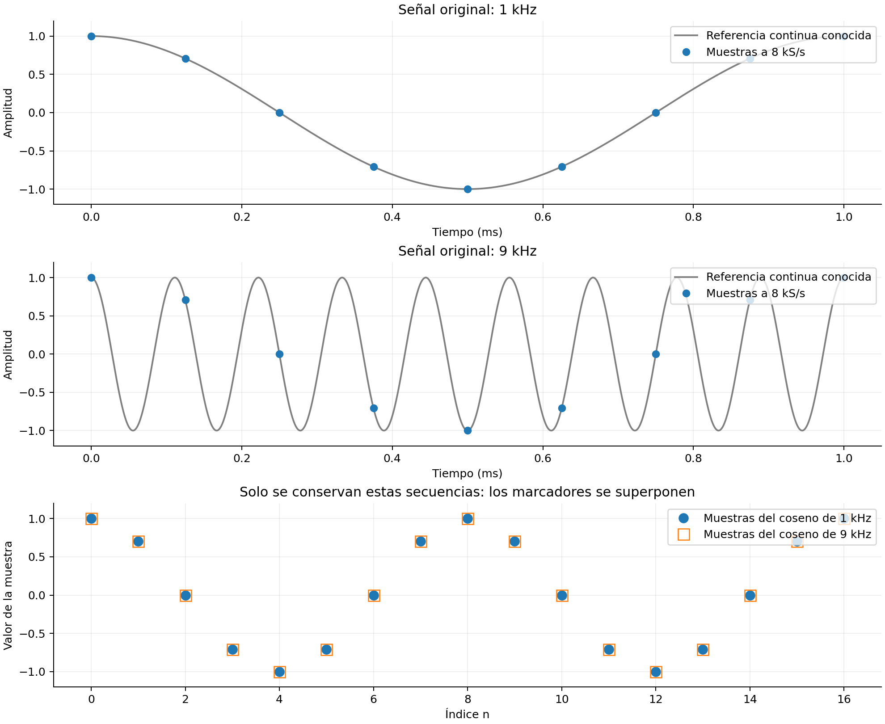

**Figura 9.** Dos cosenos distintos en tiempo continuo producen las mismas muestras a 8 kS/s.

- **Panel superior — coseno de 1 kHz:** los puntos muestran los valores de la señal en los instantes de muestreo. La curva gris permite observar lo que ocurre entre esos instantes.
- **Panel central — coseno de 9 kHz:** la curva oscila más veces entre las muestras, pero los puntos tienen los mismos tiempos y alturas que en el panel superior.
- **Panel inferior — comparación de muestras:** los círculos y cuadrados se superponen muestra por muestra. `np.allclose` devuelve `True`; la pequeña diferencia numérica se debe al cálculo en punto flotante.
- **Qué representan las curvas grises:** son referencias calculadas con las fórmulas originales. **No fueron reconstruidas a partir de las muestras.**
- **Qué no permite decidir la secuencia:** si solo se recibieran las muestras del panel inferior, no sería posible elegir entre los dos cosenos sin información adicional sobre la banda de entrada.
- **Qué ocurre al obtener más muestras:** mantener el mismo sample rate no resuelve la equivalencia, porque la igualdad se cumple para cualquier índice entero $n$. Aumentar el sample rate durante una nueva adquisición es una operación diferente.

??? example "Comprobación: ¿el aliasing depende de la FFT?"
    No. Las dos secuencias ya coinciden antes de calcular una FFT. Cualquier cálculo que utilice únicamente esas muestras recibe la misma información en ambos casos. La FFT muestra el resultado del muestreo; no origina esta ambigüedad.

#### 4.3. Experimento B: el aliasing también ocurre en I/Q

La representación compleja distingue frecuencias positivas y negativas dentro de un intervalo apropiado, pero no elimina el aliasing. Para un tono complejo se cumple:

$$
e^{j2\pi(f_0+kf_s)n/f_s}=e^{j2\pi f_0n/f_s}\underbrace{e^{j2\pi kn}}_{1},
\qquad k\in\mathbb{Z}.
$$

Por tanto, frecuencias separadas por un múltiplo entero de $f_s$ producen la misma secuencia compleja, con igual amplitud y fase inicial.

La equivalencia entre +5 kHz y −3 kHz a $f_s=8$ kS/s se puede obtener paso a paso con las fórmulas anteriores. En la subsección 2 se escribió el tono complejo como:

$$
z[n]=A e^{j\theta[n]},
\qquad
\theta[n]=2\pi\frac{f_0}{f_s}n+\phi.
$$

El avance de fase entre dos muestras consecutivas es la diferencia entre sus ángulos:

$$
\Delta\theta=\theta[n+1]-\theta[n]=2\pi\frac{f_0}{f_s}.
$$

Es la fórmula del apartado 4.1. Para expresarla en grados se multiplica por $180^\circ/\pi$:

$$
\Delta\theta_{\mathrm{grados}}=360^\circ\frac{f_0}{f_s}.
$$

Al sustituir cada frecuencia:

$$
\begin{aligned}
f_0=+5000\ \text{Hz}:&\quad \Delta\theta=360^\circ\frac{5000}{8000}=+225^\circ,\\
f_0=-3000\ \text{Hz}:&\quad \Delta\theta=360^\circ\frac{-3000}{8000}=-135^\circ.
\end{aligned}
$$

El signo positivo indica un avance antihorario; el negativo, un avance horario, con la convención $z=I+jQ$. Por eso se dice que el primer tono avanza 225° y el segundo retrocede 135° entre muestras.

Para comprobar que ambos llegan al mismo punto, se toman $A=1$ y $\phi=0$. En $n=0$, ambos empiezan en $z[0]=1+j0$. En $n=1$, la fórmula de Euler de la subsección 2 da:

$$
\begin{aligned}
z_5[1]&=e^{j5\pi/4}=\cos225^\circ+j\sin225^\circ=-\frac{\sqrt{2}}{2}-j\frac{\sqrt{2}}{2},\\
z_{-3}[1]&=e^{-j3\pi/4}=\cos(-135^\circ)+j\sin(-135^\circ)=-\frac{\sqrt{2}}{2}-j\frac{\sqrt{2}}{2}.
\end{aligned}
$$

Los recorridos son distintos, pero las coordenadas I y Q coinciden porque $225^\circ=-135^\circ+360^\circ$. La equivalencia no se limita a la primera muestra: para cualquier índice entero $n$,

$$
z_5[n]=e^{j5\pi n/4}=e^{-j3\pi n/4}e^{j2\pi n}=z_{-3}[n],
$$

ya que $e^{j2\pi n}=1$. La diferencia de una vuelta completa por intervalo de muestreo queda invisible en toda la secuencia. En Hz, esa misma diferencia es $5000-(-3000)=8000=f_s$.

**Qué se varía:** la frecuencia del tono complejo, de +5 a −3 kHz. **Qué permanece fijo:** sample rate de 8 kS/s, magnitud 1, fase inicial 0 y los mismos instantes de muestreo. **Qué se debe notar:** coinciden I y Q, no solo la parte real.

**Colab — Celda 3: comparar ambas componentes y los avances de fase.**

```python
z5 = np.exp(1j * 2 * np.pi * 5000 * t)
z_m3 = np.exp(-1j * 2 * np.pi * 3000 * t)
print("Coincide toda la secuencia I/Q:", np.allclose(z5, z_m3))
print("Coincide I:", np.allclose(z5.real, z_m3.real))
print("Coincide Q:", np.allclose(z5.imag, z_m3.imag))
ang_pos = np.linspace(0, 2 * np.pi * 5000 / fs, 301)
ang_neg = np.linspace(0, -2 * np.pi * 3000 / fs, 301)

fig, axes = plt.subplots(1, 3, figsize=(15, 4.5), layout="constrained")
for ax, angulo, titulo in zip(axes[:2], [ang_pos, ang_neg], ["+5 kHz: avance de +225°", "-3 kHz: avance de -135°"]):
    ax.plot(np.cos(angulo), np.sin(angulo), color="tab:blue")
    ax.annotate("", xy=(np.cos(angulo[-1]), np.sin(angulo[-1])), xytext=(np.cos(angulo[-25]), np.sin(angulo[-25])), arrowprops={"arrowstyle": "->", "color": "tab:blue"})
    ax.plot([1, z5[1].real], [0, z5[1].imag], "o", color="tab:orange")
    ax.text(1, 0.12, "n=0", ha="center")
    ax.text(z5[1].real, z5[1].imag - 0.16, "n=1", ha="center")
    ax.set(title=titulo, xlabel="I", ylabel="Q", xlim=(-1.3, 1.3), ylim=(-1.3, 1.3), aspect="equal")
axes[2].plot(n[:9], z5.real[:9], "o-", label="I de +5 kHz")
axes[2].plot(n[:9], z_m3.real[:9], "s", markersize=9, markerfacecolor="none", label="I de -3 kHz")
axes[2].plot(n[:9], z5.imag[:9], "o-", label="Q de +5 kHz")
axes[2].plot(n[:9], z_m3.imag[:9], "s", markersize=9, markerfacecolor="none", label="Q de -3 kHz")
axes[2].set(title="I y Q coinciden en cada muestra", xlabel="Índice n", ylabel="Amplitud", ylim=(-1.3, 1.3))
axes[2].legend(fontsize=8)
for ax in axes:
    ax.grid(alpha=0.2)
plt.show()
```

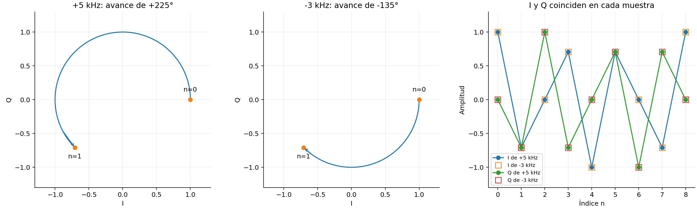

**Figura 10.** Los tonos complejos de +5 kHz y −3 kHz llegan a los mismos puntos I/Q al muestrear a 8 kS/s.

- **Panel izquierdo — tono de +5 kHz:** entre $n=0$ y $n=1$, el recorrido conocido gira en sentido antihorario.
- **Panel central — tono de −3 kHz:** durante el mismo intervalo, el recorrido gira en sentido horario. Aunque el camino es distinto, comparte los extremos con el del panel izquierdo.
- **Panel derecho — muestras I/Q:** los cuadrados de −3 kHz coinciden con los círculos de +5 kHz tanto en I como en Q. Las líneas entre muestras solo guían la lectura; no describen el recorrido continuo original.
- **Qué significa el signo negativo:** describe la rotación de la secuencia representativa. No significa que exista una RF física negativa ni que el tono continuo de +5 kHz haya cambiado realmente su sentido de giro.
- **Qué se debe concluir:** el muestreo dejó de distinguir los dos recorridos, porque solo conserva sus valores en los instantes de muestreo.

#### 4.4. Experimento C: ¿en qué frecuencia aparece el alias?

Como las frecuencias $f_0+kf_s$ son equivalentes, el espectro de tiempo discreto se repite cada $f_s$ cuando su eje se expresa en Hz. Basta mostrar un intervalo de ancho $f_s$. En esta sesión se utiliza:

$$
-\frac{f_s}{2}\leq f<\frac{f_s}{2}.
$$

Con 8 kS/s, corresponde a $[-4,4)$ kHz. El extremo izquierdo se incluye y el derecho no, porque −4 y +4 kHz son equivalentes. Esta convención coincide con el eje de [`fftfreq`](https://numpy.org/doc/stable/reference/generated/numpy.fft.fftfreq.html) para un número par de muestras, después de aplicar `fftshift`.

La frecuencia representativa se obtiene sumando o restando múltiplos de $f_s$ hasta entrar en ese intervalo. La expresión usada en la celda 1 hace esa operación:

$$
f_a=\left((f_0+f_s/2)\bmod f_s\right)-f_s/2.
$$

| Frecuencia del tono complejo conocido | Operación con $f_s=8$ kS/s | Frecuencia representativa |
|---|---|---:|
| +1 kHz | Ya está dentro del intervalo | +1 kHz |
| +5 kHz | $5-8$ | −3 kHz |
| +7 kHz | $7-8$ | −1 kHz |
| +9 kHz | $9-8$ | +1 kHz |
| −5 kHz | $-5+8$ | +3 kHz |

Para un coseno real hay dos componentes, en $+f_0$ y $-f_0$, y cada una se lleva al intervalo. Por ejemplo, un coseno de 7 kHz presenta componentes representativas en −1 y +1 kHz. Su magnitud espectral no permite distinguirlo del coseno de 1 kHz de igual amplitud y fase inicial cero.

**Qué se varía:** la frecuencia original del tono complejo, manteniendo 8 kS/s. **Qué se debe notar:** la frecuencia representativa crece hasta el borde y luego reaparece en el lado negativo. No crece indefinidamente en la pantalla.

**Colab — Celda 4: visualizar la periodicidad y el desplazamiento al intervalo.**

```python
originales = np.arange(-12000, 12001, 500)
aliases = frecuencia_alias(originales, fs)
equivalentes = 1000 + fs * np.arange(-2, 3)
fig, axes = plt.subplots(2, 1, figsize=(11, 8), layout="constrained")
axes[0].stem(equivalentes / 1000, np.ones(len(equivalentes)), basefmt=" ")
axes[0].axvspan(-fs / 2000, fs / 2000, color="tab:green", alpha=0.12, label="Intervalo mostrado: [-4, 4) kHz")
axes[0].set(title="Un tono discreto de +1 kHz: posiciones equivalentes cada 8 kHz", xlabel="Frecuencia (kHz)", ylabel="Peso del tono ideal", xticks=equivalentes / 1000, ylim=(-0.05, 1.3))
axes[0].legend(loc="upper right")
axes[1].plot(originales / 1000, aliases / 1000, ".", color="tab:blue")
axes[1].plot([1, 5, 7, 9], frecuencia_alias(np.array([1000, 5000, 7000, 9000]), fs) / 1000, "s", color="tab:orange", markersize=8)
axes[1].axhline(fs / 2000, color="tab:gray", linestyle="--")
axes[1].axhline(-fs / 2000, color="tab:gray", linestyle="--")
axes[1].set(title="De la frecuencia original a su representante", xlabel="Frecuencia original del tono complejo (kHz)", ylabel="Frecuencia representativa (kHz)", yticks=np.arange(-4, 5), ylim=(-4.5, 4.5))
for ax in axes:
    ax.grid(alpha=0.2)
plt.show()
```

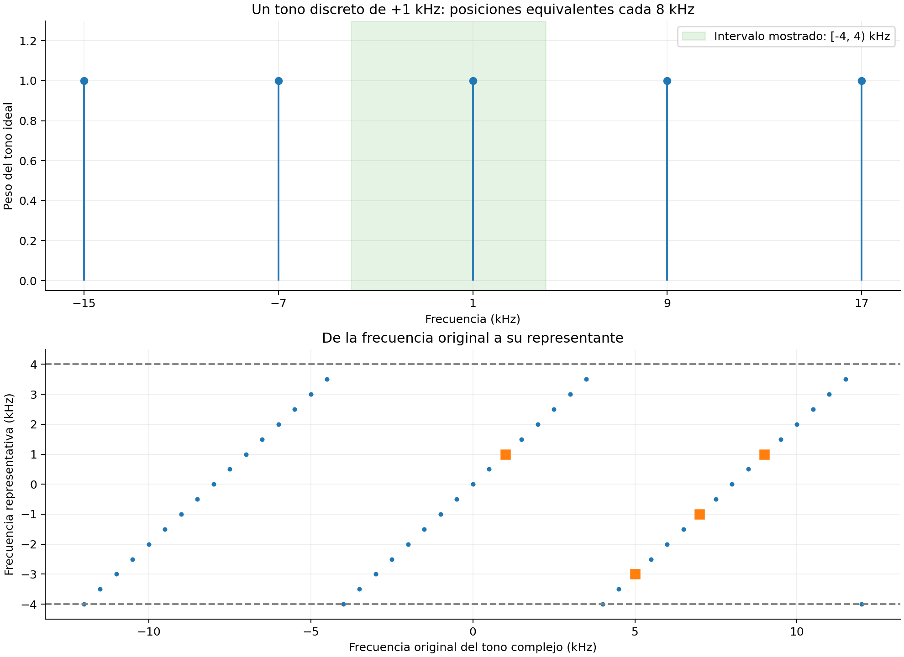

**Figura 11.** Periodicidad de las posiciones de un tono discreto y mapa hacia un intervalo representativo de ancho 8 kHz.

- **Panel superior — posiciones equivalentes:** −15, −7, +1, +9 y +17 kHz representan la misma componente discreta. Es un esquema del tono ideal, no una FFT del bloque ni cinco transmisores distintos.
- **Banda verde:** selecciona una sola representación dentro del intervalo centrado en cero.
- **Panel inferior — lectura de los ejes:** el eje horizontal indica la frecuencia original del experimento y el vertical indica su representante. Así, +5 kHz termina en −3 kHz y +9 kHz termina en +1 kHz.
- **Por qué los puntos no se unen:** unirlos podría dibujar una transición continua falsa entre +4 y −4 kHz.
- **Qué permite la expresión con módulo:** selecciona un representante dentro del intervalo. No recupera la frecuencia original a partir de muestras ambiguas.

#### 4.5. Experimento D: la señal queda fija y cambia el sample rate

Hasta aquí cambió la frecuencia de la señal. Ahora se mantiene un tono complejo de **+3 kHz** y se realizan tres adquisiciones ideales con tasas diferentes:

| Sample rate | Avance por muestra | Intervalo representativo | Pico esperado |
|---|---:|---|---:|
| 12 kS/s | 90° | $[-6,6)$ kHz | +3 kHz |
| 8 kS/s | 135° | $[-4,4)$ kHz | +3 kHz |
| 4 kS/s | 270°, equivalente a −90° | $[-2,2)$ kHz | −1 kHz |

- **Qué se varía:** el sample rate con el que se generan nuevas muestras.
- **Qué permanece fijo:** tono de +3 kHz, magnitud 1, fase inicial 0 y duración del bloque de 8 ms.
- **Qué cambia como consecuencia:** el intervalo entre muestras, su cantidad y el ancho del eje de frecuencia. Se obtienen 96, 64 y 32 muestras respectivamente.

Esto no consiste en tomar un archivo y cambiar la etiqueta de su sample rate. Cada fila calcula la señal original en nuevos instantes de muestreo.

**Colab — Celda 5: comparar las adquisiciones en tiempo y frecuencia.**

```python
f_tono = 3000
duracion = 0.008
tasas = [12000, 8000, 4000]
td = np.linspace(0, 0.001, 1201)
fig, axes = plt.subplots(3, 2, figsize=(12, 10), layout="constrained")
for fila, tasa in enumerate(tasas):
    cantidad = int(round(duracion * tasa))
    tk = np.arange(cantidad) / tasa
    zk = np.exp(1j * 2 * np.pi * f_tono * tk)
    fa = float(frecuencia_alias(f_tono, tasa))
    fk, Ck = espectro(zk, tasa)
    visible_k = tk <= 0.001
    print(f"fs={tasa} S/s; N={cantidad}; alias={fa:g} Hz; pico FFT={fk[np.argmax(np.abs(Ck))]:g} Hz")
    axes[fila, 0].plot(td * 1000, np.cos(2 * np.pi * f_tono * td), color="tab:gray", label="I continua original: +3 kHz")
    axes[fila, 0].plot(td * 1000, np.cos(2 * np.pi * fa * td), "--", color="tab:orange", label=f"I del representante: {fa / 1000:+g} kHz")
    axes[fila, 0].plot(tk[visible_k] * 1000, zk.real[visible_k], "o", color="tab:blue", label="Muestras I")
    axes[fila, 0].set(title=f"fs = {tasa / 1000:g} kS/s; {cantidad} muestras en 8 ms", xlabel="Tiempo (ms)", ylabel="I", ylim=(-1.2, 1.2))
    axes[fila, 0].legend(fontsize=8, loc="upper right")
    axes[fila, 1].stem(fk / 1000, np.abs(Ck), basefmt=" ")
    axes[fila, 1].set(title=f"FFT de I + jQ: pico en {fa / 1000:+g} kHz", xlabel="Frecuencia (kHz)", ylabel="Magnitud por componente", xlim=(-6.2, 6.2), ylim=(-0.03, 1.2))
    axes[fila, 1].axvline(-tasa / 2000, color="tab:gray", linestyle="--")
    axes[fila, 1].axvline(tasa / 2000, color="tab:gray", linestyle="--")
    axes[fila, 1].axvspan(-tasa / 2000, tasa / 2000, color="tab:green", alpha=0.08)
for ax in axes.flat:
    ax.grid(alpha=0.2)
plt.show()
```

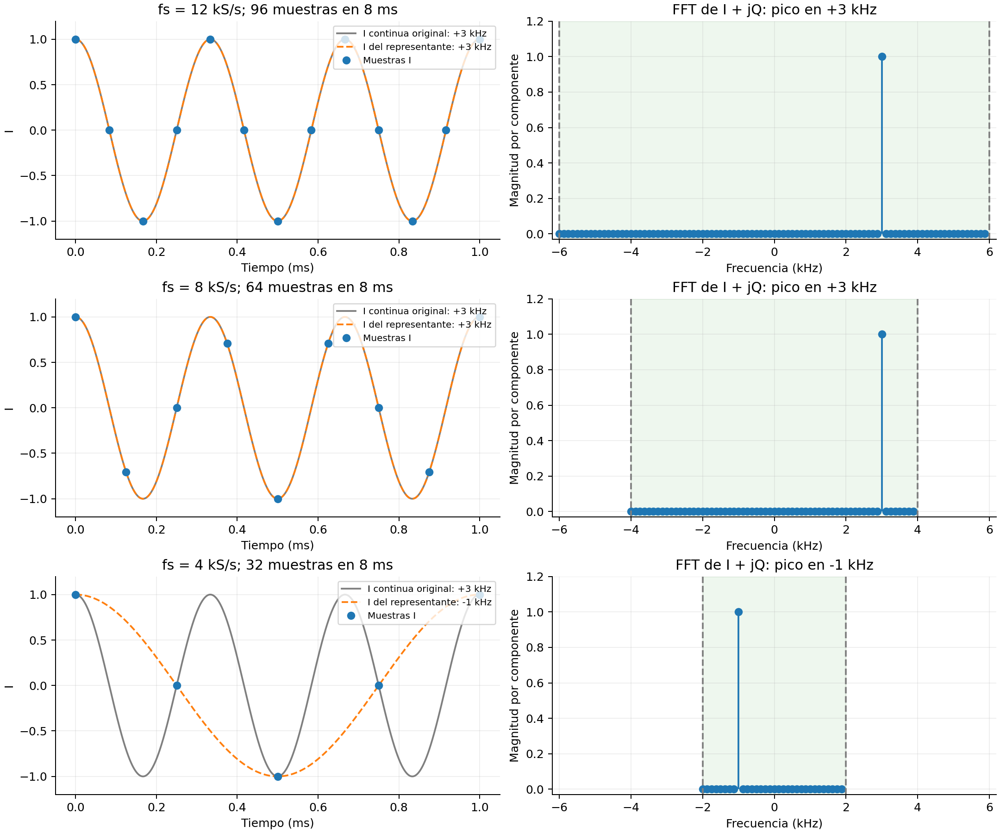

**Figura 12.** Reducir el sample rate puede hacer que un mismo tono aparezca en otra frecuencia representativa.

- **Columna izquierda — muestras I:** la curva original gris permanece fija. Al reducir el sample rate, los puntos quedan más separados en el tiempo.
- **Fila superior — 12 kS/s:** la referencia original y la del representante coinciden a la izquierda. A la derecha, el pico aparece en +3 kHz.
- **Fila central — 8 kS/s:** las dos referencias también coinciden y el pico permanece en +3 kHz. El intervalo disponible es más estrecho que en la primera fila.
- **Fila inferior — 4 kS/s:** las referencias son distintas entre los puntos, pero ambas pasan por las muestras I. La FFT de la derecha muestra el representante en −1 kHz.
- **Columna derecha — FFT compleja:** se utilizan I y Q conjuntamente, no solo I. Observar únicamente el coseno de I no permitiría distinguir +1 de −1 kHz.
- **Banda verde y líneas verticales:** indican el intervalo disponible y sus bordes, $\pm f_s/2$. La escala horizontal es la misma en las tres filas para comparar sus anchos.
- **Zonas exteriores a la banda:** no contienen bins de esa FFT. No son mediciones que demuestren ausencia de señal.
- **Curva naranja:** es otra referencia calculada, no una reconstrucción que demuestre cuál fue el tono original.

#### 4.6. Experimento E: por qué el borde de Nyquist requiere cuidado

Para una señal real limitada a una banda low-pass, con frecuencia máxima $f_{\max}$, se utiliza la condición:

$$f_s>2f_{\max}.$$

La mitad del sample rate, $f_s/2$, es la frecuencia de Nyquist. La condición supone que la banda de entrada está limitada: las muestras por sí solas no garantizan que no hubiera componentes fuera de ella. El [teorema de muestreo del DSP Guide](https://www.dspguide.com/ch3/2.htm) explica esa relación entre la banda analógica y su representación discreta.

En la práctica también hace falta margen para el filtro. La condición no significa que dos puntos dibujen una curva suave ni que unir puntos reconstruya la señal; establece cuándo el muestreo ideal permite una recuperación bajo las hipótesis de banda limitada.

El caso exacto $f_0=f_s/2$ muestra por qué no conviene diseñar sobre el borde. Con un coseno de 4 kHz a 8 kS/s:

$$
x[n]=\cos(\pi n+\phi)=(-1)^n\cos\phi.
$$

Con fase 0°, las muestras alternan +1 y −1. Con fase 90°, todas son cero. La señal continua no es cero, pero el muestreo coincide con sus cruces por cero.

- **Qué se varía:** solo la fase inicial, de 0° a 90°.
- **Qué permanece fijo:** frecuencia de 4 kHz, sample rate de 8 kS/s y amplitud 1.
- **Qué se debe notar:** una señal no nula puede quedar completamente invisible en sus muestras reales en este caso límite.

**Colab — Celda 6: observar las dos fases en el borde.**

```python
td = np.linspace(0, 0.001, 2001)
tn = np.arange(9) / fs
fig, axes = plt.subplots(2, 1, figsize=(11, 6), layout="constrained")
for ax, fase, etiqueta in zip(axes, [0, np.pi / 2], ["0°", "90°"]):
    valores = np.cos(2 * np.pi * (fs / 2) * tn + fase)
    ax.plot(td * 1000, np.cos(2 * np.pi * (fs / 2) * td + fase), color="tab:gray", label="Coseno continuo conocido")
    ax.plot(tn * 1000, valores, "o", color="tab:blue", label="Muestras")
    ax.set(title=f"4 kHz a 8 kS/s; fase inicial {etiqueta}", xlabel="Tiempo (ms)", ylabel="Amplitud", ylim=(-1.2, 1.2))
    ax.grid(alpha=0.2)
    ax.legend(loc="upper right")
    print(f"Fase {etiqueta}: {np.round(valores, 6)}")
plt.show()
```

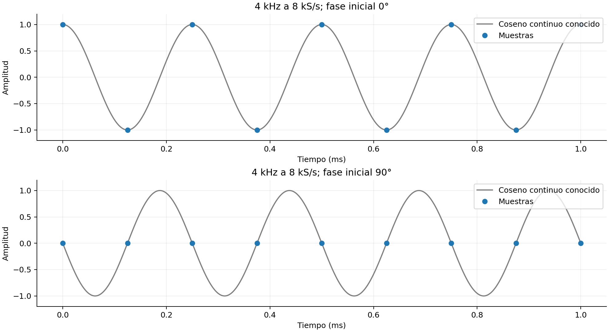

**Figura 13.** En el borde de Nyquist, cambiar la fase de un coseno real puede hacer que todas sus muestras sean cero.

- **Panel superior — muestras en máximos y mínimos:** los valores alternan entre los extremos del coseno real.
- **Panel inferior — muestras en cruces por cero:** los instantes de muestreo son los mismos, pero el cambio de fase hace que todas las muestras coincidan con cruces por cero. La curva gris sigue oscilando entre ellas.
- **Precisión numérica:** los valores calculados del segundo panel pueden ser muy cercanos a cero, sin ser exactamente cero, por el cálculo en punto flotante.
- **Diferencia con un tono complejo:** la figura utiliza un coseno **real**. Un tono complejo en ese borde conserva su magnitud, porque $e^{j(\pi n+\phi)}=(-1)^n e^{j\phi}$.
- **Equivalencia de los extremos:** +$f_s/2$ y −$f_s/2$ producen la misma secuencia compleja. No son posiciones independientes.
- **Ancho del intervalo I/Q:** para baseband centrado en cero, el ancho total es $f_s$, repartido entre frecuencias negativas y positivas. No se limita toda señal compleja a una banda total de $f_s/2$.
- **Condición que interesa preservar:** las componentes distintas de la banda que se desea conservar no deben superponerse al muestrear. Estos ejemplos seleccionan la banda centrada en cero; otros esquemas de muestreo quedan fuera de la sesión.

#### 4.7. Experimento F: el filtro debe actuar antes de perder la distinción

El filtrado anti-aliasing atenúa las componentes que se confundirían con la banda de interés. Debe actuar **antes** del muestreo que genera la superposición. El [MIT, en su lección sobre muestreo](https://ocw.mit.edu/courses/6-003-signals-and-systems-fall-2011/resources/mit6_003f11_lec22/), muestra ese orden tanto para muestreo continuo como para cambios de tasa en tiempo discreto.

Si la operación es un ADC, el filtrado previo es analógico. Si se reduce el sample rate de una secuencia ya adquirida, el filtrado previo puede ser digital: se aplica antes de descartar muestras. Diseñar esos filtros corresponde a la siguiente sesión; aquí se observa por qué hacen falta.

El ejemplo genera una señal compleja a 24 kS/s con dos componentes conocidas:

$$z_{\mathrm{entrada}}(t)=e^{j2\pi\,1000\,t}+0.6e^{j2\pi\,9000\,t}.$$

Después se conserva una de cada tres muestras, para obtener 8 kS/s. En esa nueva tasa, +9 kHz y +1 kHz coinciden. Con las fases elegidas, ambas contribuciones se suman en +1 kHz y la magnitud pasa de 1 a 1.6.

Se compara con un segundo camino: un filtro ideal previo conserva el tono de +1 kHz y elimina el de +9 kHz. Para aislar la idea, su salida se escribe directamente usando el tono conocido. **No se implementa un filtro real ni se calcula su respuesta en este snippet.**

**Qué se varía:** la presencia o ausencia de filtrado antes de reducir la tasa. **Qué permanece fijo:** señal de entrada, tasa inicial de 24 kS/s, tasa final de 8 kS/s y duración de 8 ms. **Qué se debe notar:** después de la superposición ya no hay dos picos que un filtro pueda separar.

**Colab — Celda 7: comparar ambos caminos.**

```python
fs_alta = 24000
fs_baja = 8000
factor = fs_alta // fs_baja
th = np.arange(192) / fs_alta
deseada = np.exp(1j * 2 * np.pi * 1000 * th)
interferente = 0.6 * np.exp(1j * 2 * np.pi * 9000 * th)
entrada = deseada + interferente
salida_filtro_ideal = deseada  # Modelo: elimina por completo el tono de 9 kHz.
sin_filtro = entrada[::factor]
con_filtro = salida_filtro_ideal[::factor]
tb = np.arange(len(sin_filtro)) / fs_baja
print("Sin filtro, se obtiene 1.6 veces el tono deseado:", np.allclose(sin_filtro, 1.6 * con_filtro))

fig, axes = plt.subplots(2, 2, figsize=(12, 8), layout="constrained")
casos = [(entrada, fs_alta, "Entrada: dos tonos a 24 kS/s"), (salida_filtro_ideal, fs_alta, "Después del filtro ideal, antes de reducir la tasa"), (sin_filtro, fs_baja, "Reducir a 8 kS/s SIN filtro: los tonos se suman")]
for ax, (y, tasa, titulo) in zip([axes[0, 0], axes[0, 1], axes[1, 0]], casos):
    f, C = espectro(y, tasa)
    ax.stem(f / 1000, np.abs(C), basefmt=" ")
    ax.set(title=titulo, xlabel="Frecuencia (kHz)", ylabel="Magnitud por componente", xlim=(-12.2, 12.2), ylim=(-0.03, 1.85))
    ax.axvspan(-4, 4, color="tab:green", alpha=0.08, label="Banda representativa de la tasa final")
    ax.legend(fontsize=8, loc="upper left")
axes[1, 1].plot(tb[:17] * 1000, sin_filtro.real[:17], "o-", label="I sin filtro: amplitud 1.6")
axes[1, 1].plot(tb[:17] * 1000, con_filtro.real[:17], "s-", label="I con filtro previo: amplitud 1", markerfacecolor="white")
axes[1, 1].set(title="Salidas a 8 kS/s: misma frecuencia, distinto resultado", xlabel="Tiempo (ms)", ylabel="I", ylim=(-1.85, 1.85))
axes[1, 1].legend(fontsize=8)
for ax in axes.flat:
    ax.grid(alpha=0.2)
plt.show()
```

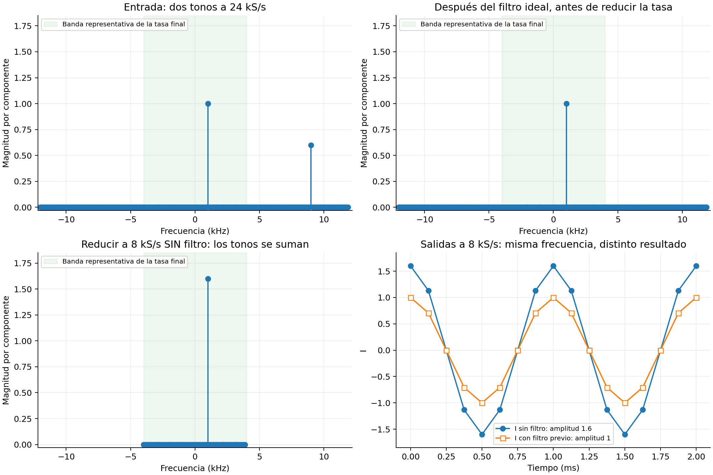

**Figura 14.** El filtrado previo evita que una componente fuera de la banda se superponga al tono que se desea conservar al reducir el sample rate.

- **Panel superior izquierdo — entrada a la tasa inicial:** +1 y +9 kHz se distinguen porque ambos están dentro del intervalo disponible.
- **Panel superior derecho — filtrado previo ideal:** solo queda +1 kHz. Esta eliminación ocurre **antes** de reducir la tasa a 8 kS/s.
- **Panel inferior izquierdo — reducción sin filtro:** aparece una sola componente de magnitud 1.6 en +1 kHz. El tono de +9 kHz ya se superpuso al de +1 kHz.
- **Eje del panel inferior izquierdo:** solo hay bins entre −4 y +4 kHz. El resto del eje se mantiene para comparar las posiciones con la entrada.
- **Panel inferior derecho — comparación de las salidas:** ambas secuencias tienen la misma tasa final. Con filtrado previo, I conserva el tono de magnitud 1; sin filtrado, muestra el resultado de la superposición.
- **FFT de la salida filtrada:** tendría un pico de magnitud 1 en +1 kHz. La diferencia con la salida sin filtro se debe al procesamiento previo, no a la tasa final, que es igual en ambos casos.
- **Por qué un filtro posterior no separa los tonos:** si deja pasar +1 kHz, también deja pasar la contribución aliased. Ambas ocupan la misma frecuencia.
- **Por qué la magnitud es 1.6:** depende de las amplitudes y fases elegidas. En otro caso, las contribuciones podrían reforzarse menos o cancelarse.
- **Qué no constituye una solución general:** dividir por 1.6 funciona para esta simulación conocida, pero no permite deshacer aliasing en una captura desconocida de forma general.

#### 4.8. Qué conclusiones se aplican a una captura SDR

La tasa de la secuencia I/Q determina el intervalo representativo de **esa etapa**. No significa que la RF de la antena se muestree directamente a la tasa del archivo: el receptor incluye conversión de frecuencia, filtrado y cambios de tasa, como se presentó en la sesión 1. La relación entre baseband y RF se retomará en la subsección 6.

Para interpretar los experimentos conviene distinguir tres operaciones:

- **Adquirir de nuevo con otro sample rate:** cambia los instantes en los que se observa la señal. Puede evitar aliasing si la banda de entrada y el filtrado son apropiados.
- **Reducir la tasa descartando muestras:** puede crear aliasing nuevo. Requiere filtrado previo respecto a la tasa de salida.
- **Cambiar solo la etiqueta de sample rate de un archivo:** cambia la interpretación de sus ejes, pero no obtiene información nueva ni revierte aliasing.

??? example "Comprobación: predecir un alias complejo"
    Un tono complejo de +11 kHz muestreado a 8 kS/s tiene representante en +3 kHz, porque $11-8=3$. Un tono de −6 kHz tiene representante en +2 kHz, porque $-6+8=2$. En ambos casos se conserva el signo del representante; no se toma su valor absoluto.

??? example "Comprobación: ¿más puntos en la FFT recuperan la frecuencia original?"
    No. Si las muestras de +1 y +9 kHz coinciden a 8 kS/s, una FFT más larga no puede decidir cuál fue la frecuencia original. Cambiar la longitud de la FFT afecta la lectura del bloque, no la información que se perdió al muestrear.

??? example "Comprobación: escoger una tasa para una señal real low-pass"
    Si la banda real que se desea conservar llega hasta 3 kHz, la condición ideal es $f_s>6$ kS/s. Una tasa de 8 kS/s permite margen entre 3 y 4 kHz para una transición de filtrado, pero que sea suficiente en un equipo concreto depende del filtro y de la atenuación requerida. No basta con seleccionar la tasa y omitir el filtrado de componentes exteriores.

La idea central es que una secuencia no identifica por sí sola todas las posibles frecuencias de la señal original. El sample rate, la banda seleccionada y el filtrado previo forman parte de su interpretación. El aliasing se origina al muestrear o reducir la tasa; el efecto de observar solo un bloque finito, llamado spectral leakage, se estudiará por separado en la subsección 5.

#### 4.9. Ejercicios de refuerzo

##### Ejercicio 4A — ubicar frecuencias equivalentes con su signo

Se utiliza $f_s=8000$ S/s y el intervalo representativo $[-4,+4)$ kHz.

- Determinar los representantes de +13 kHz, −10 kHz y +4 kHz.
- Explicar por qué no se toman los valores absolutos de los resultados ni se incluyen ambos extremos como frecuencias independientes.

??? example "Solución del ejercicio 4A"

    - **+13 kHz:** $13-2(8)=-3$ kHz, que pertenece al intervalo.
    - **−10 kHz:** $-10+8=-2$ kHz.
    - **+4 kHz:** se representa en −4 kHz, porque $4-8=-4$ y el extremo derecho no se incluye.
    - **Signo y extremos:** el signo conserva el sentido de giro de la secuencia representativa. +4 y −4 kHz son equivalentes a esta tasa; no son dos posiciones independientes.

##### Ejercicio 4B — demostrar una equivalencia muestra por muestra

Se comparan $z_7[n]=e^{j2\pi\,7000\,n/8000}$ y $z_{-1}[n]=e^{-j2\pi\,1000\,n/8000}$.

- Separar el exponente de $z_7[n]$ usando $7000=-1000+8000$ y comprobar la igualdad para cualquier $n$ entero.
- Calcular el valor de ambas secuencias en $n=1$ y explicar si obtener más muestras a la misma tasa elimina la equivalencia.

??? example "Solución del ejercicio 4B"

    - **Separación:** $z_7[n]=e^{-j2\pi\,1000\,n/8000}e^{j2\pi n}$.
    - **Índice entero:** $e^{j2\pi n}=1$, por lo que $z_7[n]=z_{-1}[n]$ para cualquier muestra.
    - **Muestra 1:** los ángulos son 315° y −45°, que llegan al mismo punto: aproximadamente $0.7071-j0.7071$.
    - **Más muestras:** no resuelven la equivalencia al mantener 8 kS/s. Haría falta información adicional sobre la banda original o una adquisición apropiada diferente, no una FFT que intente decidir entre secuencias iguales.

##### Ejercicio 4C — predecir la superposición antes de reducir la tasa

A 24 kS/s se tiene $z[n]=e^{j2\pi\,1000\,n/24000}+0.4e^{j2\pi\,9000\,n/24000}$. Se conserva una de cada tres muestras, empezando por $n=0$, sin filtrado previo.

- Determinar la tasa final, las frecuencias representativas y la magnitud resultante.
- Explicar dónde debe actuar el filtrado si se desea conservar solo el tono de +1 kHz.

??? example "Solución del ejercicio 4C"

    - **Tasa final:** $24000/3=8000$ S/s.
    - **Representantes:** +1 kHz permanece en +1 kHz y +9 kHz también aparece allí, porque $9-8=1$ kHz.
    - **Magnitud resultante:** las dos contribuciones tienen fase inicial cero y se suman como $(1+0.4)e^{j2\pi\,1000\,m/8000}$. Queda magnitud 1.4; $m$ es el índice de la secuencia de salida.
    - **Filtrado previo:** el tono de +9 kHz debe atenuarse antes de descartar muestras. Después de la reducción, un filtro que deje pasar +1 kHz deja pasar también su contribución aliased; ya no están en frecuencias separadas.
    - **Dependencia de fase:** el valor 1.4 corresponde a las fases elegidas. No es una regla general para cualquier interferente ni una corrección aplicable a una captura desconocida.

##### Ejercicio 4D — explicar el caso límite de la Figura 13

Se muestrea un coseno real de 4 kHz a 8 kS/s, primero con fase inicial cero y después con fase $\pi/2$.

- Escribir las dos secuencias y explicar si «dos muestras por ciclo» garantiza conservar este coseno real para cualquier fase.
- Indicar si un tono complejo en el mismo borde pierde su magnitud de la misma manera.

??? example "Solución del ejercicio 4D"

    - **Fase cero:** $x[n]=\cos(\pi n)=(-1)^n$. Las muestras alternan entre +1 y −1.
    - **Fase de 90°:** $x[n]=\cos(\pi n+\pi/2)=0$ para todos los índices enteros. La onda continua no desapareció, pero las muestras caen en sus cruces por cero.
    - **Condición real low-pass:** la igualdad en el borde no garantiza conservar cualquier fase. La condición utilizada en esta sesión es $f_s>2f_{\max}$, junto con una banda de entrada adecuadamente limitada.
    - **Tono complejo:** $e^{j(\pi n+\phi)}=(-1)^n e^{j\phi}$ conserva su magnitud. Aun así, +4 y −4 kHz producen la misma secuencia compleja; el borde requiere una interpretación cuidadosa.

### 5. Qué calcula una FFT de un bloque finito

Una captura puede contener millones de muestras, pero una gráfica de espectro suele calcularse usando un bloque de ellas. Por ejemplo, se toman 64 muestras, se calcula una FFT y se dibujan sus resultados. Después puede analizarse otro bloque.

Hasta ahora se utilizaron tonos elegidos para producir picos limpios. En una captura real no se puede esperar que todas las frecuencias coincidan con los puntos que evalúa la FFT. Tampoco se observa la señal durante un tiempo infinito. Ambas condiciones influyen en lo que aparece en la pantalla.

La pregunta conductora es: **¿cuánto de la forma del espectro corresponde a la señal y cuánto corresponde a la forma de observarla?**

#### 5.1. La FFT recibe un bloque, no una señal de duración infinita

Se consideran $N$ muestras consecutivas:

$$x[0],\ x[1],\ \ldots,\ x[N-1].$$

Con un sampling rate $f_s$, la duración nominal del bloque y el intervalo entre muestras son:

$$T_{\mathrm{obs}}=\frac{N}{f_s},\qquad T_s=\frac{1}{f_s}.$$

Aquí $f_s$ sigue siendo el **sampling rate**, como `samp_rate` en un flowgraph. No es la Nyquist frequency, que vale $f_s/2$. Tampoco es la frecuencia de un tono contenido en las muestras. Cada pareja I/Q cuenta como una muestra compleja.

Con $N=64$ y $f_s=8000$ S/s, el bloque representa 8 ms de señal. Como se explicó en la subsección 1, la última muestra está en 7.875 ms; el siguiente instante, en 8 ms, ya corresponde al bloque siguiente. La duración $N/f_s$ es la que se utiliza para relacionar este bloque con su rejilla de frecuencias.

Conviene distinguir dos nombres:

- **DFT — discrete Fourier transform:** la transformación matemática de un bloque de muestras a un conjunto de coeficientes complejos.
- **FFT — fast Fourier transform:** un algoritmo eficiente para calcular esa DFT. No es una transformación diferente ni proporciona un espectro distinto por ser más rápida.

La función [`np.fft.fft`](https://numpy.org/doc/stable/reference/generated/numpy.fft.fft.html) calcula la DFT mediante un algoritmo FFT y admite muestras complejas. En los primeros experimentos se utilizan $N$ muestras y una FFT de longitud $N$. Más adelante se distinguirán explícitamente las muestras adquiridas y la longitud de la FFT.

#### 5.2. Cada bin compara las muestras con un tono conocido

La DFT utilizada en esta sesión es:

$$
X[k]=\sum_{n=0}^{N-1}x[n]e^{-j2\pi kn/N},\qquad k=0,1,\ldots,N-1.
$$

Esta es la convención documentada por [NumPy](https://numpy.org/doc/stable/reference/routines.fft.html). La salida contiene $N$ coeficientes complejos. Cada posición $k$ es un **bin**: un punto de evaluación de la representación en frecuencia.

Para interpretar la fórmula, se puede separar en tres acciones:

1. Elegir un tono de referencia $e^{j2\pi kn/N}$.
2. Multiplicar las muestras por su conjugado $e^{-j2\pi kn/N}$, que gira en sentido contrario.
3. Sumar los resultados complejos.

El tono de referencia del bin $k$ completa $k$ ciclos en $N$ muestras. Su frecuencia, antes de llevarla al intervalo representativo, es:

$$f_k=\frac{k f_s}{N}.$$

Si la señal es exactamente ese tono, con amplitud 1 y fase inicial 0, las rotaciones se cancelan en cada muestra:

$$
x[n]e^{-j2\pi kn/N}=e^{j2\pi kn/N}e^{-j2\pi kn/N}=1.
$$

La suma de $N$ unos da $X[k]=N$. Por eso en los visores anteriores se dividió la FFT entre $N$: la magnitud de ese tono pasa a ser 1.

Si la referencia es otro bin, las contribuciones recorren el plano complejo y se cancelan al sumarse sobre el bloque completo. Esa cancelación exacta ocurre para los tonos de la rejilla. Para una frecuencia situada entre bins, las contribuciones no se cancelan exactamente y varios coeficientes resultan distintos de cero; ese caso se observará en el apartado 5.4.

**Colab — Celda 1: comprobar la suma que calcula un bin.** Las ocho celdas de esta subsección se ejecutan en orden y permiten comenzar en un notebook nuevo.

```python
import numpy as np
import matplotlib.pyplot as plt

fs = 8000
n8 = np.arange(8)
tono8 = np.exp(1j * 2 * np.pi * 1000 * n8 / fs)
for k in [1, 2]:
    productos = tono8 * np.exp(-1j * 2 * np.pi * k * n8 / 8)
    print(f"Bin k={k}; frecuencia={k * fs / 8:g} Hz; suma={np.sum(productos):.6f}")
print("La FFT devuelve las mismas sumas:", np.round(np.fft.fft(tono8)[[1, 2]], 6))

def espectro_bloque(x, sample_rate, ventana=None, nfft=None):
    cantidad = len(x)
    w = np.ones(cantidad) if ventana is None else np.asarray(ventana)
    longitud_fft = cantidad if nfft is None else nfft
    if len(w) != cantidad or longitud_fft < cantidad:
        raise ValueError("La ventana debe tener N valores y la FFT no debe recortar las muestras")
    f = np.fft.fftshift(np.fft.fftfreq(longitud_fft, d=1 / sample_rate))
    C = np.fft.fftshift(np.fft.fft(x * w, n=longitud_fft)) / np.sum(w)
    return f, C

def magnitud_db(C):
    return 20 * np.log10(np.maximum(np.abs(C), 1e-6))
```

Con ocho muestras a 8 kS/s, el bin 1 corresponde a +1 kHz y produce una suma de 8; el bin 2 corresponde a +2 kHz y produce una suma cercana a cero. La pequeña parte imaginaria o el residuo cercano a cero se deben a precisión numérica.

La función `espectro_bloque` prepara los siguientes gráficos: calcula coeficientes, construye el eje y los ordena. Sin una ventana explícita, divide entre $N$, como antes. Las opciones `ventana` y `nfft` se explicarán al utilizarlas. `magnitud_db` se reserva para las comparaciones donde conviene observar valores pequeños.

Un bin no es un transmisor ni una caja que contiene exclusivamente las señales de un pequeño intervalo. Es una evaluación mediante la suma anterior: un solo tono entre bins puede contribuir a muchos de ellos.

#### 5.3. Experimento A: construir y ordenar el eje de frecuencias

Para una FFT de longitud $N$, la separación entre bins consecutivos es:

$$
\Delta f=\frac{f_s}{N}=\frac{1}{T_{\mathrm{obs}}}.
$$

Con 64 muestras a 8 kS/s, $\Delta f=125$ Hz. Las frecuencias de la rejilla incluyen 0, ±125, ±250, … Hz. Un tono de +1 kHz coincide con un bin porque $1000/125=8$.

La salida de `fft` no empieza por la frecuencia más negativa. Para un número par de muestras, [`fftfreq`](https://numpy.org/doc/stable/reference/generated/numpy.fft.fftfreq.html) asigna las frecuencias en este orden:

$$
0,\ \Delta f,\ \ldots,\ \frac{f_s}{2}-\Delta f,\ -\frac{f_s}{2},\ \ldots,\ -\Delta f.
$$

El bin 0 corresponde a DC, frecuencia cero. Los bins de la segunda mitad representan frecuencias negativas. Por ejemplo, con $N=8$ y $f_s=8000$ S/s, el índice $k=6$ tiene una frecuencia no reordenada de −2 kHz: $6\cdot1000=6000$ Hz es equivalente a $6000-8000=-2000$ Hz, como se estudió en aliasing.

[`fftshift`](https://numpy.org/doc/stable/reference/generated/numpy.fft.fftshift.html) reordena estos elementos para mostrar primero las frecuencias negativas y situar DC en el centro. Debe aplicarse tanto al eje como a los coeficientes. No cambia las muestras ni mezcla la señal: cambia el orden de presentación.

**Qué se varía:** únicamente el orden de presentación. **Qué permanece fijo:** un bloque de ocho muestras que contiene tonos complejos de +1 kHz, magnitud 1, y −2 kHz, magnitud 0.5. **Qué se debe notar:** cambian las posiciones de los elementos, pero no las frecuencias ni las magnitudes de los tonos.

**Colab — Celda 2: relacionar el índice de salida con su frecuencia.**

```python
z8 = np.exp(1j * 2 * np.pi * 1000 * n8 / fs) + 0.5 * np.exp(-1j * 2 * np.pi * 2000 * n8 / fs)
f_sin_ordenar = np.fft.fftfreq(len(z8), d=1 / fs)
C_sin_ordenar = np.fft.fft(z8) / len(z8)
f_ordenado = np.fft.fftshift(f_sin_ordenar)
C_ordenado = np.fft.fftshift(C_sin_ordenar)
print("k | frecuencia (Hz) | magnitud")
for k, (frecuencia, coeficiente) in enumerate(zip(f_sin_ordenar, C_sin_ordenar)):
    print(f"{k} | {frecuencia:7.0f} | {abs(coeficiente):.3f}")

fig, axes = plt.subplots(1, 2, figsize=(12, 4.5), layout="constrained")
axes[0].stem(np.arange(8), np.abs(C_sin_ordenar), basefmt=" ")
axes[0].set(title="Orden original de fft", xlabel="Índice k de la salida", ylabel="Magnitud", xticks=np.arange(8), ylim=(-0.03, 1.2))
for k, frecuencia in enumerate(f_sin_ordenar):
    axes[0].text(k, abs(C_sin_ordenar[k]) + 0.07, f"{frecuencia / 1000:g} kHz", ha="center", fontsize=8)
axes[1].stem(f_ordenado / 1000, np.abs(C_ordenado), basefmt=" ")
axes[1].set(title="Eje y coeficientes después de fftshift", xlabel="Frecuencia (kHz)", ylabel="Magnitud", xticks=np.arange(-4, 4), ylim=(-0.03, 1.2))
for ax in axes:
    ax.grid(alpha=0.2)
plt.show()
```

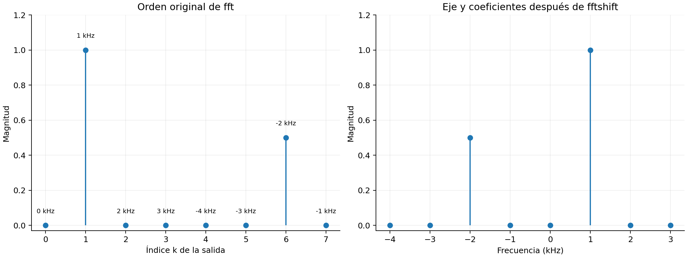

**Figura 15.** La posición de un coeficiente en la salida de `fft` no es por sí sola su frecuencia física; el eje debe construirse y reordenarse correctamente.

- **Panel izquierdo — orden por índice:** el pico de $k=1$ corresponde a +1 kHz y el de $k=6$, a −2 kHz. Las etiquetas indican la frecuencia de cada elemento.
- **Panel derecho — orden por frecuencia:** muestra los mismos resultados, reordenados de −4 a +3 kHz. No se cambian las frecuencias de los tonos: se cambia el orden en que se presentan los coeficientes.
- **Extremo de Nyquist:** +4 kHz no aparece como punto adicional porque es equivalente a −4 kHz.
- **Por qué se usan ocho muestras:** el tamaño pequeño permite leer todos los bins. No se propone como tamaño habitual para una captura SDR.
- **Tipo de FFT utilizado:** se calcula la FFT compleja de ambos lados. `rfft`, destinada a entradas reales, no es la elección para una captura I/Q genérica.

#### 5.4. Experimento B: un tono alineado y otro entre bins

Se vuelve a un bloque de $N=64$ muestras a 8 kS/s. Su duración es 8 ms y sus bins están separados 125 Hz. Se comparan dos tonos complejos de magnitud 1:

| Frecuencia del tono | Ciclos en el bloque, $f_0N/f_s$ | Posición respecto a los bins |
|---|---:|---|
| 1000 Hz | 8 | Coincide con el bin de 1000 Hz |
| 1062.5 Hz | 8.5 | Queda a mitad de camino entre 1000 y 1125 Hz |

El tono de 1062.5 Hz sigue siendo un solo tono. No se convierte en varios transmisores. Sin embargo, su DFT tiene varios coeficientes distintos de cero. Esta distribución se llama **spectral leakage**, contribución del tono en frecuencias distintas de su frecuencia central al analizar un bloque finito.

La fórmula del apartado 5.2 permite entenderlo. Si se sustituye $x[n]=e^{j2\pi f_0 n/f_s}$:

$$
X[k]=\sum_{n=0}^{N-1}e^{j2\pi\left(f_0/f_s-k/N\right)n}.
$$

Para 1 kHz y $k=8$, el exponente es cero y todas las contribuciones se suman. Para 1062.5 Hz no existe un índice entero $k=8.5$: en los bins cercanos las contribuciones se suman parcialmente y en los demás tampoco se cancelan exactamente.

También ayuda observar la repetición del bloque. Los tonos de la rejilla de la DFT completan un número entero de vueltas durante $N$ muestras. Por ello, su representación mediante esos tonos se repite cada $N$ muestras. No es necesario que el equipo repita físicamente el archivo: es una propiedad de la representación matemática.

En el tono de 1 kHz, la continuación original en $n=64$ vuelve a $1+j0$, igual que el inicio del bloque. En el de 1062.5 Hz, la continuación llega a $-1+j0$, pero repetir el bloque obliga a volver a $1+j0$. La repetición deja de coincidir con la señal original.

**La condición no es que la primera y la última muestra sean iguales.** La última está en $n=63$; lo que se compara es la continuación en $n=64$ con el reinicio en $n=0$.

**Qué se varía:** frecuencia del tono, de 1000 a 1062.5 Hz. **Qué permanece fijo:** sample rate, 64 muestras, amplitud, fase inicial y ventana rectangular, que equivale a conservar todas las muestras con el mismo peso. **Qué se debe notar:** un solo tono entre bins produce varios valores espectrales y sus bins de mayor magnitud no llegan a 1.

**Colab — Celda 3: relacionar la repetición del bloque con spectral leakage.**

```python
N = 64
n = np.arange(N)
t = n / fs
T_obs = N / fs
tonos = {f0: np.exp(1j * 2 * np.pi * f0 * t) for f0 in [1000, 1062.5]}
t_dos_bloques = np.arange(2 * N) / fs
td = np.linspace(0, 2 * T_obs, 4001)
fig, axes = plt.subplots(2, 2, figsize=(12, 8), layout="constrained")
for fila, (f0, z) in enumerate(tonos.items()):
    f, C = espectro_bloque(z, fs)
    repeticion = np.tile(z, 2)
    print(f"f0={f0:g} Hz; ciclos={f0 * T_obs:g}; máximo en bins={np.max(np.abs(C)):.4f}")
    axes[fila, 0].plot(td * 1000, np.cos(2 * np.pi * f0 * td), color="tab:gray", label="Continuación original conocida")
    axes[fila, 0].plot(t_dos_bloques * 1000, repeticion.real, ".--", color="tab:orange", label="Repetición de las 64 muestras I")
    axes[fila, 0].axvline(T_obs * 1000, color="tab:blue", linestyle=":", label="Reinicio del bloque")
    axes[fila, 0].set(title=f"{f0:g} Hz: reinicio tras {f0 * T_obs:g} ciclos", xlabel="Tiempo (ms)", ylabel="I", xlim=((T_obs - 0.001) * 1000, (T_obs + 0.001) * 1000), ylim=(-1.3, 1.3))
    axes[fila, 0].legend(fontsize=8, loc="lower left")
    axes[fila, 1].stem(f, np.abs(C), basefmt=" ")
    axes[fila, 1].axvline(f0, color="tab:orange", linestyle="--", label="Frecuencia del tono original")
    axes[fila, 1].set(title="FFT compleja del primer bloque, sin padding", xlabel="Frecuencia (Hz)", ylabel="Magnitud", xlim=(250, 1875), ylim=(-0.03, 1.15))
    axes[fila, 1].legend(fontsize=8)
for ax in axes.flat:
    ax.grid(alpha=0.2)
plt.show()
```

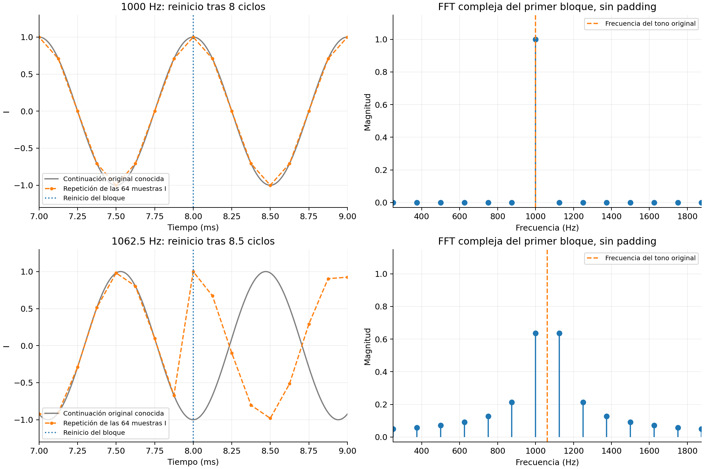

**Figura 16.** La frecuencia que no coincide con la rejilla de una FFT rectangular contribuye a varios bins, aunque la señal original contenga un único tono.

- **Panel superior izquierdo — repetición del tono de 1 kHz:** las muestras repetidas siguen la continuación original del tono, incluso al reiniciar el bloque en 8 ms.
- **Panel inferior izquierdo — repetición del tono de 1062.5 Hz:** en 8 ms, la referencia original vale −1 y la repetición vuelve a +1. El bloque repetido deja de seguir la continuación original.
- **Escala temporal y líneas:** la columna izquierda se amplía entre 7 y 9 ms para observar el reinicio. Las líneas entre puntos facilitan la comparación y no representan una reconstrucción continua.
- **Panel superior derecho — FFT del tono de 1 kHz:** tiene magnitud 1 en su bin y ceros numéricos en los demás.
- **Panel inferior derecho — FFT del tono de 1062.5 Hz:** los máximos son aproximadamente 0.637 en 1000 y 1125 Hz. También aparecen contribuciones en otros bins, aunque la señal original contiene un solo tono.
- **Línea naranja del espectro:** indica la frecuencia verdadera, conocida porque se generó el tono. En el caso de 1062.5 Hz no hay un bin exactamente en esa línea.
- **Qué conserva la DFT:** leakage no significa que se hayan perdido las muestras dentro del bloque. La DFT completa conserva su información, como se comprobó en la subsección 3.
- **Qué espectros no deben confundirse:** el del bloque observado y el ideal de un tono que existiera durante un tiempo infinito. El [tutorial FFT de SciPy](https://docs.scipy.org/doc/scipy/tutorial/fft.html) explica el efecto de limitar la señal y utilizar ventanas.

#### 5.5. Experimento C: más puntos en la FFT no significa más muestras adquiridas

Antes de introducir padding, se retoma el **spectral leakage** observado en el apartado 5.4:

- **Qué significa:** al analizar un bloque finito, un tono contribuye a una forma espectral extendida alrededor de su frecuencia. En el ejemplo de 1062.5 Hz, esa contribución aparece en varios bins porque el tono queda entre los bins de la FFT original.
- **Qué no significa:** la señal no se convirtió en varios tonos ni aparecieron nuevos transmisores. Sigue siendo el mismo tono de 1062.5 Hz.
- **Qué se comprobará ahora:** añadir ceros permite evaluar más puntos sobre esa misma forma espectral. No elimina leakage ni añade muestras adquiridas de la señal.

Hasta aquí la longitud de la FFT coincide con las $N$ muestras disponibles. Ahora se introduce **zero padding**: añadir ceros al final del bloque antes de calcular la FFT.

Se utilizarán dos símbolos para evitar una confusión frecuente:

- $N$: número de muestras adquiridas de la señal.
- $M$: longitud de la FFT, incluyendo los ceros añadidos si los hay.

Con $M\geq N$, la operación es:

$$
X_M[k]=\sum_{n=0}^{N-1}x[n]e^{-j2\pi kn/M}.
$$

Los términos desde $N$ hasta $M-1$ no se escriben porque las muestras añadidas valen cero. La rejilla de salida tiene separación:

$$
\Delta f_{\mathrm{FFT}}=\frac{f_s}{M}.
$$

Pero el tiempo realmente observado sigue siendo $T_{\mathrm{obs}}=N/f_s$. No pasa a ser $M/f_s$ solo porque se añadieron ceros.

Se conservan las mismas 64 muestras del tono de 1062.5 Hz y se comparan:

| Muestras adquiridas $N$ | Longitud FFT $M$ | Ceros añadidos | Tiempo observado | Separación de bins de salida |
|---:|---:|---:|---:|---:|
| 64 | 64 | 0 | 8 ms | 125 Hz |
| 64 | 512 | 448 | 8 ms | 15.625 Hz |

En el segundo caso, 1062.5 Hz sí pertenece a la rejilla de salida porque $1062.5/15.625=68$. Se puede evaluar la suma exactamente en la frecuencia del tono. Esto ayuda a leer la posición y altura de su máximo, pero no añade observaciones ni hace más estrecha la forma espectral del bloque.

[`np.fft.fft(x, n=M)`](https://numpy.org/doc/stable/reference/generated/numpy.fft.fft.html) añade ceros cuando $M$ supera la longitud de la entrada. La función auxiliar evita $M<N$, porque en ese caso NumPy recortaría muestras: sería otro experimento.

**Qué se varía:** longitud de la FFT, de 64 a 512. **Qué permanece fijo:** las mismas 64 muestras adquiridas a 8 kS/s y la ventana rectangular. **Qué se debe notar:** aparecen más puntos sobre la forma espectral del mismo bloque; no se incorpora una observación más larga.

**Colab — Celda 4: comparar muestras adquiridas y ceros añadidos.**

```python
z_off = tonos[1062.5]
M = 512
entrada_padded = np.pad(z_off, (0, M - len(z_off)))
f64, C64 = espectro_bloque(z_off, fs)
f512, C512 = espectro_bloque(z_off, fs, nfft=M)
print("Muestras adquiridas:", len(z_off), "; longitud FFT:", M)
print("Los bins originales están incluidos:", np.allclose(C512[::8], C64))
print("Máximo con padding:", np.max(np.abs(C512)))

fig, axes = plt.subplots(2, 2, figsize=(12, 8), layout="constrained")
axes[0, 0].plot(np.arange(N), z_off.real, ".-", label="64 muestras I adquiridas")
axes[0, 0].set(title="Entrada original", xlabel="Índice de muestra", ylabel="I", ylim=(-1.2, 1.2))
axes[0, 1].plot(np.arange(M), entrada_padded.real, ".-", label="Entrada con padding")
axes[0, 1].axvspan(N, M - 1, color="tab:orange", alpha=0.12, label="448 ceros, no nuevas observaciones")
axes[0, 1].set(title="La entrada se completa con ceros", xlabel="Índice en el arreglo de entrada", ylabel="I", ylim=(-1.2, 1.2))
axes[1, 0].stem(f64, np.abs(C64), basefmt=" ")
axes[1, 0].set(title="M = 64: bins cada 125 Hz", xlabel="Frecuencia (Hz)", ylabel="Magnitud", xlim=(700, 1450), ylim=(-0.03, 1.15))
axes[1, 1].plot(f512, np.abs(C512), ".-", label="M = 512: bins cada 15.625 Hz")
axes[1, 1].plot(f64, np.abs(C64), "s", color="tab:orange", markerfacecolor="none", markersize=8, label="Los bins de M = 64")
axes[1, 1].set(title="Más puntos sobre la misma forma espectral", xlabel="Frecuencia (Hz)", ylabel="Magnitud", xlim=(700, 1450), ylim=(-0.03, 1.15))
for ax in axes[1]:
    ax.axvline(1062.5, color="tab:gray", linestyle="--")
for ax in axes.flat:
    ax.grid(alpha=0.2)
for ax in [axes[0, 0], axes[0, 1], axes[1, 1]]:
    ax.legend(fontsize=8)
plt.show()
```

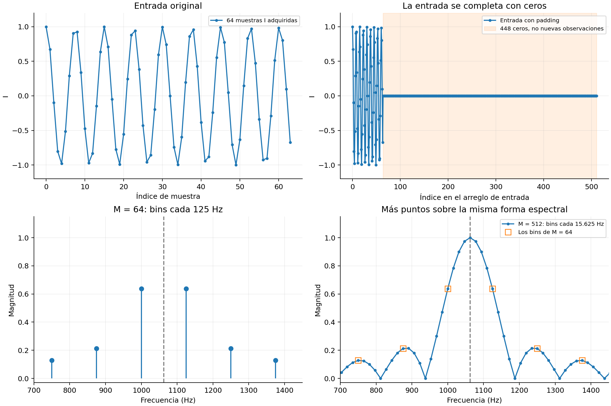

**Figura 17.** Zero padding aumenta el número de bins evaluados sin aumentar el tiempo de observación de la señal.

- **Panel superior izquierdo — entrada original:** presenta las 64 muestras I adquiridas.
- **Panel superior derecho — entrada con padding:** conserva esas muestras y añade 448 ceros. El eje indica posiciones en un arreglo; los ceros no prueban que la señal física haya desaparecido después de 8 ms.
- **Panel inferior izquierdo — FFT de 64 puntos:** muestra los bins originales, separados 125 Hz.
- **Panel inferior derecho — FFT de 512 puntos:** muestra una rejilla más densa sobre la misma forma espectral. Los cuadrados naranjas, que representan los bins originales, coinciden con puntos de la rejilla azul.
- **Altura del máximo:** ahora llega a 1 en 1062.5 Hz porque se evalúa la suma en esa frecuencia. No significa que antes el tono tuviera menor amplitud.
- **Leakage después del padding:** la forma extendida y sus lóbulos siguen presentes. Añadir ceros no elimina leakage ni estrecha esa forma.
- **Normalización de magnitud:** se divide entre las 64 muestras originales, no entre 512. Dividir entre $M$ sin ajustar la escala reduciría artificialmente las magnitudes por un factor de ocho.
- **Si el tono coincidiera con un bin original:** una FFT sin padding podría mostrar un solo valor no nulo. El padding permitiría observar también la forma espectral entre los bins originales; sus ceros no implican una línea infinitamente estrecha.

#### 5.6. Experimento D: qué cambia al aplicar una ventana

Conservar un bloque sin modificar sus valores equivale a multiplicarlo por una **ventana rectangular**: peso 1 dentro del bloque y 0 fuera. Se eligió un intervalo y se dejó de observar lo que ocurre antes y después.

Otra ventana asigna pesos menores a las muestras próximas a los bordes. La operación es una multiplicación muestra por muestra:

$$x_w[n]=x[n]w[n].$$

No se cambia el sample rate ni se adquieren nuevas muestras. Se modifica el bloque que se entrega a la FFT, conservando aparte los datos originales.

En este experimento se utiliza una **Hann periódica**, definida por:

$$
w[n]=\frac{1}{2}-\frac{1}{2}\cos\left(\frac{2\pi n}{N}\right),\qquad 0\leq n<N.
$$

Sus pesos son pequeños en los bordes y mayores en el centro. El denominador es $N$, no $N-1$, porque se utiliza la variante periódica para análisis espectral. La [documentación de Hann en SciPy](https://docs.scipy.org/doc/scipy/reference/generated/scipy.signal.windows.hann.html) distingue las variantes periódica y simétrica. Aquí se escribe la fórmula con NumPy para no necesitar otra biblioteca en Colab.

Una ventana no convierte un tono entre bins en un tono alineado. Cambia la forma de su contribución espectral. Para describir esa forma se utilizan dos términos:

- **Main lobe:** el lóbulo principal, alrededor de la frecuencia del tono.
- **Sidelobes:** los lóbulos secundarios, más alejados de esa frecuencia.

Al comparar rectangular y Hann, se espera que Hann reduzca los sidelobes, pero ensanche el main lobe. Este compromiso se muestra en el [análisis espectral de SciPy](https://docs.scipy.org/doc/scipy/tutorial/signal.html#spectral-analysis). Reducir sidelobes ayuda a observar componentes débiles próximas a una fuerte; ensanchar el main lobe puede dificultar la separación de componentes muy cercanas.

**La altura también requiere una escala consistente.** Para un tono complejo de amplitud $A$, evaluado exactamente en su frecuencia, las rotaciones se cancelan y la suma con ventana vale:

$$
X_w(f_0)=A e^{j\phi}\sum_{n=0}^{N-1}w[n].
$$

Por eso la función auxiliar divide entre $\sum w[n]$. Para rectangular, la suma es $N$; para esta Hann periódica, es $N/2$. Así se comparan tonos con la misma escala de amplitud. Sin esta corrección, el máximo del tono con Hann bajaría a la mitad solo por el cambio de pesos.

Esta normalización se utiliza para la magnitud de tonos. No es una normalización de power spectral density, PSD, ni una calibración en dBm. Tampoco corrige que la rejilla no pase exactamente por el máximo del tono.

Para observar los sidelobes se usa una escala en dB:

$$L(f)=20\log_{10}|C(f)|.$$

La referencia es una magnitud normalizada de 1. Una magnitud de 0.1 corresponde a −20 dB y una de 0.01, a −40 dB. Se aplica un mínimo numérico de $10^{-6}$ para evitar $\log(0)$; el valor −120 dB resultante es un límite del gráfico, no una medición de ruido.

**Qué se varía:** ventana rectangular frente a Hann. **Qué permanece fijo:** las 64 muestras del tono de 1062.5 Hz, sample rate de 8 kS/s y FFT de 4096 puntos con padding para dibujar los lóbulos. **Qué se debe notar:** Hann reduce las contribuciones alejadas del tono a costa de un lóbulo principal más ancho.

**Colab — Celda 5: observar los pesos, las muestras modificadas y el espectro.**

```python
def hann_periodica(cantidad):
    return 0.5 - 0.5 * np.cos(2 * np.pi * np.arange(cantidad) / cantidad)

w_rect = np.ones(N)
w_hann = hann_periodica(N)
f_win, C_rect = espectro_bloque(z_off, fs, ventana=w_rect, nfft=4096)
_, C_hann = espectro_bloque(z_off, fs, ventana=w_hann, nfft=4096)
print("Suma de pesos rectangular:", np.sum(w_rect))
print("Suma de pesos Hann:", np.sum(w_hann))
print("Máximos con escala corregida:", np.max(np.abs(C_rect)), np.max(np.abs(C_hann)))

fig, axes = plt.subplots(2, 2, figsize=(12, 8), layout="constrained")
axes[0, 0].plot(n, w_rect, label="Rectangular")
axes[0, 0].plot(n, w_hann, label="Hann periódica")
axes[0, 0].set(title="Pesos aplicados a cada muestra", xlabel="Índice n", ylabel="Peso w[n]", ylim=(-0.05, 1.15))
axes[0, 1].plot(t * 1000, z_off.real, ".-", label="I original: rectangular")
axes[0, 1].plot(t * 1000, (z_off * w_hann).real, ".-", label="I multiplicada por Hann")
axes[0, 1].set(title="Cambian las amplitudes del bloque, no sus instantes", xlabel="Tiempo (ms)", ylabel="I", ylim=(-1.2, 1.2))
for ax in axes[1]:
    ax.plot(f_win, magnitud_db(C_rect), label="Rectangular")
    ax.plot(f_win, magnitud_db(C_hann), label="Hann periódica")
    ax.axvline(1062.5, color="tab:gray", linestyle="--")
    ax.set(xlabel="Frecuencia (Hz)", ylabel="Magnitud (dB respecto a 1)", ylim=(-85, 5))
axes[1, 0].set(title="Main lobe: Hann es más ancha", xlim=(650, 1475))
axes[1, 1].set(title="Sidelobes: Hann reduce los valores alejados", xlim=(0, 2500))
for ax in axes.flat:
    ax.grid(alpha=0.2)
    ax.legend(fontsize=8)
plt.show()
```

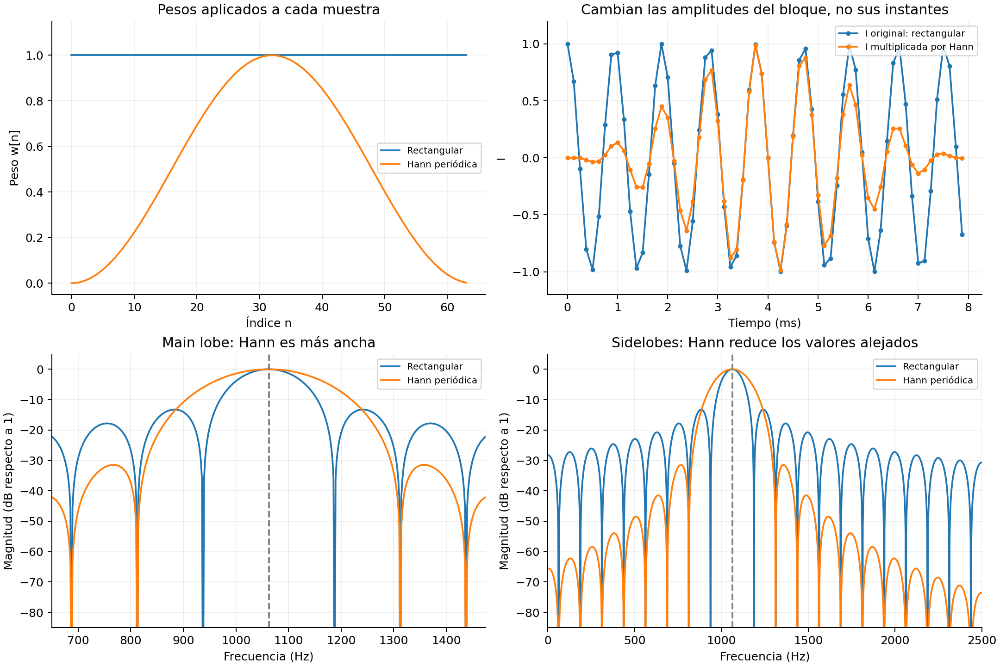

**Figura 18.** La ventana Hann reduce los sidelobes del tono observado, pero ensancha su main lobe respecto a la ventana rectangular.

- **Panel superior izquierdo — pesos de las ventanas:** la rectangular asigna peso 1 a todas las muestras. Hann reduce principalmente los pesos próximos a los bordes.
- **Panel superior derecho — muestras después de aplicar la ventana:** la rectangular conserva sus valores y Hann atenúa las próximas a los bordes. En ambos casos se mantienen los mismos 64 instantes de muestreo.
- **Panel inferior izquierdo — zoom del main lobe:** los primeros ceros están aproximadamente en 937.5 y 1187.5 Hz para rectangular, y en 812.5 y 1312.5 Hz para Hann. El ancho entre ellos pasa de 250 a 500 Hz.
- **Panel inferior derecho — comparación de sidelobes:** Hann produce sidelobes menores. La escala en dB permite observar valores que casi no se distinguirían en una escala lineal.
- **Caídas muy profundas:** corresponden a ceros de las formas espectrales. No demuestran que existan canales físicos vacíos.
- **Máximos de 0 dB:** se corrigió la suma de pesos y la rejilla densa incluye la frecuencia del tono. El padding ayuda a ver la forma; la diferencia entre las curvas la produce la ventana.
- **Compromiso al elegir ventana:** no hay una universalmente mejor. La elección depende de si interesa separar tonos cercanos, medir amplitudes o detectar una componente débil junto a otra fuerte.
- **Diferencia con el filtro anti-aliasing:** una ventana de análisis no elimina la ambigüedad que ya existe en las muestras. Tampoco selecciona por sí sola un canal RF.

#### 5.7. Experimento E: observar durante más tiempo sí cambia la separación de tonos

Ahora se cambia **la cantidad de muestras adquiridas**, no solo la longitud de la FFT. Se mantiene $f_s=8000$ S/s y se comparan bloques de 64 y 512 muestras:

| Muestras adquiridas $N$ | Tiempo observado $N/f_s$ | Separación de bins sin padding, $f_s/N$ |
|---:|---:|---:|
| 64 | 8 ms | 125 Hz |
| 512 | 64 ms | 15.625 Hz |

Los números de la última columna coinciden con los del experimento de padding, pero la operación es diferente: ahora las 448 posiciones adicionales contienen **nuevas muestras de la señal**, no ceros.

Para comprobar su efecto se utilizan dos tonos complejos de igual amplitud, en 1000 y 1062.5 Hz. La separación entre ellos es 62.5 Hz. En el bloque corto, sus contribuciones con Hann forman un máximo combinado. Con el bloque largo, los lóbulos se estrechan y aparecen dos máximos separados.

Aquí **resolución** se refiere a la capacidad de distinguir componentes cercanas en la gráfica de este análisis. Depende del tiempo observado, la ventana, las amplitudes relativas, las fases, el ruido y el criterio de separación. No equivale únicamente a la distancia entre puntos dibujados.

La relación $1/T_{\mathrm{obs}}$ da una escala natural de separación en frecuencia. No es una garantía universal de que dos señales separadas por un bin se puedan distinguir. Para estas ventanas ideales y un tono aislado, el ancho del main lobe entre sus primeros ceros es $2f_s/N$ con rectangular y $4f_s/N$ con Hann. Al aumentar $N$ manteniendo $f_s$, esos anchos disminuyen.

**Qué se varía:** número de muestras adquiridas, de 64 a 512. **Qué permanece fijo:** dos tonos de 1000 y 1062.5 Hz, amplitudes 1, fases iniciales 0, sample rate de 8 kS/s y tipo de ventana Hann. Se usa la misma FFT de 8192 puntos en ambos casos. **Qué se debe notar:** aunque los puntos de salida tengan la misma separación, solo el bloque largo permite distinguir los dos máximos en este experimento.

**Colab — Celda 6: comparar un bloque corto y otro largo de la misma señal.**

```python
frecuencias_par = [1000, 1062.5]
resultados_duracion = {}
fig, axes = plt.subplots(2, 2, figsize=(12, 8), layout="constrained")
for fila, cantidad in enumerate([64, 512]):
    tk = np.arange(cantidad) / fs
    zk = np.exp(1j * 2 * np.pi * frecuencias_par[0] * tk) + np.exp(1j * 2 * np.pi * frecuencias_par[1] * tk)
    wk = hann_periodica(cantidad)
    fk, Ck = espectro_bloque(zk, fs, ventana=wk, nfft=8192)
    resultados_duracion[cantidad] = (fk, Ck)
    print(f"N={cantidad}; tiempo={1000 * cantidad / fs:g} ms; fs/N={fs / cantidad:g} Hz; fs/M={fs / 8192:g} Hz")
    axes[fila, 0].plot(tk * 1000, np.abs(zk), ".-", label="Magnitud de las muestras originales")
    axes[fila, 0].axvline(1000 * cantidad / fs, color="tab:orange", linestyle="--", label="Fin del tiempo observado")
    axes[fila, 0].set(title=f"N = {cantidad}: se observan {1000 * cantidad / fs:g} ms", xlabel="Tiempo (ms)", ylabel="Magnitud de z[n]", xlim=(0, 65), ylim=(-0.05, 2.2))
    axes[fila, 0].legend(fontsize=8)
    axes[fila, 1].plot(fk, np.abs(Ck), label="Hann; misma FFT de 8192 puntos")
    for frecuencia in frecuencias_par:
        axes[fila, 1].axvline(frecuencia, color="tab:orange", linestyle="--")
    axes[fila, 1].set(title="¿Se distinguen los dos tonos?", xlabel="Frecuencia (Hz)", ylabel="Magnitud", xlim=(700, 1350), ylim=(-0.03, 1.5))
    axes[fila, 1].legend(fontsize=8)
for ax in axes.flat:
    ax.grid(alpha=0.2)
plt.show()
```

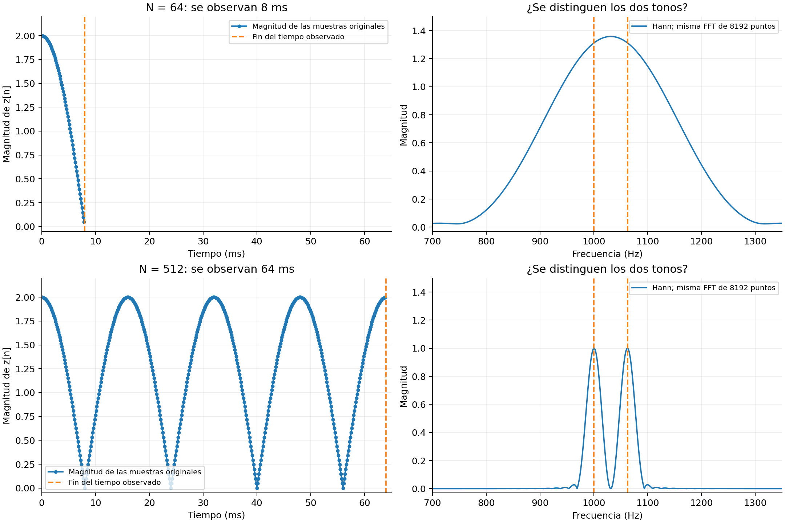

**Figura 19.** Aumentar el tiempo de observación estrecha los lóbulos y permite distinguir los dos tonos del ejemplo; aumentar solo los puntos de salida no produce ese efecto.

- **Panel superior izquierdo — bloque corto:** muestra $|z[n]|$ durante 8 ms, **antes** de aplicar la ventana. La zona sin puntos no significa que la señal haya terminado.
- **Panel inferior izquierdo — bloque largo:** observa la misma señal durante 64 ms. Aquí se adquirieron más muestras, no se añadieron ceros en lugar de datos.
- **Panel superior derecho — espectro del bloque corto:** presenta un máximo combinado alrededor de 1031 Hz. Su altura no es la amplitud individual de ninguno de los tonos: interviene la suma de sus contribuciones complejas.
- **Panel inferior derecho — espectro del bloque largo:** permite distinguir los tonos de 1000 y 1062.5 Hz. Las líneas naranjas indican sus frecuencias conocidas.
- **Qué se mantiene igual en los espectros:** la escala, la ventana Hann y la separación de puntos de FFT, $8000/8192\approx0.977$ Hz. Tener la misma rejilla de salida no garantiza la misma capacidad de separar tonos.
- **Qué cambia en el main lobe:** para un tono aislado con Hann, su ancho pasa de 500 Hz con 64 muestras a 62.5 Hz con 512. El cambio proviene de observar durante más tiempo, no del padding.
- **Límite del experimento:** ambos tonos son estables durante todo el bloque. Si la señal cambia rápidamente, un bloque largo mezcla en un mismo espectro lo ocurrido en distintos instantes; la duración no se aumenta sin límite.

#### 5.8. Experimento F: un tono débil junto a uno fuerte

La reducción de sidelobes tiene una consecuencia observable: una componente fuerte puede producir leakage que dificulte reconocer otra más débil.

Se utilizan 256 muestras a 8 kS/s, es decir, 32 ms de observación. La señal contiene:

$$
z[n]=e^{j2\pi\,1007.8125\,n/f_s}+0.01e^{j2\pi\,1203.125\,n/f_s}.
$$

La primera componente tiene magnitud 1 y la segunda, 0.01. La diferencia de magnitud es $20\log_{10}(0.01/1)=-40$ dB. No hay ruido añadido: cualquier contribución alejada del tono fuerte en su gráfica aislada procede del análisis del bloque.

En cada ventana se comparan dos casos: solo el tono fuerte y la suma del fuerte con el débil. Así se puede ver qué parte de la gráfica ya existía antes de añadir el tono débil.

**Qué se varía:** ventana rectangular frente a Hann y, dentro de cada panel, presencia o ausencia del tono débil. **Qué permanece fijo:** frecuencias, amplitudes, fases iniciales 0, sample rate, 256 muestras y FFT de 8192 puntos. **Qué se debe notar:** en la zona del tono débil, la contribución del tono fuerte es mayor con rectangular; Hann deja ver un máximo asociado a la componente débil de este ejemplo.

**Colab — Celda 7: distinguir el tono débil de los sidelobes del fuerte.**

```python
N_debil = 256
t_debil = np.arange(N_debil) / fs
f_fuerte = 1007.8125
f_debil = 1203.125
fuerte = np.exp(1j * 2 * np.pi * f_fuerte * t_debil)
debil = 0.01 * np.exp(1j * 2 * np.pi * f_debil * t_debil)
resultados_debil = {}
fig, axes = plt.subplots(2, 1, figsize=(11, 8), layout="constrained")
for ax, nombre, w in zip(axes, ["Rectangular", "Hann"], [np.ones(N_debil), hann_periodica(N_debil)]):
    f, C_fuerte = espectro_bloque(fuerte, fs, ventana=w, nfft=8192)
    _, C_ambos = espectro_bloque(fuerte + debil, fs, ventana=w, nfft=8192)
    resultados_debil[nombre] = (f, C_fuerte, C_ambos)
    indice_debil = np.argmin(np.abs(f - f_debil))
    print(f"{nombre}: solo fuerte en f_debil={magnitud_db(C_fuerte)[indice_debil]:.1f} dB; ambos={magnitud_db(C_ambos)[indice_debil]:.1f} dB")
    ax.plot(f, magnitud_db(C_fuerte), label="Solo el tono fuerte")
    ax.plot(f, magnitud_db(C_ambos), "--", label="Tono fuerte + tono débil")
    ax.axvline(f_debil, color="tab:gray", linestyle=":", label="Frecuencia conocida del tono débil")
    ax.set(title=f"Ventana {nombre}: mismos datos y misma escala", xlabel="Frecuencia (Hz)", ylabel="Magnitud (dB respecto a 1)", xlim=(900, 1350), ylim=(-85, 5))
    ax.grid(alpha=0.2)
    ax.legend(fontsize=8, loc="lower left")
plt.show()
```

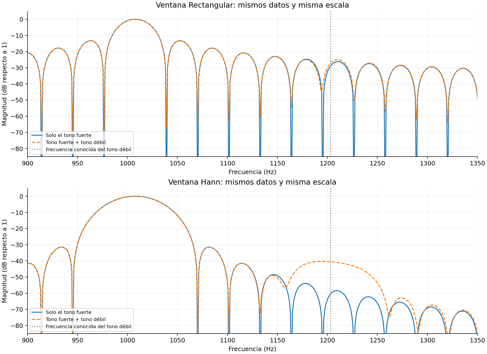

**Figura 20.** Los sidelobes de una componente fuerte pueden dificultar la lectura de otra débil; la ventana cambia esa interferencia de la representación espectral.

- **Curvas de ambos paneles:** la azul contiene solo el tono fuerte. La naranja discontinua añade el tono débil.
- **Panel superior — ventana rectangular:** en la frecuencia del tono débil, la curva azul ya alcanza aproximadamente −28.9 dB. Esa contribución supera los −40 dB del tono débil, por lo que la curva combinada no muestra allí un pico aislado fácil de interpretar.
- **Panel inferior — ventana Hann:** en esa misma frecuencia, la contribución del fuerte baja a aproximadamente −60.5 dB. La curva combinada presenta un máximo próximo a −40 dB, asociado al tono débil conocido.
- **Por qué no se obtiene exactamente −40 dB:** en la línea vertical, la curva combinada vale aproximadamente −40.6 dB. También interviene la contribución compleja restante del tono fuerte.
- **Condiciones del ejemplo:** se eligió una separación suficiente entre los tonos, no se añadió ruido y ambos son estables. El resultado no demuestra que Hann permita detectar cualquier señal débil.
- **Qué podría ocurrir con tonos más próximos:** el main lobe más ancho de Hann podría dificultar su separación. La figura muestra un compromiso de análisis, no una regla universal de detección.

#### 5.9. Experimento G: separar aliasing de spectral leakage

Ambos efectos pueden modificar lo que se observa, pero responden a preguntas distintas:

| Pregunta | Aliasing | Spectral leakage |
|---|---|---|
| ¿Qué lo origina? | Frecuencias distintas producen muestras indistinguibles a la tasa utilizada. | Se analiza un bloque finito con una ventana; el tono contribuye a una forma espectral extendida. |
| ¿Qué ilustra el ejemplo? | Un tono de +5 kHz tiene representante en −3 kHz a 8 kS/s. | Un tono de 1062.5 Hz contribuye a varios bins de una FFT rectangular de 64 puntos. |
| ¿Una FFT más larga con ceros lo elimina? | No recupera la frecuencia original. | No elimina la forma espectral del bloque; la evalúa en más puntos. |
| ¿Qué permite controlarlo? | Banda de entrada, filtrado previo y sample rate apropiados. | Tiempo de observación y elección de ventana, con sus compromisos. |

Un alias puede aparecer como un pico perfectamente limpio si coincide con un bin. Un tono sin aliasing puede presentar leakage por quedar entre bins. También pueden ocurrir ambos efectos a la vez.

**Qué se varía:** frecuencia del tono original, de +5 kHz a 1062.5 Hz. **Qué permanece fijo:** 64 muestras a 8 kS/s, magnitud 1, fase inicial 0, ventana rectangular y FFT sin padding. **Qué se debe notar:** un pico limpio no garantiza ausencia de aliasing; varios bins no demuestran que existan varios tonos originales.

**Colab — Celda 8: observar un alias limpio y un tono entre bins.**

```python
fig, axes = plt.subplots(2, 1, figsize=(11, 7), layout="constrained")
for ax, f0, titulo in zip(axes, [5000, 1062.5], ["Original: +5 kHz; representante: -3 kHz, alineado con un bin", "Original: 1062.5 Hz; entre bins, dentro de la banda centrada"]):
    z = np.exp(1j * 2 * np.pi * f0 * np.arange(64) / fs)
    f, C = espectro_bloque(z, fs)
    ax.stem(f, np.abs(C), basefmt=" ")
    ax.set(title=titulo, xlabel="Frecuencia representativa (Hz)", ylabel="Magnitud", xlim=(-4100, 4100), ylim=(-0.03, 1.15))
    ax.grid(alpha=0.2)
plt.show()
```

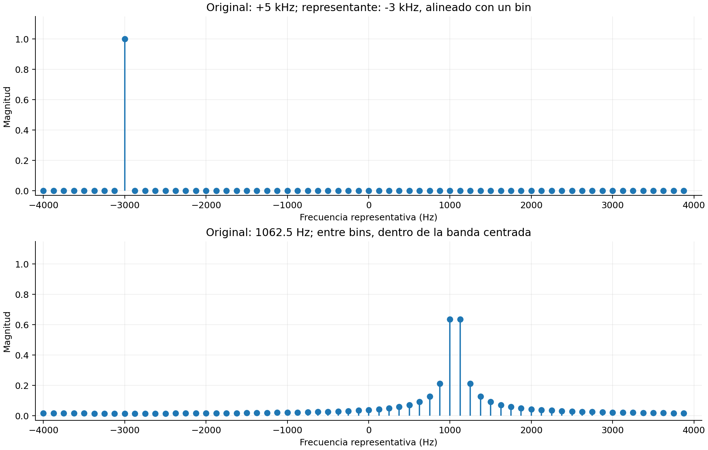

**Figura 21.** La limpieza de un pico y la presencia de contribuciones en varios bins no permiten, por sí solas, diagnosticar aliasing ni contar tonos originales.

- **Panel superior — aliasing con un pico limpio:** la señal continua generada tenía +5 kHz, pero el pico aparece en −3 kHz. La FFT de esas muestras no puede distinguirla de un tono original de −3 kHz.
- **Panel inferior — leakage de un solo tono:** la señal contiene únicamente un tono de 1062.5 Hz dentro del intervalo centrado. Que varios bins sean distintos de cero no significa que hubiera varios tonos originales.
- **Qué se conoce en la simulación:** las frecuencias originales se conocen porque las señales se generaron con fórmulas elegidas.
- **Qué requiere una captura desconocida:** información sobre la banda seleccionada, el sample rate y el procesamiento previo. La forma de una sola pantalla no basta para diagnosticar aliasing ni contar los tonos originales.

#### 5.10. Comprobaciones y guía para interpretar un espectro

Antes de interpretar una gráfica conviene identificar cuatro datos: **sample rate, número de muestras adquiridas, longitud de FFT y ventana**. Con ellos se puede calcular el tiempo observado, construir el eje y explicar parte de la forma de los picos.

??? example "Comprobación 1: duración y bins de una captura SDR"
    Un bloque de 4096 muestras I/Q a 2.4 MS/s representa $4096/2400000\approx1.707$ ms. Sin padding, sus bins están separados $2400000/4096=585.9375$ Hz. La Nyquist frequency es 1.2 MHz; no es el sample rate ni la separación entre bins.

??? example "Comprobación 2: un tono que no coincide con la rejilla"
    Con 64 muestras a 8 kS/s, los bins están separados 125 Hz. Un tono de 1100 Hz completa 8.8 ciclos en el bloque y no coincide con un bin. El bin más cercano está en 1125 Hz, pero eso no cambia la frecuencia original a 1125 Hz. El máximo de los bins es una lectura sobre una rejilla, no una medición exacta garantizada de la frecuencia del tono.

??? example "Comprobación 3: 1024 puntos a partir de 64 muestras"
    Añadir ceros hasta una FFT de 1024 puntos produce bins separados $8000/1024=7.8125$ Hz. El tiempo observado sigue siendo 8 ms, porque solo se adquirieron 64 muestras. Los puntos más juntos permiten leer mejor la forma del bloque, pero no equivalen a adquirir 1024 muestras durante 128 ms.

??? example "Comprobación 4: por qué una FFT con Hann no es el bloque original"
    La FFT recibe $x[n]w[n]$, no $x[n]$ sin modificar. Aplicar la inversa de la DFT sin normalización adicional recupera el bloque con ventana. No recupera automáticamente los datos originales; por eso se conservan aparte. La corrección de magnitud por la suma de pesos no deshace la multiplicación muestra por muestra.

??? example "Comprobación 5: escoger entre más datos y más ceros"
    Si dos tonos forman un máximo combinado, añadir ceros puede ayudar a ver su forma, pero no estrecha sus lóbulos. Adquirir un bloque más largo, si los tonos permanecen estables, sí puede estrecharlos. Además deben considerarse la ventana, la diferencia de amplitudes y el ruido; no existe una garantía basada únicamente en la cantidad de bins.

Una secuencia práctica de lectura es:

1. Confirmar que $f_s$ es la tasa de esa etapa y que el eje corresponde a ella.
2. Calcular $T_{\mathrm{obs}}=N/f_s$ usando las muestras adquiridas, no los ceros añadidos.
3. Calcular la separación de los puntos de salida, $f_s/M$, y comprobar si hubo padding.
4. Identificar la ventana y la escala: magnitud lineal, dB relativos, potencia o PSD no son etiquetas intercambiables.
5. Interpretar los lóbulos y no contar cada bin como una señal diferente.
6. Revisar la banda y el filtrado previo antes de descartar aliasing.

Esta subsección se concentra en magnitud de tonos y utiliza señales sintéticas sin ruido añadido. No implementa PSD, promediado de espectros ni calibración de potencia del receptor. Esos temas requieren otras normalizaciones y no se deducen de convertir una FFT a dB.

La FFT describe el bloque que se le entrega. El sample rate determina su eje; el tiempo observado y la ventana afectan la forma y separación de los componentes; el padding cambia cuántos puntos se dibujan. Con esas distinciones, la siguiente subsección relacionará las frecuencias representativas en baseband con las frecuencias RF de una captura SDR.

#### 5.11. Ejercicios de refuerzo

##### Ejercicio 5A — separar datos adquiridos y puntos de FFT

Un bloque contiene $N=960$ muestras a $f_s=48000$ S/s. Se compara una FFT de $M=960$ puntos con otra de $M=3840$, completada con ceros.

- Calcular la duración observada, los ceros añadidos y la separación entre bins en ambos casos.
- Indicar si la segunda FFT representa una observación de 80 ms y cuál es la Nyquist frequency.

??? example "Solución del ejercicio 5A"

    - **Tiempo observado:** $N/f_s=960/48000=20$ ms en ambos casos.
    - **Ceros añadidos:** $3840-960=2880$. No son muestras adquiridas durante otros instantes.
    - **Separación de salida:** $48000/960=50$ Hz sin padding y $48000/3840=12.5$ Hz con padding.
    - **Interpretación de los 80 ms:** $3840/48000=80$ ms es la duración que tendrían 3840 muestras adquiridas a esa tasa, pero aquí solo se adquirieron 960. No es el tiempo observado.
    - **Nyquist frequency:** $f_s/2=24000$ Hz. No es ninguna de las dos separaciones entre bins.

##### Ejercicio 5B — distinguir un tono alineado de otro entre bins

Se analizan por separado tonos complejos de magnitud 1 y fase inicial cero, con frecuencias 1125 y 1100 Hz, usando 64 muestras a 8 kS/s, ventana rectangular y FFT sin padding.

- Calcular los ciclos de cada tono dentro del bloque y determinar cuál coincide con un bin.
- Explicar si un máximo de la FFT de 1100 Hz cerca de 1125 Hz significa que cambió la frecuencia original.

??? example "Solución del ejercicio 5B"

    - **Rejilla:** la separación es $8000/64=125$ Hz.
    - **Tono de 1125 Hz:** completa $1125(64/8000)=9$ ciclos. Coincide con el bin de 1125 Hz y, en este ejemplo ideal, muestra magnitud 1 allí y ceros numéricos en los demás.
    - **Tono de 1100 Hz:** completa $1100(64/8000)=8.8$ ciclos y queda entre los bins de 1000 y 1125 Hz. Contribuye a varios bins por spectral leakage.
    - **Frecuencia original:** sigue siendo 1100 Hz. Los bins son puntos donde se evalúa la transformada; el bin de mayor magnitud no redefine la frecuencia con la que se generó la señal.

##### Ejercicio 5C — elegir una modificación de análisis con un propósito

Se retoman los paneles de la Figura 30.

- Indicar qué modificación permite dibujar más puntos del mismo bloque, cuál reduce sidelobes y cuál permitió distinguir los dos tonos estables del panel D.
- Explicar por qué ninguna de esas decisiones constituye una mejora universal para toda señal.

??? example "Solución del ejercicio 5C"

    - **Más puntos:** el padding del panel B densifica la rejilla y conserva el tiempo observado. No estrecha por sí solo el main lobe.
    - **Sidelobes menores:** Hann, en el panel C, reduce los sidelobes respecto a rectangular, pero ensancha el main lobe. El compromiso importa al buscar una señal débil o separar componentes próximas.
    - **Dos tonos separados:** el panel D utiliza más muestras adquiridas, de 64 a 512, y aumenta la observación de 8 a 64 ms. Las dos curvas mantienen la misma longitud de FFT; la diferencia no proviene de más puntos de salida.
    - **Límites:** una ventana no es siempre la mejor y una observación más larga puede mezclar cambios temporales. La elección depende de lo que se necesita observar, las amplitudes, el ruido y la estabilidad de la señal.

##### Ejercicio 5D — recuperar el bloque que recibió la transformada

Se conservan las muestras originales $x[n]$ y se calcula $X_w[k]=\operatorname{DFT}\{x[n]w[n]\}$ con Hann, sin normalización adicional ni reordenamiento.

- Indicar qué recupera la inversa de $X_w[k]$.
- Explicar si guardar solo $|X_w[k]|$ basta para recuperar ese mismo bloque y si corregir la escala de magnitud deshace la ventana.

??? example "Solución del ejercicio 5D"

    - **Inversa completa:** recupera $x[n]w[n]$, porque ese fue el bloque entregado a la DFT. No recupera automáticamente $x[n]$ sin ventana.
    - **Solo magnitudes:** no conservan las fases de los coeficientes. En general, su inversa no reconstruye ni siquiera el mismo bloque con ventana.
    - **Corrección de escala:** dividir por la suma de pesos permite una determinada lectura de magnitudes de tonos, pero no deshace la multiplicación muestra por muestra.
    - **Datos originales:** se mantienen aparte para otros análisis. Cambiar ventana o representación no debe confundirse con haber conservado una copia inalterada de la entrada.

### 6. De baseband a RF: interpretar una captura SDR

Hasta aquí se generaron tonos con frecuencias como +1 kHz o −3 kHz. En una captura SDR, esas frecuencias son **relativas a una referencia RF**, no necesariamente las frecuencias de los transmisores en la antena.

La pregunta de esta subsección es: **si una componente aparece a la izquierda o a la derecha del cero de baseband, ¿a qué frecuencia RF corresponde y cómo puede trasladarse al cero?**

El desarrollo empieza con tonos conocidos y termina leyendo un bloque de la grabación de la sesión 1. No se diseña todavía un filtro ni se recupera el audio de una emisora.

#### 6.1. La frecuencia central es la referencia, no el sample rate

Se distinguen tres frecuencias:

- **$f_c$, frecuencia central:** referencia RF de la captura. En la grabación oficial es 99.1 MHz.
- **$f_s$, sample rate:** tasa de las muestras complejas. En esa grabación es 2.4 MS/s.
- **$f_{\mathrm{BB}}$, frecuencia en baseband:** desplazamiento de una componente respecto a $f_c$. Puede ser positivo, negativo o cero.

Con la convención I/Q utilizada en esta sesión, las relaciones son:

$$
f_{\mathrm{BB}}=f_{\mathrm{RF}}-f_c,
\qquad
f_{\mathrm{RF}}=f_c+f_{\mathrm{BB}}.
$$

Esta interpretación supone una banda correctamente seleccionada, sin componentes aliased que se confundan con ella, y una captura sin inversión del espectro. La referencia es la frecuencia central documentada para la grabación; los errores de sintonía y calibración del receptor no se estudian aquí. El [tutorial I/Q de GNU Radio](https://wiki.gnuradio.org/index.php/IQ_Complex_Tutorial) explica la representación compleja equivalente en baseband.

Por ejemplo, si $f_c=99.1$ MHz:

| Frecuencia RF | Cálculo del desplazamiento | Frecuencia en baseband | Posición respecto al cero |
|---|---|---|---|
| 98.5 MHz | $98.5-99.1=-0.6$ MHz | −600 kHz | A la izquierda |
| 99.1 MHz | $99.1-99.1=0$ | 0 Hz | En el centro |
| 99.5 MHz | $99.5-99.1=+0.4$ MHz | +400 kHz | A la derecha |

La frecuencia negativa de la primera fila **no es una RF física negativa**. Indica que 98.5 MHz está por debajo de la referencia de 99.1 MHz.

¿Por qué no se genera una senoide de 99.5 MHz usando directamente $f_s=2.4$ MS/s? Porque las muestras que entrega esta etapa del receptor ya representan la banda convertida a baseband. El tono que corresponde a 99.5 MHz se modela con su desplazamiento de +400 kHz:

$$
x[n]=A e^{j(2\pi\,400000\,n/2400000+\phi)}.
$$

El receptor realiza la conversión y selecciona la banda antes de entregar estas muestras. No se está afirmando que la antena se muestree directamente a 2.4 MS/s ni que una FFT por sí sola pueda descubrir $f_c$.

Para el intervalo centrado utilizado en la sesión:

$$
-\frac{f_s}{2}\leq f_{\mathrm{BB}}<\frac{f_s}{2}
\quad\Longrightarrow\quad
f_c-\frac{f_s}{2}\leq f_{\mathrm{RF}}<f_c+\frac{f_s}{2}.
$$

Con los datos de la grabación, el intervalo nominal es $[-1.2,+1.2)$ MHz en baseband y $[97.9,100.3)$ MHz en RF. **Es un intervalo de representación:** no garantiza una respuesta plana ni que toda su anchura sea utilizable en un receptor real.

#### 6.2. Experimento A: el mismo espectro con dos ejes

Se generan tres tonos complejos para representar las tres posiciones de la tabla. Son señales sintéticas: **no son mediciones de emisoras reales ni una simulación de su modulación FM**.

- **Qué se varía:** el eje horizontal, entre frecuencia relativa y frecuencia RF.
- **Qué permanece fijo:** las muestras, la FFT y sus magnitudes; $f_s=2.4$ MS/s, $N=2400$ y $f_c=99.1$ MHz.
- **Qué se debe notar:** cambiar el eje no cambia los coeficientes ni las muestras.

Las celdas de esta subsección se ejecutan en orden y no necesitan las variables de las anteriores.

**Colab — Celda 1: preparar las señales y el visor.**

```python
import numpy as np
import matplotlib.pyplot as plt
from pathlib import Path

fs = 2.4e6
fc = 99.1e6
N = 2400
n = np.arange(N)
t = n / fs
frecuencias_bb = np.array([-600e3, 0, 400e3])
amplitudes = np.array([0.6, 0.4, 1.0])
x = sum(A * np.exp(1j * 2 * np.pi * f0 * t) for A, f0 in zip(amplitudes, frecuencias_bb))

def espectro_iq(z, sample_rate, ventana=None):
    w = np.ones(len(z)) if ventana is None else np.asarray(ventana)
    if len(w) != len(z) or np.sum(w) == 0:
        raise ValueError("La ventana debe tener un peso por muestra y suma no nula")
    f = np.fft.fftshift(np.fft.fftfreq(len(z), d=1 / sample_rate))
    C = np.fft.fftshift(np.fft.fft(z * w)) / np.sum(w)
    return f, C

def dibujar_tonos(ax, f, C, escala=1000, referencia=0):
    presentes = np.abs(C) > 1e-10
    ax.stem((referencia + f[presentes]) / escala, np.abs(C[presentes]), basefmt=" ")
    ax.grid(alpha=0.2)

f_bb, C_entrada = espectro_iq(x, fs)
print("Duración del bloque (ms):", N / fs * 1000)
print("Separación entre bins (Hz):", fs / N)
print("Frecuencias RF de los tonos (MHz):", (fc + frecuencias_bb) / 1e6)
```

La función `dibujar_tonos` omite únicamente los residuos numéricos menores que $10^{-10}$ de estos tonos alineados con bins. Ese umbral **no se propone como detector de señales en una captura real**. En el ejemplo con la grabación se dibujarán todos los bins.

**Colab — Celda 2: cambiar el eje sin cambiar las muestras.**

```python
fig, axes = plt.subplots(1, 2, figsize=(12, 4.5), layout="constrained")
dibujar_tonos(axes[0], f_bb, C_entrada)
axes[0].axvline(0, color="tab:gray", linestyle="--")
axes[0].set(title="Frecuencias relativas a 99.1 MHz", xlabel="Frecuencia en baseband (kHz)", ylabel="Magnitud", xlim=(-1200, 1200), ylim=(-0.03, 1.2), xticks=[-1200, -600, 0, 400, 1200])
dibujar_tonos(axes[1], f_bb, C_entrada, escala=1e6, referencia=fc)
axes[1].axvline(fc / 1e6, color="tab:gray", linestyle="--")
axes[1].set(title="Los mismos coeficientes con etiquetas RF", xlabel="Frecuencia RF (MHz)", ylabel="Magnitud", xlim=(97.9, 100.3), ylim=(-0.03, 1.2), xticks=[97.9, 98.5, 99.1, 99.5, 100.3])
plt.show()
```

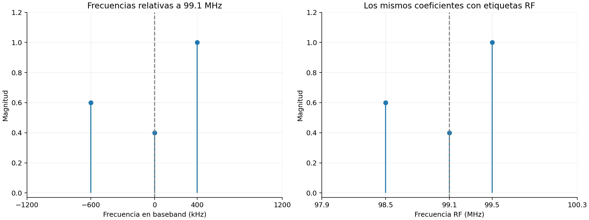

**Figura 22.** Una misma FFT puede leerse en frecuencia relativa o en RF si se conoce la referencia de la captura.

- **Panel izquierdo — baseband:** los tonos aparecen en −600, 0 y +400 kHz. La línea discontinua marca el cero relativo.
- **Panel derecho — RF:** aparecen en 98.5, 99.1 y 99.5 MHz. La línea discontinua marca la referencia de 99.1 MHz.
- **Correspondencia entre paneles:** el tono de −600 kHz no cambió de frecuencia física; su etiqueta RF es $99.1-0.6=98.5$ MHz. Lo mismo ocurre con los otros dos.
- **Magnitudes:** permanecen en 0.6, 0.4 y 1. Se dibujan los mismos coeficientes, sin calcular otra FFT.
- **Bordes del eje:** marcan el intervalo nominal. Para este bloque par, el último bin queda ligeramente antes del extremo derecho, que no se incluye como un bin adicional.

#### 6.3. Experimento B: trasladar una componente al cero mediante mezcla compleja

Ahora se desea que el tono de +400 kHz quede en 0 Hz. No basta con escribir otra etiqueta: se deben transformar las muestras.

La **mezcla compleja** consiste en multiplicar cada muestra por un tono complejo. Se define $f_{\mathrm{mix}}$ como la frecuencia del tono multiplicador:

$$
y[n]=x[n]e^{j2\pi f_{\mathrm{mix}}n/f_s}.
$$

Para comprobar el resultado, primero se considera una sola componente de la entrada:

$$
x_0[n]=A e^{j(2\pi f_0 n/f_s+\phi)}.
$$

Al multiplicar, los exponentes se suman:

$$
\begin{aligned}
y_0[n]
&=A e^{j(2\pi f_0 n/f_s+\phi)}e^{j2\pi f_{\mathrm{mix}}n/f_s}\\
&=A e^{j[2\pi(f_0+f_{\mathrm{mix}})n/f_s+\phi]}.
\end{aligned}
$$

Por tanto, la frecuencia de salida es $f_0+f_{\mathrm{mix}}$, interpretada módulo $f_s$ si cruza el borde del intervalo. Para centrar $f_0=+400$ kHz se elige **$f_{\mathrm{mix}}=-400$ kHz**.

- **Multiplicador con frecuencia negativa:** desplaza hacia frecuencias menores, a la izquierda.
- **Multiplicador con frecuencia positiva:** desplaza hacia frecuencias mayores, a la derecha.
- **Para centrar una componente:** se utiliza la frecuencia opuesta a su desplazamiento actual.

La operación afecta a **toda la entrada**, no solo al tono elegido:

| Componente | Antes de la mezcla | Frecuencia del multiplicador | Después de la mezcla |
|---|---:|---:|---:|
| A | −600 kHz | −400 kHz | −1000 kHz |
| B | 0 kHz | −400 kHz | −400 kHz |
| C, objetivo | +400 kHz | −400 kHz | 0 kHz |

En este ejemplo ninguna componente cruza los bordes de ±1.2 MHz. El multiplicador tiene magnitud 1; por ello $|y[n]|=|x[n]|$ muestra por muestra, aunque cambien I, Q y la evolución de fase. **Conservar la magnitud no significa conservar la secuencia compleja.**

- **Qué se varía:** las muestras, al multiplicarlas por un tono de −400 kHz.
- **Qué permanece fijo:** sample rate, cantidad de muestras, duración y magnitud del multiplicador.
- **Qué se debe notar:** todos los tonos se desplazan −400 kHz; el objetivo deja de girar respecto al nuevo cero.

**Colab — Celda 3: mezclar y comprobar el signo.**

```python
f_objetivo = 400e3
f_mix = -f_objetivo
oscilador = np.exp(1j * 2 * np.pi * f_mix * t)
y = x * oscilador
f_salida, C_salida = espectro_iq(y, fs)
objetivo = np.exp(1j * 2 * np.pi * f_objetivo * t)
objetivo_centrado = objetivo * oscilador
print("Misma magnitud por muestra:", np.allclose(np.abs(y), np.abs(x)))
print("Muestras complejas iguales:", np.allclose(y, x))
print("Objetivo convertido en 1+j0:", np.allclose(objetivo_centrado, 1))

fig, axes = plt.subplots(2, 2, figsize=(12, 8), layout="constrained")
dibujar_tonos(axes[0, 0], f_bb, C_entrada)
axes[0, 0].set(title="Entrada: los tres tonos", xlabel="Frecuencia en baseband (kHz)", ylabel="Magnitud", xlim=(-1200, 1200), ylim=(-0.03, 1.2), xticks=[-1000, -600, -400, 0, 400, 1000])
dibujar_tonos(axes[0, 1], f_salida, C_salida)
axes[0, 1].set(title="Salida: desplazamiento de -400 kHz", xlabel="Frecuencia en baseband (kHz)", ylabel="Magnitud", xlim=(-1200, 1200), ylim=(-0.03, 1.2), xticks=[-1000, -600, -400, 0, 400, 1000])
axes[1, 0].plot(t[:37] * 1e6, objetivo[:37].real, ".-", label="I del objetivo")
axes[1, 0].plot(t[:37] * 1e6, objetivo[:37].imag, ".-", label="Q del objetivo")
axes[1, 0].set(title="Solo el objetivo antes de la mezcla", xlabel="Tiempo (µs)", ylabel="Valor", ylim=(-1.2, 1.2))
axes[1, 1].plot(t[:37] * 1e6, objetivo_centrado[:37].real, ".-", label="I del objetivo centrado")
axes[1, 1].plot(t[:37] * 1e6, objetivo_centrado[:37].imag, ".-", label="Q del objetivo centrado")
axes[1, 1].set(title="Solo el objetivo después: I = 1, Q = 0", xlabel="Tiempo (µs)", ylabel="Valor", ylim=(-1.2, 1.2))
for ax in axes.flat:
    ax.grid(alpha=0.2)
for ax in axes[0]:
    ax.axvline(0, color="tab:gray", linestyle="--")
for ax in axes[1]:
    ax.legend(fontsize=8)
plt.show()
```

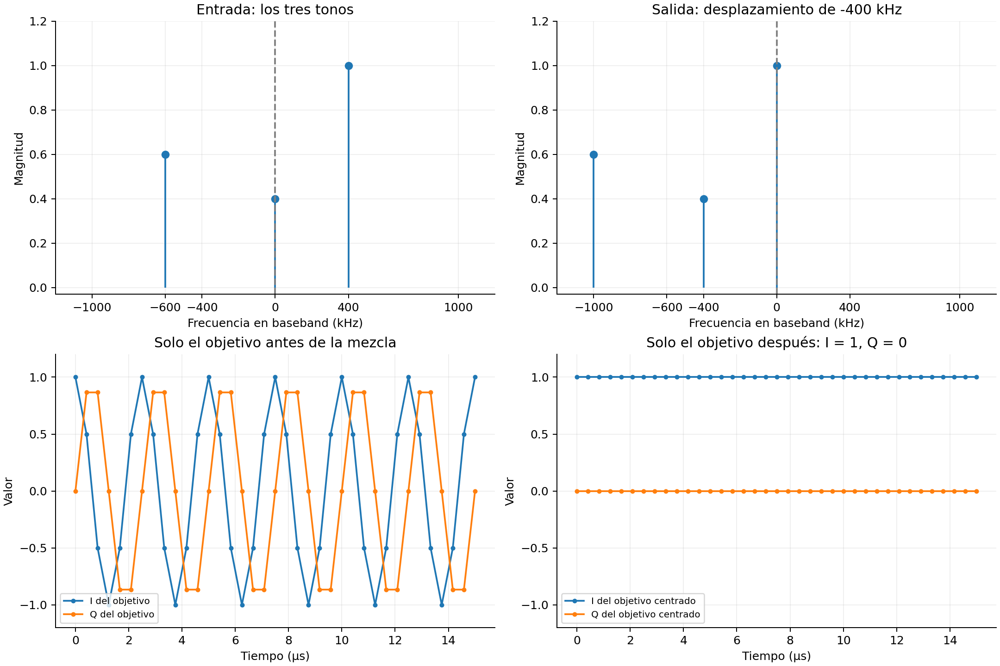

**Figura 23.** La mezcla compleja desplaza todos los tonos y convierte el tono objetivo ideal en una constante cuando cancela exactamente su frecuencia.

- **Panel superior izquierdo — espectro de entrada:** se observan los tonos de −600, 0 y +400 kHz.
- **Panel superior derecho — espectro de salida:** aparecen en −1000, −400 y 0 kHz. El desplazamiento es hacia la izquierda, de −400 kHz para todos.
- **Panel inferior izquierdo — objetivo aislado:** I y Q oscilan porque el tono tiene frecuencia relativa de +400 kHz.
- **Panel inferior derecho — objetivo centrado:** I queda en 1 y Q en 0, porque se canceló el avance de fase y la fase inicial era cero. **Solo se grafica el objetivo aislado**, no la suma completa de los tres tonos.
- **Otra fase inicial:** un tono centrado con fase $\phi$ sería la constante $A e^{j\phi}$; no necesariamente tendría Q igual a cero.
- **Una señal modulada:** centrarla no la convierte en una constante. Se elimina el desplazamiento de su centro, pero permanece la variación que transporta información.
- **Qué no hizo la mezcla:** no eliminó los otros tonos ni cambió la tasa. Centrar no equivale a filtrar, decimar ni demodular.

El [bloque Rotator de GNU Radio](https://wiki.gnuradio.org/index.php/Rotator) implementa una rotación equivalente a multiplicar por un tono complejo. Su incremento de fase se expresa en radianes por muestra: $\Delta\phi_{\mathrm{mix}}=2\pi f_{\mathrm{mix}}/f_s$. Aquí se usa NumPy para observar la operación sin construir todavía un flowgraph.

#### 6.4. Experimento C: reetiquetar el visor no es volver a sintonizar

Después de centrar el objetivo, el nuevo cero representa 99.5 MHz para las componentes del ejemplo. La nueva referencia es:

$$
f_c'=f_c-f_{\mathrm{mix}}=99.1\text{ MHz}-(-0.4\text{ MHz})=99.5\text{ MHz}.
$$

Para una componente que no cruza los bordes, se comprueba que la frecuencia RF sigue siendo la misma:

$$
\underbrace{f_c'+f_{\mathrm{salida}}}_{\text{RF después}}
=(f_c-f_{\mathrm{mix}})+(f_{\mathrm{BB}}+f_{\mathrm{mix}})
=\underbrace{f_c+f_{\mathrm{BB}}}_{\text{RF antes}}.
$$

Hay dos operaciones distintas:

- **Reetiquetar sin mezclar:** se cambia el número que se suma al eje, pero se conservan las muestras. Si se coloca 99.5 MHz como referencia de la entrada original, sus etiquetas RF dejan de corresponder a la captura.
- **Mezclar y actualizar la referencia:** se trasladan las muestras −400 kHz y se usa 99.5 MHz como nueva referencia. Las componentes del ejemplo conservan sus etiquetas RF correctas, pero el objetivo queda en el nuevo cero de baseband.

- **Qué se varía:** la combinación de muestras de entrada o salida y referencia del eje.
- **Qué permanece fijo:** el sample rate y las frecuencias RF originales de los tonos del experimento.
- **Qué se debe notar:** una etiqueta incorrecta puede mover el dibujo sin haber trasladado la señal respecto al cero.

**Colab — Celda 4: comparar una etiqueta falsa con una mezcla real.**

```python
fc_nuevo = fc - f_mix
casos_eje = [
    (f_bb, C_entrada, fc, "Entrada original: referencia correcta de 99.1 MHz"),
    (f_bb, C_entrada, fc_nuevo, "Sin mezcla: etiquetas incorrectas al escribir 99.5 MHz"),
    (f_salida, C_salida, fc_nuevo, "Con mezcla: nueva referencia correcta de 99.5 MHz"),
]
fig, axes = plt.subplots(3, 1, figsize=(11, 9), layout="constrained")
for ax, (f, C, referencia, titulo) in zip(axes, casos_eje):
    dibujar_tonos(ax, f, C, escala=1e6, referencia=referencia)
    ax.axvline(referencia / 1e6, color="tab:orange", linestyle="--", label="Etiqueta RF del cero de baseband")
    ax.set(title=titulo, xlabel="Etiqueta RF (MHz)", ylabel="Magnitud", xlim=(97.9, 100.7), ylim=(-0.03, 1.2), xticks=[98.5, 98.9, 99.1, 99.5, 99.9])
    ax.legend(fontsize=8, loc="upper left")
print("RF original (MHz):", (fc + frecuencias_bb) / 1e6)
print("RF después de mezclar (MHz):", (fc_nuevo + frecuencias_bb + f_mix) / 1e6)
plt.show()
```

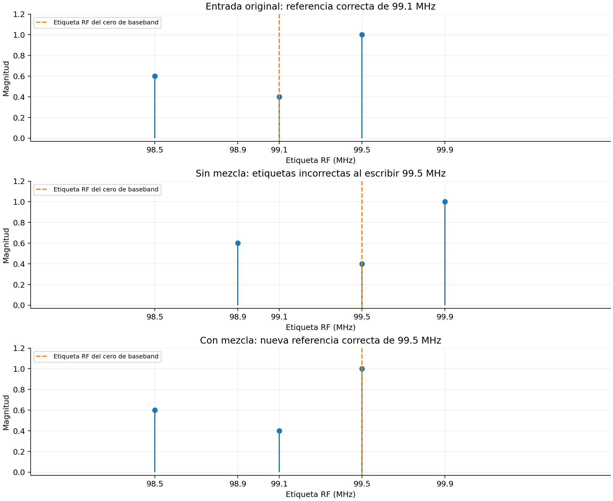

**Figura 24.** Cambiar las etiquetas sin transformar las muestras puede producir una interpretación RF falsa; la mezcla y la referencia deben ser coherentes.

- **Panel superior — entrada correcta:** los tonos tienen etiquetas 98.5, 99.1 y 99.5 MHz. El cero de baseband está etiquetado como 99.1 MHz.
- **Panel central — referencia falsa:** los mismos coeficientes se dibujan en 98.9, 99.5 y 99.9 MHz. Nada se mezcló; solo se sumó una referencia incorrecta al eje.
- **Panel inferior — mezcla y referencia correctas:** se recuperan las etiquetas 98.5, 99.1 y 99.5 MHz, pero ahora el cero de baseband corresponde al objetivo de 99.5 MHz.
- **Comparación superior e inferior:** las frecuencias RF coinciden porque los transmisores representados no cambiaron. Lo que cambió es la referencia respecto a la cual giran las muestras.
- **Escala horizontal común:** facilita comparar las etiquetas; las zonas sin tallos no significan que se haya adquirido una banda RF nueva.
- **Límite de esta equivalencia RF:** las tres componentes no cruzaron el borde. No se debe interpretar todo el intervalo posterior como una nueva captura continua alrededor de 99.5 MHz; la mezcla digital no obtiene lo que quedó fuera de la adquisición original.

En el [QT GUI Frequency Sink](https://wiki.gnuradio.org/index.php/QT_GUI_Frequency_Sink), **Center Frequency** se utiliza para las etiquetas del eje. Cambiar ese parámetro, por sí solo, no mezcla las muestras ni cambia la sintonía del hardware. Una conexión de control que envíe órdenes a un receptor sería una acción adicional, no el efecto de reetiquetar el visor.

| Acción | ¿Cambia las muestras? | ¿Qué cambia? |
|---|---|---|
| Cambiar Center Frequency del visor, sin control del receptor | No | Las etiquetas del eje |
| Multiplicar por un tono complejo | Sí | La referencia frecuencial de las muestras ya adquiridas |
| Volver a sintonizar el receptor y adquirir | Sí, se obtienen otras muestras | La banda RF observada por el equipo |

#### 6.5. Experimento D: por qué se usa un multiplicador complejo

Puede parecer equivalente multiplicar por un coseno de 400 kHz. Sin embargo, en la subsección 2 se comprobó que un coseno real contiene dos tonos complejos:

$$
\cos(2\pi f_m n/f_s)=\frac{1}{2}e^{j2\pi f_m n/f_s}+\frac{1}{2}e^{-j2\pi f_m n/f_s}.
$$

Por ello, al multiplicar el objetivo de +400 kHz por un coseno de 400 kHz se obtienen **dos componentes**:

$$
e^{j2\pi\,400000\,n/f_s}\cos(2\pi\,400000\,n/f_s)
=\frac{1}{2}e^{j2\pi\,800000\,n/f_s}+\frac{1}{2}.
$$

- **Multiplicador complejo de −400 kHz:** produce una sola traslación y lleva el tono a 0 Hz, con magnitud 1.
- **Coseno real de 400 kHz:** produce dos copias desplazadas, en 0 y +800 kHz, con magnitud 0.5 cada una.
- **Para una entrada con varios tonos:** cada componente participa en ambas copias; si se superponen, sus contribuciones complejas se suman.

Esto compara dos operaciones **sobre una entrada I/Q compleja**. No pretende describir ni descartar las arquitecturas analógicas que utilizan mezcladores reales y filtrado.

- **Qué se varía:** el multiplicador, entre tono complejo y coseno real.
- **Qué permanece fijo:** el objetivo aislado de +400 kHz, el bloque y el sample rate.
- **Qué se debe notar:** un coseno no hace la misma operación que una exponencial compleja.

**Colab — Celda 5: comparar los dos multiplicadores.**

```python
salida_compleja = objetivo * np.exp(-1j * 2 * np.pi * f_objetivo * t)
salida_coseno = objetivo * np.cos(2 * np.pi * f_objetivo * t)
f_compleja, C_compleja = espectro_iq(salida_compleja, fs)
f_coseno, C_coseno = espectro_iq(salida_coseno, fs)
fig, axes = plt.subplots(2, 1, figsize=(11, 7), layout="constrained")
for ax, f, C, titulo in [(axes[0], f_compleja, C_compleja, "Multiplicador complejo: una componente en 0 Hz"), (axes[1], f_coseno, C_coseno, "Coseno real: componentes en 0 y +800 kHz")]:
    dibujar_tonos(ax, f, C)
    ax.set(title=titulo, xlabel="Frecuencia en baseband (kHz)", ylabel="Magnitud", xlim=(-1200, 1200), ylim=(-0.03, 1.2), xticks=[-1200, -800, -400, 0, 400, 800, 1200])
plt.show()
```

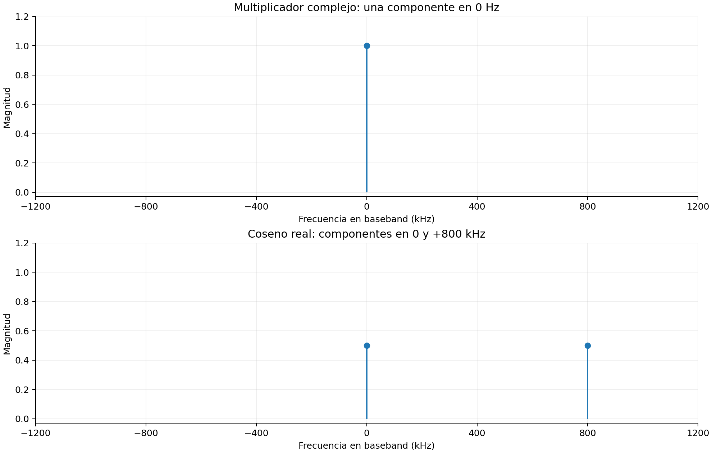

**Figura 25.** Un multiplicador complejo traslada una vez el espectro; un coseno real genera dos copias desplazadas.

- **Panel superior — multiplicador complejo:** el objetivo queda en 0 Hz con magnitud 1.
- **Panel inferior — coseno real:** aparece una componente en 0 Hz y otra en +800 kHz, ambas de magnitud 0.5.
- **Origen de las dos componentes:** el coseno aporta frecuencias de +400 y −400 kHz. Al sumarlas a los +400 kHz de la entrada, se obtienen +800 y 0 kHz.
- **Qué se debe concluir:** para la traslación única buscada en estos ejemplos I/Q, se utiliza un tono complejo. Multiplicar por un coseno no es un reemplazo equivalente.

#### 6.6. Experimento E: la traslación digital también respeta la periodicidad

Se retoma una tasa pequeña para leer los números con facilidad: $f_s=8000$ S/s. Un tono de +3 kHz se multiplica por otro de +2 kHz. La suma es +5 kHz, pero su representante en $[-4,+4)$ kHz es −3 kHz:

$$
f_{\mathrm{salida}}=3000+2000=5000\text{ Hz},
\qquad
f_{\mathrm{rep}}=5000-8000=-3000\text{ Hz}.
$$

La componente sale por el borde derecho y aparece por el izquierdo al presentar un solo intervalo. No se dibuja una banda ilimitada alrededor del cero: el espectro discreto es periódico, como se estudió en la subsección 4.

Aquí conviene distinguir dos situaciones:

- **Aliasing de una adquisición:** dos frecuencias continuas diferentes pueden haber producido las mismas muestras. Las muestras no permiten decidir cuál fue la original sin información adicional.
- **Traslación de una secuencia conocida:** multiplicar por un tono complejo de magnitud 1 es reversible. Se recupera la secuencia de entrada multiplicando por el tono opuesto; la aparición al otro lado del eje no implica que se hayan descartado muestras.

La reversibilidad de la mezcla **no recupera información que ya se perdió al adquirir**. Tampoco autoriza a interpretar una componente que reaparece por el borde como una nueva RF que el receptor nunca observó.

- **Qué se varía:** se añade un desplazamiento digital de +2 kHz.
- **Qué permanece fijo:** las 64 muestras, la tasa de 8 kS/s y la magnitud 1.
- **Qué se debe notar:** la salida aparece en −3 kHz, pero la mezcla inversa recupera la entrada.

**Colab — Celda 6: observar el cruce del borde y deshacer la mezcla.**

```python
fs_borde = 8000
n_borde = np.arange(64)
entrada_borde = np.exp(1j * 2 * np.pi * 3000 * n_borde / fs_borde)
osc_borde = np.exp(1j * 2 * np.pi * 2000 * n_borde / fs_borde)
salida_borde = entrada_borde * osc_borde
recuperada = salida_borde * np.conj(osc_borde)
print("Se recupera la secuencia original:", np.allclose(recuperada, entrada_borde))
fig, axes = plt.subplots(2, 1, figsize=(11, 7), layout="constrained")
for ax, z, titulo in [(axes[0], entrada_borde, "Entrada: +3 kHz"), (axes[1], salida_borde, "Tras mezclar con +2 kHz: +5 kHz es equivalente a -3 kHz")]:
    f, C = espectro_iq(z, fs_borde)
    dibujar_tonos(ax, f, C)
    ax.axvline(-4, color="tab:gray", linestyle="--")
    ax.axvline(4, color="tab:gray", linestyle="--")
    ax.set(title=titulo, xlabel="Frecuencia representativa (kHz)", ylabel="Magnitud", xlim=(-4.3, 4.3), ylim=(-0.03, 1.2), xticks=np.arange(-4, 5))
plt.show()
```

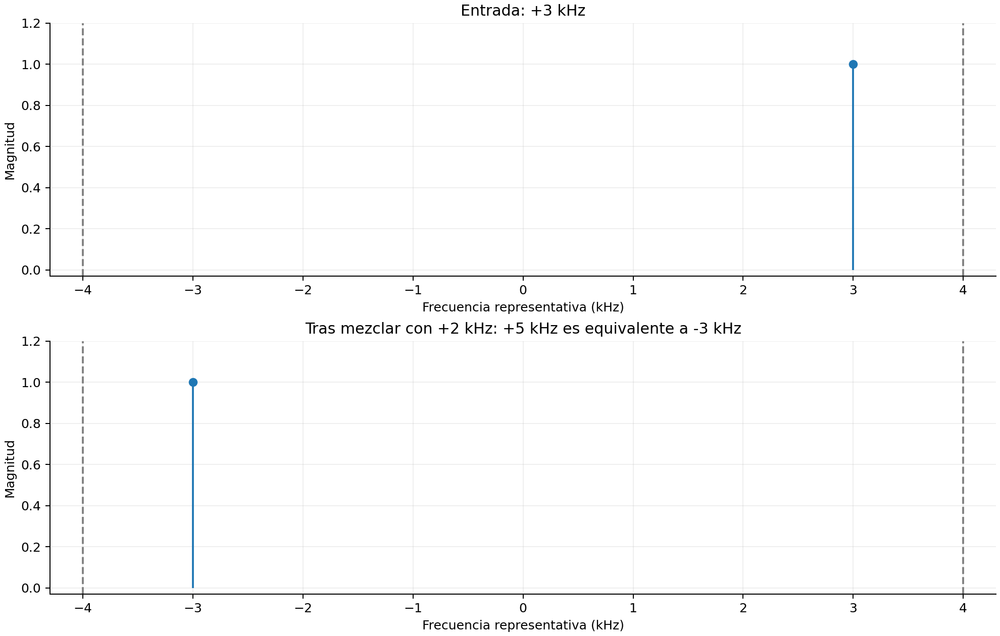

**Figura 26.** Al cruzar el borde del intervalo, una traslación digital reaparece por el otro extremo; la mezcla inversa recupera la secuencia de entrada.

- **Panel superior — antes de mezclar:** el pico está en +3 kHz, dentro del intervalo de la tasa de 8 kS/s.
- **Panel inferior — después de mezclar:** el pico aparece en −3 kHz. Es el representante de $3+2=5$ kHz, no el resultado de restar 6 kHz a la entrada.
- **Líneas verticales:** marcan −4 y +4 kHz. El borde derecho no añade una frecuencia independiente del izquierdo.
- **Resultado de la mezcla inversa:** `np.allclose` devuelve `True` al comparar la secuencia recuperada con la original. En este experimento no se aplicó un filtro ni se descartaron muestras.
- **Límite de la interpretación RF:** una etiqueta RF continua requiere seguir la referencia y los cruces del borde. No basta con sumar una nueva frecuencia central a toda la salida y suponer que se adquirió otra banda.

#### 6.7. Experimento F: leer la grabación oficial sin confundir baseband y RF

Se utiliza `fm_99p1MHz_2p4Msps_g30.cu8`, distribuido en la [carpeta de muestras del curso](../01-introduccion-sdr/index.md#descargar-la-grabacion). Para Colab, se descarga el archivo y se carga mediante el panel de archivos del notebook; debe conservar su nombre. Para ejecución local desde la raíz del repositorio, se coloca en `samples/`.

Los metadatos que se retoman de la sesión 1 son:

| Dato | Valor | Para qué se utiliza |
|---|---|---|
| Frecuencia central | 99.1 MHz | Convertir baseband a etiquetas RF |
| Sample rate | 2.4 MS/s | Construir el eje y calcular la duración |
| Formato | `.cu8`, bytes sin signo intercalados I, Q | Interpretar cada pareja como una muestra compleja |

**El archivo raw no incorpora estos metadatos como un encabezado.** No se deducen únicamente de los bytes: deben acompañar la grabación. La documentación de [`np.fromfile`](https://numpy.org/doc/stable/reference/generated/numpy.fromfile.html) advierte que el formato binario raw no conserva por sí mismo información como el tipo de datos.

Se lee un bloque inicial de 16384 muestras, no los 10 segundos completos. El bloque corresponde a unos 6.827 ms y sus bins están separados aproximadamente 146.484 Hz. Se aplica Hann periódica, sin padding, y se muestran las magnitudes en dB **relativos al máximo de este mismo bloque**. No son dBm ni una PSD calibrada.

- **Qué se varía:** únicamente el eje entre baseband y RF.
- **Qué permanece fijo:** el bloque leído, la ventana, la FFT y la referencia vertical de dB.
- **Qué se debe notar:** las mismas estructuras espectrales aparecen con etiquetas relativas o absolutas; una emisora modulada no tiene por qué parecer un tono aislado.

**Colab — Celda 7: leer un bloque `.cu8` y mostrar sus dos ejes.**

```python
if "ruta_captura" not in globals():
    ruta_captura = Path("fm_99p1MHz_2p4Msps_g30.cu8")
    if not ruta_captura.exists():
        ruta_captura = Path("samples/fm_99p1MHz_2p4Msps_g30.cu8")
ruta_captura = Path(ruta_captura)
if not ruta_captura.exists():
    raise FileNotFoundError("Falta la grabación oficial: debe cargarse en Colab o colocarse en samples/")

N_captura = 16384
fs_captura = 2.4e6
fc_captura = 99.1e6
crudo = np.fromfile(ruta_captura, dtype=np.uint8, count=2 * N_captura)
if len(crudo) != 2 * N_captura:
    raise ValueError("El archivo no contiene el bloque completo de 16384 parejas I/Q")
pares = crudo.astype(np.float64).reshape(-1, 2)
z_captura = ((pares[:, 0] - 127.5) + 1j * (pares[:, 1] - 127.5)) / 127.5
w_captura = 0.5 - 0.5 * np.cos(2 * np.pi * np.arange(N_captura) / N_captura)
f_captura, C_captura = espectro_iq(z_captura, fs_captura, ventana=w_captura)
maximo_captura = np.max(np.abs(C_captura))
if maximo_captura == 0:
    raise ValueError("El bloque no tiene magnitud espectral para definir un máximo de referencia")
db_captura = 20 * np.log10(np.maximum(np.abs(C_captura) / maximo_captura, 1e-6))
print("Duración observada (ms):", N_captura / fs_captura * 1000)
print("Separación entre bins (Hz):", fs_captura / N_captura)

fig, axes = plt.subplots(2, 1, figsize=(12, 8), layout="constrained")
axes[0].plot(f_captura / 1e6, db_captura, linewidth=0.7)
axes[0].set(title="Grabación oficial: eje relativo a 99.1 MHz", xlabel="Frecuencia en baseband (MHz)", ylabel="dB relativos al máximo", xlim=(-1.2, 1.2), ylim=(-65, 3), xticks=[-1.2, -1, -0.5, 0, 0.5, 1, 1.2])
axes[1].plot((fc_captura + f_captura) / 1e6, db_captura, linewidth=0.7)
axes[1].set(title="El mismo bloque y la misma FFT: eje RF", xlabel="Frecuencia RF (MHz)", ylabel="dB relativos al máximo", xlim=(97.9, 100.3), ylim=(-65, 3), xticks=[97.9, 98.1, 98.6, 99.1, 99.6, 100.1, 100.3])
for ax, referencias in [(axes[0], [-1, 0, 1]), (axes[1], [98.1, 99.1, 100.1])]:
    for referencia in referencias:
        ax.axvline(referencia, color="tab:orange", linestyle="--", alpha=0.6)
    ax.grid(alpha=0.2)
plt.show()
```

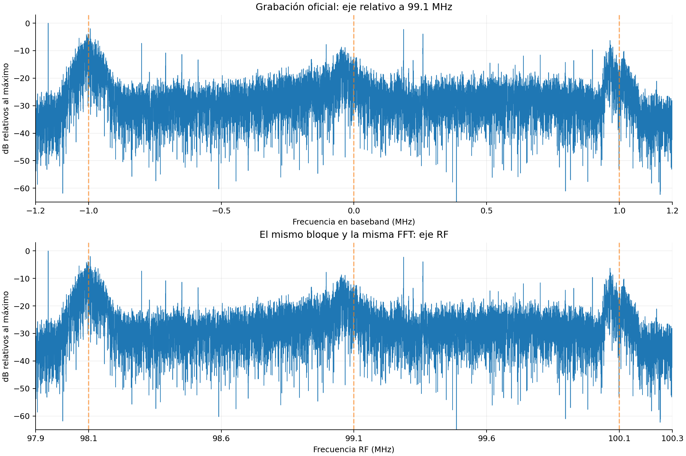

**Figura 27.** La grabación oficial se interpreta mediante sus metadatos: un mismo bloque I/Q admite un eje en baseband y otro en RF.

- **Panel superior — frecuencia relativa:** el cero representa la referencia de la captura. Las líneas de −1, 0 y +1 MHz sirven para localizar posiciones conocidas.
- **Panel inferior — frecuencia RF:** esas mismas líneas corresponden a 98.1, 99.1 y 100.1 MHz, porque se suma la referencia de 99.1 MHz.
- **Correspondencia de las curvas:** cada bin tiene la misma altura en ambos paneles. No se volvió a sintonizar el receptor ni se mezclaron las muestras.
- **Anchura de las estructuras:** la grabación contiene señales moduladas, no únicamente tonos ideales. No se debe contar cada máximo o cada bin como una emisora distinta.
- **Líneas naranjas:** son referencias de frecuencia, no un detector ni una afirmación de que el máximo de cada señal deba coincidir exactamente con ellas.
- **Escala vertical:** 0 dB corresponde al bin de mayor magnitud de este bloque. Otra selección temporal podría cambiar las alturas; no se está midiendo potencia RF absoluta.
- **Información disponible:** solo se analizan unos 6.827 ms de la grabación. La figura no describe por sí sola toda la evolución temporal ni demuestra ausencia de aliasing o de errores del receptor.

#### 6.8. Comprobaciones y cierre de la teoría

??? example "Comprobación 1: una componente por debajo de la referencia"
    Con $f_c=99.1$ MHz, una componente en −750 kHz corresponde a $99.1-0.75=98.35$ MHz. La frecuencia negativa es relativa al centro, no una RF física negativa.

??? example "Comprobación 2: centrar una componente negativa"
    Para llevar −600 kHz al cero se multiplica por $e^{j2\pi\,600000\,n/f_s}$. El multiplicador tiene +600 kHz, porque $-600+600=0$. Para esa componente, la nueva referencia RF es $99.1-0.6=98.5$ MHz.

??? example "Comprobación 3: escoger el signo equivocado"
    Si el objetivo está en +400 kHz y se multiplica por un tono de +400 kHz, aparece en +800 kHz, no en cero. La cancelación exige sumar la frecuencia opuesta.

??? example "Comprobación 4: centrar no es aislar"
    Después de trasladar −400 kHz, el objetivo del ejemplo queda en cero, pero los otros tonos siguen en −1000 y −400 kHz. Para aislar la banda del objetivo hace falta filtrado; para reducir después la tasa hace falta considerar la banda conservada y el filtrado anti-aliasing.

??? example "Comprobación 5: cambiar solo la referencia del visor"
    Si la captura sigue centrada en 99.1 MHz, un tono en +400 kHz corresponde a 99.5 MHz. Escribir 99.5 MHz como Center Frequency del visor sin mezclar haría etiquetarlo como 99.9 MHz; no cambiaría las muestras ni adquiriría otra banda.

La interpretación de una captura se puede organizar así:

1. Identificar el formato, el sample rate y la frecuencia central documentados.
2. Construir el eje de baseband con la tasa de la etapa que se analiza.
3. Relacionar una posición con RF mediante $f_{\mathrm{RF}}=f_c+f_{\mathrm{BB}}$, considerando la banda seleccionada y posibles inversiones o aliases.
4. Si se necesita centrar una señal, multiplicar por un tono complejo con frecuencia opuesta a su desplazamiento.
5. Seguir la referencia de las muestras transformadas y comprobar si alguna componente cruza el borde.
6. Distinguir centrar, filtrar, reducir la tasa y demodular: son operaciones diferentes.

Con esta subsección se completa el recorrido teórico de la sesión: las muestras tienen un eje temporal, su carácter I/Q permite distinguir el signo de las frecuencias, la FFT describe un bloque finito y los metadatos permiten relacionar baseband con RF. La selección de un canal mediante filtros queda como puente hacia el siguiente tema; no se construye todavía un receptor FM completo.

#### 6.9. Ejercicios de refuerzo

##### Ejercicio 6A — pasar de posiciones relativas a RF

Una captura I/Q tiene $f_c=433.92$ MHz y $f_s=2$ MS/s. Se consideran componentes conocidas en −350 y +125 kHz, sin inversión del espectro ni aliasing de la banda seleccionada.

- Calcular sus frecuencias RF y el intervalo RF nominal representativo.
- Explicar qué significa el signo negativo de la primera componente.

??? example "Solución del ejercicio 6A"

    - **Componente negativa:** $433.92-0.350=433.57$ MHz.
    - **Componente positiva:** $433.92+0.125=434.045$ MHz.
    - **Intervalo nominal:** $f_s/2=1$ MHz, por lo que corresponde a $[432.92,434.92)$ MHz. No garantiza una respuesta plana ni toda esa anchura como banda útil del equipo.
    - **Signo:** −350 kHz indica una posición por debajo de la referencia RF de 433.92 MHz. No representa una RF física negativa.

##### Ejercicio 6B — centrar una componente que está a la izquierda

La captura tiene $f_c=99.1$ MHz y $f_s=2.4$ MS/s. Se desea centrar un objetivo en 98.7 MHz; también hay componentes en 99.1 y 99.5 MHz.

- Calcular la posición inicial del objetivo, la frecuencia del multiplicador y la nueva referencia RF.
- Determinar las posiciones de salida de las otras dos componentes e indicar si quedaron eliminadas.

??? example "Solución del ejercicio 6B"

    - **Posición inicial:** $98.7-99.1=-0.4$ MHz, es decir, −400 kHz.
    - **Multiplicador:** se utiliza +400 kHz, porque $-400+400=0$. Con la convención de esta sesión, $y[n]=x[n]e^{j2\pi\,400000\,n/f_s}$.
    - **Nueva referencia:** $f_c'=99.1-0.4=98.7$ MHz. Para el objetivo, ese es el nuevo cero de baseband.
    - **Otras componentes:** 99.1 MHz pasa de 0 a +400 kHz; 99.5 MHz pasa de +400 a +800 kHz. Ninguna cruza el borde de este ejemplo y sus etiquetas RF originales se conservan con la nueva referencia.
    - **Selección del canal:** no quedaron eliminadas. La mezcla centró el objetivo, pero no filtró la banda ni redujo la tasa.

##### Ejercicio 6C — detectar una etiqueta RF incorrecta

En la captura original centrada en 99.1 MHz, una componente aparece en +250 kHz. Sin modificar las muestras, se cambia Center Frequency del visor a 99.5 MHz.

- Indicar la RF correcta y la etiqueta RF que mostraría esa configuración errónea.
- Explicar qué mezcla permitiría centrar la componente y qué referencia correspondería entonces.

??? example "Solución del ejercicio 6C"

    - **RF correcta:** $99.1+0.250=99.35$ MHz.
    - **Etiqueta errónea:** el visor sumaría $99.5+0.250=99.75$ MHz. La componente sigue en +250 kHz de la secuencia original; no se trasladó al cero.
    - **Mezcla necesaria:** se multiplica por un tono complejo de −250 kHz. La componente pasa a $250-250=0$ kHz.
    - **Referencia después de mezclar:** $f_c'=99.1-(-0.250)=99.35$ MHz. Cambiar solo la etiqueta no realiza esa operación ni vuelve a sintonizar el hardware.

##### Ejercicio 6D — relacionar bytes, tiempo y metadatos

Un bloque de la grabación oficial contiene 48000 bytes `.cu8`, intercalados I, Q. Sus metadatos indican $f_s=2.4$ MS/s y $f_c=99.1$ MHz.

- Calcular cuántas muestras complejas contiene y cuánto tiempo representa.
- Indicar a qué RF corresponde una posición de −1 MHz y explicar si los bytes por sí solos permitirían obtener esa referencia RF.

??? example "Solución del ejercicio 6D"

    - **Muestras complejas:** cada pareja ocupa dos bytes, de modo que hay $48000/2=24000$ muestras. No hay 48000 instantes distintos.
    - **Tiempo observado:** $24000/2400000=0.01$ s, es decir, 10 ms.
    - **Posición RF:** $99.1-1=98.1$ MHz, utilizando la convención y la referencia documentadas para esta captura.
    - **Metadatos:** el archivo raw no contiene un encabezado que determine por sí solo $f_s$ y $f_c$. Sin esos datos, los bytes no bastan para construir un eje temporal correcto ni asignar frecuencias RF absolutas.

## Síntesis visual — de las muestras a la interpretación del espectro

- **Propósito:** conectar las seis subsecciones mediante cuatro láminas. No se introduce teoría nueva: se retoman señales conocidas para distinguir qué se observa, qué se calcula y qué información hace falta.
- **Lectura en dos paneles:** cada enlace «Abrir imagen» abre la lámina por separado. En un panel se mantiene la imagen y en el otro, la lectura guiada de la clase; las letras A, B, C y D vinculan los ítems con los paneles de la figura.
- **Orden de explicación:** primero se relacionan muestras, tiempo e I/Q; luego se distinguen aliasing y leakage; después se comparan decisiones de FFT y finalmente se conecta baseband con RF.

### 1. Las muestras, el plano I/Q y el espectro describen aspectos distintos

- **Imagen para el panel visual:** [Abrir imagen de la Figura 28](figures/sintesis-muestras-representaciones.png){target="_blank" rel="noopener"}.

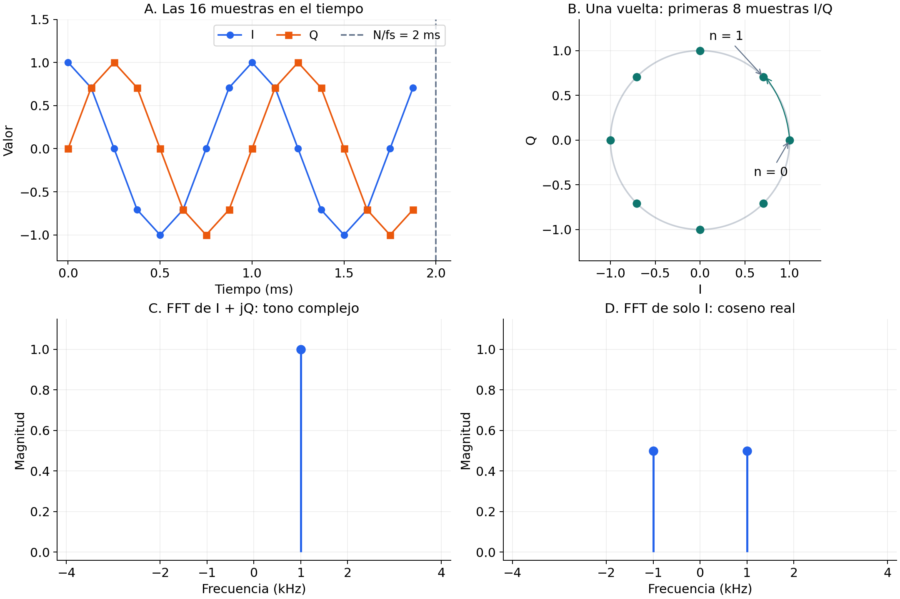

**Figura 28.** Un tono complejo de +1 kHz a 8 kS/s permite relacionar el tiempo, el plano I/Q y las diferencias entre un espectro complejo y uno real.

- **A1. Panel A — qué representa cada instante:** un círculo azul y un cuadrado naranja en el mismo tiempo forman **una muestra compleja**, $z[n]=I[n]+jQ[n]$. No son dos muestras tomadas en momentos diferentes; son dos componentes del mismo valor.
- **A2. Panel A — separación temporal:** con $f_s=8000$ S/s, el intervalo es $T_s=1/f_s=0.125$ ms. La separación de los puntos proviene del sample rate, no de la frecuencia del tono.
- **A3. Panel A — duración del bloque:** las 16 muestras representan $N/f_s=2$ ms, señalados por la línea discontinua. La última muestra está en $15/f_s=1.875$ ms; la línea de 2 ms marca el límite nominal del bloque, no una muestra adicional.
- **B1. Panel B — las mismas componentes vistas como coordenadas:** I se lee en el eje horizontal y Q en el vertical. Las primeras ocho muestras caen sobre un círculo de radio 1 porque el tono ideal tiene magnitud constante; una captura I/Q genérica no tiene por qué formar ese círculo.
- **B2. Panel B — dirección y frecuencia:** al pasar de $n=0$ a $n=1$, el punto gira 45° en sentido antihorario. Ese avance corresponde a $2\pi f_0/f_s=2\pi(1000/8000)=\pi/4$ radianes por muestra y representa el tono de +1 kHz.
- **B3. Panel B — una vuelta no es una muestra:** ocho avances de 45° completan 360°. La muestra $n=8$ vuelve al punto de $n=0$; la figura muestra los ocho puntos anteriores a ese retorno. El círculo gris es una referencia del tono conocido, no una reconstrucción de una captura desconocida.
- **C1. Panel C — FFT de la secuencia compleja:** al utilizar I y Q conjuntamente, aparece una componente en +1 kHz de magnitud 1. El signo de la frecuencia es coherente con el giro del panel B; no aparece una copia obligatoria en −1 kHz.
- **C2. Panel C — por qué el pico es limpio:** el bloque de 2 ms contiene exactamente dos ciclos del tono, y 1 kHz coincide con un bin. La limpieza de este ejemplo depende de la señal y del bloque elegidos; no garantiza que toda captura tenga picos aislados ni que esté libre de aliasing.
- **D1. Panel D — qué cambia al utilizar solo I:** la entrada de la FFT ya no es $z[n]$, sino su componente real, un coseno. Su representación contiene componentes de +1 y −1 kHz, de magnitud 0.5 cada una, como se desarrolló en la subsección 2.
- **D2. Panel D — qué no debe concluirse:** los dos picos no representan necesariamente dos transmisores. Son la descomposición del coseno real; descartar Q cambia la información que se entrega al análisis y no es equivalente a conservar la señal I/Q completa.
- **Idea que conecta los cuatro paneles:** el tiempo muestra la evolución de los valores, el plano I/Q muestra magnitud y fase, y la FFT muestra las componentes frecuenciales del bloque. La gráfica de magnitud de FFT no conserva por sí sola toda la información de fase de la transformada completa.

### 2. Aliasing y spectral leakage responden a preguntas diferentes

- **Imagen para el panel visual:** [Abrir imagen de la Figura 29](figures/sintesis-aliasing-leakage.png){target="_blank" rel="noopener"}.

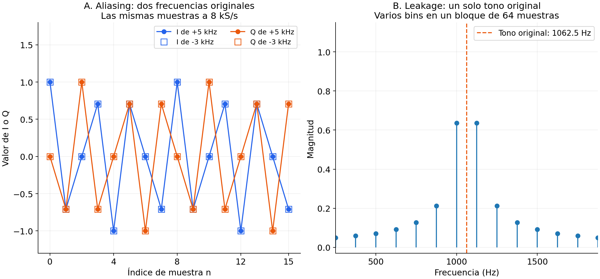

**Figura 29.** Aliasing hace indistinguibles frecuencias originales diferentes; spectral leakage distribuye la contribución de un tono en el análisis de un bloque finito.

- **A1. Panel A — qué se compara:** los círculos representan las muestras del tono de +5 kHz y los cuadrados vacíos, las del tono de −3 kHz. Se compara I con I y Q con Q; en ambas componentes los marcadores coinciden.
- **A2. Panel A — por qué coinciden:** las frecuencias difieren en un sample rate: $5000-(-3000)=8000$ Hz. Entre muestras, sus avances de fase difieren en una vuelta completa; para todo índice entero $n$, esa diferencia no cambia el valor complejo observado.
- **A3. Panel A — qué información falta:** si solo se recibiera esa secuencia, no se podría decidir cuál de las dos frecuencias originales la produjo sin información adicional sobre la banda de entrada. La igualdad existe antes de calcular una FFT; el aliasing no se origina en el dibujo del espectro.
- **A4. Panel A — qué no soluciona la ambigüedad:** obtener un bloque más largo al mismo sample rate o añadir ceros a la FFT no distingue estos tonos. El control del aliasing depende de la banda seleccionada, el filtrado previo y la tasa de adquisición o de reducción.
- **B1. Panel B — qué señal se generó:** hay un único tono complejo de 1062.5 Hz y se observan 64 muestras a 8 kS/s. La línea naranja indica su frecuencia conocida; no corresponde a un bin de esta FFT, cuyos puntos están separados 125 Hz.
- **B2. Panel B — qué muestran los tallos:** la contribución del tono aparece en varios bins. Los mayores están en 1000 y 1125 Hz y tienen magnitud aproximada de 0.637; esos bins no son nuevos tonos que se hayan añadido a la entrada.
- **B3. Panel B — qué significa leakage:** se observa el espectro de un bloque finito, no la línea ideal de un tono que existiera durante un tiempo infinito. La duración y la ventana afectan esa forma espectral; la DFT completa sigue conservando la información de las muestras que recibió.
- **Comparación A–B:** en A, el problema es distinguir posibles frecuencias originales a partir de unas mismas muestras. En B, el problema es interpretar cómo contribuye una señal conocida al espectro de un bloque observado.
- **Regla de lectura:** un pico limpio no demuestra ausencia de aliasing y varios bins no demuestran varios transmisores. Ambos efectos pueden ocurrir simultáneamente; en una captura real también deben conocerse los metadatos y el procesamiento previo.

### 3. Más ceros, otra ventana y más datos no hacen lo mismo

- **Imagen para el panel visual:** [Abrir imagen de la Figura 30](figures/sintesis-decisiones-fft.png){target="_blank" rel="noopener"}.

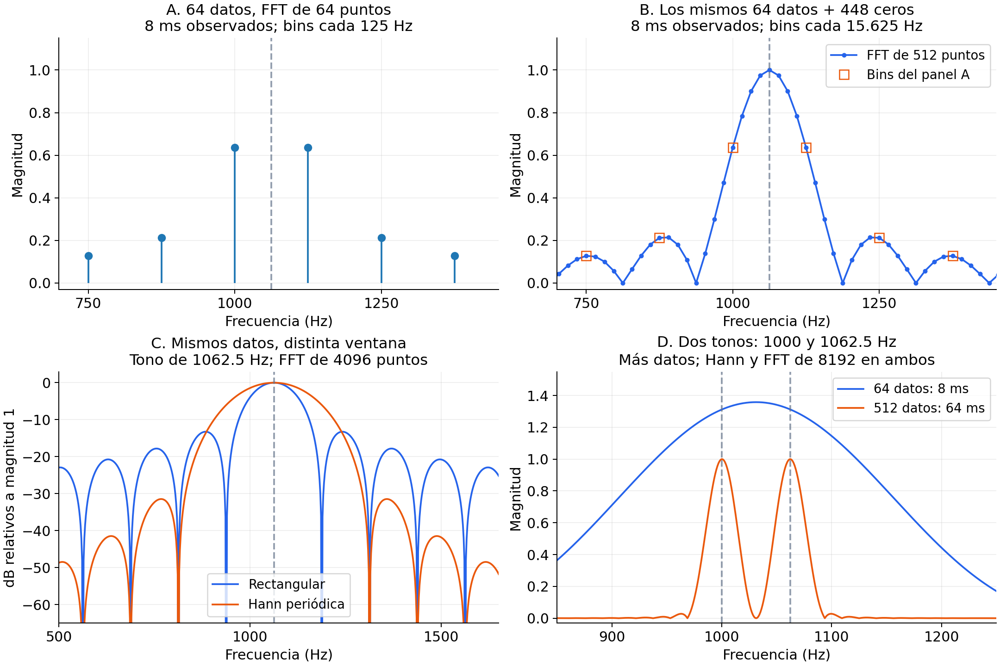

**Figura 30.** El padding densifica la rejilla, la ventana modifica la forma espectral y una observación más larga puede mejorar la separación de tonos estables.

- **A1. Panel A — punto de partida:** se analizan 64 muestras del tono de 1062.5 Hz con ventana rectangular y una FFT de 64 puntos. Se observaron 8 ms y los bins están separados $8000/64=125$ Hz.
- **A2. Panel A — qué se debe notar:** los bins cercanos no caen exactamente en la frecuencia del tono. Por eso sus alturas no llegan a 1, aunque el tono generado tenga esa magnitud; el máximo de una rejilla no siempre coincide con el máximo de la forma espectral.
- **B1. Panel B — qué se cambió:** se conservaron las mismas 64 muestras y se añadieron 448 ceros para obtener una FFT de 512 puntos. No se realizaron nuevas mediciones ni se observó durante más tiempo: siguen siendo 8 ms.
- **B2. Panel B — qué se obtuvo:** la separación de salida pasa a $8000/512=15.625$ Hz. Los cuadrados naranjas, que reproducen los bins de A, coinciden con puntos de la curva azul; ahora hay más evaluaciones entre ellos.
- **B3. Panel B — qué no cambió:** el padding no estrecha el main lobe ni elimina los sidelobes. El máximo llega a 1 porque la nueva rejilla incluye 1062.5 Hz, no porque se haya recuperado una amplitud física perdida ni porque se haya adquirido más información.
- **C1. Panel C — qué se compara:** el mismo bloque de 64 muestras se analiza con rectangular y Hann periódica. Las dos curvas usan una FFT de 4096 puntos para mostrar su forma con detalle; la diferencia entre ellas la produce la ventana, no una cantidad distinta de datos o de ceros.
- **C2. Panel C — compromiso de Hann:** la curva naranja tiene sidelobes menores, pero un main lobe más ancho. Esa combinación puede facilitar observar una señal débil junto a otra fuerte y, al mismo tiempo, dificultar separar componentes demasiado próximas.
- **C3. Panel C — cómo leer las alturas:** la escala es dB relativos a magnitud 1 y se corrigió la suma de pesos de cada ventana. Los máximos de 0 dB no implican una medición de 0 dBm; las caídas profundas son ceros de la forma espectral, no demostraciones de canales RF vacíos.
- **D1. Panel D — aquí la entrada es otra:** se retoma el par de tonos de 1000 y 1062.5 Hz de la subsección 5.7. No se compara este panel como si fuera el mismo tono único de A, B y C; su propósito es comprobar la separación de dos componentes próximas.
- **D2. Panel D — qué se varía y qué se mantiene:** se comparan 64 muestras adquiridas durante 8 ms y 512 adquiridas durante 64 ms. En ambos casos se utiliza Hann y una FFT de 8192 puntos: la rejilla de salida es la misma, pero el tiempo observado no.
- **D3. Panel D — qué se debe notar:** el bloque corto muestra un máximo combinado y el largo distingue dos máximos cerca de las líneas de referencia. El cambio proviene de los datos adicionales; el máximo combinado no es la amplitud individual de ninguno de los tonos.
- **Límite de la comparación D:** los tonos son estables durante el bloque. Una observación más larga no es una mejora universal: si la señal cambia, el espectro puede mezclar lo ocurrido en distintos instantes, y también importan el ruido, las amplitudes y la ventana.
- **Relación que debe conservarse:** $N$ cuenta muestras adquiridas, $M$ cuenta puntos de FFT y $T_{\mathrm{obs}}=N/f_s$. La separación de salida es $f_s/M$; no se debe utilizar $M/f_s$ como tiempo observado cuando parte de la entrada son ceros añadidos.

### 4. La referencia RF permite interpretar; la mezcla transforma

- **Imagen para el panel visual:** [Abrir imagen de la Figura 31](figures/sintesis-baseband-rf.png){target="_blank" rel="noopener"}.

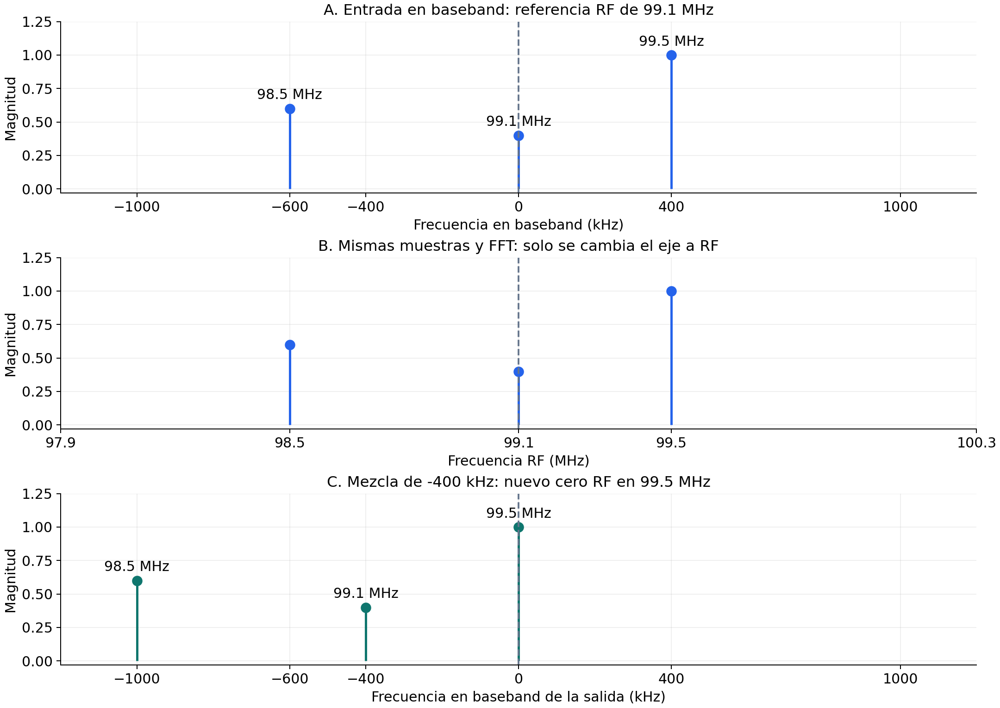

**Figura 31.** Reetiquetar el eje conserva las muestras; la mezcla compleja cambia su referencia frecuencial y desplaza todas las componentes.

- **A1. Panel A — posiciones relativas:** con referencia $f_c=99.1$ MHz, las componentes aparecen en −600, 0 y +400 kHz. La línea discontinua marca el cero de baseband, no 0 Hz de RF.
- **A2. Panel A — lectura de las etiquetas sobre los tonos:** se utiliza $f_{\mathrm{RF}}=f_c+f_{\mathrm{BB}}$. Así, −600 kHz corresponde a 98.5 MHz y +400 kHz corresponde a 99.5 MHz; el signo negativo solo indica una posición por debajo de la referencia.
- **B1. Panel B — qué cambió:** se dibujan los mismos coeficientes de FFT sobre un eje RF. Las alturas siguen siendo 0.6, 0.4 y 1 porque no se modificaron las muestras ni se aplicó otra operación de señal.
- **B2. Panel B — qué dato hizo posible la lectura:** se conocía la frecuencia central de la captura. La FFT obtiene las posiciones relativas usando el sample rate, pero no descubre por sí sola la referencia RF de un archivo raw.
- **C1. Panel C — qué operación se realizó:** la entrada se multiplicó por un tono complejo de −400 kHz: $y[n]=x[n]e^{-j2\pi\,400000\,n/f_s}$. Ahora sí cambió la secuencia I/Q; no se trata únicamente de otra etiqueta horizontal.
- **C2. Panel C — qué se desplazó:** **todos** los tonos se trasladaron −400 kHz. El objetivo pasó de +400 a 0 kHz, el tono central pasó a −400 kHz y el de −600 pasó a −1000 kHz.
- **C3. Panel C — nuevo cero y RF original:** el nuevo cero corresponde a 99.5 MHz. Las etiquetas sobre los tonos siguen siendo 98.5, 99.1 y 99.5 MHz porque las frecuencias RF originales no cambiaron; ninguna de estas componentes cruzó el borde del intervalo.
- **Comparación A–B–C:** entre A y B cambia la forma de etiquetar el mismo espectro. Entre A y C se transforma la señal para que el objetivo quede en el cero; las dos acciones tienen propósitos diferentes.
- **Qué no hizo C:** no eliminó los otros tonos, no redujo el sample rate y no recuperó audio. Centrar, filtrar, decimar y demodular son operaciones distintas; centrar no equivale a seleccionar por completo un canal.
- **Precaución sobre la banda:** la mezcla trabaja con muestras ya adquiridas. No obtiene señales que estaban fuera de la captura, y si una componente cruza el borde reaparece por el otro extremo del intervalo discreto; no debe interpretarse como una nueva banda RF adquirida.
- **Precaución sobre el visor:** cambiar solo Center Frequency sin una mezcla ni una nueva adquisición no sintoniza el receptor. Si se usa una referencia que no corresponde a las muestras, las etiquetas RF pueden ser falsas, aunque el dibujo parezca razonable.

### 5. Guía de cierre: qué se necesita para interpretar una captura

- **1. Formato de entrada:** antes de calcular, se identifica cómo están almacenadas las muestras. En `.cu8`, una pareja de bytes I, Q forma una muestra compleja; leerlos como otro tipo de datos cambia la secuencia que recibe el análisis.
- **2. Sample rate de la etapa:** se identifica la tasa de la secuencia analizada, que puede ser distinta de la tasa anterior a una decimación. Con ella se construyen los ejes; $f_s$ es el sample rate y $f_s/2$ es la Nyquist frequency, no son nombres intercambiables.
- **3. Datos realmente observados:** se cuenta $N$ y se calcula $T_{\mathrm{obs}}=N/f_s$. Se distingue ese tiempo del instante de la última muestra y de la longitud de un arreglo completado con ceros.
- **4. Configuración del análisis:** se identifica $M$, la ventana y la escala vertical. Una rejilla más densa, otra ventana y más tiempo de adquisición no deben presentarse como si fueran la misma modificación.
- **5. Interpretación prudente del espectro:** no se cuenta cada bin como un transmisor ni se concluye que un pico limpio descarta aliasing. Se consideran la banda seleccionada y el procesamiento previo, además de la duración y la ventana del bloque.
- **6. Referencia RF:** se conoce $f_c$ y se relaciona con las posiciones en baseband. Si se mezclaron las muestras, se sigue la nueva referencia y se comprueban posibles cruces del borde; no se asume que toda etiqueta del visor sea automáticamente correcta.
- **7. Operación que se necesita:** se distingue entre mostrar otro eje, centrar una señal, aislar su banda, reducir su tasa y recuperar información. Esa distinción prepara el trabajo con sistemas y filtros sin adelantar todavía un receptor completo.
- **Conclusión de la sesión:** una captura SDR no se interpreta solo mirando picos. Se interpreta relacionando las muestras con sus metadatos, el bloque observado, la configuración de FFT y las operaciones aplicadas a la señal.
