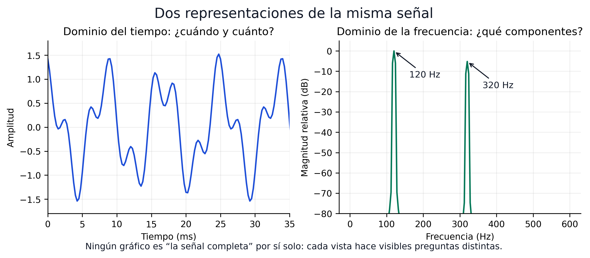
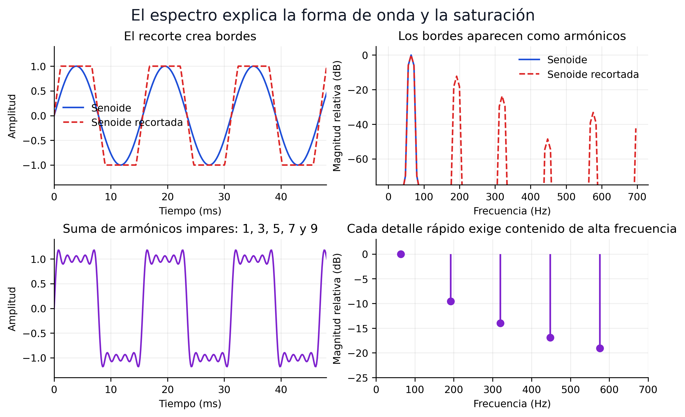
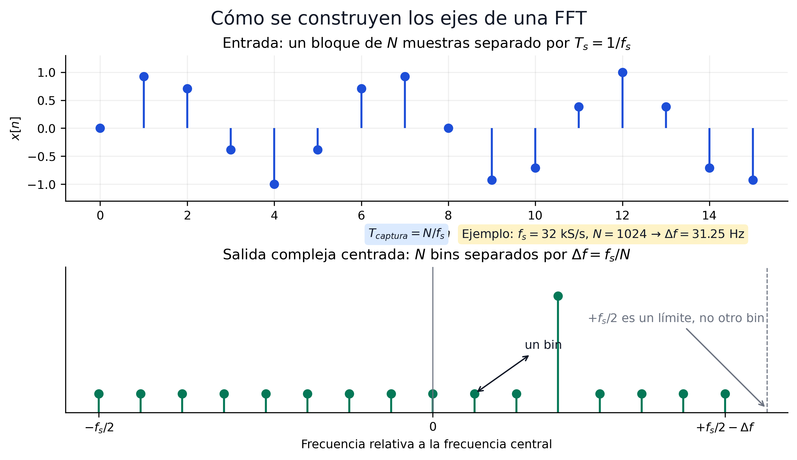
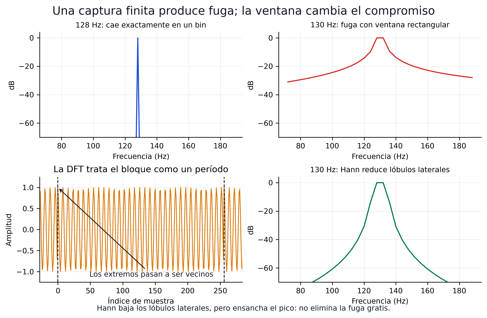
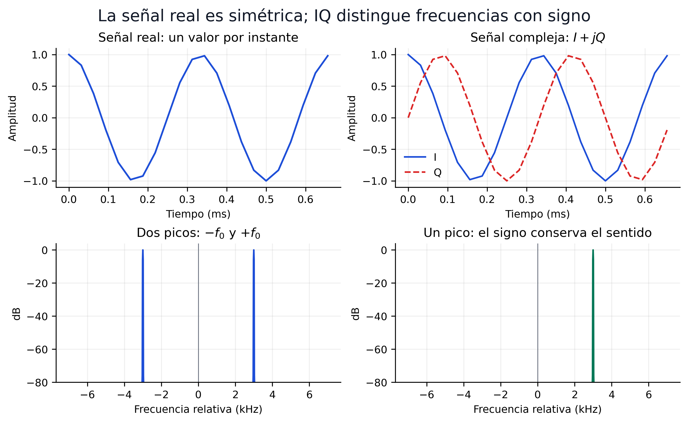
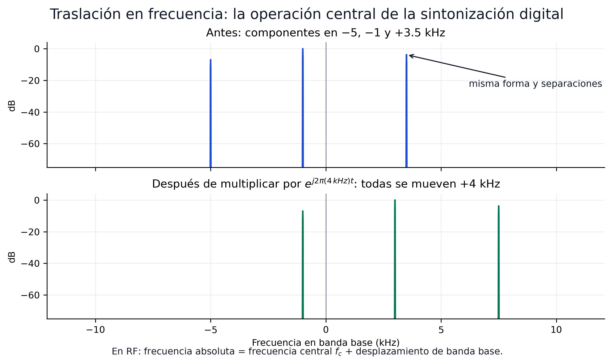

# Sesión 02 — Del tiempo al espectro: señales e IQ

## Objetivos de aprendizaje

Al finalizar esta sesión, el estudiante será capaz de:

1. Interpretar los dominios del tiempo y la frecuencia como **dos representaciones de la misma señal**
2. Predecir el espectro de una senoide real, una senoide compleja y una suma de tonos
3. Calcular la duración de una captura y la separación entre bins a partir de $f_s$ y $N$
4. Reconocer fuga espectral, recorte, desplazamiento de continua y error de frecuencia en una visualización
5. Explicar por qué las muestras I/Q distinguen frecuencias positivas y negativas respecto a $f_c$
6. Analizar una grabación I/Q en GNU Radio y NumPy sin depender de un dongle

!!! abstract "La regla de esta sesión"
    Cada ecuación debe permitir **predecir algo que se pueda observar inmediatamente** en GNU Radio o Python. No se evalúa la capacidad de repetir una tabla de transformadas ni de resolver integrales por memoria.

La sesión tiene 2 h de teoría y 2 h de laboratorio. La primera mitad construye una forma práctica de pensar las señales; la segunda utiliza esa forma de pensar para diagnosticar lo que entrega un SDR.

| Minutos de teoría | Pregunta conductora | Resultado observable |
|---:|---|---|
| 0–20 | ¿Qué revela cada dominio? | relacionar una forma temporal con sus componentes |
| 20–45 | ¿Qué calcula realmente una FFT? | construir duración, intervalo y bins desde $f_s$ y $N$ |
| 45–65 | ¿Por qué un tono ocupa varios bins? | distinguir fuga y efecto de una ventana |
| 65–90 | ¿Por qué SDR utiliza I/Q? | predecir espectros reales y complejos |
| 90–105 | ¿Cómo se sintoniza en software? | trasladar una señal mediante mezcla compleja |
| 105–120 | ¿Qué defectos produce el hardware? | reconocer recorte, DC, AGC y error en ppm |

---

## Teoría

### 1. Una señal, dos preguntas

Una señal es una magnitud que cambia: el voltaje en una antena, las muestras entregadas por un ADC o el audio producido por un demodulador. Puede describirse desde dos perspectivas complementarias:

| Representación | Pregunta que responde | Resulta útil para observar |
|---|---|---|
| Tiempo, $x(t)$ o $x[n]$ | ¿Qué valor toma y cuándo cambia? | pulsos, transitorios, recorte, envolvente, periodicidad |
| Frecuencia, $X(f)$ o $X[k]$ | ¿Qué componentes frecuenciales contiene? | portadoras, ancho de banda, armónicos, interferencia, ruido |

La notación

$$
x(t) \longleftrightarrow X(f)
$$

no describe dos señales. Indica dos representaciones de la misma información.



**Figura 1.** En el tiempo se aprecia la evolución de la amplitud; en frecuencia se identifican inmediatamente los componentes de 120 y 320 Hz.

Un gráfico de magnitud espectral no muestra directamente cuándo ocurrió un evento. Eso no significa que la transformada de Fourier destruya la información temporal: la transformada completa también contiene fase y es invertible. La pantalla habitual del analizador simplemente oculta parte de esa información.

??? question "Comprobación rápida"
    Una captura presenta un pulso corto y un tono continuo. ¿En qué vista resulta más fácil localizar el pulso? ¿En cuál resulta más fácil medir la frecuencia del tono?

    ??? example "Respuesta"
        El pulso se localiza en el dominio del tiempo. La frecuencia del tono se mide con mayor facilidad en el espectro. Ambas vistas provienen de las mismas muestras.

### 2. Leer un pico: amplitud, frecuencia y fase

La senoide es el componente elemental del análisis frecuencial:

$$
x(t)=A\cos(2\pi f_0t+\phi).
$$

- $A$ determina la amplitud.
- $f_0$ determina cuántos ciclos ocurren por segundo.
- $\phi$ determina dónde comienza el ciclo respecto al origen temporal.

Una señal puede contener varias senoides. Si

$$
x(t)=x_1(t)+x_2(t),
$$

entonces, por linealidad,

$$
X(f)=X_1(f)+X_2(f).
$$

Por eso el espectro de la Figura 1 presenta dos componentes. El analizador no «descubre emisoras»: compara el bloque de muestras con ondas de distintas frecuencias y muestra cuánto coincide con cada una.

Una forma de onda con cambios rápidos necesita componentes de frecuencia más alta. Al sumar los armónicos impares $f_0,3f_0,5f_0,\ldots$, la forma se aproxima a una onda cuadrada. El sobreimpulso cerca de sus discontinuidades se denomina fenómeno de Gibbs, pero no se necesita calcularlo en esta sesión.

El mismo principio permite diagnosticar saturación. Cuando un ADC recorta una senoide, aplana sus extremos y crea armónicos que no estaban en la entrada.



**Figura 2.** Los bordes y el recorte se manifiestan como contenido adicional de alta frecuencia.

!!! warning "Un pico no es necesariamente otra transmisión"
    Los armónicos pueden originarse dentro del propio receptor por saturación o no linealidad. Antes de concluir que existe una señal en una frecuencia, reduce la ganancia y comprueba si el pico disminuye de manera desproporcionada o desaparece.

### 3. El SDR entrega bloques finitos

El receptor no entrega una función continua e infinita. Entrega una secuencia de muestras separadas por

$$
T_s=\frac{1}{f_s},
\qquad
x[n]=x(nT_s).
$$

Una FFT opera sobre un bloque de $N$ muestras. La duración observada por ese bloque es

$$
T_{\text{captura}}=NT_s=\frac{N}{f_s}.
$$

La DFT puede escribirse como

$$
X[k]=\sum_{n=0}^{N-1}x[n]e^{-j2\pi kn/N}.
$$

No se calculará esa suma a mano. Su interpretación práctica es suficiente: para cada índice $k$, la DFT compara las $N$ muestras con una senoide compleja de frecuencia conocida y acumula el resultado. La **FFT** es un algoritmo eficiente para calcular esa misma DFT.

!!! note "Vocabulario mínimo"
    - **DFT:** la operación matemática que transforma $N$ muestras en $N$ coeficientes frecuenciales.
    - **FFT:** el algoritmo rápido utilizado por NumPy y GNU Radio para calcular la DFT.
    - **Bin:** una de las frecuencias discretas evaluadas por la DFT.

La DFT trata el bloque como si se repitiera indefinidamente. En ese modelo, la última muestra queda junto a la primera. Esta vecindad circular es importante porque una unión brusca introduce un borde artificial.

### 4. Construir correctamente los ejes de la FFT

Los bins están separados por

$$
\Delta f = \frac{f_s}{N}.
$$

Este valor debe llamarse **separación entre bins**. La capacidad real de distinguir dos señales cercanas también depende de la ventana, la duración de la captura, el ruido y la diferencia de amplitudes.



**Figura 3.** $f_s$ fija el intervalo total representado; $N$ divide ese intervalo en bins. Aumentar $N$ no aumenta el ancho de banda observado.

Para muestras complejas I/Q, los $N$ bins cubren un intervalo completo de ancho $f_s$. Después de centrar la FFT con `fftshift`, el eje habitual es

$$
-\frac{f_s}{2}\leq f < +\frac{f_s}{2}.
$$

Algunos tamaños usados en el curso ilustran el compromiso:

| $f_s$ | $N$ | $T_{captura}=N/f_s$ | $\Delta f=f_s/N$ | Intervalo complejo |
|---:|---:|---:|---:|---:|
| 32 kS/s | 1 024 | 32 ms | 31.25 Hz | $-16$ a $+16$ kHz |
| 2.4 MS/s | 1 024 | 0.427 ms | 2.344 kHz | $-1.2$ a $+1.2$ MHz |
| 2.4 MS/s | 4 096 | 1.707 ms | 585.94 Hz | $-1.2$ a $+1.2$ MHz |
| 2.4 MS/s | 32 768 | 13.653 ms | 73.24 Hz | $-1.2$ a $+1.2$ MHz |

Duplicar $N$ reduce $\Delta f$ a la mitad porque la FFT observa el doble de tiempo. Duplicar $f_s$ manteniendo $N$ duplica el intervalo observado, pero también duplica la separación entre bins.

??? question "Predicción antes de tocar el programa"
    Un Frequency Sink utiliza $f_s=1$ MS/s y $N=2\,000$. ¿Qué intervalo muestra con muestras complejas? ¿Cuál es la separación entre bins?

    ??? example "Respuesta"
        El intervalo centrado es de $-500$ a $+500$ kHz y

        $$
        \Delta f=\frac{10^6}{2000}=500\ \text{Hz}.
        $$

### 5. Por qué aparece la fuga espectral

Si una senoide completa un número entero de ciclos dentro del bloque, la unión circular es continua y su energía puede concentrarse en un bin. Si el bloque termina en otra fase, la repetición introduce un salto artificial. La FFT necesita varios bins para representar ese salto: aparece **fuga espectral**.

Una ventana multiplica gradualmente el bloque:

$$
x_w[n]=w[n]x[n].
$$

La ventana Hann reduce los lóbulos laterales, pero ensancha el pico y modifica su amplitud. No «limpia» la señal ni elimina la fuga gratuitamente.



**Figura 4.** La fuga proviene del intervalo finito de observación. Una ventana cambia el compromiso entre lóbulos laterales, anchura del pico y exactitud de amplitud.

| Ventana | Ventaja práctica | Costo |
|---|---|---|
| Rectangular | Pico estrecho cuando existe coherencia | lóbulos laterales altos ante una discontinuidad |
| Hann | reduce los lóbulos laterales y funciona bien como opción general | ensancha el lóbulo principal |

En esta sesión se comparan las ventanas visualmente. La normalización de densidad espectral de potencia, el RBW y la medición rigurosa de SNR pertenecen a la Sesión 03.

### 6. Señales reales y señales complejas

Una senoide real contiene dos exponenciales complejas:

$$
\cos(2\pi f_0t)
=\frac{1}{2}e^{j2\pi f_0t}
+\frac{1}{2}e^{-j2\pi f_0t}.
$$

Por ello, su espectro tiene componentes conjugadas en $+f_0$ y $-f_0$. No son dos tonos físicos independientes; son la representación simétrica que necesita una señal real.

Una muestra compleja contiene dos números reales:

$$
z[n]=I[n]+jQ[n].
$$

Para $z(t)=e^{j2\pi f_0t}$, $I(t)=\cos(2\pi f_0t)$ y $Q(t)=\sin(2\pi f_0t)$. El par conserva el sentido de rotación y permite distinguir $+f_0$ de $-f_0$.



**Figura 5.** Una señal real tiene espectro conjugado-simétrico. Una señal compleja I/Q utiliza todo el intervalo de ancho $f_s$ para representar frecuencias con signo.

!!! info "El signo es relativo, no una frecuencia RF negativa"
    Si el tuner está centrado en $f_c$, una componente I/Q situada en $f_{BB}$ corresponde a

    $$
    f_{RF}=f_c+f_{BB}.
    $$

    Con $f_c=99.1$ MHz, un pico en $+300$ kHz representa 99.4 MHz y uno en $-500$ kHz representa 98.6 MHz.

### 7. Traslación en frecuencia: sintonizar en software

Multiplicar una señal compleja por otra exponencial compleja desplaza todo su espectro:

$$
y[n]=x[n]e^{j2\pi f_0n/f_s}
\quad\Longleftrightarrow\quad
Y(f)=X(f-f_0).
$$

El signo debe verificarse en el sistema utilizado; con esta convención, $f_0>0$ desplaza las componentes hacia frecuencias mayores. Se conservan la forma del espectro y las separaciones internas.



**Figura 6.** La mezcla compleja es una traslación, no una deformación. Es la operación central del DDC, la sintonización fina y la canalización digital.

Para llevar una emisora ubicada en $+300$ kHz al centro, se multiplica por una exponencial de $-300$ kHz. Después puede aplicarse un filtro paso bajo y reducir la tasa. Esas dos operaciones se desarrollan en la Sesión 03.

### 8. Lo que revela un receptor real

Los dominios del tiempo y la frecuencia se convierten ahora en herramientas de diagnóstico:

| Condición | En el tiempo | En frecuencia | Decisión práctica |
|---|---|---|---|
| Ganancia insuficiente | amplitud pequeña | señal cerca del piso visible | aumentar ganancia y volver a observar |
| Ganancia excesiva / recorte | valores pegados a los extremos | armónicos, espurias o pedestal elevado | reducir ganancia |
| AGC ajustándose | envolvente que cambia con el tiempo | nivel del espectro inestable | usar ganancia manual para comparar mediciones |
| Desplazamiento de continua | media de I o Q distinta de cero | pico exactamente en 0 Hz | medir la media; evitar centrar allí una señal estrecha |
| Error del oscilador | no siempre evidente | todas las componentes aparecen desplazadas | calcular o estimar la corrección en ppm |

La **ganancia manual** mantiene fijo el estado del receptor y permite comparar capturas. El **AGC** cambia la ganancia para responder al nivel recibido: resulta cómodo para explorar una señal variable, pero altera la amplitud y puede ocultar si un cambio provino del entorno o del receptor. Por eso las tres grabaciones calificadas se realizan con ganancias manuales conocidas. La prueba con AGC queda como observación opcional para quien tenga hardware.

El desplazamiento de continua puede medirse con

$$
\mu=\frac{1}{N}\sum_{n=0}^{N-1}x[n].
$$

Restar $\mu$ elimina el componente constante de una captura para una visualización, pero no corrige todas las imperfecciones de un receptor de conversión directa.

El error del oscilador se expresa en partes por millón:

$$
\Delta f=f_c\frac{\text{ppm}}{10^6}.
$$

Un error de 1 ppm produce 99.1 Hz a 99.1 MHz y 1.09 kHz a 1090 MHz. La misma exactitud puede ser despreciable para un canal FM de 200 kHz y relevante para una señal estrecha.

!!! note "Qué no se evalúa todavía"
    No se evalúa en esta sesión:

    - resolver integrales de la transformada continua;
    - memorizar la tabla completa de propiedades;
    - implementar el algoritmo interno de la FFT o dibujar sus mariposas;
    - calcular la ganancia de procesamiento de la FFT;
    - diseñar ventanas;
    - resolver convolución, filtros, PSD, RBW o SNR calibrada.

    La convolución, el filtrado y las mediciones espectrales rigurosas se desarrollan en la Sesión 03.

---

## Síntesis

| Si se modifica… | Entonces… | Lo que no cambia |
|---|---|---|
| La amplitud de un tono | cambia la altura de su pico | su frecuencia |
| La fase o el instante inicial | cambia la fase espectral | la magnitud del tono |
| $N$ con $f_s$ fijo | cambia $T_{captura}$ y $\Delta f$ | el intervalo total observado |
| $f_s$ con $N$ fijo | cambia el intervalo y $\Delta f$ | la cantidad de bins |
| La ventana | cambian lóbulos, anchura y calibración | las muestras originales almacenadas |
| El tipo real por complejo | desaparece la redundancia conjugada | la información física representada |
| La frecuencia de mezcla compleja | se traslada todo el espectro | su forma y separaciones internas |
| La ganancia hasta producir recorte | aparecen productos de distorsión | la señal original que existía en la antena |

---

## Ejercicios

### Ejercicio 1: duración, bins e intervalo

Un RTL-SDR entrega muestras complejas a 2.4 MS/s. El Frequency Sink utiliza $N=4096$.

1. Calcular la duración de cada bloque.
2. Calcular la separación entre bins.
3. Determinar el intervalo de frecuencia relativa mostrado.
4. Si $f_c=99.1$ MHz, hallar el intervalo de frecuencia RF.

??? example "Solución"
    $$
    T_{captura}=\frac{4096}{2.4\times10^6}=1.707\ \text{ms},
    $$

    $$
    \Delta f=\frac{2.4\times10^6}{4096}=585.94\ \text{Hz}.
    $$

    El intervalo relativo es $-1.2$ a $+1.2$ MHz. Al sumar $f_c$, el intervalo RF es 97.9–100.3 MHz.

### Ejercicio 2: real o compleja

Se observan dos espectros:

- A presenta picos iguales en $-4$ y $+4$ kHz.
- B presenta un único pico en $+4$ kHz.

¿Cuál puede provenir directamente de una senoide real? ¿Cuál representa una exponencial compleja de frecuencia positiva?

??? example "Solución"
    A corresponde a una senoide real: su espectro debe ser conjugado-simétrico. B corresponde a $e^{j2\pi(4\,\text{kHz})t}$ y requiere dos componentes I/Q.

### Ejercicio 3: fuga o dos señales

Una senoide de frecuencia conocida aparece como un pico ancho con lóbulos laterales. Al cambiar su frecuencia unos pocos hertz, cambia la forma de los lóbulos. Al aplicar Hann, estos bajan pero el pico central se ensancha.

¿El resultado demuestra que existen varias transmisiones cercanas?

??? example "Solución"
    No. El comportamiento es característico de fuga espectral causada por una captura finita y no coherente con los bins. La ventana modifica los lóbulos porque modifica el bloque observado. Antes de declarar varias señales se debe repetir la medición con otra duración o ventana.

### Ejercicio 4: sintonización digital

Una emisora aparece en $f_{BB}=+420$ kHz dentro de una captura centrada en 98.7 MHz.

1. ¿Cuál es su frecuencia RF?
2. ¿Por qué frecuencia compleja se debe multiplicar para llevarla a 0 Hz?

??? example "Solución"
    La frecuencia RF es $98.7+0.420=99.120$ MHz. Se multiplica por una exponencial compleja de $-420$ kHz. Toda la emisora se desplaza al centro sin cambiar su ancho de banda.

### Ejercicio 5: diagnosticar una captura

Al aumentar la ganancia, una señal deseada sube 4 dB, pero aparecen numerosos picos nuevos y muchas muestras I/Q quedan cerca de $\pm1$.

¿Se obtuvo una recepción mejor?

??? example "Solución"
    No. Los valores cercanos a los extremos y los productos espectrales nuevos indican recorte. La señal deseada ya no crece proporcionalmente porque la cadena está saturada. Se debe reducir la ganancia y comparar nuevamente.

### Ejercicio 6: el mismo ppm, distinto efecto

Calcular el error producido por 2 ppm a 100 MHz y a 1.5 GHz. Explicar por qué especificar solamente «2 ppm» no dice cuántos hertz se desplazará una señal.

??? example "Solución"
    A 100 MHz:

    $$
    \Delta f=100\times10^6\frac{2}{10^6}=200\ \text{Hz}.
    $$

    A 1.5 GHz:

    $$
    \Delta f=1.5\times10^9\frac{2}{10^6}=3\ \text{kHz}.
    $$

    El ppm es un error relativo. El desplazamiento absoluto aumenta en proporción a la frecuencia sintonizada.

---

## Laboratorio

El laboratorio sigue una ruta común sin hardware y una extensión opcional con dongle. Se utilizan primero señales sintéticas para aislar cada fenómeno y luego grabaciones I/Q para observar varios efectos simultáneamente.

### Archivos necesarios

- [`test.grc`](https://github.com/ollerenac-uni/sdr/blob/main/gnuradio-flowgraphs/test.grc), preparado con **File Source → Throttle** como ruta activa.
- Las tres grabaciones FM oficiales `.cu8`: ganancia manual baja, media y alta.
- Un cuaderno local o Google Colab con NumPy y Matplotlib.

El grafo también conserva una fuente **Soapy RTL-SDR Source** visible pero desactivada (`D`). Solo quien tenga dongle debe intercambiar las rutas.

!!! warning "Pendiente del profesor: grabaciones a tres ganancias"
    Antes de publicar la sesión se añadirá aquí la URL de Google Drive y, para cada `.cu8`, el nombre, $f_c$, $f_s$, ganancia manual, antena, duración, formato y SHA-256. El laboratorio y la rúbrica ya están definidos; únicamente falta sustituir este aviso por los metadatos reales.

    El archivo oficial conserva los bytes crudos. El `.cfile` usado por **File Source** será un derivado reproducible creado con el conversor de la Parte B, no un segundo archivo fuente sin trazabilidad.

### Parte A — Construir intuición con GNU Radio (55 min)

Crea `s02_fft.grc` con estos bloques:

```text
Signal Source → Throttle ─┬─→ QT GUI Time Sink
                          └─→ QT GUI Frequency Sink
```

Configura inicialmente:

| Parámetro | Valor |
|---|---:|
| Tipo de salida | Complex |
| Forma | Cosine |
| `samp_rate` | 32 000 S/s |
| Frecuencia | 1 000 Hz |
| Amplitud | 0.8 |
| FFT size | 1 024 |

Realiza las siguientes predicciones **antes** de ejecutar cada modificación:

| Paso | Modificación | Predicción y evidencia |
|---:|---|---|
| 1 | Ejecutar la configuración inicial | explicar qué revela cada dominio y localizar el pico |
| 2 | Detener el grafo; cambiar Signal Source, Throttle y ambos sinks a `Float` | predecir y capturar los picos en $\pm1$ kHz; después restaurar los cuatro bloques a `Complex` |
| 3 | Volver a `Complex` y cambiar 1 000 por 1 010 Hz | comparar fuga y ubicación entre bins |
| 4 | Comparar ventana rectangular y Hann | identificar reducción de lóbulos y ensanchamiento del pico |
| 5 | Cambiar FFT size de 1 024 a 4 096 | calcular los nuevos $T_{captura}$ y $\Delta f$ |
| 6 | Volver a 1 024 y duplicar `samp_rate` | predecir el intervalo y la nueva separación entre bins |

Para comprobar traslación en frecuencia, añade una segunda **Signal Source** compleja de 4 kHz y un bloque **Multiply**. Multiplica el tono de 1 kHz por el de 4 kHz. El resultado debe aparecer en 5 kHz. Cambia la segunda fuente a $-4$ kHz y comprueba que el resultado cae en $-3$ kHz.

### Parte B — Inspeccionar I/Q en NumPy (40 min)

Primero comprueba que un desplazamiento temporal puede conservar la magnitud y cambiar la fase. Para $f_s=32$ kS/s, $N=1024$ y $f_0=1$ kHz, un retraso circular de ocho muestras produce $-\pi/2$ radianes en el bin del tono:

```python
import numpy as np

fs_demo, n_demo, f0, delay = 32_000, 1_024, 1_000, 8
n = np.arange(n_demo)
x_demo = np.exp(1j * 2 * np.pi * f0 * n / fs_demo)
y_demo = np.roll(x_demo, delay)
k0 = round(f0 * n_demo / fs_demo)
X_demo, Y_demo = np.fft.fft(x_demo), np.fft.fft(y_demo)

print("magnitudes:", abs(X_demo[k0]), abs(Y_demo[k0]))
print("cambio de fase:", np.angle(Y_demo[k0] / X_demo[k0]))
```

Después coloca los tres archivos `.cu8` en la misma carpeta del cuaderno. Sustituye nombres, `FS` y `FC` por los metadatos publicados:

```python
from pathlib import Path

import matplotlib.pyplot as plt
import numpy as np

FS = 2_400_000
FC = 99_100_000

files = {
    "baja": Path("fm_ganancia_baja.cu8"),
    "media": Path("fm_ganancia_media.cu8"),
    "alta": Path("fm_ganancia_alta.cu8"),
}

def load_cu8(path):
    raw = np.fromfile(path, dtype=np.uint8)
    if len(raw) % 2:
        raise ValueError(f"{path}: cantidad impar de bytes")
    i = (raw[0::2].astype(np.float32) - 127.5) / 127.5
    q = (raw[1::2].astype(np.float32) - 127.5) / 127.5
    return raw, (i + 1j*q).astype(np.complex64)

loaded = {name: load_cu8(path) for name, path in files.items()}
raw = {name: pair[0] for name, pair in loaded.items()}
iq = {name: pair[1] for name, pair in loaded.items()}
```

Cada muestra cruda contiene dos bytes, `I,Q`, entre 0 y 255. La conversión

$$
I=\frac{u_I-127.5}{127.5},
\qquad
Q=\frac{u_Q-127.5}{127.5}
$$

lleva cada componente aproximadamente al intervalo $[-1,+1]$. El archivo `.cfile` resultante contiene pares `float32` complejos y puede conectarse directamente al **File Source** de GNU Radio.

Antes de abandonar los 8 bits, mide cuánto rango del ADC utilizó cada captura y cuántas muestras tocaron los códigos extremos 0/255:

```python
def raw_metrics(u8):
    i, q = u8[0::2], u8[1::2]
    at_rail = (i == 0) | (i == 255) | (q == 0) | (q == 255)
    return {
        "I_codes": f"{i.min()}..{i.max()}",
        "Q_codes": f"{q.min()}..{q.max()}",
        "rail_sample_%": 100 * np.mean(at_rail),
    }

for name in files:
    x = iq[name]
    print(name, raw_metrics(raw[name]), {
        "rms": np.sqrt(np.mean(np.abs(x) ** 2)),
        "mean": np.mean(x),
    })
```

Un intervalo de códigos muy estrecho indica que se desaprovecha el convertidor. Un porcentaje apreciable exactamente en 0/255 es evidencia fuerte de recorte. Ninguna métrica aislada sustituye la inspección conjunta en tiempo y frecuencia.

Genera también los `.cfile` derivados para GNU Radio:

```python
for name, path in files.items():
    output = path.with_suffix(".cfile")
    iq[name].tofile(output)
    print(output, output.stat().st_size, "bytes")
```

Para comparar espectros usa el mismo $N$ y la misma ventana en todos los archivos:

```python
def magnitude_spectrum(x, fs, fc, nfft=262_144, remove_dc=False):
    x = x[:nfft]
    if remove_dc:
        x = x - np.mean(x)
    window = np.hanning(len(x))
    spectrum = np.fft.fftshift(np.fft.fft(x * window))
    frequency = fc + np.fft.fftshift(np.fft.fftfreq(len(x), d=1/fs))
    magnitude_db = 20 * np.log10(np.maximum(np.abs(spectrum) / window.sum(), 1e-12))
    return frequency, magnitude_db

for name, x in iq.items():
    f, level = magnitude_spectrum(x, FS, FC)
    plt.plot(f / 1e6, level, label=name)

plt.xlabel("Frecuencia RF (MHz)")
plt.ylabel("Magnitud por bin (dB, ref. amplitud compleja 1)")
plt.legend()
plt.grid(alpha=0.2)
```

La referencia de 0 dB es una exponencial compleja de amplitud unitaria que cae exactamente en un bin. La gráfica se denomina magnitud por bin, no PSD. La normalización rigurosa por hertz se realizará en la Sesión 03.

Finalmente, compara el espectro de una captura antes y después de restar su media:

```python
x = iq["media"]
for remove_dc, label in ((False, "original"), (True, "media removida")):
    f, level = magnitude_spectrum(x, FS, FC, remove_dc=remove_dc)
    plt.plot((f - FC) / 1e3, level, label=label)

plt.xlim(-100, 100)
plt.xlabel("Frecuencia relativa a $f_c$ (kHz)")
plt.ylabel("Magnitud por bin (dB, ref. amplitud compleja 1)")
plt.legend()
plt.grid(alpha=0.2)
```

Explica qué parte desaparece, qué permanece y por qué restar la media no constituye una reparación general del receptor.

### Parte C — Comparar la grabación y la fuente opcional (25 min)

1. Abre `gnuradio-flowgraphs/test.grc`.
2. Confirma que **File Source** y **Throttle** están activos.
3. Confirma que **Soapy RTL-SDR Source** permanece desactivada (`D`).
4. Selecciona uno de los `.cfile` derivados en la Parte B, ejecuta y observa simultáneamente tiempo y frecuencia.
5. Repite con las otras dos ganancias sin cambiar escala, FFT ni ventana.
6. Identifica cuál captura queda subutilizada, cuál aprovecha mejor el rango y cuál presenta evidencia de saturación. La conclusión debe basarse en observaciones, no en asumir que «más ganancia es mejor».

Quien tenga un RTL-SDR puede detener el grafo, desactivar **File Source** y **Throttle**, activar **Soapy RTL-SDR Source** y repetir la observación en vivo. Esta extensión no modifica la calificación.

Con hardware, usa primero ganancia manual. Después activa AGC, vuelve a ejecutar y observa si la envolvente o el nivel espectral cambia durante el ajuste. No compares amplitudes entre dos configuraciones si el AGC estuvo activo.

!!! tip "Antena del kit: una variable que también debe permanecer fija"
    En FM, comienza con el dipolo orientado verticalmente y cerca de una ventana; evita apoyarlo sobre la laptop o junto al cable USB. Como aproximación, cada brazo de un dipolo mide $\lambda/4=c/(4f)$: a 100 MHz son unos 75 cm. Para comparar ganancias, no cambies simultáneamente posición, longitud u orientación de la antena.

### Reporte 1 — Del tiempo al espectro

- **Vence:** al inicio de la Sesión 03.
- **Hardware:** indicar «sin dongle» o el modelo utilizado; no afecta la nota.
- **Archivos:** registrar nombre y SHA-256 de las tres grabaciones `.cu8`; los `.cfile` son derivados locales.
- **Resultados mínimos:**
  1. tabla con $f_s$, $N$, $T_{captura}$ y $\Delta f$ del experimento sintético;
  2. capturas real versus compleja y rectangular versus Hann;
  3. tabla de rangos de códigos 8-bit, ocupación de 0/255 y métricas para las tres ganancias;
  4. espectros comparativos con escalas idénticas;
  5. explicación de recorte, DC y selección de ganancia basada en evidencia.

| Criterio | Puntos |
|---|---:|
| Flowgraph reproducible, parámetros y archivos identificados | 1.0 |
| Cálculos correctos de captura, bins e intervalo | 1.0 |
| Predicciones real/compleja y ventana verificadas | 1.0 |
| Comparación cuantitativa de códigos y espectros para las tres ganancias | 1.5 |
| Interpretación clara de recorte y DC | 0.5 |
| **Total** | **5.0** |

---

## Lecturas recomendadas

1. T. F. Collins, R. Getz, D. Pu y A. M. Wyglinski, *Software-Defined Radio for Engineers*, cap. 2, §§2.1 y 2.3. La sesión adapta estos apartados y corrige su presentación del espectro complejo.
2. [NumPy: Discrete Fourier Transform](https://numpy.org/doc/stable/reference/routines.fft.html). Convenciones de bins, frecuencias y normalización utilizadas por `numpy.fft`.
3. [GNU Radio Wiki: QT GUI Frequency Sink](https://wiki.gnuradio.org/index.php/QT_GUI_Frequency_Sink). Parámetros del analizador utilizado en el laboratorio.
4. [Sesión 01: cadena de recepción del RTL-SDR](../01-introduccion-sdr/index.md#2-cadena-de-recepcion-del-rtl-sdr). Origen de las muestras I/Q, $f_c$, $f_s$, ganancia y resolución de 8 bits.
